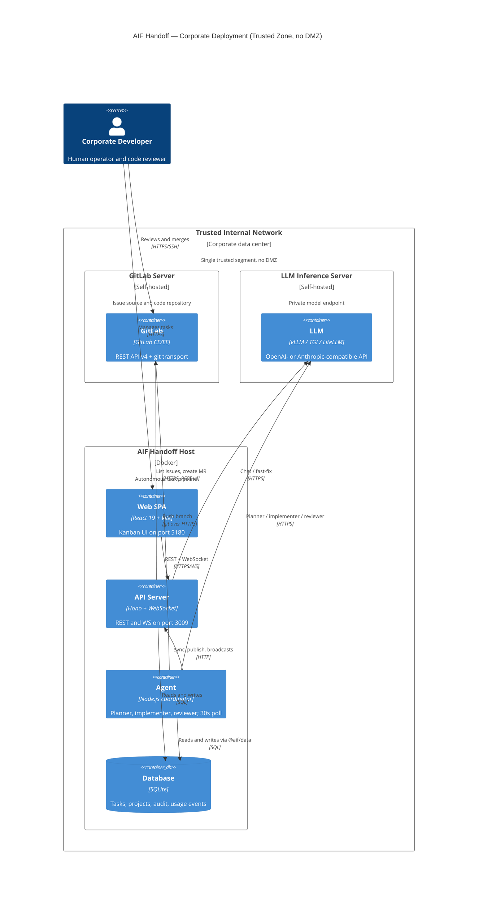

# Research

Updated: 2026-09-10 12:00
Status: active

## Active Summary (input for /aif-plan)
<!-- aif:active-summary:start -->
Topic: Parallel agent execution — per-issue git-worktree isolation (Level 1) + intra-issue worker fan-out (Level 2), plus worktree lifecycle and DB↔filesystem reconciliation

Goal: Replace the current serial "one shared tree" behaviour with a two-level parallelism model, and make it survive task re-execution.

- **Level 1 — across issues:** one git worktree per issue branch, so several issue tasks run concurrently in the same project. Isolation is real (separate HEAD/index/working files).
- **Level 2 — within one issue:** N `implement-worker` subagents run inside ONE worktree. There is no git isolation at this level, so safety must come from file-scope partitioning. Fan-out width is capped by the new env var `AIF_IMPLEMENT_MAX_WORKERS=2`.

Origin incident: a retained task-scoped worktree `vnc-feature-github-issue-1-a1342eab-…` held branch `feature/github-issue-1`; later tasks for the same issue computed a different path but the same branch, so `git worktree add` failed → `worktree_create_failed` → permanent `blocked_external` (retryAfter=null). A retained worktree without any owner in the pipeline is the core structural defect.

Decisions (confirmed with the user):
- **Level 1 identity:** worktree path is deterministic from the BRANCH (never from `taskId`); branch is one-per-issue and named from the project's RULES (`## Git conventions` → `branch_prefix`) + issue number, with fallback chain RULES → `git.branch_prefix` → provider default.
- **Worktree root (option C):** `/home/www/.worktrees/<project>/<branch>` — isolated, predictable, not nested inside the working tree.
- **Adopt instead of fail:** if a worktree for that branch already exists, reuse it (`action: "reused"`) and persist its path; never throw `worktree_create_failed` for that case.
- **Enablement:** `AIF_TASK_WORKTREES_ENABLED=true` + `project.parallelEnabled=true` open the parallel pool. This reverses the earlier `AIF_TASK_WORKTREES_ENABLED=false` decision.
- **Issue-task bypass must be removed:** `shouldCreateWorktree = Boolean(githubIssue) || (…)` (planner.ts:211-215) currently ignores the flag; and the non-worktree path must pass the RULES-derived issue branch into `ensureFeatureBranch` (planner.ts:249), otherwise the branch becomes task-slug-scoped.
- **Task restart:** same worktree, **new agent session** (no session resume) — changes the current `sessionReusePolicy: "resume_if_available"` for the implementer.
- **Task deletion (option a):** stash uncommitted changes, then `git worktree remove`.
- **DB↔folder sync (option a):** the DB is the source of truth. Reconcile at agent start and after terminal transitions: orphan worktree folders → `git worktree remove` + `git worktree prune`; a task with a non-null `worktreePath` and no folder → recreate the worktree, otherwise park the task as `blocked_external`.
- **Level 2 ownership rules:** plan tasks must declare their change scope (which files, why, what changes; new vs modified artifacts by type). Overlapping file sets are sequenced, never parallelised. Workers are edit-only (no git writes); the coordinator owns all git writes and the plan file; repo-wide builds/tests run once per layer; each layer is checkpointed for rollback.
- **Control surface for Level 2:** the `ai-factory` package itself is NOT in scope. Its the target project's skills, rules and agent definitions (`.claude/agents/`, `.claude/skills/`, `.ai-factory/rules/`) that govern fan-out behaviour, and those live in the project repo under VCS.
- **Dropped requirement:** no human ever edits artifacts inside the container working tree, so human-lease safety gating is not needed.

Constraints:
- DB boundary via @aif/data.
- Migration versions append-only — never renumber a merged migration.
- Every package ≥70% coverage; `npm run ai:validate` after implementation.
- Docker config must stay in sync if packages/config change.
- Level 1 requires a per-project mutex around repo-mutating git ops (`fetch`/`worktree add`/branch create) to avoid ref-lock races.

Open questions (unresolved):
1. PR comment → `/aif-improve` conflicts with the current implementation, which moves `plan_review` → `planning` and re-runs the **planner** with `planReviewFeedback` (planner.ts:155-164); `/aif-improve` only exists in skills mode (`runPlanImprove && !useSubagents`).
2. `isFix` tasks get no branch at all and therefore run on arbitrary HEAD.
3. Shared-artifact divergence across parallel issue branches (`AGENTS.md`, `ARCHITECTURE.md`, `ROADMAP.md`, `RULES.md`).
4. On task deletion — is the issue branch also removed, or retained because the PR/MR needs it?
5. Legacy task rows whose `worktreePath` points at an old sibling folder (`…-<taskId>`) — adopt or recreate?

Success signals:
- Two issue tasks of one project run concurrently, each in its own worktree, with no `worktree_create_failed`.
- Re-running a blocked task adopts the existing worktree instead of parking forever.
- Deleting a task removes its folder while its uncommitted work stays recoverable in a tagged stash.
- After the sweep, `git worktree list` matches the set of non-terminal tasks in the DB.
- Within one issue, a layer's workers touch disjoint file sets and only the coordinator commits.

Next step: /aif-plan full — correctness core first (Level 1 identity + adopt + lifecycle + DB↔folder sync + branch-isolation stderr logging), then the Level 2 fan-out contract and `AIF_IMPLEMENT_MAX_WORKERS`.
<!-- aif:active-summary:end -->

## Sessions
<!-- aif:sessions:start -->
### 2026-09-10 12:00 — Parallel agent execution: worktree identity, lifecycle, and DB sync
What changed: Diagnosed the `worktree_create_failed` incident, corrected a wrong first hypothesis, and converged on a two-level parallelism model with explicit identity, lifecycle, fan-out and DB-sync rules.

Key notes:
- Incident root cause: the branch name is issue-scoped (`feature/github-issue-<N>`, planner.ts:221) while the worktree path was task-scoped (`buildTaskWorktreePath` = `dirname(projectRoot)/<project>-<branch-slug>-<taskId>`, gitIsolation.ts:109-118), and nothing ever removes worktrees. A retained worktree from task a1342eab held the branch, so tasks 146c1db2/aaab3549 failed `git worktree add` → `worktree_create_failed` → `blocked_external`.
- Branch-isolation failures are intentionally non-retryable: `classifyStageError` pins them to `blocked_external` with `retryAfter=null` (stageErrorHandler.ts:218-248).
- Diagnostic gaps (why this took several rounds): the failing command runs as `runGit(projectRoot, args, { ignoreExit: true })` (gitIsolation.ts:617), and `runGit` only logs when `ignoreExit` is falsy; `stageErrorHandler` logs only `{ branchKind, branchName, projectRoot }` and never `branchErr.message`. The stderr survives only in `tasks.blockedReason` (persisted at coordinator.ts:869, rendered on the task card).
- The `dubious ownership` message the operator pasted was an artifact of `docker compose exec agent` running as **root** (it bypasses the ENTRYPOINT's `exec gosu node`, .docker/docker-entrypoint.sh:12). Live check showed `/home/www`, `/home/www/vnc`, `/home/www/vnc/.git` are all `node:node`, so the agent (uid 1000) never hits that error.
- `safe.directory` is only ever set by the GitLab prepare path (`gitlabPrepare.ts:159-172`); there is no GitHub equivalent, but that turned out not to be the cause here.
- Serialization today: `projectRequiresSerialExecution` (coordinator.ts:320-333) forces pool depth 1 whenever `!AIF_TASK_WORKTREES_ENABLED || !projectSupportsTaskWorktrees`, and the API rejects parallel auto-queue for that combo (`rejectsParallelAutoQueueWithBranches`) — one shared tree and parallelism are mutually exclusive.
- Retry semantics today: `restorePersistedBranch` returns before the clean check when HEAD already equals the persisted branch (gitIsolation.ts:832-835), so dirty state is preserved on an in-place retry.
- Intra-issue fan-out is delegated to runtime-native subagents (`executionMode: "native_subagents"`, `agentDefinitionName: "implement-coordinator"`, implementer.ts:363-380). `.claude/agents/` is empty in this repo — the definitions are project content under VCS, created by `ai-factory init`.
- `planLayers.ts` builds a dependency DAG and execution layers, and `formatLayerSummary` renders `"Layer N (parallel): …"`, but it is dead code — never injected into the prompt (only `computePendingPlanLayers` is used, for pending counts).
- Existing commit points to build on: plan-only commit via `ensurePlanReviewCommit` (planReviewPublisher.ts:73); implementation commit via `ensureAutoQueueTaskCommit` before push (githubWorkflow.ts:187). Plan and implementation share one branch/PR (`task.branchName`).
- Risk registers produced: Level 1 (ref-lock races, collision, stale registrations, disk growth, shared-artifact divergence, resources, opacity) and Level 2 (same-file lost updates, git-index races, plan-file races, build/test contention, no rollback, worker recursion, resource exhaustion).

Links (paths):
- packages/shared/src/gitIsolation.ts (`ensureTaskWorktree`, `buildTaskWorktreePath`, `ensureFeatureBranch`, `restorePersistedBranch`, `assertWorkingTreeClean`, `runGit`)
- packages/agent/src/subagents/planner.ts:147,188-260 (worktree decision + branch provisioning)
- packages/agent/src/subagents/implementer.ts:216-380 (layer computation, prompt, `sessionReusePolicy`)
- packages/agent/src/planLayers.ts (`computePlanLayers`, `formatLayerSummary` — unused)
- packages/agent/src/coordinator.ts:320-333,1148-1158 (serial predicate), :825-891 (stage error handling / blockedReason persist)
- packages/agent/src/stageErrorHandler.ts:218-248 (branch-isolation blocking)
- packages/agent/src/planReviewPublisher.ts:61-73, githubWorkflow.ts:87-240 (plan/impl commit + publish)
- packages/data/src/index.ts:1537-1541 (`deleteTask`), packages/data/src/github.ts:233-410 (issue→task dedupe via `githubIssues.taskId`)
- packages/shared/src/projectConfig.ts:108-115 (git defaults), packages/agent/src/gitConventions.ts (RULES `branch_prefix`)
- docs/architecture.md (worktree retention policy), docs/getting-started.md (root-owned PROJECTS_DIR warning)

### 2026-08-16 07:00 — Manual-review handoff stuck in legacy mode + GitLab "request changes" signal
What changed: Investigated why task b0f811dc showed "Auto-review stopped and human review is required" but offered no way to send it back for fixing; then validated the GitLab "Request changes" flow end-to-end against live API data.
Key notes:
- Task state after manual handoff: `status=review`, `executionOwner=human`, `manualReviewRequired=1`, `reviewIterationCount=4` (> max 3), `permittedActions=[]`.
- Root cause (Path 2): in legacy mode (`PARTICIPANTS_MODE_ENABLED` unset) `resolveTaskAction` routes every task through `resolveLegacyAction`, which has NO events from `review`. `complete_review`/`request_review_changes` exist only in `resolveHumanOwnerAction` (participants mode). UI warning text references Approve/Request changes but those are `done`-status actions → nothing renders.
- Docs mismatch: docs/api.md:1204 and docs/configuration.md:555 claim the task stays in `done` after failed convergence, but coordinator.ts keeps `review` (test coordinator.test.ts:1560 asserts `review`).
- Test pins legacy semantics: stateMachine.test.ts:376 human-owned backlog can `start_ai` in disabled mode → do NOT reroute all human-owned tasks; add guarded legacy cases for review events.
- Path 3 live validation: clicked "Request changes" in GitLab GUI → discussion thread shows system note "requested changes". MR API still reports `detailed_merge_status: "mergeable"` (even with `with_merge_status_recheck=true`), `approved` still true in DB (approvals API is binary). Signal = system note `{system:true, body:"requested changes"}` (id 3691116788). GitLabNoteResponse type lacks `system`/`type` fields → must add.
- GitHub analog: routes/github.ts:254-274 uses `review.state === "changes_requested" && review.id !== existing?.lastReviewId && task.status === "done"` → implementing + reworkRequested + reset autoQueueCommit. GitLab needs `last_review_note_id` column (append-only migration).
- GitHub mode also documents a differences: docs/architecture.md:201-207 says web UI does not offer local approve/request-change actions for GitLab tasks; TaskDetailHeader filter only hides `approve_done`/`open_request_changes` when `task.github || task.gitlab` (gitlab field is never populated by toTaskRouteResponse — only `github`) so `complete_review`/`request_review_changes` buttons would render after Path 2 fix.
Links (paths):
- packages/shared/src/stateMachine.ts (resolveLegacyAction / resolveHumanOwnerAction / resolveTaskAction)
- packages/shared/src/__tests__/stateMachine.test.ts:376 (legacy pin)
- packages/agent/src/coordinator.ts:633-686 (manual_review_required handoff), coordinator.test.ts:1560
- packages/api/src/routes/github.ts:254-274 (changes_requested analog)
- packages/api/src/routes/gitlab.ts:245-287 (sync status transitions), 308-401 (publish)
- packages/api/src/services/gitlab.ts (GitLabClient, GitLabNoteResponse, GitLabMergeRequestResponse)
- packages/data/src/gitlab.ts (updateGitLabMergeRequest, importGitLabIssueTask)
- packages/shared/src/schema.ts (gitlabIssues table)
- .ai-factory/references/gitlab-rest-api.md (Notes API system:true at L340; detailed_merge_status values at L259)
- docs/api.md:1204, docs/configuration.md:555-557, docs/architecture.md:201-207

<!-- aif:sessions:end -->
### 2026-08-13 14:00 — GitLab adapter exploration (Option A)
What changed:
- Clarified "adapter" ambiguity: GitLab = repository-hosting integration (GitHub Issue-to-PR mirror), NOT an AI runtime adapter (runtime/adapters/ is for LLM providers only).
- Mapped the full GitHub integration surface (schema v28, data layer, API client/routes, agent workflow, env flag, web UI, docs, tests).
- Found the original feature plan (.ai-factory/plans/feature-github-issue-pr-mode.md) — the exact 4-phase blueprint to mirror.
- Investigated Option A (mirror) in depth: per-file checklist, GitLab REST v4 API mapping, test surface (3 packages + web), UI wiring points (ProjectSelector block, TaskDetailHeader badge, read-only descriptions).
- Captured project rules that constrain implementation (migration append-only v29, DB boundary, structured errors, nullable casts, coverage/ai:validate, Pencil sync if new UI).

Key notes:
- GitHub equivalents found: github_repositories/github_issues tables (migration v28); data/src/github.ts (repo ops + atomic import + PR update + fingerprint); services/github.ts (GitHubApiError + GitHubClient); routes/github.ts (5 endpoints, rollout middleware); agent githubWorkflow.ts (sync poll + publish); 4 web hooks + ProjectSelector GitHub section + TaskDetailHeader GITHUB badge; tests in data/api/agent + web.
- GitLab diffs vs GitHub: namespace/project vs owner/repo; project-id-based API; iid vs number; MR vs PR; approvals vs reviews; pipelines/commit statuses vs check runs; PRIVATE-TOKEN header; self-hosted baseUrl; Retry-After rate limits.
- Wired points for agent: coordinator.ts runPollCycle → synchronizeGitHubProjects(); implementer + reviewer stage → publishGitHubTask(); internal API auth via notifier.ts internalApiHeaders; branch push to origin via git credentials (no token in git).
- API mount: packages/api/src/index.ts → app.route("/projects", githubRouter).
- UI: GitHub section is a single block in ProjectSelector edit dialog guarded by githubIssuePrEnabled; TaskDetailHeader renders GITHUB #N badge and hides local approve/request-changes actions when task.github exists.

Links (paths):
- .ai-factory/plans/feature-github-issue-pr-mode.md (blueprint)
- packages/shared/src/schema.ts (github tables), db.ts (migration v28), types.ts (GitHub types, Task.github)
- packages/data/src/github.ts, data/src/index.ts
- packages/api/src/services/github.ts, routes/github.ts, schemas.ts, index.ts, routes/settings.ts
- packages/agent/src/githubWorkflow.ts, coordinator.ts, notifier.ts, autoQueueCommit.ts
- packages/shared/src/env.ts (AIF_GITHUB_ISSUE_PR_ENABLED)
- packages/web/src/lib/api.ts, hooks/useProjects.ts, components/project/ProjectSelector.tsx, components/task/TaskDetailHeader.tsx, components/task/TaskDescription.tsx
- docs/api.md, docs/architecture.md, docs/configuration.md
- Tests: packages/{data,api,agent}/src/__tests__/github*.test.ts

### 2026-08-13 15:30 — GitLab Option A: env design + API research (GitLab docs)
What changed:
- User decisions: (1) self-hosted baseUrl ONLY via global AIF_GITLAB_BASE_URL env; (2) introduce GIT_PROVIDER env to select the active provider; (3) research approvals mapping further; (4) propose justification.
- Researched official GitLab docs (docs.gitlab.com): merge request approvals API, discussions API, commits/commit-status API.
- CORRECTION to earlier assumption: the MR approvals endpoint GET /projects/:id/merge_requests/:iid/approvals IS available on all tiers including Free (approve/unapprove/reset/retrieve approval state are Free; /approval_state and approval rules require Premium/Ultimate). CE: approved=true iff >=1 approval; EE: rules satisfied, true when no rules apply.
- Confirmed GitLab has NO first-class "changes requested" review state. Closest signals: unresolved discussions (Free tier, notes carry resolvable/resolved) or EE /approval_state.
- Confirmed commit statuses endpoint (Free): GET /projects/:id/repository/commits/:sha/statuses; statuses pending/running/success/failed/canceled/skipped; allow_failure marks non-blocking failures. Chose it over pipelines for prChecksStatus (see justification in discussion).
- env.ts pattern verified: AIF_GITHUB_ISSUE_PR_ENABLED: booleanEnvSchema.default(false) (line 276). New vars: GIT_PROVIDER z.enum(["github","gitlab"]).default("github"); AIF_GITLAB_ISSUE_MR_ENABLED booleanEnvSchema.default(false); AIF_GITLAB_BASE_URL string with default https://gitlab.com/api/v4.

Key notes:
- GIT_PROVIDER design: deployment-level selector, default "github" (backward compatible — existing GitHub deployments unchanged). Mode active ⇔ GIT_PROVIDER matches provider AND provider rollout flag true. Independent axes: which provider vs whether feature on. Prevents accidental dual activation. Consumed in: routes/github.ts + routes/gitlab.ts middleware, agent workflows, settings overview (gitProvider), web UI gates.
- AIF_GITLAB_BASE_URL justification: self-hosted GitLab is common; base URL is org/deployment property, non-secret → env var; no baseUrl column or UI input needed.
- Checks justification (statuses over pipelines): direct analog of GitHub combined status+check-runs fold; single Free-tier endpoint; includes pipeline jobs AND external statuses; allow_failure mirrors GitHub's neutral/skipped semantics; pipelines API is per-pipeline (multiple per commit), ref-scoped, more requests, status values differ → no benefit for tri-state prChecksStatus.
- Approvals recommendation: ship v1 with approvals-only reviewState (approved/pending, no auto-rework); defer unresolved-discussions→changes_requested (v1.1 spike) due to false-positive risk. User to confirm.
- Upstream doc pages: https://docs.gitlab.com/api/merge_request_approvals/ , https://docs.gitlab.com/api/discussions/ , https://docs.gitlab.com/api/commits/

Links (paths):
- packages/shared/src/env.ts (line 276 — booleanEnvSchema pattern)
- packages/api/src/routes/settings.ts (buildSettingsOverview → githubIssuePrEnabled pattern)
- docs.gitlab.com/api/merge_request_approvals/ (approvals tiers + CE/EE approved semantics)
- docs.gitlab.com/api/discussions/ (MR discussions, resolvable/resolved notes)
- docs.gitlab.com/api/commits/ (commit statuses endpoint, allow_failure)
### 2026-08-13 16:00 — GitLab Option A: decisions finalized
What changed:
- User confirmed all remaining decisions: (1) reviewState = approvals-only (Option A) — no auto-rework in v1; (2) GitLab MR note marker "<!-- aif-gitlab-review -->"; (3) GIT_PROVIDER default "github".
- All open questions resolved; exploration of Option A is complete → ready for /aif-plan.

Key notes:
- v1 reviewState semantics: "approved" ⇔ GET /merge_requests/:iid/approvals → approved=true; else "pending". No changes_requested in v1; no approval-driven task resumption (human reopens).
- v1 GitLab task transitions: MR merged → task verified; MR closed unmerged → task paused; review feedback note posted with marker; fingerprint dedupe like GitHub.
- changes_requested via unresolved discussions stays a v1.1 candidate (spike on real data first).
- GIT_PROVIDER default "github" + AIF_GITLAB_ISSUE_MR_ENABLED=false keeps GitLab fully dormant by default (zero behavior change for existing deployments).

Links (paths):
- .ai-factory/RESEARCH.md (Active Summary — all decisions recorded)
- .ai-factory/plans/feature-github-issue-pr-mode.md (plan blueprint)
### 2026-08-13 17:30 — Corporate deployment topology (trusted zone, no DMZ)
What changed:
- Explored AIF Handoff deployment in a corporate environment.
- Compared DMZ vs Internal (trusted) placement for GitLab + LLM.
- DECISION: GitLab + LLM both in the trusted Internal zone, no DMZ, with a self-hosted LLM.

Key notes:
- DMZ vs Internal differ by trust level, connection direction, and blast radius on compromise.
- Trusted-only removes the DMZ boundary; defense shifts to internal segmentation (VLANs), least-privilege, and deny-all egress.
- If the LLM is fully self-hosted, the autonomous agent can be firewalled with zero internet egress — the strongest exfiltration control.
- Runtime adapters reach the LLM via ANTHROPIC_BASE_URL / OPENAI_BASE_URL / OPENROUTER_BASE_URL / OPENCODE_BASE_URL or a custom module; GitLab via AIF_GITLAB_BASE_URL + GIT_PROVIDER=gitlab.

C4 Deployment diagram:



Links (paths):
- .ai-factory/references/mermaid-c4.md (C4 syntax reference)
- packages/shared/src/env.ts (ANTHROPIC_BASE_URL, OPENAI_BASE_URL, AIF_GITLAB_BASE_URL, GIT_PROVIDER, proxy vars)
- packages/runtime/src/adapters/ (claude, codex, opencode, openrouter — baseUrl support)
- packages/api/src/services/gitlab.ts (GitLabClient, baseUrl from AIF_GITLAB_BASE_URL)
- packages/agent/src/gitlabWorkflow.ts (sync + publish via internal API)
### 2026-08-13 18:00 — Verification runbook: gitlab.com + router.ai (OpenAI-compatible)
What changed:
- Captured the final code-grounded verification runbook for the GitLab Issue-to-MR flow, with router.ai (OpenAI-compatible) as the LLM backend.
- Corrected an earlier assumption: the Codex API transport is a one-shot /chat/completions call (no tool-calling) and therefore cannot run the implement/review pipeline. The pipeline needs the local agentic Codex transport (CLI/SDK/App Server) with CODEX_BASE_URL pointing at router.ai.

Key notes:
- User decisions: Option A (OpenAI-compatible router.ai); simplest setup (Participants Mode off, anonymous); secrets only via .env.
- GitLab PAT needs scopes api + write_repository (api for REST, write_repository for git push).
- inferDefaultTransport("codex") = CLI (not API); the runtime profile must set transport cli/sdk/app-server + baseUrl + apiKeyEnvVar=OPENAI_API_KEY.
- Issue import → task autoMode=true, executionOwner=ai, status=backlog; auto-queue advances backlog→planning.
- MR merged → verified; MR closed → paused; the human owns the merge.
- Precondition: router.ai must be Codex-CLI-protocol-compatible and the model must support tool use.

### 2026-08-16 12:00 — Remove Root Path field; auto-generate project folder path
What changed:
- Explored the project create/edit Root Path flow across web, API, data, shared, and agent.
- Decided to remove the editable Root Path field and derive the container folder path from the project name.
Key notes:
- `rootPath` column/type stays (downstream: git, worktrees, chat, MCP, roadmap).
- Existing `slugify` (shared/planPath.ts) is reusable for folder-name generation.
- Name uniqueness: trimmed + case-insensitive; plus slug/rootPath collision suffix.
- rootPath immutable on rename to avoid moving live git repos.
Links (paths):
- packages/web/src/components/project/ProjectSelector.tsx
- packages/api/src/repositories/projects.ts
- packages/api/src/schemas.ts
- packages/shared/src/types.ts, planPath.ts, schema.ts
- packages/data/src/index.ts

### 2026-08-16 01:51 — Live board heartbeat + real-time token/cost feedback
What changed: Explored the live-feedback pipeline; scoped to (1) heartbeat pulse on board + detail, (2) instant run-boundary token/cost updates with a "robot blink" indicator. No LLM reasoning stream.
Key notes:
- `startHeartbeat` (subagentQuery) already writes `lastHeartbeatAt` + `updatedAt` every 30s but broadcasts nothing; `TaskListItem` has no `lastHeartbeatAt`.
- Staleness threshold = `AGENT_STAGE_STALE_TIMEOUT_MS` (default 90 min), same as the coordinator watchdog.
- Token/cost are run-boundary: `recordUsageEvent` rolls usage into task columns on run completion; `onRecorded` currently emits `project:runtime_limit_updated` (full refetch). Replace with targeted `task:usage_updated { taskId, projectId, usage }`.
- Board must patch cache via `setQueryData`, not invalidate `tasks`, to avoid `updatedAt` resort churn.
- No schema change; only `TaskListItem` projection + WS events + UI.
- Pencil sync, theme-pairing, no-expensive-CSS rules apply to new visuals.
Links (paths):
- packages/agent/src/subagentQuery.ts (heartbeat, usageSink onRecorded)
- packages/data/src/index.ts (updateTaskHeartbeat, recordUsageEvent, listTaskListItems projection)
- packages/shared/src/types.ts (TaskListItem, WsEventType/WsEvent)
- packages/api/src/ws.ts, packages/api/src/routes/tasks.ts (broadcast path)
- packages/agent/src/notifier.ts (broadcast helpers)
- packages/web/src/hooks/useWebSocket.ts (WS handler)
- packages/web/src/components/kanban/TaskCard.tsx, packages/web/src/components/task/TaskDetailHeader.tsx

### 2026-08-16 04:01 — Task progress indication: working vs hung
What changed: Explored how to tell that an agent is actively working rather than hung. Decided: dedicated server `lastActivityAt` + in-flight tool tracking + 5-minute silence threshold; loop detection and per-stage % are separate/deferred.
Key notes:
- `lastHeartbeatAt` is conflated: `startHeartbeat` (30s) AND `appendTaskActivityLog` both write it → the UI cannot distinguish "alive" from "working".
- Root cause of the "suspiciously long" task (#1 Рефакторинг, review stage): the review agent on Codex CLI looped `git diff a245fef^ a245fef -- <file>` for ~25 min; the heartbeat stayed green because the process was alive; ~40M input tokens, `costUsd=0`.
- Best practices: determinate % only where a denominator exists; "current step" is more valuable than %; structured event streaming (tool-call start/end) is the industry standard; recency + in-flight for "is it working"; loop detection is emerging agent-reliability practice.
- Decisions: threshold = 5 min (`AGENT_ACTIVITY_SILENCE_MS`, new); server `lastActivityAt` column (survives F5); in-flight `currentTool` now (SDK/app-server only; CLI opaque); loop detection separate.
Links (paths):
- packages/agent/src/subagentQuery.ts (startHeartbeat, onEvent, onToolUse wiring)
- packages/agent/src/hooks.ts (appendActivityLogToDb, createActivityLogger, createSubagentLogger)
- packages/data/src/index.ts (appendTaskActivityLog — writes lastHeartbeatAt today)
- packages/shared/src/db.ts (migration append-only)
- packages/web/src/hooks/useTaskLiveness.ts (current running indicator)
- packages/web/src/hooks/useWebSocket.ts (task:activity handling)

### 2026-08-16 04:38 — Agent loop detection: stage 1 (tool-call cap + read-only burst)
What changed: Proposed and scoped loop detection after the confirmed review-loop incident (task b0f811dc). User decided: immediate blocked_external (no retry), thresholds = 500 tool-calls / 20 reads-without-write, agent-side blocking only (no UI indicator yet).
Key notes:
- Incident signature: ~hundreds of `git diff <sha>^ <sha> -- <file>` + `git show <sha>:<file>` (read-only, no mutations) over ~25-28 min per attempt; ~40M input tokens; `runTimeoutMs` (1h) the only existing guard.
- Options evaluated: A tool-call cap, B read-only burst, C normalized-template repetition, D novelty ratio, E token-bloat (SDK only), F client-side visual warn.
- Stage 1 = A+B with immediate blocked_external (`possible_loop`); C/D/F deferred; E SDK/app-server only.
Links (paths):
- packages/agent/src/subagentQuery.ts (onToolUse counting + abort)
- packages/agent/src/taskWatchdog.ts (blocked_external transition pattern)
- packages/data/src/index.ts (transitionTaskStatus, task columns)
- packages/shared/src/env.ts (new AGENT_MAX_TOOL_CALLS_PER_STAGE)

<!-- aif:sessions:end -->

## Runbook (final)

### 0. Inputs to prepare
- gitlab.com repo path: NAMESPACE/PROJECT (nested groups: group/subgroup/project).
- GitLab PAT scopes: api + write_repository.
- router.ai: base URL, model id, API key.
- Precondition: router.ai compatible with Codex CLI protocol; model supports function calling / tool use.

### 1. .env
```dotenv
# GitLab
GIT_PROVIDER=gitlab
AIF_GITLAB_ISSUE_MR_ENABLED=true
AIF_GITLAB_BASE_URL=https://gitlab.com/api/v4
GITLAB_TOKEN=<PAT: api + write_repository>

# router.ai (OpenAI-compatible) via local Codex
OPENAI_API_KEY=<router.ai key>
OPENAI_MODEL=<router.ai model id>
CODEX_BASE_URL=<router.ai base URL>

# skills mode (required: Codex has no agent definitions)
AGENT_USE_SUBAGENTS=false
```

### 2. Build + run prod compose
```bash
cd aif-handoff
docker compose -f docker-compose.production.yml build
docker compose -f docker-compose.production.yml up -d
docker compose -f docker-compose.production.yml ps
```
Health:
```bash
curl -s http://localhost:3009/health
curl -s http://localhost:3100/health
curl -s http://localhost/health
```

### 3. Runtime profile for router.ai (port 3009, no /api prefix)
Create profile:
```bash
curl -s -X POST http://localhost:3009/runtime-profiles \
  -H "Content-Type: application/json" \
  -d '{ "name":"router.ai (Codex CLI)", "runtimeId":"codex", "providerId":"openai", "transport":"cli", "baseUrl":"<router.ai base URL>", "apiKeyEnvVar":"OPENAI_API_KEY", "defaultModel":"<router.ai model id>", "enabled":true }'
```
Note the returned id as <profile-id>. Validate connection:
```bash
curl -s -X POST http://localhost:3009/runtime-profiles/validate \
  -H "Content-Type: application/json" \
  -d '{ "profile": { "runtimeId":"codex", "providerId":"openai", "transport":"cli", "baseUrl":"<router.ai base URL>", "apiKeyEnvVar":"OPENAI_API_KEY", "defaultModel":"<router.ai model id>" } }'
```
Set app defaults:
```bash
curl -s -X PUT http://localhost:3009/settings/runtime-defaults \
  -H "Content-Type: application/json" \
  -d '{ "defaultTaskRuntimeProfileId":"<profile-id>", "defaultPlanRuntimeProfileId":"<profile-id>", "defaultReviewRuntimeProfileId":"<profile-id>", "defaultChatRuntimeProfileId":"<profile-id>" }'
```
Readiness:
```bash
curl -s http://localhost:3009/agent/readiness
```
Expect ready=true.

### 4. Project + git remote + push credentials (via .env)
Create project (projects volume is mounted at /home/www):
```bash
curl -s -X POST http://localhost:3009/projects \
  -H "Content-Type: application/json" \
  -d '{ "name":"demo", "rootPath":"/home/www/demo" }'
```
Note the returned id as <project-id>. Set origin + credential helper (token read from $GITLAB_TOKEN in the container):
```bash
docker compose -f docker-compose.production.yml exec agent git -C /home/www/demo remote add origin https://gitlab.com/NAMESPACE/PROJECT.git
```
```bash
docker compose -f docker-compose.production.yml exec agent git -C /home/www/demo config credential.helper '!f() { echo username=GITLAB_USERNAME; echo password=$GITLAB_TOKEN; }; f'
```

### 5. Connect GitLab repository
```bash
curl -s -X PUT http://localhost:3009/projects/<project-id>/gitlab \
  -H "Content-Type: application/json" \
  -d '{ "repository":"NAMESPACE/PROJECT", "tokenEnvVar":"GITLAB_TOKEN", "enabled":true, "eligibility":{"labels":[],"assignee":null,"milestone":null} }'
```

### 6. Issue → task
1. Create an open Issue in gitlab.com with a realistic description.
2. Sync runs every 60s; force it:
```bash
curl -s -X POST http://localhost:3009/projects/<project-id>/gitlab/sync -H "Content-Type: application/json" -d '{}'
```
3. A card #<iid> <title> appears with a GITLAB badge, status backlog, autoMode=true; no manual start needed.

### 7. Pipeline → MR
```
Planning → Plan Ready → Implementing → Review → Done
```
Watch: `docker compose -f docker-compose.production.yml logs -f agent`.
- implementer + reviewer call publishGitLabTask → git push + create/update MR.
- MR appears in gitlab.com targeting main with description starting with Closes #<iid>.

### 8. Review + merge → verified
1. Review the MR, approve, merge.
2. Agent sync sees mrState=merged and moves task done → verified (≤60s).
- MR merged → verified; MR closed → paused; MR open → waits for human.

### 9. Acceptance
1. GET /agent/readiness → ready=true.
2. Issue imported idempotently (no duplicates).
3. Task reached done (proves router.ai supports tool-calling).
4. MR in main with Closes #<iid>.
5. After approve+merge task is verified.
6. No StageManualBlockError / gitlab_* errors in agent logs.

Links (paths):
- packages/runtime/src/resolution.ts (inferDefaultTransport, inferDefaultBaseUrl)
- packages/runtime/src/adapters/codex/index.ts (descriptor: defaultTransport CLI; supported transports)
- packages/runtime/src/adapters/codex/api.ts (one-shot /chat/completions)
- packages/runtime/src/adapters/codex/appServer/process.ts (baseUrl → CODEX_BASE_URL; apiKeyEnvVar → OPENAI_API_KEY)
- packages/agent/src/coordinator.ts (PIPELINE; publishGitLabTask wiring in implementer/reviewer)
- packages/agent/src/gitlabWorkflow.ts (SYNC_INTERVAL_MS=60_000; pushBranch; publishGitLabTask)
- packages/api/src/routes/gitlab.ts (connect/sync/publish endpoints)
- packages/data/src/gitlab.ts (importGitLabIssueTask: autoMode/backlog)
- packages/shared/src/env.ts (GIT_PROVIDER, AIF_GITLAB_*, CODEX_BASE_URL, OPENAI_*)
- docs/configuration.md (GitLab Issue-to-MR Mode; env vars)
- docker-compose.production.yml (services + volumes)

### 2026-08-14 — Runtime profile bootstrap (Option B): automate demo step 3.1
What changed:
- Explored automating docs/gitlab-demo.md step 3.1 (create runtime profile) + 3.3 (defaults) for the router.ai demo.
- Verified in code that the profile is functionally required for router.ai + Codex CLI: resolution.ts L277-280 sets apiKeyEnvVar=null for local codex transport without explicit apiKeyEnvVar; cli.ts buildCuratedEnv blocks OPENAI_API_KEY when allowApiKey=false (L283-285). Env-only fallback cannot express the API-key opt-in.
- Compared 3 automation levels (curl script wrapper / startup seed in API / docker entrypoint) — user chose Option B (startup seed).
- Full design (env vars, idempotency, edge cases, Docker impact, priority ordering) captured in the Active Summary above.
Links (paths):
- packages/api/src/index.ts (seed insertion point: after listProjects()/resetStaleQaRuns(), before startServer())
- packages/shared/src/env.ts (new AIF_BOOTSTRAP_* vars)
- packages/runtime/src/resolution.ts (env fallback + codex apiKeyEnvVar=null)
- packages/runtime/src/adapters/codex/cli.ts (BLOCKED_ENV_KEYS / buildCuratedEnv allowApiKey)
- packages/data/src/index.ts (createRuntimeProfile L3375, updateAppSettings L1631, listRuntimeProfiles L3315, resolveEffectiveRuntimeProfile L3738)
- packages/api/src/routes/runtimeProfiles.ts (POST /runtime-profiles)
- packages/api/src/routes/settings.ts (PUT /settings/runtime-defaults)
- docker-compose.production.yml (api service uses env_file: .env)

### 2026-08-15 — GitLab auto git-prepare on connect/sync (UC final)
What changed:
- User: manual git steps (remote add / credential helper / mirroring / scaffold commit) are inconvenient; they must run automatically in the agent container when connecting a repo via GUI and syncing.
- Investigated current code: api routes/gitlab.ts (PUT connect validates via REST + saves connection with defaultBranch/webUrl/tokenEnvVar; POST sync does REST-only), agent gitlabWorkflow.ts (synchronizeGitLabProjects polls every 60s → POST /sync; publishGitLabTask does git push assuming origin+credentials ready). No auto git-prep exists in GitHub or GitLab agent workflows.
- Scoped UC down: NO MR mirroring. Only: extract default branch (whatever it is named — from connection.defaultBranch, fallback origin/HEAD) + init AI Factory files if missing (REUSE existing idempotent initProject in runtime/src/projectInit.ts).
- Decisions: option B (API calls agent synchronously via internal HTTP; error → immediate + task blocked, no silent retries); empty repo → push scaffold as initial default branch (decision a); initProject AFTER checkout (decision 2); standard git behavior only; token owner = bot (prod) / current user now.
- Triggers: Connect (PUT /projects/:id/gitlab) + Sync now (POST /projects/:id/gitlab/sync) from Edit Project dialog.
Links (paths):
- packages/agent/src/gitlabWorkflow.ts (synchronizeGitLabProjects, publishGitLabTask)
- packages/api/src/routes/gitlab.ts (PUT /:id/gitlab, POST /:id/gitlab/sync)
- packages/runtime/src/projectInit.ts (initProject — idempotent, reuse)
- packages/data/src/gitlab.ts (listEnabledGitLabRepositories; connection fields webUrl/defaultBranch/tokenEnvVar)
- docs/gitlab-demo.md (manual steps 4.2–4.4 to be automated)

<!-- aif:sessions:end -->
