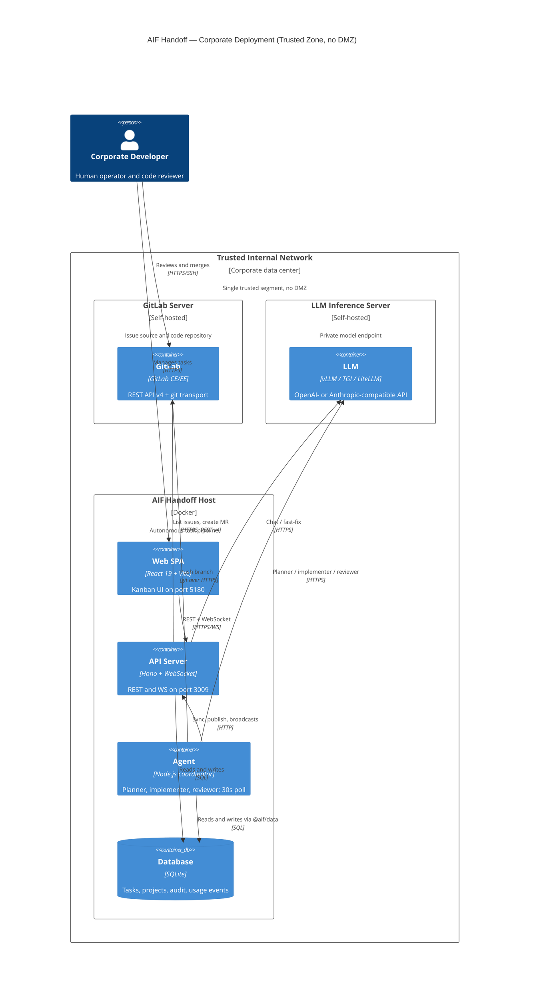

# Research

Updated: 2026-08-13 17:30
Status: active

## Active Summary (input for /aif-plan)
<!-- aif:active-summary:start -->
Topic: GitLab adapter — mirror the GitHub Issue-to-PR integration (Option A)

Goal: Add GitLab as a second repository-hosting provider so issues sync to tasks and merge requests get published, mirroring the existing GitHub mode 1:1.

Constraints:
- No new packages; work stays inside existing workspaces (shared, data, api, agent, web).
- DB access only via @aif/data (DB boundary rule).
- Append-only migrations: next free version is v29 (v28 is the last landed).
- Structured error classification: GitLabApiError must carry httpStatus + adapterCode + retryAt; never branch on message text.
- Nullable cast rule: parsers (eligibility/snapshot) must keep explicit `| null` unions and guard before access.
- Runtime Adapter Sync Rule / docs/providers.md: NOT affected (GitLab is not an AI runtime adapter).
- Pencil sync required only if a new visual UI component is introduced; prefer reusing existing primitives.
- UI theme rules; no expensive CSS properties.
- Every package >=70% coverage; finish with `npm run ai:validate`.

Decisions (user-confirmed):
- Option A (mirror): add gitlab_* tables/routes/services alongside github_*; do not refactor GitHub code.
- GIT_PROVIDER env (`z.enum(["github","gitlab"]).default("github")`) — deployment-level provider selector. A mode is active ONLY when GIT_PROVIDER matches the provider AND its rollout flag is true. Backward compatible: default "github" + existing AIF_GITHUB_ISSUE_PR_ENABLED = current behavior, zero migration.
- AIF_GITLAB_ISSUE_MR_ENABLED (boolean, default false) — GitLab rollout gate, surfaced as gitlabIssueMrEnabled in settings overview. GitHub flag stays as-is.
- AIF_GITLAB_BASE_URL global env (default `https://gitlab.com/api/v4`) — self-hosted support WITHOUT per-connection baseUrl field (no schema/UI churn). Non-secret.
- Default token env var GITLAB_TOKEN; connect schema validates `namespace/project` + `GITLAB_*` prefix.
- Reuse git push to origin for branch publication; connection stays one-per-project (projectId PK). GIT_PROVIDER is global, so only one provider is active per deployment → no remote ambiguity.
- prChecksStatus source: commit statuses endpoint (NOT pipelines) — CONFIRMED, see mapping below.
- reviewState source (CONFIRMED Option A): MR approvals endpoint (available on Free tier) → "approved" ⇔ approvals.approved=true, else "pending". NO "changes_requested"/auto-rework in v1; task resumes only via human action. Unresolved-discussions → changes_requested deferred as a v1.1 spike.
- GitLab MR note marker CONFIRMED: "<!-- aif-gitlab-review -->" (analog of GitHub REVIEW_MARKER).

Blueprint: .ai-factory/plans/feature-github-issue-pr-mode.md defines the 4-phase plan structure to mirror (schema → data → API/agent → UI/docs).

File checklist (mirror):
1. packages/shared/src/schema.ts — gitlabRepositories + gitlabIssues tables (no node_id; add global id + iid; no baseUrl column).
2. packages/shared/src/db.ts — migration v29 (append-only, do not touch v1-v28).
3. packages/shared/src/types.ts — GitLabEligibility (same shape), GitLabRepositoryConnection, GitLabIssueSnapshot, GitLabIssueCommentSnapshot, GitLabIssueLink, Task.gitlab.
4. packages/data/src/gitlab.ts + export in index.ts — repo CRUD, importGitLabIssueTask, updateGitLabMergeRequest, review fingerprint, etc.
5. packages/api/src/services/gitlab.ts — GitLabApiError + GitLabClient (REST v4, baseUrl from env).
6. packages/api/src/routes/gitlab.ts + mount in index.ts (app.route("/projects", gitlabRouter)) — GET/PUT/DELETE /:id/gitlab, POST /:id/gitlab/sync, POST /:id/gitlab/tasks/:taskId/publish. Middleware gate: GIT_PROVIDER === "gitlab" && AIF_GITLAB_ISSUE_MR_ENABLED. GitHub middleware additionally gates GIT_PROVIDER === "github".
7. packages/api/src/schemas.ts — gitlabConnectSchema, gitlabSyncSchema, gitlabPublishSchema.
8. packages/shared/src/env.ts — GIT_PROVIDER, AIF_GITLAB_ISSUE_MR_ENABLED, AIF_GITLAB_BASE_URL.
9. packages/api/src/routes/settings.ts — expose gitProvider + gitlabIssueMrEnabled.
10. packages/agent/src/gitlabWorkflow.ts + coordinator.ts wiring (runPollCycle + implementer/reviewer stages) — synchronizeGitLabProjects + publishGitLabTask; both skipped when GIT_PROVIDER !== "gitlab".
11. packages/web/src/lib/api.ts — GitLabProjectState + 4 methods; SettingsResponse.gitProvider + gitlabIssueMrEnabled.
12. packages/web/src/hooks/useProjects.ts — useProjectGitLab, useConnectProjectGitLab, useDisconnectProjectGitLab, useSyncProjectGitLab.
13. packages/web/src/components/project/ProjectSelector.tsx — parallel GitLab block in edit dialog (guarded by gitProvider==="gitlab" && gitlabIssueMrEnabled).
14. packages/web/src/components/task/TaskDetailHeader.tsx — GITLAB #N badge; gate local approve/request-changes actions on task.gitlab.
15. packages/web/src/components/task/TaskDescription.tsx — read-only for synced tasks (readOnly prop already generic; verify).
16. Docs: docs/api.md (GitLab Issue-to-MR section), docs/architecture.md (workflow + Database list), docs/configuration.md (env vars + mode section). README optional.
17. Tests: packages/data/src/__tests__/gitlab.test.ts, packages/api/src/__tests__/gitlab.test.ts, packages/agent/src/__tests__/gitlabWorkflow.test.ts, web tests (ProjectSelector/TaskDetailHeader mirrors).

GitLab REST API v4 mapping (verified against docs.gitlab.com, 2026-08-13):
- Projects: GET /projects/:url_encoded_path (validate on connect)
- Issues: GET /projects/:id/issues?scope=all&state=opened&order_by=updated_at
- Issue notes: GET /projects/:id/issues/:iid/notes (or discussions)
- Merge requests: GET /projects/:id/merge_requests (filters: source_branch, state=all)
- Create MR: POST /projects/:id/merge_requests {source_branch, target_branch, title, description}
- Update MR: PUT /projects/:id/merge_requests/:iid
- MR merged ⇔ state === "merged" (or merge_commit_sha != null)
- Approvals: GET /projects/:id/merge_requests/:iid/approvals → {approved, approved_by, approvals_required, approvals_left} — AVAILABLE ON ALL TIERS incl. Free (approve/unapprove/reset/retrieve are Free; detailed /approval_state + rules are Premium/Ultimate). CE semantics: approved=true iff >=1 approval exists. EE semantics: approval rules satisfied (true when no rules apply).
- "Changes requested": NO first-class state in GitLab. Closest signals: unresolved discussion threads (GET /merge_requests/:iid/discussions — Free; notes carry resolvable/resolved/resolved_by/resolved_at) or EE /approval_state.
- Commit statuses: GET /projects/:id/repository/commits/:sha/statuses — Free; status values pending/running/success/failed/canceled/skipped; allow_failure marks non-blocking failed jobs. Fold like GitHub combined status: failure if any failed && !allow_failure; else pending if any pending/running; else success if any success; else null.
- Auth: PRIVATE-TOKEN header. Rate limit: 429 + Retry-After → rate_limited adapterCode.
- MR body "Closes #N" closing reference works the same; reuse findPullRequestClosingIssue logic.
- Eligibility (labels/assignee/milestone) maps 1:1; issue iid replaces github issue number in task linkage; global id replaces node_id.
- Review comment publication: analog of GitHub upsertMarkerComment → POST /projects/:id/merge_requests/:iid/notes with marker; fingerprint to avoid duplicates.

Open questions: ALL RESOLVED (2026-08-13).
- reviewState mapping → Option A (approvals-only, no auto-rework in v1; B as v1.1 spike).
- CI source → commit statuses endpoint (confirmed).
- Bot note marker → "<!-- aif-gitlab-review -->" (confirmed).
- GIT_PROVIDER default → "github" (confirmed).

Success signals:
- GitLab repo connects; issues import as tasks with read-only descriptions.
- Branch push + MR publish works; MR merged → verified; MR closed → paused; approval state reflected on task.
- Tests mirror GitHub coverage; all packages >=70%; `npm run ai:validate` passes.
- Docs updated; no GitHub code touched.

Next step: /aif-plan — research is complete, all decisions confirmed. Mirror the 4-phase structure of .ai-factory/plans/feature-github-issue-pr-mode.md.
<!-- aif:active-summary:end -->

## Sessions
<!-- aif:sessions:start -->
### 2026-08-13 14:00 — GitLab adapter exploration (Option A)
What changed:
- Clarified "adapter" ambiguity: GitLab = repository-hosting integration (GitHub Issue-to-PR mirror), NOT an AI runtime adapter (runtime/adapters/ is for LLM providers only).
- Mapped the full GitHub integration surface (schema v28, data layer, API client/routes, agent workflow, env flag, web UI, docs, tests).
- Found the original feature plan (.ai-factory/plans/feature-github-issue-pr-mode.md) — the exact 4-phase blueprint to mirror.
- Investigated Option A (mirror) in depth: per-file checklist, GitLab REST v4 API mapping, test surface (3 packages + web), UI wiring points (ProjectSelector block, TaskDetailHeader badge, read-only descriptions).
- Captured project rules that constrain implementation (migration append-only v29, DB boundary, structured errors, nullable casts, coverage/ai:validate, Pencil sync if new UI).

Key notes:
- GitHub equivalents found: github_repositories/github_issues tables (migration v28); data/src/github.ts (repo ops + atomic import + PR update + fingerprint); services/github.ts (GitHubApiError + GitHubClient); routes/github.ts (5 endpoints, rollout middleware); agent githubWorkflow.ts (sync poll + publish); 4 web hooks + ProjectSelector GitHub section + TaskDetailHeader GITHUB badge; tests in data/api/agent + web.
- GitLab diffs vs GitHub: namespace/project vs owner/repo; project-id-based API; iid vs number; MR vs PR; approvals vs reviews; pipelines/commit statuses vs check runs; PRIVATE-TOKEN header; self-hosted baseUrl; Retry-After rate limits.
- Wired points for agent: coordinator.ts runPollCycle → synchronizeGitHubProjects(); implementer + reviewer stage → publishGitHubTask(); internal API auth via notifier.ts internalApiHeaders; branch push to origin via git credentials (no token in git).
- API mount: packages/api/src/index.ts → app.route("/projects", githubRouter).
- UI: GitHub section is a single block in ProjectSelector edit dialog guarded by githubIssuePrEnabled; TaskDetailHeader renders GITHUB #N badge and hides local approve/request-changes actions when task.github exists.

Links (paths):
- .ai-factory/plans/feature-github-issue-pr-mode.md (blueprint)
- packages/shared/src/schema.ts (github tables), db.ts (migration v28), types.ts (GitHub types, Task.github)
- packages/data/src/github.ts, data/src/index.ts
- packages/api/src/services/github.ts, routes/github.ts, schemas.ts, index.ts, routes/settings.ts
- packages/agent/src/githubWorkflow.ts, coordinator.ts, notifier.ts, autoQueueCommit.ts
- packages/shared/src/env.ts (AIF_GITHUB_ISSUE_PR_ENABLED)
- packages/web/src/lib/api.ts, hooks/useProjects.ts, components/project/ProjectSelector.tsx, components/task/TaskDetailHeader.tsx, components/task/TaskDescription.tsx
- docs/api.md, docs/architecture.md, docs/configuration.md
- Tests: packages/{data,api,agent}/src/__tests__/github*.test.ts

### 2026-08-13 15:30 — GitLab Option A: env design + API research (GitLab docs)
What changed:
- User decisions: (1) self-hosted baseUrl ONLY via global AIF_GITLAB_BASE_URL env; (2) introduce GIT_PROVIDER env to select the active provider; (3) research approvals mapping further; (4) propose justification.
- Researched official GitLab docs (docs.gitlab.com): merge request approvals API, discussions API, commits/commit-status API.
- CORRECTION to earlier assumption: the MR approvals endpoint GET /projects/:id/merge_requests/:iid/approvals IS available on all tiers including Free (approve/unapprove/reset/retrieve approval state are Free; /approval_state and approval rules require Premium/Ultimate). CE: approved=true iff >=1 approval; EE: rules satisfied, true when no rules apply.
- Confirmed GitLab has NO first-class "changes requested" review state. Closest signals: unresolved discussions (Free tier, notes carry resolvable/resolved) or EE /approval_state.
- Confirmed commit statuses endpoint (Free): GET /projects/:id/repository/commits/:sha/statuses; statuses pending/running/success/failed/canceled/skipped; allow_failure marks non-blocking failures. Chose it over pipelines for prChecksStatus (see justification in discussion).
- env.ts pattern verified: AIF_GITHUB_ISSUE_PR_ENABLED: booleanEnvSchema.default(false) (line 276). New vars: GIT_PROVIDER z.enum(["github","gitlab"]).default("github"); AIF_GITLAB_ISSUE_MR_ENABLED booleanEnvSchema.default(false); AIF_GITLAB_BASE_URL string with default https://gitlab.com/api/v4.

Key notes:
- GIT_PROVIDER design: deployment-level selector, default "github" (backward compatible — existing GitHub deployments unchanged). Mode active ⇔ GIT_PROVIDER matches provider AND provider rollout flag true. Independent axes: which provider vs whether feature on. Prevents accidental dual activation. Consumed in: routes/github.ts + routes/gitlab.ts middleware, agent workflows, settings overview (gitProvider), web UI gates.
- AIF_GITLAB_BASE_URL justification: self-hosted GitLab is common; base URL is org/deployment property, non-secret → env var; no baseUrl column or UI input needed.
- Checks justification (statuses over pipelines): direct analog of GitHub combined status+check-runs fold; single Free-tier endpoint; includes pipeline jobs AND external statuses; allow_failure mirrors GitHub's neutral/skipped semantics; pipelines API is per-pipeline (multiple per commit), ref-scoped, more requests, status values differ → no benefit for tri-state prChecksStatus.
- Approvals recommendation: ship v1 with approvals-only reviewState (approved/pending, no auto-rework); defer unresolved-discussions→changes_requested (v1.1 spike) due to false-positive risk. User to confirm.
- Upstream doc pages: https://docs.gitlab.com/api/merge_request_approvals/ , https://docs.gitlab.com/api/discussions/ , https://docs.gitlab.com/api/commits/

Links (paths):
- packages/shared/src/env.ts (line 276 — booleanEnvSchema pattern)
- packages/api/src/routes/settings.ts (buildSettingsOverview → githubIssuePrEnabled pattern)
- docs.gitlab.com/api/merge_request_approvals/ (approvals tiers + CE/EE approved semantics)
- docs.gitlab.com/api/discussions/ (MR discussions, resolvable/resolved notes)
- docs.gitlab.com/api/commits/ (commit statuses endpoint, allow_failure)
### 2026-08-13 16:00 — GitLab Option A: decisions finalized
What changed:
- User confirmed all remaining decisions: (1) reviewState = approvals-only (Option A) — no auto-rework in v1; (2) GitLab MR note marker "<!-- aif-gitlab-review -->"; (3) GIT_PROVIDER default "github".
- All open questions resolved; exploration of Option A is complete → ready for /aif-plan.

Key notes:
- v1 reviewState semantics: "approved" ⇔ GET /merge_requests/:iid/approvals → approved=true; else "pending". No changes_requested in v1; no approval-driven task resumption (human reopens).
- v1 GitLab task transitions: MR merged → task verified; MR closed unmerged → task paused; review feedback note posted with marker; fingerprint dedupe like GitHub.
- changes_requested via unresolved discussions stays a v1.1 candidate (spike on real data first).
- GIT_PROVIDER default "github" + AIF_GITLAB_ISSUE_MR_ENABLED=false keeps GitLab fully dormant by default (zero behavior change for existing deployments).

Links (paths):
- .ai-factory/RESEARCH.md (Active Summary — all decisions recorded)
- .ai-factory/plans/feature-github-issue-pr-mode.md (plan blueprint)
### 2026-08-13 17:30 — Corporate deployment topology (trusted zone, no DMZ)
What changed:
- Explored AIF Handoff deployment in a corporate environment.
- Compared DMZ vs Internal (trusted) placement for GitLab + LLM.
- DECISION: GitLab + LLM both in the trusted Internal zone, no DMZ, with a self-hosted LLM.

Key notes:
- DMZ vs Internal differ by trust level, connection direction, and blast radius on compromise.
- Trusted-only removes the DMZ boundary; defense shifts to internal segmentation (VLANs), least-privilege, and deny-all egress.
- If the LLM is fully self-hosted, the autonomous agent can be firewalled with zero internet egress — the strongest exfiltration control.
- Runtime adapters reach the LLM via ANTHROPIC_BASE_URL / OPENAI_BASE_URL / OPENROUTER_BASE_URL / OPENCODE_BASE_URL or a custom module; GitLab via AIF_GITLAB_BASE_URL + GIT_PROVIDER=gitlab.

C4 Deployment diagram:

Links (paths):
- .ai-factory/references/mermaid-c4.md (C4 syntax reference)
- packages/shared/src/env.ts (ANTHROPIC_BASE_URL, OPENAI_BASE_URL, AIF_GITLAB_BASE_URL, GIT_PROVIDER, proxy vars)
- packages/runtime/src/adapters/ (claude, codex, opencode, openrouter — baseUrl support)
- packages/api/src/services/gitlab.ts (GitLabClient, baseUrl from AIF_GITLAB_BASE_URL)
- packages/agent/src/gitlabWorkflow.ts (sync + publish via internal API)
<!-- aif:sessions:end -->
