# Mermaid Diagrams Reference (with C4 focus)

> Source:
> - https://mermaid.js.org/intro/
> - https://mermaid.js.org/syntax/c4.html
> - https://github.com/plantuml-stdlib/C4-PlantUML
> - https://c4model.com/
> - https://mermaid.js.org/syntax/flowchart.html
> - https://mermaid.js.org/syntax/sequenceDiagram.html
> - https://mermaid.js.org/syntax/classDiagram.html
> - https://mermaid.js.org/syntax/stateDiagram.html
> - https://mermaid.js.org/syntax/entityRelationshipDiagram.html
> - https://mermaid.js.org/syntax/mindmap.html
> - https://mermaid.js.org/config/theming.html
> Created: 2026-08-13
> Updated: 2026-08-13

## Overview

Mermaid is a JavaScript-based diagramming and charting tool that renders Markdown-inspired text definitions into SVG diagrams. Its main purpose is to help documentation keep up with development ("doc-rot" prevention): diagrams are stored as plain text in the same repo as the code, diffable and reviewable like code, and renderable in CI, wikis, IDEs, and editors.

Key properties:
- Text-based diagrams defined in fenced code blocks with the `mermaid` language.
- One syntax per diagram type; each block starts with a diagram-type keyword (e.g. `flowchart`, `sequenceDiagram`, `C4Context`).
- Layout is computed automatically by the renderer (dagre by default; ELK for large/complex diagrams).
- Rendered output is SVG; styling is theme-driven (see Theming section).

CDN: `https://cdn.jsdelivr.net/npm/mermaid@<version>/dist/` — latest is `mermaid@11`.

This project renders Mermaid diagrams in Zed with automatic theme matching. C4 diagrams are auto-color-coded using the editor theme's accent palette; do **not** hardcode hex colors in C4 diagrams unless an exact color match is required, and do **not** include `%%{init}%%` directives or custom `classDef` styles.

## Diagram Types

| Type | Keyword | Use case |
|---|---|---|
| Flowchart | `flowchart` (or `graph`) | Process/algorithm flow, nodes + edges |
| Sequence | `sequenceDiagram` | Message exchange between participants over time |
| Class | `classDiagram` | UML class structure, relationships |
| State | `stateDiagram-v2` | Finite-state machines, transitions |
| Entity Relationship | `erDiagram` | Data model, entities + cardinality |
| User Journey | `journey` | User tasks and satisfaction |
| Gantt | `gantt` | Project schedules / timelines |
| Pie | `pie` | Simple proportion charts |
| Quadrant Chart | `quadrantChart` | 2×2 positioning of items |
| XY Chart | `xyChart` | Cartesian charts (line, bar) |
| Requirement | `requirementDiagram` | Requirements engineering |
| Git graph | `gitGraph` | Git branching/history visualization |
| C4 | `C4Context`, `C4Container`, `C4Component`, `C4Dynamic`, `C4Deployment` | Software architecture (C4 model) |
| Mindmap | `mindmap` | Hierarchical idea organization |
| Timeline | `timeline` | Chronological events |
| Sankey | `sankey-beta` | Flow quantities between nodes |
| Architecture (experimental) | `architecture-beta` | Cloud/infra component diagrams |
| Block | `block-beta` | Block diagrams |

Experimental diagram types (syntax may change): `erDiagram` (partially), `mindmap`, `c4`, `sankey-beta`, `architecture-beta`, `block-beta`, `quadrantChart`.

## C4 Model (concepts)

The C4 model ("context, containers, components, and code") is an abstraction-first approach to software architecture diagramming created by Simon Brown (c4model.com). It is notation-independent and tooling-independent.

The model is a set of hierarchical abstractions, each mapped to a diagram type:

| Level | Abstraction | Diagram | Audience |
|---|---|---|---|
| 1 | **Context** — the system in scope and the people/systems it interacts with | System Context (`C4Context`) | Everyone (technical + non-technical) |
| 2 | **Containers** — separately runnable/deployable units (web app, database, message queue, mobile app) | Container (`C4Container`) | Technical staff |
| 3 | **Components** — major structural building blocks inside a container | Component (`C4Component`) | Developers |
| 4 | **Code** — class/package level (in Mermaid: approximated by class diagrams) | — | Developers (usually auto-generated) |

Supporting diagram types: **System Landscape** (multiple systems in scope), **Dynamic** (shows behavior/flow between elements at a chosen level), **Deployment** (shows how containers are deployed to infrastructure nodes).

Guidance from c4model.com:
- Diagram as a **map**, not the territory: draw only the parts of the architecture that matter for the communication.
- The 4 levels are zoom levels, not a mandate to draw all 4 every time.
- C4 works with any notation (boxes-and-lines is enough); Mermaid's C4 syntax is one concrete notation.

## Mermaid C4 Diagrams (C4 syntax)

C4 diagram support in Mermaid is **experimental** — the syntax and properties can change in future releases. Mermaid's C4 syntax is **compatible with C4-PlantUML** (see the C4-PlantUML project for reference).

Supported C4 chart types:

| Chart type | Keyword |
|---|---|
| System Context | `C4Context` |
| Container | `C4Container` |
| Component | `C4Component` |
| Dynamic | `C4Dynamic` |
| Deployment | `C4Deployment` |

### General structure

```
C4Context
  title <diagram title>
  <element statements>
  <relationship statements>
  <style statements>
```

Layout notes:
- C4 uses a **fixed style** (CSS colors); different skins do not restyle C4.
- The layout is **not** fully automated: the position of shapes is adjusted by changing the order in which statements are written.
- Layout statements `Lay_U/Lay_Up`, `Lay_D/Lay_Down`, `Lay_L/Lay_Left`, `Lay_R/Lay_Right` are **not supported** in Mermaid C4.
- `UpdateLayoutConfig($c4ShapeInRow, $c4BoundaryInRow)` adjusts the number of shapes per row (default 4) and boundaries per row (default 2).

### Parameter passing (the `$` syntax)

Optional parameters (marked `?` in signatures) can be passed two ways:
1. Positional (in order): `UpdateRelStyle(customerA, bankA, "red", "blue", "-40", "60")`
2. Named, with the name starting with `$`: `UpdateRelStyle(customerA, bankA, $offsetX="-40", $offsetY="60", $lineColor="blue", $textColor="red")`

### System Context diagram (C4Context)

Elements:

| Macro | Signature |
|---|---|
| `Person` | `Person(alias, label, ?descr, ?sprite, ?tags, $link)` |
| `Person_Ext` | `Person_Ext(alias, label, ?descr, ?sprite, ?tags, $link)` |
| `System` | `System(alias, label, ?descr, ?sprite, ?tags, $link)` |
| `SystemDb` | `SystemDb(alias, label, ?descr, ?sprite, ?tags, $link)` |
| `SystemQueue` | `SystemQueue(alias, label, ?descr, ?sprite, ?tags, $link)` |
| `System_Ext` | `System_Ext(alias, label, ?descr, ?sprite, ?tags, $link)` |
| `SystemDb_Ext` | `SystemDb_Ext(alias, label, ?descr, ?sprite, ?tags, $link)` |
| `SystemQueue_Ext` | `SystemQueue_Ext(alias, label, ?descr, ?sprite, ?tags, $link)` |
| `Boundary` | `Boundary(alias, label, ?type, ?tags, $link)` |
| `Enterprise_Boundary` | `Enterprise_Boundary(alias, label, ?tags, $link)` |
| `System_Boundary` | `System_Boundary(alias, label, ?tags, $link)` |

### Container diagram (C4Container)

Adds to the context macros:

| Macro | Signature |
|---|---|
| `Container` | `Container(alias, label, ?techn, ?descr, ?sprite, ?tags, $link)` |
| `ContainerDb` | `ContainerDb(alias, label, ?techn, ?descr, ?sprite, ?tags, $link)` |
| `ContainerQueue` | `ContainerQueue(alias, label, ?techn, ?descr, ?sprite, ?tags, $link)` |
| `Container_Ext` | `Container_Ext(alias, label, ?techn, ?descr, ?sprite, ?tags, $link)` |
| `ContainerDb_Ext` | `ContainerDb_Ext(alias, label, ?techn, ?descr, ?sprite, ?tags, $link)` |
| `ContainerQueue_Ext` | `ContainerQueue_Ext(alias, label, ?techn, ?descr, ?sprite, ?tags, $link)` |
| `Container_Boundary` | `Container_Boundary(alias, label, ?tags, $link)` |

### Component diagram (C4Component)

Adds to the container macros:

| Macro | Signature |
|---|---|
| `Component` | `Component(alias, label, ?techn, ?descr, ?sprite, ?tags, $link)` |
| `ComponentDb` | `ComponentDb(alias, label, ?techn, ?descr, ?sprite, ?tags, $link)` |
| `ComponentQueue` | `ComponentQueue(alias, label, ?techn, ?descr, ?sprite, ?tags, $link)` |
| `Component_Ext` | `Component_Ext(alias, label, ?techn, ?descr, ?sprite, ?tags, $link)` |
| `ComponentDb_Ext` | `ComponentDb_Ext(alias, label, ?techn, ?descr, ?sprite, ?tags, $link)` |
| `ComponentQueue_Ext` | `ComponentQueue_Ext(alias, label, ?techn, ?descr, ?sprite, ?tags, $link)` |

### Dynamic diagram (C4Dynamic)

- `RelIndex(index, from, to, label, ?tags, $link)` — compatible with C4-PlantUML but **ignores the index parameter**; sequence numbers are determined by statement order.

### Deployment diagram (C4Deployment)

| Macro | Signature |
|---|---|
| `Deployment_Node` | `Deployment_Node(alias, label, ?type, ?descr, ?sprite, ?tags, $link)` |
| `Node` | `Node(alias, label, ?type, ?descr, ?sprite, ?tags, $link)` — short name of `Deployment_Node()` |
| `Node_L` | `Node_L(alias, label, ?type, ?descr, ?sprite, ?tags, $link)` — left-aligned node |
| `Node_R` | `Node_R(alias, label, ?type, ?descr, ?sprite, ?tags, $link)` — right-aligned node |

### Relationship types

| Macro | Description |
|---|---|
| `Rel(from, to, label, ?techn, ?descr, ?sprite, ?tags, $link)` | Directed relationship |
| `BiRel(from, to, label)` | Bidirectional relationship |
| `Rel_U` / `Rel_Up` | Relationship forced upward |
| `Rel_D` / `Rel_Down` | Relationship forced downward |
| `Rel_L` / `Rel_Left` | Relationship forced left |
| `Rel_R` / `Rel_Right` | Relationship forced right |
| `Rel_Back` | Relationship drawn backward |
| `RelIndex(index, from, to, label, ?tags, $link)` | Same as `Rel`; index ignored |

### Styling

Supported (in diagram body, typically at the end):

| Statement | Purpose |
|---|---|
| `UpdateElementStyle(elementName, ?bgColor, ?fontColor, ?borderColor, ?shadowing, ?shape, ?sprite, ?techn, ?legendText, ?legendSprite)` | Updates default style of all elements of a type (person, container, ...). No legend entry created. |
| `UpdateRelStyle(from, to, ?textColor, ?lineColor, ?offsetX, ?offsetY)` | Updates relationship colors and label offsets. `offsetX`/`offsetY` are Mermaid additions (label position relative to original). |
| `UpdateLayoutConfig(?c4ShapeInRow, ?c4BoundaryInRow)` | Adjusts shapes-per-row (default 4) and boundaries-per-row (default 2). |

Not yet supported (checked-box list from docs): `AddElementTag`, `AddRelTag`, `RoundedBoxShape`, `EightSidedShape`, `DashedLine`, `DottedLine`, `BoldLine`, sprites, tags, links, and `Legend` (auto-generated legend).

### Element text wrapping

Element text (name, type, description) stays on one line by default and the element sizes itself to its longest line. To wrap text to the element width, set `wrap: true` and `c4.width` in frontmatter config:

```yaml
---
config:
  wrap: true
  c4:
    width: 216
---
```

### C4 examples

**C4Context — full example:**

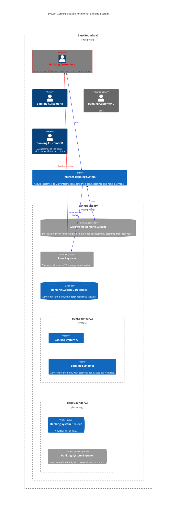

**C4Container — full example:**

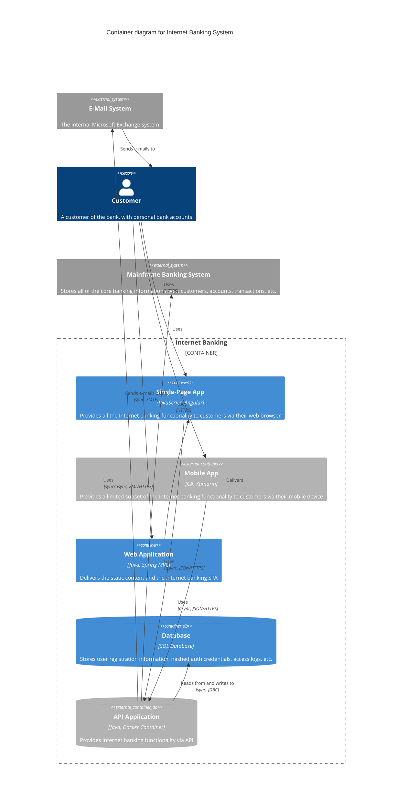

**C4Deployment — full example:**

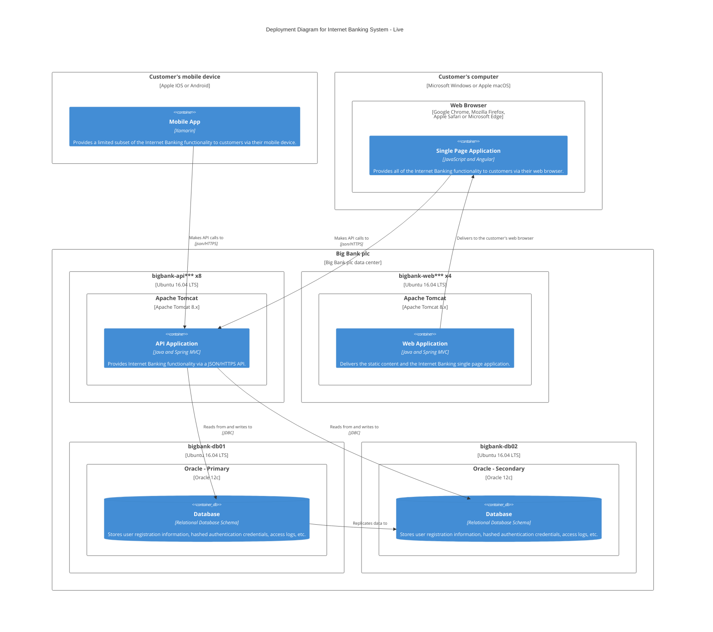

**C4Dynamic — full example:**

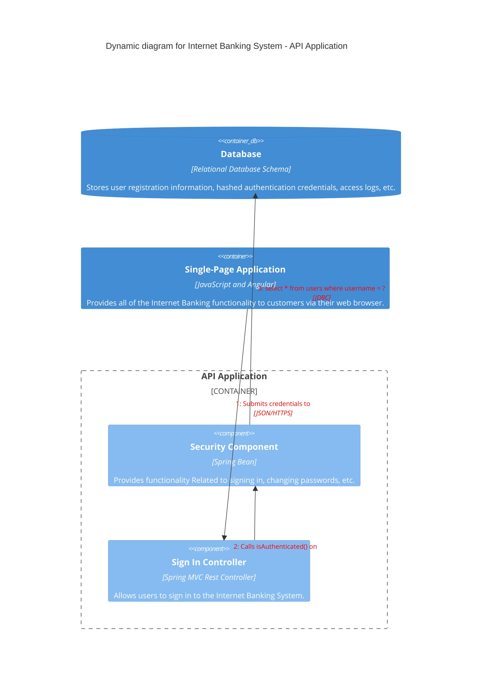

**C4Component — full example:**

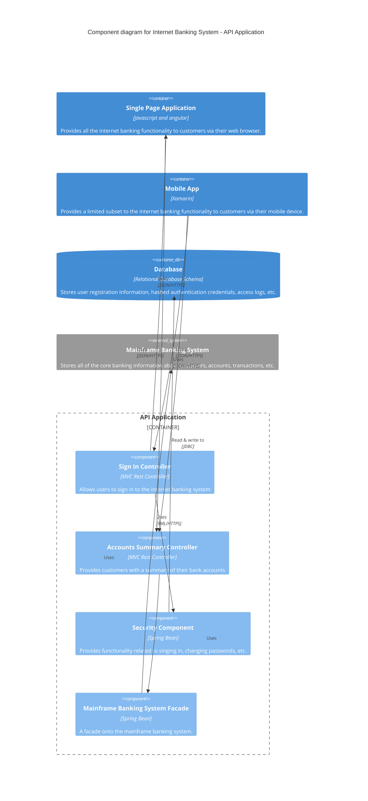

### C4 in this project (Zed)

When rendering C4 in Zed:
- The renderer themes C4 automatically using the editor theme's accent palette — do **not** hardcode hex colors or define custom `classDef` styles (they would conflict with theme theming).
- Do **not** include `%%{init}%%` directives — they are not supported by the renderer.
- Rendering is themed via the user's editor theme; C4's fixed-style colors may be overridden by the renderer.

## Other Diagram Types (key syntax)

### Flowchart

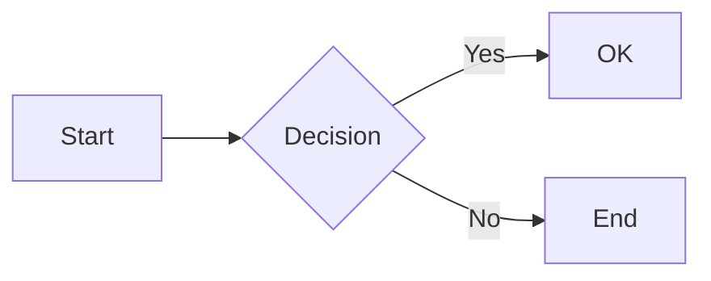

- Directions: `TB`/`TD`, `BT`, `RL`, `LR`.
- Node shapes: `A[...]` rect, `A(...)` round, `A([...])` stadium, `A[[...]]` subroutine, `A[(...)]` cylinder/database, `A((...))` circle, `A{...}` rhombus/diamond, `A{{...}}` hexagon, `A>...]` asymmetric.
- Extended shape syntax (v11.3.0+): `A@{ shape: rect }` (or `stadium`, `subproc`, `cyl`, `diamond`, `hex`, `datastore`, `doc`, `bolt`, etc. — 30+ shapes).
- Links: `-->` arrow, `---` open, `-.->` dotted, `==>` thick, `~~~` invisible, `--o` circle, `--x` cross, `<-->` bidirectional, `o--o`, `x--x`.
- Link labels: `A-- text -->B` or `A-->|text|B`.
- Subgraphs: `subgraph id [Title] ... end`; collapsible via `id@{ view: collapsed }`.
- Comments: `%% comment` on its own line.
- **Reserved-word pitfalls**: a node literally named `end` breaks the diagram — capitalize (`End`, `END`) or quote. A node starting with `o` or `x` may create circle/cross edges — add a space or capitalize.

### Sequence diagram

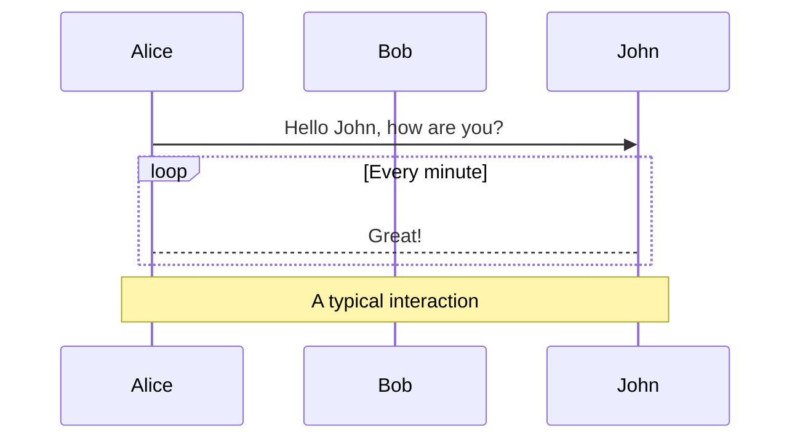

- Participants: `participant`, `actor`; aliases: `participant A as Alice`; stereotypes with `@{ "type": "boundary" }` etc.
- Arrows: `->` solid, `-->` dotted, `->>` solid with arrowhead, `-->>` dotted with arrowhead, `-x` cross, `-)` open arrow (async), `<<->>` bidirectional.
- Activation: `activate`/`deactivate` or `+`/`-` suffixes on arrows.
- Blocks: `loop`, `alt`/`else`, `opt`, `par`/`and`, `critical`/`option`, `break`, `rect rgb(...)`.
- Auto-numbering: `autonumber [start [increment]]`.
- Comments: `%%`.

### Class diagram

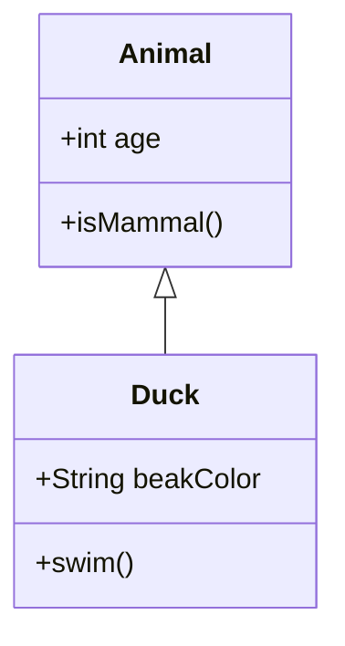

- Members via `:` per-line or `{}` blocks. Visibility: `+` public, `-` private, `#` protected, `~` package.
- Classifiers: `*` abstract, `$` static.
- Relations: `<|--` inheritance, `*--` composition, `o--` aggregation, `-->` association, `--` link, `..>` dependency, `..|>` realization, `..` dashed link. Two-way: `<|--|>`.
- Cardinality: `Customer "1" --> "*" Ticket`.
- Annotations: `<<interface>>`, `<<abstract>>`, `<<service>>`, `<<enumeration>>`.
- Namespaces: `namespace Name { ... }`; labels `namespace Auth["Label"]`; nesting supported (v11.15.0+).
- Generics: `class Square~Shape~{...}`.

### State diagram

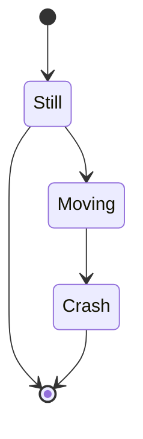

- `[*]` is start/stop (direction of transition decides which).
- State with description: `state "description" as s2` or `s2 : description`.
- Composite states: `state First { ... }` (nestable).
- Choice: `state if_state <<choice>>`; forks/joins: `<<fork>>`, `<<join>>`.
- Concurrency: `--` inside a composite state.
- Notes: `note right of State1 ... end note` / `note left of State1 : text`.
- Styling: `classDef name fill:#f00,...` + `class Node1,Node2 name` or `Node:::name`. Limitations: classDefs can't apply to start/end states or within composite states.

### Entity Relationship (ER) diagram

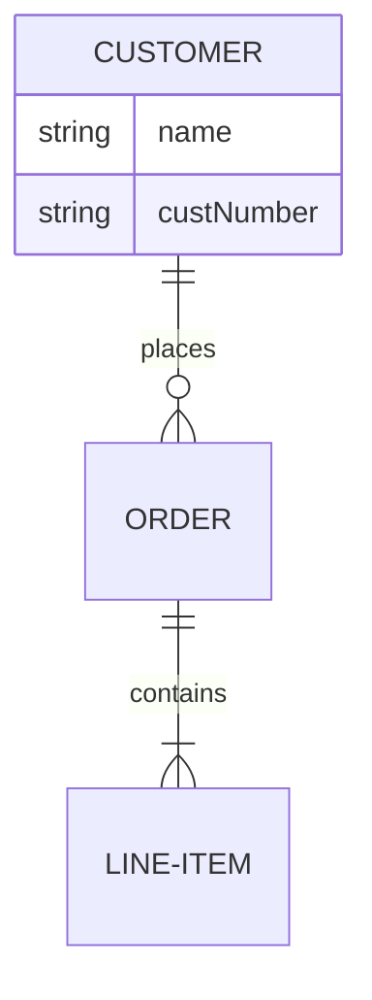

- Cardinality (crow's foot): `||` exactly one, `o|` zero or one, `}|` one or more, `}o` zero or more (left side; mirrored on the right).
- Identifying (`--` solid) vs non-identifying (`..` dashed) relationships.
- Attribute types can end with `?` for nullable (v11.16.0+).
- Keys: `PK`, `FK`, `UK` after attribute name; comments in double quotes.
- Aliases: `p[Person] { ... }`.
- Subgraphs supported.
- Layout: `direction TB/BT/RL/LR`; optional ELK layout via `config: layout: elk`.

### Mindmap

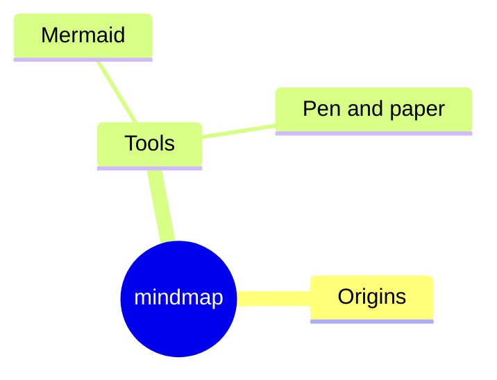

- Hierarchy by indentation; unclear indentation resolves to the nearest parent.
- Shapes: `id[...]` square, `id(...)` rounded, `id((...))` circle, `id))...((` bang, `id)...(` cloud, `id{{...}}` hexagon.
- Icons: `::icon(fa fa-book)` (experimental); classes: `:::urgent large`.
- Markdown strings: `["`**Root** with\na second line`"]`.
- Layout option: `config: layout: tidy-tree`.

## Configuration & Theming

### Frontmatter config

Diagram-level configuration uses YAML frontmatter at the top of the diagram block:

```yaml
---
title: My diagram
config:
  theme: forest
---
flowchart LR
    A --> B
```

### Themes

| Theme | Description |
|---|---|
| `default` | Default for all diagrams |
| `neutral` | For black-and-white printed documents |
| `dark` | For dark backgrounds; pair with `darkMode: true` |
| `forest` | Green shades |
| `base` | The only **modifiable** theme — use as the base for customizations |

### themeVariables

Custom themes modify `themeVariables` (requires `theme: base`). Only **hex** colors are recognized (e.g. `#ff0000` works, `red` does not).

Key variables:

| Variable | Default | Description |
|---|---|---|
| `darkMode` | `false` | Affects derived colors; set `true` for dark mode |
| `background` | `#f4f4f4` | Base background |
| `fontFamily` | `trebuchet ms, verdana, arial` | Diagram font |
| `fontSize` | `16px` | Diagram font size |
| `primaryColor` | `#fff4dd` | Node background; other colors derived from it |
| `primaryTextColor` | derived | Text color on `primaryColor` |
| `primaryBorderColor` | derived from `primaryColor` | Node border |
| `secondaryColor` | derived | Secondary node background |
| `lineColor` | derived | Link/edge color |
| `textColor` | derived | Text over background (labels, titles) |
| `mainBkg` | derived | Flowchart/class/sequence node backgrounds |
| `noteBkgColor` | `#fff5ad` | Note background |
| `noteTextColor` | `#333` | Note text |

Derived values auto-adjust (invert, hue shift, lighten/darken ~10%) when the source variable changes — e.g. `primaryBorderColor` follows `primaryColor`.

### Site-wide config

```javascript
mermaid.initialize({
  securityLevel: 'loose', // loose enables click callbacks; strict disables them
  theme: 'base',
  startOnLoad: true,
});
```

### Common config keys

- `flowchart.curve` — line curve (`basis`, `linear`, `step`, `cardinal`, `monotoneX`, ...).
- `flowchart.defaultRenderer` — `dagre` (default) or `elk` (better for large diagrams, experimental).
- `class.hideEmptyMembersBox` — hide empty member boxes in class diagrams.
- `sequence` — `diagramMarginX`, `diagramMarginY`, `mirrorActors`, font sizes, etc.
- `wrap` + `c4.width` — C4 element text wrapping (see C4 section).
- `securityLevel` — `strict` (default) disables JS callbacks on click; `loose` enables them.

## Best Practices

1. **Use C4 for architecture docs, not random diagrams.** The C4 model's 4 zoom levels (context → containers → components → code) map directly to the Mermaid C4 chart types; pick the level that matches the audience and message.
2. **Start with `C4Context`, drill in only where it matters.** Not every system needs all four levels. A system context diagram for non-technical stakeholders, a container diagram for the team, component diagrams only for complex containers.
3. **Keep diagrams "maps, not the territory."** Draw only the parts relevant to the communication; omit internal details of systems that are out of scope.
4. **Follow C4 naming conventions:** Person → role, not name ("Banking Customer", not "Alice Smith"); Container → name + technology + responsibility; label relationships with a verb phrase + protocol/technology (`"Uses", "HTTPS"`).
5. **In this project, let the theme color C4 diagrams.** Do not hardcode hex colors or inject `%%{init}%%`; the renderer matches the editor theme automatically.
6. **Control C4 layout by statement order** (position is not fully automated); use `UpdateRelStyle` offsets to fix label collisions rather than trying to reorder everything.
7. **Use frontmatter `title:` for diagram titles** instead of inline text; it is rendered consistently and used for accessibility.
8. **Prefer `flowchart` over `graph`** (same thing, but `flowchart` supports subgraph edges and directions).
9. **Avoid reserved words** as node ids (`end`, starting `o`/`x`) — capitalize, quote, or use backticks.
10. **Escape special characters** with quoted labels, `#code;` entity codes (`#quot;`, `#9829;`), and backtick-wrapped markdown strings.
11. **Add `accTitle` / `accDescr`** (accessibility title/description) on important diagrams; supported in most diagram types.
12. **For ER diagrams**, decide consciously whether to include foreign-key attributes (logical models usually omit them; the relationships already convey association).

## Common Pitfalls

- **C4 is experimental**: the C4 syntax and properties may change in future Mermaid releases. Pin expectations to the installed Mermaid version.
- **C4 layout is not automated**: `Lay_*` layout statements are unsupported; element order in the source determines placement. Use `UpdateLayoutConfig` for rows-per-line tuning.
- **Unsupported C4 features** (as of Mermaid 11): `AddElementTag`, `AddRelTag`, custom shape/line helper calls (`RoundedBoxShape`, `DashedLine`, ...), sprites, tags, links, and manual legends. Writing them produces no effect or errors.
- **`UpdateRelStyle` offsets are strings**: `$offsetX="-40"` — pass numbers as quoted strings.
- **C4 `$`-named parameters**: named optional args must start with `$`; positional args must be in exact signature order.
- **`end` breaks flowcharts**: a lowercase `end` node id breaks the diagram; use `End`/`END` or quotes.
- **Leading `o`/`x` in flowchart node ids** silently produce circle/cross edges (`A---oB`); add a space or capitalize.
- **Theming only recognizes hex colors** (`red` fails silently); always use `#rrggbb`.
- **Only `base` theme is modifiable**: setting `themeVariables` with another theme has no effect.
- **External CSS styling of Mermaid nodes does not work reliably** (internal styles are injected with `!important`). Use `classDef` instead.
- **Subgraph direction is ignored** if any node inside the subgraph links to the outside — the subgraph inherits the parent direction.
- **Markdown strings need `htmlLabels: false`** for full formatting in some diagram types.
- **C4 element text wraps only when configured** (`wrap: true` + `c4.width`); otherwise lines stay single and the element grows to its longest line.
- **GitLab.com/self-hosted Mermaid renderers may lag**: verify experimental syntax (C4, mindmap) against the exact renderer version in use.

## Version Notes

- **Mermaid v11** (current major, 2024): ESM-first, lazy-loaded diagrams, `mermaid@11` CDN tag; used by this project's renderer.
- **v11.16.0+**: optional/nullable ER attribute types (`string?`).
- **v11.15.0+**: class namespace labels and nesting; `autonumber` start/increment values.
- **v11.12.3+**: sequence half-arrows and central lifeline connections (`()`).
- **v11.10.0+**: edge-level `curve` property via edge IDs.
- **v11.7.0+**: FontAwesome icon pack registration.
- **v11.3.0+**: extended flowchart node shapes (`@{ shape: ... }`), icon/image shapes, edge IDs and animations.
- **v11.0.0+**: bidirectional sequence arrows (`<<->>`).
- **v10.3.0+**: sequence participant create/destroy directives.
- **v9.4+**: ELK renderer option; mindmap included in the main package (before that, a separate `@mermaid-js/mermaid-mindmap` package).
- **v8.7.0+**: dynamic/integrated theme configuration (`themeVariables`).
- The C4 diagram is marked experimental by Mermaid; proper documentation is promised "when the syntax is stable".
