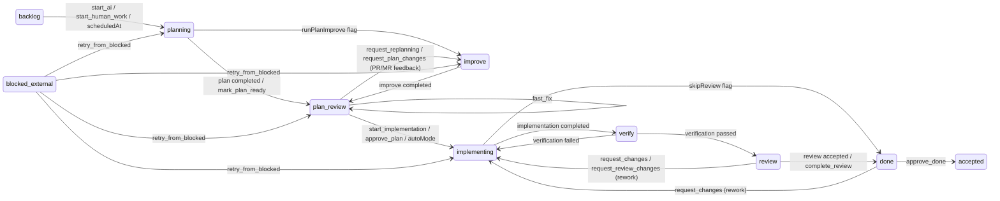

# ADR-IMPL.PROCESS.task-state-machine

**Статус:** ПРИНЯТО
**Дата:** 2026-09-14
**Контекст:** Задачи в AIF Handoff проходят через конвейер стадий: от создания (backlog) до завершения (done/accepted). Без формальной модели состояний каждый переход обрабатывался бы ad-hoc — статусы разрастались бы, условия переходов дублировались, и система стала бы непредсказуемой. Для AI-управляемого конвейера нужна детерминированная машина состояний с явными правилами, действиями и защитами.

**Требование-источник:** `vision.md` §1.3 HF-1–HF-7, `vision.md` §2 (границы конвейера), `docs/architecture.md` §Task State Machine

## Решение: Машина состояний в `packages/shared/src/stateMachine.ts` с централизованной функцией `computeTransition(action, task, context)`, возвращающей `TransitionResult` с патчем или ошибкой. Полный граф переходов (Mermaid state diagram):

**Статусы:** `backlog → planning → improve (опционально) → plan_review → implementing → verify → review → done → accepted`.

### Описание состояний

| Статус             | Роль                                         | Вход                                         | Выход                                                                                                                                                    |
| ------------------ | -------------------------------------------- | -------------------------------------------- | -------------------------------------------------------------------------------------------------------------------------------------------------------- |
| `backlog`          | Задача создана, ожидает запуска              | Создание, импорт                             | `start_ai` / `scheduledAt` / `start_human_work` → `planning`                                                                                             |
| `planning`         | AI планирует или человек описывает план      | `backlog`                                    | План готов → `plan_review`; флаг `runPlanImprove` → `improve`                                                                                            |
| `improve`          | `/aif-improve` уточняет план                 | `planning` (флаг) или `plan_review` (replan) | `improve` completed → `plan_review`                                                                                                                      |
| `plan_review`      | План готов, ожидает разрешения на реализацию | `planning` / `improve`                       | `start_implementation` / `approve_plan` / `autoMode` → `implementing`; `request_replanning` / `request_plan_changes` → `improve`; `fast_fix` → self-loop |
| `implementing`     | AI реализует план                            | `plan_review`                                | Реализация завершена → `verify`; флаг `skipReview` → `done`                                                                                              |
| `verify`           | Проверка реализации на соответствие плану    | `implementing`                               | Проверка пройдена → `review`; не пройдена → `implementing`                                                                                               |
| `review`           | Ревью кода (auto или human)                  | `verify`                                     | Ревью пройдено → `done`; изменения запрошены → `implementing`                                                                                            |
| `done`             | Реализация завершена, ожидает подтверждения  | `review` / `implementing` (skipReview)       | `approve_done` → `accepted`; `request_changes` → `implementing`                                                                                          |
| `accepted`         | Задача принята (терминальное состояние)      | `done`                                       | —                                                                                                                                                        |
| `blocked_external` | Задача заблокирована внешней причиной        | Любой статус (через error recovery)          | `retry_from_blocked` → исходный статус (`planning` / `improve` / `plan_review` / `implementing`)                                                         |

Ключевые принципы:

- **Actor-aware:** каждое действие знает, кто его выполняет (ai/human/system), и участник, если Participants Mode включён.
- **Skill-mode флаги:** `runPlanImprove` (вставка improve), `skipReview` (пропустить verify и review), `useSubagents` (subagent vs skills-mode).
- **AutoMode:** когда `true`, координатор автоматически проводит задачу по всем стадиям с auto-review gate.
- **Blocked external:** при недоступности рантайма задача переходит в `blocked_external` с `retryAfter` и автоматическим возвратом.
- **Action codes:** каждое возвращаемое действие имеет код (`action_not_allowed`, `actor_not_authorized` и т.д.) для однозначной обработки в API и UI.

**Рассмотренные альтернативы:**

- **XState / state machines as code** — внешняя библиотека для формальной машины. Отвергнуто: избыточно для текущей сложности, дополнительная зависимость, простые таблицы переходов читаются легче.
- **Статусы как enum без формальных правил** — `TaskStatus` + `if`-проверки по всему коду. Отвергнуто: дублирование правил, риск незаконного перехода.
- **State machine per pipeline stage** — отдельные автоматы для планирования, реализации, ревью. Отвергнуто: сложность согласования переходов между автоматами.

**Последствия:**

- **Положительные:** все правила в одном файле; `TransitionResult` с кодом ошибки даёт однозначную обратную связь API; actor-aware позволяет совмещать AI и human execution в одном автомате; флаги (skipReview, autoMode, scheduleAt) компонуются без раздувания переходов.
- **Отрицательные:** функция `computeTransition` — единая точка сложности; рост числа флагов увеличивает размер таблицы; hard-code mapping действий на статусы затрудняет добавление новых стадий без изменения ядра.
- **Смягчение:** `TransitionPatch` типизирован и расширяется через объединение типов; новые действия/флаги добавляются точечно, без переписывания существующих переходов.
