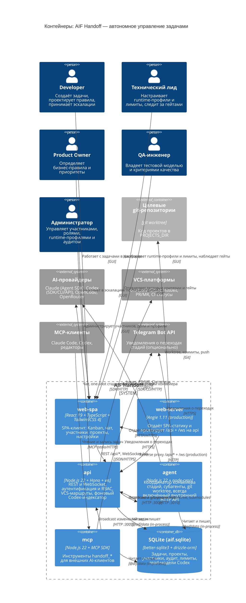

# Container — AIF Handoff: контейнеры системы автономного управления задачами

Диаграмма уровня 2 (Container) раскрывает исполняемые блоки системы **AIF Handoff** (`aif-handoff`):
контейнеры `web-spa`, `web-server`, `api`, `agent`, `mcp` и встроенную БД SQLite. Библиотечные модули (`shared`,
`runtime`, `data`) отдельными контейнерами не являются — они компилируются и исполняются внутри
процессов `api`, `agent` и `mcp`. Внешние AI-провайдеры, целевые git-репозитории, VCS-платформы,
MCP-клиенты и Telegram показаны как внешние системы без внутренней детализации.

Источники данных: [docker-compose.yml](../../docker-compose.yml), [docker-compose.production.yml](../../docker-compose.production.yml),
[.docker/Dockerfile](../../.docker/Dockerfile), [.docker/angie.conf](../../.docker/angie.conf),
[.docker/angie.production.conf](../../.docker/angie.production.conf), фактическая реализация в `packages/`,
[architecture.md](../architecture.md).

## Контекст

- **Человеческие персоны — единственные внешние акторы.** Developer, Технический лид, Product Owner,
  QA-инженер и Администратор работают с системой через `web-spa`. Внутри системы разделены два
  контейнера web-слоя: `web-server` (раздача статики/прокси) и `web-spa` (клиентское SPA-приложение).
  Роли различаются правами, а не каналом доступа. Состав совпадает с [уровнем контекста](context.md).
  AI-агенты внешними акторами не являются: их запускает `agent` внутри системы.
- **C4-контейнер = исполняемый процесс или отдельная зона ответственности.** В развёртывании
  присутствуют процессы `web` (Angie), `api`, `agent`, `mcp` и файл БД SQLite. На уровне модели
  web-слой разделён на `web-server` (server-side) и `web-spa` (client-side логика), чтобы
  явно показать доставку статики и исполнение интерфейса.
- **Библиотечные модули — не контейнеры.** `@aif/shared`, `@aif/runtime` и `@aif/data` — npm-пакеты
  рабочего пространства, исполняемые внутри процессов. `@aif/runtime` (реестр и адаптеры) и
  `@aif/data` (доступ к БД) присутствуют одновременно в `api` и `agent`, а `@aif/data` — ещё и в `mcp`.
- **БД — не сетевой сервис.** SQLite-файл (`DATABASE_URL`, том `db-data`) открывается in-process
  каждым процессом; сетевых связей к БД на диаграмме нет. Правило «только через `@aif/data`»
  закреплено lint-guard'ом.
- **`mcp` — контейнер с двумя режимами.** В HTTP-режиме это отдельный сервис на порту 3100 с
  Bearer-токеном; в stdio-режиме — дочерний процесс MCP-клиента, который портов не слушает.
- **AI-провайдеры — внешние системы.** Адаптеры `claude`, `codex`, `opencode`, `openrouter`
  исполняются внутри `api`/`agent` (SDK, CLI-процессы, HTTP-API), но сами провайдеры вне контура
  системы; конкретный провайдер выбирается runtime-профилем задачи или проекта.
- **`repos` — внешний ресурс, а не контейнер.** Целевые репозитории монтируются в контейнеры как
  каталог `PROJECTS_DIR` / `PROJECTS_MOUNT`; изменения выполняются в изолированных git worktree.

## Фактические контейнеры (привязка к реализации)

| Контейнер             | Технология                                     | Назначение                                                                                                        | Привязка                                                                                                                                    |
| --------------------- | ---------------------------------------------- | ----------------------------------------------------------------------------------------------------------------- | ------------------------------------------------------------------------------------------------------------------------------------------- |
| `web-spa`             | React 19 + TypeScript + TailwindCSS 4          | SPA-клиент: Kanban, чат, участники, проекты, настройки                                                            | `packages/web/src`; сборка через Vite                                                                                                       |
| `web-server`          | Angie 1.11 (production static server)          | Отдаёт SPA-статику и проксирует `/api/` + `/ws` на `api`                                                          | `.docker/angie.conf`, `.docker/angie.production.conf`; сервис `web` в compose                                                               |
| `api`                 | Node.js 22, Hono, `ws`, Zod                    | REST + WebSocket, session/CSRF/RBAC, маршруты VCS, фоновый Codex-индексатор, graceful shutdown                    | `packages/api/src/index.ts`, `serverBootstrap.ts`, `ws.ts`, `routes/`, `services/`, `middleware/`                                           |
| `agent`               | Node.js 22, `node-cron`, Hono (внутренний API) | Цикл координатора, стадии конвейера и субагенты, git worktree, публикация PR/MR, уведомления, внутренний HTTP API | `packages/agent/src/coordinator.ts`, `subagentQuery.ts`, `internalApi.ts`, `worktreeLifecycle.ts`, `githubWorkflow.ts`, `gitlabWorkflow.ts` |
| `mcp`                 | Node.js 22, `@modelcontextprotocol/sdk`, Zod   | MCP-сервер с инструментами `handoff_*`; транспорты Streamable HTTP и stdio                                        | `packages/mcp/src/index.ts`, `server.ts`, `tools/`, `middleware/rateLimit.ts`                                                               |
| `SQLite (aif.sqlite)` | better-sqlite3 + drizzle-orm                   | Единое хранилище состояния: задачи, проекты, участники, аудит, лимиты, read-модели Codex                          | Том `db-data` / `DATABASE_URL`; схема — `packages/shared/src/schema.ts`; миграции — `packages/shared/src/db.ts`; доступ — `packages/data`   |

### Библиотечные модули (не контейнеры)

| Модуль         | Назначение                                                       | Где исполняется                                |
| -------------- | ---------------------------------------------------------------- | ---------------------------------------------- |
| `@aif/shared`  | Типы, схема БД, автомат стадий, env, константы, логгер, Telegram | `api`, `agent`, `mcp`, `web` (browser-экспорт) |
| `@aif/runtime` | Контракты рантайма, реестр, разрешение профилей, адаптеры        | `api`, `agent`                                 |
| `@aif/data`    | Централизованный доступ к БД (все репозитории и SQL)             | `api`, `agent`, `mcp`                          |

## Интерфейсы контейнеров

| Контейнер    | Интерфейс                                                                                                                                | Порт / транспорт                         | Аутентификация                                                                                        |
| ------------ | ---------------------------------------------------------------------------------------------------------------------------------------- | ---------------------------------------- | ----------------------------------------------------------------------------------------------------- |
| `web-spa`    | Клиентское SPA-приложение: Kanban-дашборд, чат, участники, проекты, настройки                                                            | загружается из `web-server`              | Session-cookie участника (проверяется в `api`)                                                        |
| `web-server` | HTTP-сервер статики + reverse proxy `/api/` и `/ws`                                                                                      | dev `5180` (`WEB_PORT`); prod `80`/`443` | Без сессии; сессия проверяется downstream в `api`                                                     |
| `api`        | REST: `/health`, `/settings`, `/auth/*`, `/participants/*`, `/projects/*`, `/tasks/*`, `/chat/*`, `/runtime-profiles/*`; WebSocket `/ws` | `3009` (`PORT`)                          | Session + CSRF при `PARTICIPANTS_MODE_ENABLED`; `INTERNAL_BROADCAST_TOKEN` для `/tasks/:id/broadcast` |
| `agent`      | Внутренний HTTP API: `/health`, `/github/prepare`, `/gitlab/prepare`, `/worktrees/cleanup`, `/submodules/sync`; Codex login broker (dev) | `3010` (только внутри compose-сети)      | Bearer `INTERNAL_BROADCAST_TOKEN` либо заголовок `X-Internal-Broadcast-Token`                         |
| `mcp`        | MCP Streamable HTTP: `/mcp` (POST); `/health`                                                                                            | `3100` (`MCP_PORT`) или stdio            | Bearer `MCP_AUTH_TOKEN` (HTTP); stdio считается доверенным                                            |
| `SQLite`     | Прямой доступ к файлу БД через `@aif/data`                                                                                               | in-process, без сокета                   | Права ОС; общий том `db-data`                                                                         |

## Как контейнеры взаимодействуют

- **`web-server` → `web-spa`** — отдаёт SPA-статику.
- **`web-spa` → `api`** — REST-вызовы и WebSocket `/ws`.
- **`web-server` → `api`** — reverse proxy `/api/*` и `/ws` в production.
  Прямых импортов между пакетами нет — только сетевые вызовы.
- **`api` → `agent`** — HTTP-вызовы внутреннего API агента (подготовка git-репозитория, очистка
  worktree, синхронизация submodules, Codex login broker) через `AGENT_INTERNAL_URL`.
- **`agent` / `mcp` → `api`** — best-effort вызовы с внутренним токеном: `POST /tasks/:id/broadcast`
  и VCS-операции `POST /projects/:id/{github,gitlab}/sync`, `.../tasks/:taskId/publish`,
  `.../tasks/:taskId/publish-plan`.
- **`api` / `agent` / `mcp` → БД** — только через `@aif/data`; прямые SQL-импорты запрещены lint-guard'ом.
- **`agent` → целевые репозитории** — единственный писатель в git: worktree под задачу, коммиты и `git push`.
- **`api` → VCS** — REST-вызовы к GitHub/GitLab (Issues, PR/MR, CI-статусы); режим включается
  `GIT_PROVIDER` и rollout-флагами `AIF_GITHUB_ISSUE_PR_ENABLED` / `AIF_GITLAB_ISSUE_MR_ENABLED`.
- **`api` / `agent` → AI-провайдеры** — исполнение стадий и чата через адаптеры `@aif/runtime`.

## Ключевые сценарии (кратко)

1. **Обработка задачи (Backlog → Done).** Developer работает в `web-spa`; `api` пишет задачу в SQLite;
   `agent` забирает задачу в цикле координатора, запускает стадии через runtime-адаптер в изолированном
   git worktree, а `api` публикует PR/MR в VCS. Статус возвращается в SPA через WebSocket.
2. **Real-time обновления.** Координатор и MCP-инструменты уведомляют `api` вызовом broadcast; `api`
   рассылает событие (`task:*`, `chat:*`, `project:*`, `sync:*`) всем клиентам `/ws`, и `web-spa`
   инвалидирует соответствующие запросы.
3. **Работа из внешнего AI-инструмента.** MCP-клиент подключается к `mcp` (stdio локально или HTTP на 3100) и читает/изменяет задачи через инструменты `handoff_*`; изменения идут в ту же БД через
   `@aif/data` и отражаются в дашборде так же, как изменения из Web UI.

## Примечания по соответствию коду

- **C4-контейнер ≠ npm-пакет.** `shared`, `runtime` и `data` не вынесены в контейнеры: они
  исполняются внутри `api`, `agent` и `mcp`. Это соответствует [README](README.md) и lint-guard'у
  на границу доступа к БД.
- **C4-контейнер ≠ Docker-сервис.** В stdio-режиме `mcp` запускается MCP-клиентом как дочерний
  процесс и не слушает порт; отдельным сервисом он становится только в HTTP-режиме (`MCP_TRANSPORT=http`).
- **Порт 3010 не публикуется на хост.** Внутренний API агента доступен только внутри compose-сети
  (`expose`, не `ports`); Codex login broker разделяет с ним тот же порт и включается только флагом
  `AIF_ENABLE_CODEX_LOGIN_PROXY`.
- **БД разделяется томом.** `api`, `agent` и `mcp` монтируют общий том `db-data` с файлом
  `aif.sqlite`; это не клиент-серверное соединение, а параллельный in-process доступ к файлу.
- **Codex-индексатор — фоновая задача внутри `api`.** Сервис читает `~/.codex/sessions` (том
  `codex-auth`) и материализует read-модели в SQLite, чтобы горячие эндпоинты не сканировали
  файловую систему в пути запроса.
- **AI-провайдеры не фиксированы в коде.** Четыре встроенных адаптера дополняются внешними модулями
  через `AIF_RUNTIME_MODULES`; выбор провайдера — задача → проект → системное значение по умолчанию.
- **`web-server` в production — это Angie, а не Vite.** В compose dev сервис `web` также отдаёт
  собранную статику на `:80`; в production этот контейнер проксирует `/api/` и `/ws` на `api:3009`.
  Модельный контейнер `web-spa` отражает клиентское SPA-приложение и не является отдельным docker-сервисом.
- **Telegram — опциональная зависимость.** Без `TELEGRAM_BOT_TOKEN` и `TELEGRAM_USER_ID` уведомления
  молча не отправляются; ни одна стадия конвейера от них не зависит.
- **Тома, а не контейнеры, хранят состояние окружения.** Помимо `db-data` используются `projects`
  (целевые репозитории), `claude-auth`, `codex-auth` и `ssl-certs`; подробности — уровень Deployment.

## Трассируемость

| Функция                                   | Контейнеры                                                        |
| ----------------------------------------- | ----------------------------------------------------------------- |
| HF1. Hand-off-конвейер                    | `agent` (координатор и субагенты), `api`, `SQLite`, AI-провайдеры |
| HF2. Единый дашборд изменений             | `web-spa`, `web-server`, `api` (WebSocket `/ws`)                  |
| HF3. Подключаемые runtime-адаптеры        | `@aif/runtime` внутри `api` и `agent`                             |
| HF4. VCS-автоматизация                    | `agent` (worktree, коммиты, push), `api` (публикация PR/MR)       |
| HF5. Quality Gates и независимая проверка | `agent` (гейты и sidecar-агенты), AI-провайдеры                   |
| HF6. Учёт использования и лимиты          | `@aif/runtime` + `SQLite` (`usage_events`, снимки лимитов)        |
| HF7. Роли, handoff и эскалация            | `api` (RBAC), `@aif/data` (ownership и переходы)                  |
| HF8. Чат с AI-ассистентом                 | `web-spa`, `api`, AI-провайдеры                                   |
| HF9. Участники и аутентификация           | `api` (session/CSRF), `@aif/data`                                 |
| HF10. Аудит и наблюдаемость               | `@aif/data` (журнал аудита), `SQLite`, WebSocket-события          |
| HF11. VCS-интеграция (GitHub/GitLab)      | `api` (маршруты и клиенты GitHub/GitLab), VCS-платформы           |
| HF12. Разогрев сессий (Warmup)            | `agent` (`subagentQuery`), `@aif/runtime`, AI-провайдеры          |

- Пользовательские сценарии — [UC](../use-cases/README.md) (`UC-pipeline.*`, `UC-runtime.*`, `UC-integration.*`, `UC-auth.*`).
- Ограничения жизненного цикла и доступа — [BR](../business-rules/README.md) (`BR-constraint.git.*`, `BR-constraint.auth.*`, `BR-constraint.automation.*`).

## Связанные артефакты

- [System Context](context.md) — уровень 1: персоны, внешние системы, функции HF1–HF12
- [Индекс C4](README.md) — уровни C4, правила именования, формат описания
- [Архитектура](../architecture.md) — пакеты, правила зависимостей, конвейер агента, автомат стадий
- [Контракты](../contracts/README.md) — межпакетные интерфейсы, REST API, WebSocket, адаптеры
- [API Reference](../api.md) — REST-эндпоинты, WebSocket-события, внутренний API агента
- [Конфигурация](../configuration.md) — переменные окружения, порты, логирование
- [Провайдеры](../providers.md) — runtime-профили, адаптеры, матрица возможностей
- [MCP Sync](../mcp-sync.md) — инструменты `handoff_*`, транспорты и аутентификация MCP
- [ADR](../adr/README.md) — архитектурные решения проекта
