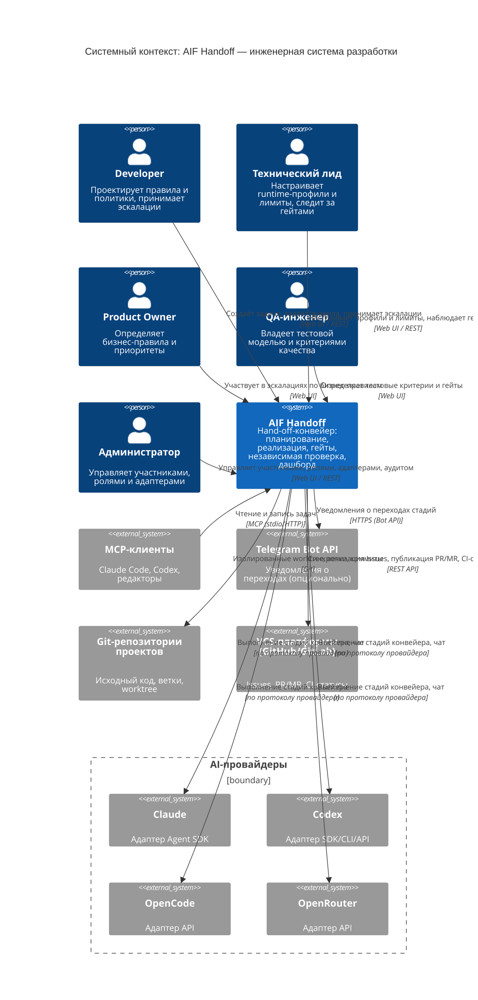

# System Context — AIF Handoff: система автономного управления задачами

Диаграмма уровня 1 (System Context) описывает систему **AIF Handoff** (`aif-handoff`) — инженерную систему разработки, в которой изменение проходит hand-off-конвейер стадий (планирование → реализация → проверки → merge), а исполняющим контуром выступает AI. Внешние AI-провайдеры, git-репозитории целевых проектов, VCS-платформы и MCP-клиенты показаны как внешние системы без внутренней детализации (подробности — на [уровне контейнеров](container.md)).

Источники данных: [vision.md](../vision.md) §3.1 (персоны), §3.2 (приоритеты), §2.2 (функции HF1–HF12), §3.3 (исходная диаграмма контекста); [.ai-factory/ARCHITECTURE.md](../../.ai-factory/ARCHITECTURE.md); фактическая реализация в `packages/`.

## Назначение системы

**Кратко.** AIF Handoff — инженерная система разработки, в которой передача ответственности между стадиями формализована: изменение проходит конвейер от Issue до доверенного change set через планирование, реализацию, формальные гейты и независимую проверку.

**Подробно.** Человек проектирует систему, задаёт правила и принимает решения, которые нельзя автоматизировать. Машина выполняет повторяемую работу: планирует изменение, реализует его в изолированном контексте, проверяет формальными гейтами, публикует PR/MR. Каждая стадия обрабатывается специализированным агентом, а провайдер исполнения выбирается подключаемыми runtime-адаптерами — система не привязана к одному AI-провайдеру. Доступ к состоянию изменения — через единый дашборд с обновлениями в реальном времени. Границы и бизнес-обоснование — [vision.md](../vision.md).

## Контекст

- **Граница системы.** Внутрь границы попадает модульный монолит из семи пакетов (`shared`, `runtime`, `data`, `api`, `web`, `agent`, `mcp`), разворачиваемый как набор Docker-сервисов. Человеческие персоны работают с системой через веб-браузер (SPA `web`, REST и WebSocket `api`); браузер — канал доступа, а не самостоятельная система.
- **AI-агенты — не внешний актор.** Программные исполнители конвейера (планировщик, реализатор, sidecar-агенты) запускаются координатором внутри системы через runtime-адаптеры. В требованиях они перечислены как программные пользователи ([vision.md](../vision.md) §3.1), но на диаграмме контекста внешним актором не являются: система владеет их запуском и их результатами.
- **AI-провайдеры — внешние системы.** Claude, Codex, OpenCode и OpenRouter вынесены в отдельную границу: конкретный провайдер выбирается runtime-профилем задачи проекта, поэтому система остаётся провайдер-независимой.
- **Git-репозитории целевых проектов** — предмет работы конвейера: изменения выполняются в изолированных git worktree и завершаются коммитами.
- **VCS-платформы** (GitHub, GitLab) — внешний процесс ревью: синхронизация Issue, публикация atomic PR/MR, чтение CI-статусов. Режим включается конфигурацией развёртывания.
- **MCP-клиенты** — внешние AI-инструменты, которые работают с теми же задачами: чтение и запись через сервер `mcp`.
- **Telegram** — опциональный канал уведомлений о переходах стадий; при отсутствии конфигурации уведомления не отправляются, поведение конвейера не меняется.

## Персоны

| Персона                                          | Тип                                | Цели                                                                                | Ключевые функции   |
| ------------------------------------------------ | ---------------------------------- | ----------------------------------------------------------------------------------- | ------------------ |
| **Developer**                                    | Человек (Web UI, дашборд)          | Проектировать правила и политики, принимать инженерные решения и эскалации          | HF1, HF4, HF5, HF7 |
| **Технический лид**                              | Человек (дашборд, настройки)       | Настраивать runtime-профили и лимиты, наблюдать гейты и метрики процесса            | HF3, HF6, HF7, HF9 |
| **Product Owner**                                | Человек (эскалации)                | Определять бизнес-правила, видение и приоритеты; принимать продуктовые решения      | HF7.2              |
| **QA-инженер**                                   | Человек (тестовая модель)          | Владеть тестовой моделью и критериями качества, определять тестовые гейты           | HF5                |
| **Администратор**                                | Человек (админ-панель)             | Управлять участниками, ролями, внешними адаптерами и аудитом                        | HF9, HF10, HF3.3   |
| **AI-агенты** (планировщик, реализатор, sidecar) | Программный (исполняется системой) | Исполнять стадии конвейера в рамках формализованных правил, эскалировать при тупике | HF1, HF4, HF5      |

## Функции системы и их внешние зависимости

Разбивка функций — по [vision.md](../vision.md) §2.2 (HF1–HF12).

| Функция                                       | Внешние системы контекста                                                            |
| --------------------------------------------- | ------------------------------------------------------------------------------------ |
| **HF1. Hand-off-конвейер**                    | AI-провайдеры (исполнение стадий), git-репозитории (изолированное выполнение)        |
| **HF2. Единый дашборд изменений**             | — (канал: браузер; при включении — Telegram для уведомлений о переходах)             |
| **HF3. Подключаемые runtime-адаптеры**        | AI-провайдеры (встроенные и внешние через `AIF_RUNTIME_MODULES`)                     |
| **HF4. VCS-автоматизация**                    | git-репозитории (worktree, ветки, коммиты), VCS-платформы (публикация плана и PR/MR) |
| **HF5. Quality Gates и независимая проверка** | AI-провайдеры (sidecar-агенты и верификация)                                         |
| **HF6. Учёт использования и лимиты**          | AI-провайдеры (данные о расходе и лимитах)                                           |
| **HF7. Роли, handoff и эскалация**            | — (внутренний контур системы)                                                        |
| **HF8. Чат с AI-ассистентом**                 | AI-провайдеры (консультации в контексте проекта и задачи)                            |
| **HF9. Участники и аутентификация**           | — (внутренний контур системы)                                                        |
| **HF10. Аудит и наблюдаемость**               | — (внутренний контур системы)                                                        |
| **HF11. VCS-интеграция (GitHub/GitLab)**      | VCS-платформы (Issues, PR/MR, CI-статусы)                                            |
| **HF12. Разогрев сессий (Warmup)**            | AI-провайдеры (предварительный прогрев сессий)                                       |

## Элементы и их соответствие

| Элемент                                   | Описание                                           | Привязка к реализации                                                                                                                                                            |
| ----------------------------------------- | -------------------------------------------------- | -------------------------------------------------------------------------------------------------------------------------------------------------------------------------------- |
| `handoff` (система)                       | Модульный монолит: конвейер, гейты, дашборд, аудит | Этот репозиторий: `packages/{shared,runtime,data,api,web,agent,mcp}`; запуск — `npm run dev` или `docker compose up`                                                             |
| AI-провайдеры (внешняя граница)           | Исполнение стадий конвейера и чата                 | Адаптеры `packages/runtime/src/adapters/{claude,codex,opencode,openrouter}`; контракт `RuntimeAdapter` (`packages/runtime/src/types.ts`); выбор — runtime-профиль задачи/проекта |
| `git` (внешняя система)                   | Репозитории целевых проектов: код, ветки, worktree | `PROJECTS_DIR` / `PROJECTS_MOUNT`; изоляция — `packages/agent/src/worktreeLifecycle.ts`, `gitOperationLock.ts`                                                                   |
| `vcs` (внешняя система)                   | GitHub и GitLab: Issues, PR/MR, CI-статусы         | `packages/api/src/services/github.ts`, `gitlab.ts`; `packages/agent/src/githubWorkflow.ts`, `gitlabWorkflow.ts`, `githubPrepare.ts`, `gitlabPrepare.ts`                          |
| `mcpclients` (внешние системы)            | AI-инструменты, работающие с задачами              | `packages/mcp` — транспорт stdio или HTTP (`MCP_PORT`, по умолчанию `3100`)                                                                                                      |
| `telegram` (внешняя система, опционально) | Push-уведомления о переходах стадий                | `packages/shared/src/telegram.ts`, `packages/agent/src/notifier.ts`; включается `TELEGRAM_BOT_TOKEN` + `TELEGRAM_USER_ID`                                                        |

## Ключевые сценарии

### Hand-off-конвейер — Developer

1. Developer создаёт задачу в Web UI — она попадает в стадию `Backlog`.
2. Координатор забирает задачу и запускает стадию `Planning`: агент-планировщик формирует Change Plan на основе контекста проекта.
3. План проходит `Improve` (второй проход на полноту и противоречия) и гейт `Plan Review` — план публикуется PR/MR для утверждения человеком.
4. После утверждения стадия `Implementing` выполняет изменение в изолированном git worktree, затем `Verify` подтверждает работоспособность.
5. Стадия `Review` запускает независимую проверку (sidecar-агенты, read-only); при замечаниях задача возвращается на доработку, при исчерпании попыток — эскалируется с диагностикой.
6. Задача завершается коммитом и atomic PR/MR в VCS-платформе; статус в дашборде обновляется в реальном времени.

### Настройка runtime и лимитов — Технический лид

1. Технический лид выбирает AI-провайдера и модель для проекта или отдельной задачи (runtime-профиль).
2. Координатор при запуске стадии разрешает профиль: переопределение задачи → профиль проекта → системное значение по умолчанию.
3. Расход каждого вызова учитывается; при приближении к лимиту новые запуски блокируются, а задача возобновляется после сброса лимита провайдера.

### Работа с задачей из внешнего AI-инструмента — Developer + MCP-клиент

1. Developer открывает свой AI-инструмент (Claude Code, Codex, редактор), подключённый к серверу `mcp`.
2. Клиент читает и обновляет задачи через инструменты `handoff_*` (создание, поиск, план, статус синхронизации).
3. Изменения, сделанные извне, отражаются в дашборде так же, как изменения из Web UI.

### Администрирование — Администратор

1. Администратор управляет участниками и ролями, подключает внешние runtime-адаптеры.
2. Система фиксирует действия в неизменяемом аудит-журнале и предоставляет историю исполнителей по каждой задаче.

## Примечания по соответствию коду

- **AI-агенты не вынесены на диаграмму как внешний актор.** В [vision.md](../vision.md) §3.1 они указаны среди профилей заинтересованных лиц как программные пользователи, однако архитектурно их запускает координатор внутри системы (`packages/agent/src/coordinator.ts` → `subagentQuery.ts` → runtime-адаптер). Изображение их внешним актором исказило бы модель.
- **Диаграмма согласована с [vision.md](../vision.md) §3.3** и расширена персонами из §3.1 (QA-инженер, Администратор) и внешними системами уровня контекста (MCP-клиенты, Telegram).
- **VCS-интеграция управляется конфигурацией развёртывания:** `GIT_PROVIDER` выбирает платформу, `AIF_GITHUB_ISSUE_PR_ENABLED` / `AIF_GITLAB_ISSUE_MR_ENABLED` включают режим; по умолчанию GitLab-режим выключен.
- **Telegram — опциональная зависимость** и best-effort: без `TELEGRAM_BOT_TOKEN` и `TELEGRAM_USER_ID` уведомления молча не отправляются, стадии конвейера от них не зависят.
- **MCP-транспорт не всегда сетевой:** в режиме stdio сервер запускается клиентом как дочерний процесс и портов не слушает; HTTP-режим (порт `3100`) требует Bearer-токен.
- **Провайдеры не фиксированы в коде:** четыре встроенных адаптера дополняются внешними модулями через `AIF_RUNTIME_MODULES`.
- **Внутренняя структура системы намеренно не раскрывается** на этом уровне: контейнеры `web`, `api`, `agent`, `mcp` и БД SQLite — предмет [container.md](container.md).
- **База данных — не внешняя система:** SQLite встроена в процессы и доступна только через `@aif/data`, поэтому на диаграмме контекста она отсутствует.

## Трассируемость

- Персоны и их функции — [vision.md](../vision.md) §3.1, §3.2; пользовательские истории — §2.2 (HF1–HF12).
- Сценарии и внешние взаимодействия — [UC](../use-cases/README.md) (`UC-pipeline.*`, `UC-runtime.*`, `UC-integration.*`, `UC-auth.*`).
- Политики, ограничивающие взаимодействия, — [BR](../business-rules/README.md) (`BR-constraint.git.*`, `BR-constraint.auth.*`, `BR-constraint.automation.*`).

## Связанные артефакты

- [Контейнеры](container.md) — уровень 2: контейнеры системы и внешние сервисы
- [Индекс C4](README.md) — уровни C4, правила именования, формат описания
- [Видение продукта](../vision.md) — персоны (§3.1), функции HF1–HF12 (§2.2), исходная диаграмма контекста (§3.3)
- [Архитектура](../architecture.md) — пакеты, правила зависимостей, конвейер агента
- [Архитектура (.ai-factory)](../../.ai-factory/ARCHITECTURE.md) — архитектурные решения для AI-агентов
- [Глоссарий](../glossary.md) — термины предметной области
- [Провайдеры](../providers.md) — runtime-профили, адаптеры, матрица возможностей
- [MCP Sync](../mcp-sync.md) — инструменты, транспорты и аутентификация MCP
- [Прецеденты использования](../use-cases/README.md) — сценарии по каналам GUI/API/Agent/Schedule
