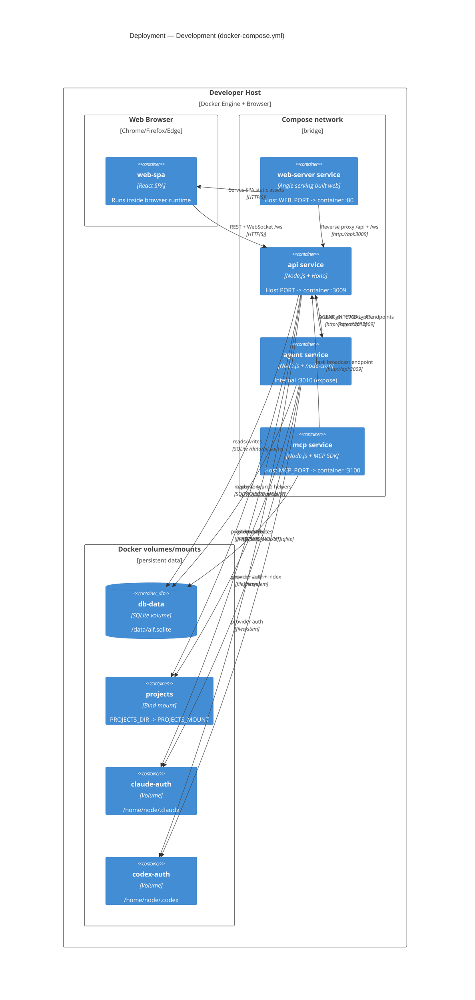
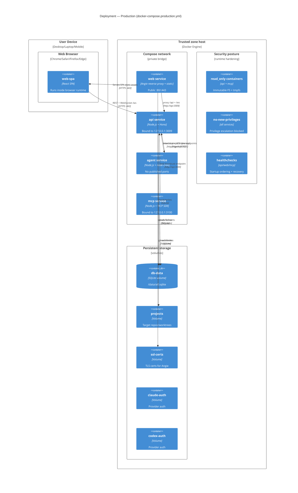
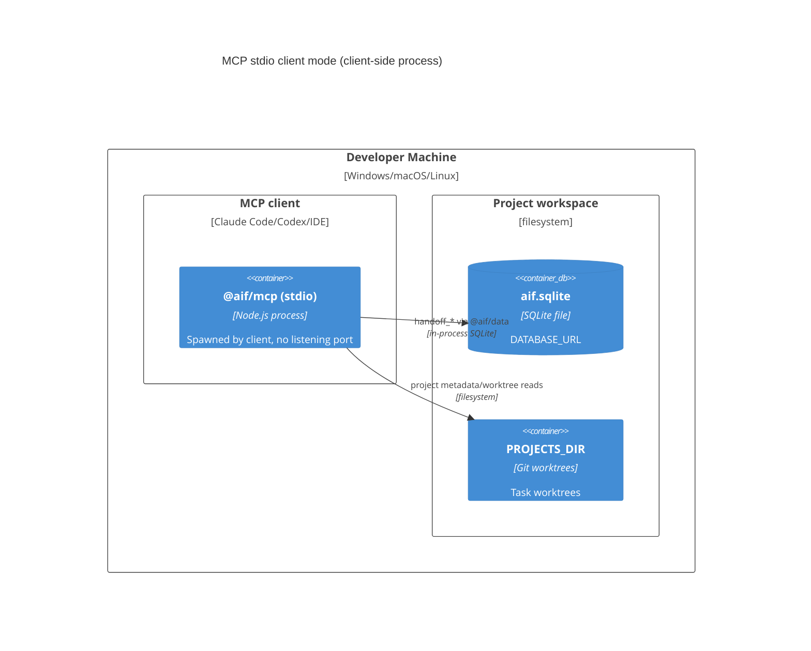

# Deployment — AIF Handoff: развёртывание по окружениям

Диаграммы уровня Deployment показывают физическое размещение контейнеров и зависимостей
для окружений проекта. Это **as-is** снимок по текущим `docker-compose.yml`,
`docker-compose.production.yml` и режимам транспорта MCP.

Источники: [docker-compose.yml](../../docker-compose.yml),
[docker-compose.production.yml](../../docker-compose.production.yml),
[docs/mcp-sync.md](../mcp-sync.md), [.docker/angie.production.conf](../../.docker/angie.production.conf).

## 1) Development — Docker Compose

## 2) Production — Hardened Docker Compose

## 3) Дополнение: MCP stdio как клиентский режим (не отдельное окружение)

## Примечания по соответствию коду

- **Dev-окружение проекта — Docker Compose.** Основная dev-схема соответствует `docker-compose.yml`.
- `api` публикуется наружу на `3009` в dev compose и привязан к `127.0.0.1:3009` в production.
- `agent` внутренний: порт `3010` не публикуется наружу (в dev `expose`, в production без `ports`).
- `mcp` в compose работает как HTTP-сервис (`:3100`), а stdio — это отдельный клиентский режим запуска.
- БД — SQLite файл на общем томе (`db-data`), а не отдельный сетевой DB-сервис.
- В production активирован hardening: `read_only`, `tmpfs`, `no-new-privileges`, healthchecks,
  и лимиты ресурсов в `deploy.resources.limits`.

## Связанные артефакты

- [Container](container.md) — логические контейнеры и их связи
- [System Context](context.md) — внешние акторы и системы
- [Configuration](../configuration.md) — env-переменные и порты
- [MCP Sync](../mcp-sync.md) — stdio/http режимы MCP и auth
