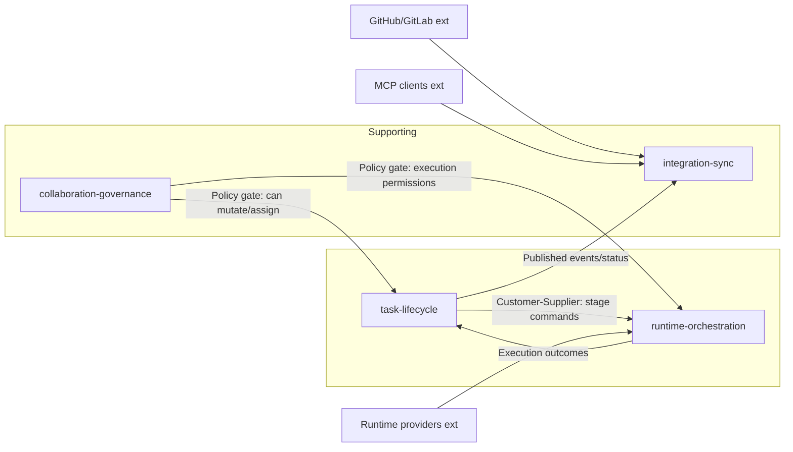

# Карта ограниченных контекстов — AIF Handoff

> Источники: `docs/vision.md`, `docs/business-rules/`, `docs/contracts/`, `packages/shared/src/stateMachine.ts`, `packages/shared/src/taskLifecycle.ts`, `packages/runtime/src/*`, `packages/data/src/*`, `packages/agent/src/*`.

## 1. Ограниченные контексты

| ID                         | Контекст (RU)                               | Классификация  | Ключевая ответственность                                              | Основные артефакты                                                                                                        |
| -------------------------- | ------------------------------------------- | -------------- | --------------------------------------------------------------------- | ------------------------------------------------------------------------------------------------------------------------- |
| `task-lifecycle`           | Жизненный цикл задач                        | **Core**       | Стадии задачи, валидные переходы, фиксация статуса/результата         | `@aif/shared/stateMachine`, `@aif/shared/taskLifecycle`, `@aif/data/taskTransitions`                                      |
| `runtime-orchestration`    | Оркестрация runtime и subagent execution    | **Core**       | Выбор профиля, capability gating, запуск workflow через адаптеры      | `@aif/runtime/*`, `packages/agent/src/subagentQuery.ts`, `packages/api/src/services/runtime.ts`                           |
| `collaboration-governance` | Владение, участники и политики доступа      | **Supporting** | Ownership/handoff, авторизация, участники, audit и policy-ограничения | `@aif/data/participants`, `@aif/data/taskOwnership`, `@aif/data/authSessions`, `packages/api/src/use-cases/taskPolicy.ts` |
| `integration-sync`         | Внешние интеграции и публикация результатов | **Supporting** | GitHub/GitLab sync, PR/MR публикации, MCP-синхронизация, уведомления  | `packages/agent/src/githubWorkflow.ts`, `gitlabWorkflow.ts`, `planReviewPublisher.ts`, `packages/mcp/src/tools/*`         |

### Обоснование классификации

| Контекст                                  | Почему Core / Supporting                                                                                          |
| ----------------------------------------- | ----------------------------------------------------------------------------------------------------------------- |
| **task-lifecycle** — Core                 | Без корректной модели стадий и переходов система теряет ключевую ценность «автономного handoff».                  |
| **runtime-orchestration** — Core          | Автоматизация зависит от единообразного исполнения workflow поверх разных runtime-провайдеров.                    |
| **collaboration-governance** — Supporting | Не определяет саму бизнес-ценность pipeline, но критичен для безопасности и управляемости работы людей/агентов.   |
| **integration-sync** — Supporting         | Расширяет возможности продукта во внешних контурах (VCS/MCP), но может быть заменён без изменения ядра lifecycle. |

## 2. Отношения контекстов (Context Map)

| От (upstream)              | К (downstream)          | Паттерн                | Механизм                                                                                          |
| -------------------------- | ----------------------- | ---------------------- | ------------------------------------------------------------------------------------------------- |
| `task-lifecycle`           | `runtime-orchestration` | **Customer-Supplier**  | Lifecycle задаёт intent и workflow stage; runtime-контекст исполняет шаг через подходящий адаптер |
| `runtime-orchestration`    | `task-lifecycle`        | **Published Language** | Результат исполнения (success/failure/category) возвращается в доменные переходы                  |
| `collaboration-governance` | `task-lifecycle`        | **Policy Gate**        | Проверки ownership/roles/allowed actions перед изменением задачи                                  |
| `collaboration-governance` | `runtime-orchestration` | **Policy Gate**        | Ограничения на запуск workflow и handoff между human/AI исполнителями                             |
| `task-lifecycle`           | `integration-sync`      | **Published Language** | Стадийные события используются для публикации PR/MR, комментариев, MCP-обновлений                 |

## 3. Внешние системы и ACL

| Наш контекст               | Внешняя система                  | Паттерн                     | Антикоррупционный слой                                                                       |
| -------------------------- | -------------------------------- | --------------------------- | -------------------------------------------------------------------------------------------- |
| `runtime-orchestration`    | Claude/Codex/OpenRouter/OpenCode | **Conformist + ACL**        | Адаптеры `@aif/runtime/adapters/*` приводят провайдер-специфику к `RuntimeAdapter` контракту |
| `integration-sync`         | GitHub / GitLab API              | **Open Host Service + ACL** | `githubWorkflow.ts` / `gitlabWorkflow.ts` переводят внутренние события в PR/MR операции      |
| `integration-sync`         | MCP clients                      | **Open Host Service**       | `@aif/mcp` экспонирует task-операции через protocol-level tools                              |
| `collaboration-governance` | Browser/session layer            | **ACL**                     | `authSessions` + API middleware нормализуют сессионную модель и роли                         |

## 4. Глобальные инварианты модели

1. Переходы задачи возможны только по разрешённым правилам state machine.
2. Автоматические workflow не обходят policy-check ownership/authorization.
3. Runtime capability проверяется до запуска конкретного workflow.
4. Ошибки классифицируются по структурным признакам (`category`, `adapterCode`, `httpStatus`), а не по строковым шаблонам сообщений.
5. Доступ к persistence из delivery-слоёв выполняется только через `@aif/data`.
6. Integration-sync не изменяет доменные правила lifecycle; он только публикует/синхронизирует доменные результаты.

## Связанные артефакты

- [Агрегаты](aggregates.md)
- [Доменные события](domain-events.md)
- [Словарь данных](data-dictionary.md)
- [Business Rules](../business-rules/README.md)
- [Architecture](../architecture.md)
