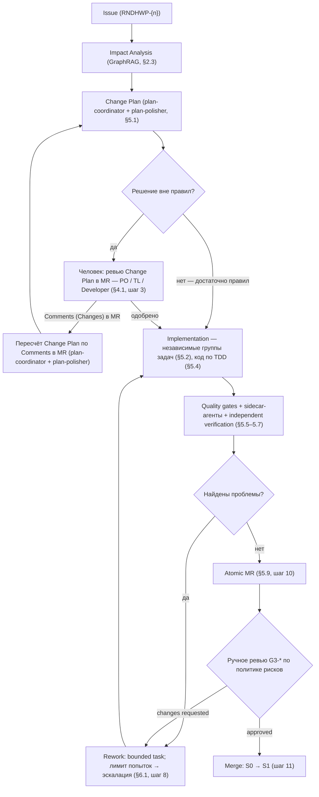
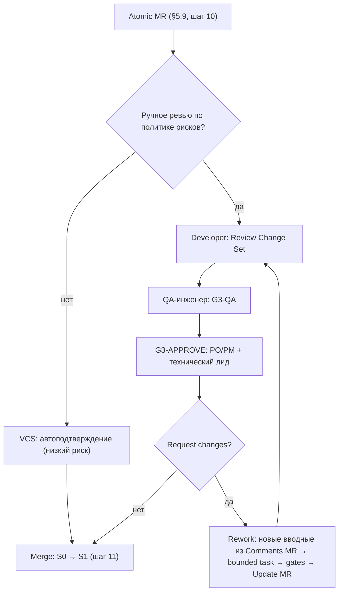
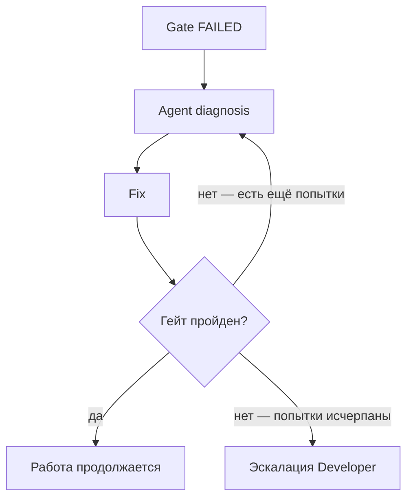
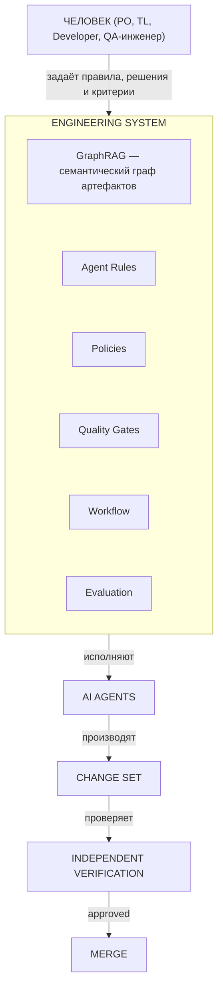

# Как мы разрабатываем

## Часть 0. Назначение и статус

Этот документ описывает hand-off-конвейер разработки: как изменение проходит от Issue до Atomic MR через планирование, реализацию, проверки, эскалацию и merge.

Статус документа — описание целевого процесса (to-be). Семантический граф артефактов, правила изменения и тестовая модель уже определены в целевом проекте и здесь не повторяются.

Ключевые обозначения:

- **GraphRAG** — механизм, который использует граф артефактов целевого проекта для планирования и проверки влияния изменений.
- **Агенты** — исполнители внутри конвейера (`plan-coordinator`, `plan-polisher`, `implement-coordinator`, `implement-worker`, sidecar-агенты). Имена взяты из aif-handoff (https://github.com/lee-to/aif-handoff); под капотом работает тот же AI Factory, что и в этом проекте (`.ai-factory/`, `.agents/skills/`).
- **Семантический граф артефактов** — вход для планирования и анализа влияния.
- **Каталог гейтов** — `specs/qa/gates.md`.
- **QA-инженер** — командная роль, отвечающая за тестовую модель и критерии качества (см. `specs/glossary.md`, §4 «Участники и роли»).

## Оглавление

- [Часть 0. Назначение и статус](#часть-0-назначение-и-статус)
- [Часть 1. Зачем мы меняем процесс](#часть-1-зачем-мы-меняем-процесс)
- [Часть 2. Модель: GraphRAG и семантический граф артефактов](#часть-2-модель-graphrag-и-семантический-граф-артефактов)
- [Часть 3. Обзор процесса одним взглядом](#часть-3-обзор-процесса-одним-взглядом)
- [Часть 4. Роли и границы ответственности](#часть-4-роли-и-границы-ответственности)
- [Часть 5. Механика конвейера по этапам](#часть-5-механика-конвейера-по-этапам)
- [Часть 6. Сбои и эскалация](#часть-6-сбои-и-эскалация)
- [Часть 7. Операционный цикл и правила](#часть-7-операционный-цикл-и-правила)
- [Часть 8. Главный принцип](#часть-8-главный-принцип)

---

## Часть 1. Зачем мы меняем процесс

Мы хотим, чтобы разработка перестала зависеть от ручной передачи знаний между людьми и ручного контроля каждого шага.

Сегодня изменение обычно проходит через цепочку:

**требование → анализ → разработка → тестирование → документация.**

На каждом переходе человек должен заново разобраться, что было решено раньше. При этом часть знаний находится в документации, часть — в коде, часть — в тестах, а часть — только в голове участников команды.

В результате появляются знакомые проблемы:

- требования расходятся с кодом;
- тесты не соответствуют актуальным требованиям;
- документация устаревает;
- изменения в одном месте не распространяются на зависимые артефакты;
- разработчик тратит время на механическую работу;
- качество зависит от того, насколько внимательно человек проверил каждый этап.

Мы строим другой процесс.

Его основа — hand-off-конвейер, который переводит проект из одного согласованного состояния в другое через ограниченную передачу ответственности между стадиями.

Главная идея:

> **Мы не передаём задачу от специалиста к специалисту. Мы передаём изменение по конвейеру стадий, пока оно не становится согласованным change set для merge.**

---

## Часть 2. Модель: GraphRAG и семантический граф артефактов

В этом документе граф артефактов рассматривается только как вход для hand-off-планирования. Подробное описание самих артефактов, их связей и правил изменения уже дано в целевом проекте.

### 2.1. Семантический граф артефактов

Граф артефактов — это внешняя опора процесса. Hand-off использует его, чтобы определить источник изменения, затронутые артефакты и порядок их обновления.

### 2.2. Что такое GraphRAG

GraphRAG — это механизм, который читает граф артефактов как рабочий контекст и превращает запрос в план изменения: что затронуто, что можно делать параллельно, а что нужно выполнять последовательно.

### 2.3. Что означает изменение

Изменение — это переход набора артефактов из одного согласованного состояния в другое. Результат этой операции — Change Plan, который становится входом для реализации.

---

## Часть 3. Обзор процесса одним взглядом

Процесс показан в двух формах: текстовый hand-off-пайплайн (§3.1) и полная диаграмма последовательности (§3.2). Здесь описывается именно конвейер передачи ответственности, а не предметная модель артефактов.

### 3.1. Текстовый пайплайн

В упрощённом виде hand-off выглядит так (в скобках — статус автомата задачи из ADR-IMPL.PROCESS.task-state-machine):

```text
Issue (Jira RNDHWP-{n})                                [backlog]
  ↓
Impact Analysis (GraphRAG)
  ↓
Change Plan                                              [planning → improve → plan_review]
  ↓
решение человека, если необходимо                       [plan_review: approve / changes]
  ↓
изменение артефактов (по семантическому графу)           [implementing → verify → review → done]
  ↓
Test Case Catalog
  ↓
Automated Tests
  ↓
Source Code
  ↓
Quality Gates
  ↓
Independent Verification
  ↓
Documentation
  ↓
Atomic MR                                                 [done → accepted]
  ↓
Merge (ручной)
```

Примечание по статусам:
- `backlog` — задача создана, ожидает запуска.
- `planning → improve → plan_review` — планирование и ревью плана (scope изменения).
- `plan_review` — gate: решение человека (`start_implementation` / `approve_plan`) или `autoMode` → `implementing`; изменения (`request_replanning` / `request_plan_changes`) → `improve`.
- `implementing → verify → review → done` — реализация, проверка, code review, готово к принятию.
- `done → accepted` — задача принята человеком (`approve_done`), MR готов к ручному merge.

Если две ветки графа семантически независимы, они обрабатываются параллельно.

Главное правило:

> **Артефакт можно строить только после того, как готовы его входные зависимости.**

### 3.2. Диаграмма последовательности

Диаграмма 1. Сквозной конвейер разработки.

```mermaid
sequenceDiagram
    autonumber

    actor PO as Product Owner
    actor TL as Team Lead
    actor DEV as Developer
    actor QA as QA-инженер

    participant VCS as GitLab
    participant PC as plan-coordinator
    participant PP as plan-polisher
    participant GR as GraphRAG

    participant IC as implement-coordinator
    participant IW as implement-worker

    participant BP as best-practices-sidecar
    participant CP as commit-preparer
    participant DA as docs-auditor
    participant RR as review-sidecar
    participant SEC as security-sidecar

    participant REPO as Repository
    participant GATE as Quality Gates

    %% =========================================================
    %% 0. ENGINEERING SYSTEM
    %% =========================================================

    rect rgb(245,245,245)
        Note over DEV,VCS: 0. Developer и QA-инженер проектируют инженерную систему:\nвсе настройки сохраняются в GitLab (VCS)

        DEV->>VCS: Agent rules / planning policy
        DEV->>VCS: Implementation policy
        DEV->>VCS: Coding / testing rules
        DEV->>VCS: Quality gate definitions
        DEV->>VCS: Review policy
        DEV->>VCS: Security policy

        QA->>VCS: Тестовая модель, test-plan, test-case catalog
        QA->>VCS: Тестовые гейты (FG-TEST, FG-TRACE, FG-TEST-QUALITY, FG-MUTATION, FG-COVERAGE)

        Note over VCS: Взаимодействия с агентами на этом этапе нет:\nправила читаются из GitLab при старте конвейера (шаг 1)
    end

    %% =========================================================
    %% 1. CHANGE REQUEST
    %% =========================================================

    rect rgb(235,245,255)
        Note over PO,VCS: 1. Создание изменения

        PO->>VCS: Issue / Change Request (Jira RNDHWP-{n})
        VCS->>PC: Start task
    end

    %% =========================================================
    %% 2. PLANNING
    %% =========================================================

    rect rgb(240,250,255)
        Note over PC,GR: 2. Планирование через GraphRAG

        PC->>GR: Найти источник изменения (семантический анализ)
        GR-->>PC: Семантически связанные артефакты

        PC->>GR: Определить затронутые артефакты
        GR-->>PC: Impacted artifacts

        PC->>PP: Передать план на refinement

        loop Plan refinement
            PP->>GR: Проверить семантические зависимости
            PP->>PP: Проверить полноту / противоречия
            PP-->>PC: Plan + critique
        end

        PC->>PC: Финализировать Change Plan
    end

    %% =========================================================
    %% 3. HUMAN DECISION
    %% =========================================================

    rect rgb(255,248,230)
        Note over PO,TL: 3. Человек ревьюит Change Plan в MR:\nрешения, которые нельзя вывести из правил

        PC->>VCS: Change Plan (в MR)

        loop Пока есть замечания (Comments) или решения вне правил
            opt Требуется бизнес-решение
                VCS->>PO: Ревью бизнес-решения
                PO-->>VCS: Approve / Comments (Changes)
            end
            opt Требуется архитектурное решение
                VCS->>TL: Ревью архитектурного решения
                TL-->>VCS: Approve / Comments (Changes)
            end

            alt Comments (Changes) в MR
                VCS-->>PC: Comments (новые вводные)
                PC->>PC: Пересчёт Change Plan (plan-coordinator + plan-polisher)
                PC->>VCS: Update Change Plan в MR
            end
        end

        Note over VCS,PC: Доработка затрагивает только план,\nпродуктовые артефакты не изменяются
    end

    %% =========================================================
    %% 4. PLAN READY
    %% =========================================================

    rect rgb(240,255,240)
        Note over PC,IC: 4. План становится входом реализации

        PC->>IC: Approved Change Plan
        IC->>GR: Семантическая кластеризация задач
        GR-->>IC: Группы независимых задач
    end

    %% =========================================================
    %% 5. IMPLEMENTATION (TDD ДЛЯ КОДА)
    %% =========================================================

    rect rgb(240,255,240)
        Note over IC,QA: 5. Реализация по зависимостям артефактов,\nкод — только по TDD: тест раньше реализации (§5.4)

        loop Каждая группа задач (стартует после готовности входов)

            IC->>IW: Dispatch bounded tasks

            par Независимая задача A (не-кодовый артефакт)
                IW->>REPO: Изменяет artifact A
            and Независимая задача B (не-кодовый артефакт)
                IW->>REPO: Изменяет artifact B
            and Кодовая задача (TDD)
                IW->>REPO: Создаёт / обновляет automated tests (testCaseCatalog определён QA)
                IW->>GATE: Run tests
                GATE-->>IW: RED (ожидаемо: реализации ещё нет)
                IW->>REPO: Реализует sourceCode
            end

            IW->>GATE: Run tests
            GATE-->>IW: GREEN / FAIL

            alt FAIL и агент способен исправить
                loop Autonomous retry
                    IW->>IW: Diagnose failure
                    IW->>REPO: Исправляет implementation (не меняя тест)
                    IW->>GATE: Run tests
                    GATE-->>IW: PASS / FAIL
                end
            end

            IW-->>IC: Results / evidence

            IC->>GR: Проверить согласованность
            GR-->>IC: Valid / Conflict
        end
    end

    %% =========================================================
    %% 6. QUALITY SIDECARS
    %% =========================================================

    rect rgb(250,245,255)
        Note over IC,SEC: 6. Независимые quality sidecars

        par Maintainability
            IC->>BP: Read-only audit
            BP-->>IC: Findings
        and Commit readiness
            IC->>CP: Read-only audit
            CP-->>IC: Findings
        and Documentation
            IC->>DA: Documentation drift audit
            DA-->>IC: Findings
        and Correctness
            IC->>RR: Read-only review
            RR-->>IC: Findings
        and Security
            IC->>SEC: Security audit
            SEC-->>IC: Findings
        end
    end

    %% =========================================================
    %% 7. QUALITY GATES
    %% =========================================================

    rect rgb(245,240,255)
        Note over IC,GATE: 7. Формальные quality gates

        IC->>GATE: Build
        IC->>GATE: Static analysis
        IC->>GATE: Unit / integration / E2E
        IC->>GATE: Contract tests
        IC->>GATE: Mutation testing
        IC->>GATE: Consistency
        IC->>GATE: Traceability

        GATE-->>IC: Gate results
    end

    %% =========================================================
    %% 8. FAILURE / ESCALATION
    %% =========================================================

    rect rgb(255,240,240)
        Note over IC,DEV: 8. Агентский тупик

        alt Все проверки проходят
            IC->>CP: Continue
        else Gate / sidecar failure

            IC->>IW: Rework bounded task

            alt Агент способен исправить
                IW->>REPO: Fix
                IW->>GATE: Retry
                GATE-->>IC: Result
            else Агент не может найти решение
                IC->>DEV: Escalation\nfailure + evidence + attempts

                DEV->>DEV: Диагностика причины

                alt Недостающее правило агента
                    DEV->>IW: Уточнить правило агента
                else Недостающая инженерная политика
                    DEV->>IC: Уточнить инженерную политику
                else Неправильный гейт
                    DEV->>GATE: Изменить гейт
                else Проблема конвейера
                    DEV->>IC: Изменить правило конвейера
                else Требуется инженерное решение
                    DEV->>REPO: Помочь с реализацией
                end

                DEV-->>IC: Resume
                IC->>IW: Continue
            end
        end
    end

    %% =========================================================
    %% 9. REVIEW
    %% =========================================================

    rect rgb(235,250,245)
        Note over RR,DEV: 9. Финальная проверка Change Set

        IC->>RR: Final review
        RR-->>IC: Review result

        alt Blocking findings
            IC->>IW: Rework
            IW->>GATE: Re-run gates
            IC->>RR: Re-review
        else Approved
            RR-->>IC: Approved
        end
    end

    %% =========================================================
    %% 10. HUMAN REVIEW
    %% =========================================================

    rect rgb(255,248,230)
        Note over PO,QA: 10. Человек подключается по политике рисков

        IC->>VCS: Atomic MR

        alt Требуется ручное ревью
            VCS->>DEV: Review Change Set
            DEV->>VCS: Approve / Request changes

            VCS->>QA: QA review (G3-QA: проверяемость, негативные сценарии)
            QA->>VCS: Approve / Request changes

            VCS->>PO: G3-APPROVE (PO/PM)
            PO-->>VCS: Approve / Request changes

            VCS->>TL: G3-APPROVE (технический лид)
            TL-->>VCS: Approve / Request changes

            alt Changes requested
                VCS-->>IC: Comments (новые вводные)
                IC->>IW: Rework (обновлённый bounded task)
                IW->>GATE: Gates
                IC->>VCS: Update MR
            end

        else Low risk
            VCS->>VCS: Automatic approval
        end
    end

    %% =========================================================
    %% 11. MERGE
    %% =========================================================

    rect rgb(235,245,255)
        Note over VCS,REPO: 11. Переход проекта в новое согласованное состояние

        VCS->>REPO: Merge Atomic MR → develop
        VCS->>VCS: Close Issue
    end

    %% =========================================================
    %% 12. LEARNING LOOP
    %% =========================================================

    rect rgb(245,245,245)
        Note over DEV,QA: 12. Улучшение инженерной системы

        DEV->>DEV: Анализ failures / escalations / metrics

        DEV->>PC: Improve planning rules
        DEV->>IC: Improve implementation policy
        DEV->>IW: Improve coding / testing rules
        DEV->>GATE: Improve quality gates
        DEV->>RR: Improve review policy
        DEV->>SEC: Improve security policy

        QA->>IW: Improve тестовую модель / критерии
    end
```



### 3.3. Жизненный цикл изменения: состояния и точки контроля

§3.1 и §3.2 показывают поток «сверху вниз»; здесь та же модель представлена как конечный автомат — с точками параллелизма, возврата и обязательного участия человека.

Статусы автомата задачи (ADR-IMPL.PROCESS.task-state-machine) привязаны к шагам процесса:

| Шаг процесса | Статус ADR | Событие перехода |
|---|---|---|
| Создание Issue | `backlog` | `start_ai` / `scheduledAt` |
| Планирование (GraphRAG + plan-coordinator) | `planning` | План готов → `plan_review` |
| Уточнение плана (plan-polisher / /aif-improve) | `improve` | `improve` completed → `plan_review` |
| Ревью Change Plan человеком | `plan_review` | `approve_plan` / `start_implementation` → `implementing`; `request_plan_changes` / `request_replanning` → `improve` |
| Реализация (implement-coordinator + workers) | `implementing` | Реализация завершена → `verify` |
| Quality gates + sidecar-агенты | `verify` | Пройдено → `review`; не пройдено → `implementing` |
| Code review (auto / human) | `review` | Пройдено → `done`; изменения → `implementing` |
| Финальное ревью MR человеком | `done` | `approve_done` → `accepted`; `request_changes` → `implementing` |
| Задача принята, MR готов к merge | `accepted` | (терминальное, merge ручной) |
| Блокировка (runtime / provider / loop) | `blocked_external` | `retry_from_blocked` → исходный статус |

Диаграмма 2. Жизненный цикл изменения (состояния и точки контроля).



Правила этой модели:

- **Вход** — Issue, **выход** — Merge, переводящий проект из состояния S0 в состояние S1 (§5.9). Каждый шаг — переход между состояниями согласованного набора артефактов, а не «передача задачи от человека к человеку».
- **Параллелизм** допустим только внутри Implementation: независимые группы задач (§5.2) выполняются одновременно; следующая группа не стартует, пока GraphRAG не подтвердит готовность её входных артефактов.
- **Возврат назад** происходит, когда gate, sidecar или verification находит проблему: bounded task возвращается на доработку (шаги 8–9 диаграммы). Число автоматических попыток ограничено; дальше — эскалация (§6.1).
- **Человек обязателен** в двух точках: (1) Approval — если решение нельзя вывести из правил (§4.1); (2) ручное ревью `G3-*` по политике рисков перед merge (шаг 10 диаграммы).
- **Доработка плана — по комментариям в MR**: если PO/TL вернули `Changes`, комментарии в MR становятся новыми вводными для `plan-coordinator`, и тот (вместе с `plan-polisher`) пересчитывает Change Plan; на этом этапе изменяется только план — продуктовые артефакты не затрагиваются (шаг 3 диаграммы, переход `H → C`).
- **Обучение** замыкает цикл после merge: сбои и эскалации превращаются в новые правила (шаг 12 диаграммы, §6.3).

---

## Часть 4. Роли и границы ответственности

Роли — это точки принятия решений и эскалации, а не «кто что делает руками».

| Роль | Принимает решения | Владеет | Сознательно НЕ делает | К ней эскалируется, когда… |
|---|---|---|---|---|
| **Product Owner** | продуктовые: Vision, Business Rules, приоритеты, ожидаемое поведение | Vision, Business Rules | не определяет, как агент пишет код | требуется бизнес-решение, которого нет в правилах |
| **Team Lead** | архитектурные и командные | границы компонентов, архитектурная политика | не распределяет задачи вручную | требуется архитектурное решение вне политики или высокий риск |
| **Developer** | инженерные правила и реализация | Agent Rules, Engineering Policies, Pipeline Policy, инженерные гейты (`FG-BUILD`, `AG-*`), Agent Evaluation | не подменяет PO/TL в продуктовых и архитектурных решениях | не хватает правила агента или инженерной политики, сбой конвейера, неверно настроен инженерный гейт, нужно уникальное инженерное решение |
| **QA-инженер** | тестовая модель и критерии качества | `specs/qa/README.md`, `test-plan.md`, `test-cases.md` (`TC-*`), тестовые гейты (`FG-UNIT`, `FG-TEST`, `FG-TRACE`, `FG-MUTATION`, `FG-COVERAGE`), `G3-QA` | не «запускает тесты после разработки» | расходятся тестовая модель/критерии/тестовый гейт или нужно ручное QA-ревью |
| **AI Agents** | — (исполняют принятые решения и правила) | — | не принимают решения вне установленных правил | задача выходит за пределы правил — агент останавливается и эскалирует по строке выше |

### 4.1. Когда нужен человек

AI-агенты не должны самостоятельно принимать решения, для которых в проекте нет установленного правила. Если план содержит решение вне правил — продуктовое, архитектурное, инженерное или тестовое — оно эскалируется своему владельцу, а план дорабатывается, пока не приняты все решения. Распространение принятого решения на зависимые артефакты дополнительного одобрения не требует.

### 4.2. Developer: две ответственности

1. **Разрабатывать продукт** — принимать инженерные решения, ревьюить реализацию, помогать агенту при тупиках, принимать результат по уровню риска.
2. **Разрабатывать саму систему разработки** — поддерживать Agent Rules (что агент может/не может, какие артефакты менять, когда эскалировать), Engineering Policies (архитектура, код, зависимости, API, тестирование, безопасность, документация), Pipeline Policy (стадии, переходы, параллелизм, остановка, лимит попыток), инженерные гейты и Agent Evaluation (тесты поведения самого конвейера).

### 4.3. QA-инженер

Отвечает за тестовую модель и критерии качества, а не за «запуск тестов после разработки»: QA Methodology и уровни тестирования, Test Plan, Test Case Catalog (`TC-*`), критерии проверяемости и негативные сценарии, тестовую часть гейтов (`FG-*`) и ручное QA-ревью `G3-QA`.

### 4.4. Product Owner

Отвечает за содержание продукта: Vision, Business Rules, продуктовые решения, приоритеты, ожидаемое поведение. PO определяет **что** система должна делать и зачем; команда — **как** этого добиться технически.

### 4.5. AI Agents

Исполнители внутри формализованной системы. У каждого агента есть роль, вход, выход, разрешённые действия, ограничения, критерии успеха и механизм эскалации.

---

## Часть 5. Механика конвейера по этапам

Каждая стадия — передача ответственности с формальным входом, действием, выходом и условием остановки.

### 5.1. Планирование: plan-coordinator + plan-polisher

- **Вход:** Issue (`RNDHWP-{n}`).
- **Действие:** `plan-coordinator` через GraphRAG определяет источник изменения, затронутые артефакты и решения вне правил; `plan-polisher` проверяет полноту, связи и противоречия.
- **Выход:** Change Plan.
- **Остановка:** план утверждён; решения вне правил эскалированы владельцу (§4.1). Доработка плана идёт по комментариям в MR и затрагивает только план.

### 5.2. Реализация: implement-coordinator

- **Вход:** утверждённый Change Plan.
- **Действие:** кластеризует затронутые артефакты в независимые группы задач, распределяет их между workers, контролирует результаты и зависимости.
- **Выход:** группы bounded tasks.
- **Остановка:** следующая группа стартует только после готовности её входов; параллелизм — только внутри независимых групп.

### 5.3. Реализация: implement-worker

- **Вход:** bounded task (входные артефакты, ожидаемый результат, ограничения, критерии готовности).
- **Действие:** изменяет разрешённые артефакты, возвращает результат с evidence.
- **Выход:** изменённые артефакты + evidence.
- **Остановка:** критерии готовности выполнены; worker не получает инструкцию «сделай всё сразу».

### 5.4. TDD

Код пишется только по цепочке **Test Case → Automated Test → Source Code → GREEN**. Агент не меняет тест ради зелёного прогона — при падении исправляет реализацию.

### 5.5. Quality Gates

Гейт — **формальное условие перехода**, а не совет. Каталог — `specs/qa/gates.md` (`G1`/`G2`/`G3`/`FG`/`AG`). Критерии инженерных гейтов определяет Developer, тестовых — QA-инженер. Не пройден гейт — работа не готова.

### 5.6. Sidecar-агенты

Проверяющие агенты (`best-practices`, `commit-preparer`, `docs-auditor`, `review`, `security`) — **read-only**: проверяют результат, но не переписывают его. Находки возвращаются `implement-coordinator`'у, который решает, какой bounded task вернуть на доработку.

### 5.7. Independent Verification

После gates результат проверяется независимо: Change Set + evidence + результаты gates + traceability. Verification **не может править** проверяемый результат; при проблеме изменение возвращается на доработку.

### 5.8. Документация

Документация — производный артефакт. Обновляется **после стабилизации источника**: сначала меняется источник знания, затем изменение распространяется в производные представления.

### 5.9. Один Atomic MR

Все изменения одного Change Request — единый согласованный переход `S0 → S1`. Отдельные MR для каждого артефакта не создаются: один Issue → Feature Branch → все затронутые артефакты → один Atomic MR → Merge.

Приёмка — каскад ручных ревью `G3-*` по политике рисков; низкий риск автоподтверждается в VCS.

Диаграмма 3. Приёмка атомарного MR.



`Request changes` любого ревьюера возвращает MR на доработку: комментарии становятся новыми вводными → bounded task → gates → Update MR → ревью заново. Merge выполняет VCS после одобрения: Issue закрывается, проект переходит из S0 в S1.

---

## Часть 6. Сбои и эскалация

### 6.1. Что происходит при ошибке

Автоматизация не означает, что агент всегда обязан решить проблему сам.

Сначала агент диагностирует сбой и делает ограниченное количество попыток исправления.

Например, цикл повторяется, пока не исчерпан лимит попыток:

Диаграмма 4. Ограниченный цикл исправлений и эскалация.



Если агент больше не может найти решение, происходит **эскалация Developer**.

В автомате задачи (ADR-IMPL.PROCESS.task-state-machine) это отражается так:
- **При блокировке рантайма/провайдера** (недоступен API, rate limit, auth error) — задача переходит в `blocked_external` и автоматически возвращается по `retry_from_blocked` после восстановления.
- **При отклонении плана человеком** (`plan_review` → `request_plan_changes` / `request_replanning`) — задача уходит в `improve` с комментариями из PR/MR как новыми вводными.
- **При отклонении результата человеком** (`done` → `request_changes`) — задача уходит в `implementing` с `reworkRequested=true`.
- **При исчерпании попыток авто-ревью** (`review`) — задача переходит в `done` с `manualReviewRequired=true` и handoff на человека.
- **При loop detection** (бесконечный цикл tool calls) — задача уходит в `blocked_external` с ручным возвратом.

Агент передаёт:

- какой гейт упал;
- какой результат ожидался;
- фактический результат;
- что было проверено;
- какие гипотезы были проверены;
- какие попытки исправления сделаны;
- что именно осталось непонятным.

Developer разбирается в проблеме.

### 6.2. Что делает Developer при эскалации

Тупик агента — это сигнал, что чего-то не хватает в правилах, политиках или модели. Кто именно подхватывает эскалацию, определяется типом недостающего решения (§4.1):

| Причина тупика | Кто подхватывает | Что меняется | Куда возвращается результат |
|---|---|---|---|
| Нет бизнес-правила / продуктового решения | PO | бизнес-правило, Vision, приоритеты | план или bounded task |
| Нет архитектурного решения | Team Lead | ADR, архитектурная политика | план или bounded task |
| Не хватает правила агента | Developer | правило агента (см. ниже) | агент продолжает работу |
| Не хватает инженерной политики | Developer | инженерная политика (см. ниже) | агент продолжает работу |
| Неверно настроен гейт | владелец гейта: Developer (`FG-BUILD`, `AG-*`) или QA-инженер (`FG-*`) | критерии/порог гейта (см. ниже) | конвейер повторяет гейт |
| Неверно устроен конвейер | Developer | политика конвейера (см. ниже) | конвейер |
| Требуется уникальное инженерное решение | Developer | реализация (см. ниже) | bounded task |

Ниже — разбор случаев, которые диагностирует Developer.

#### Не хватает правила агента

Например, агент не знает, как выбирать между двумя допустимыми архитектурными решениями.

Тогда добавляется или уточняется правило агента.

#### Не хватает инженерной политики

Например, в проекте не определено, кто имеет право зависеть от какого модуля.

Тогда уточняется инженерная политика.

#### Неправильно настроен гейт

Например, гейт проверяет не то свойство или использует неподходящий критерий.

Тогда изменяется гейт.

#### Неправильно устроен конвейер

Например, агент пытается выполнять задачу раньше, чем готова необходимая зависимость.

Тогда исправляется политика конвейера.

#### Требуется конкретное инженерное решение

Если проблема действительно уникальна и требует человеческого знания, Developer помогает непосредственно с реализацией.

После этого агент продолжает работу.

### 6.3. Почему эскалация — это не сбой процесса

Каждый тупик агента даёт нам полезную информацию.

Например:

```text
Agent не умеет решить проблему
        ↓
Developer помогает
        ↓
обнаружено отсутствующее правило
        ↓
правило добавлено
        ↓
следующий похожий случай решается автоматически
```

Поэтому после серьёзной эскалации мы должны задавать вопрос:

> **«Почему агент не смог решить эту задачу и можно ли превратить решение в правило?»**

Если можно — мы добавляем его в систему.

Так агентский конвейер постепенно становится более автономным.

---

## Часть 7. Операционный цикл и правила

### 7.1. Когда подключается Developer

Если конвейер работает (`Agent → Gate → Agent → Gate → Verification`), Developer не вмешивается. Он подключается, когда: требуется инженерное решение; агент зашёл в тупик; гейт не проходит и агент не способен устранить проблему; изменение имеет высокий риск; требуется ручное ревью; нужно изменить правило, политику или конвейер.

> **Developer не делает вручную то, что машина уже умеет делать правильно.**

### 7.2. Где хранятся правила

Правила — такие же инженерные артефакты, как код: версионируются в репозитории.

```text
.ai-factory/            — AI Factory-контекст (RULES.md, PLAN.md, ROADMAP.md, plans/, qa/, references/)
.agents/skills/         — скиллы агентов (aif-*, formal-definition, quality-matrix)
specs/qa/gates.md       — каталог гейтов (G1/G2/G3/FG/AG)
specs/qa/artifact-dependency-graph.ttl — семантический граф артефактов
```

Конкретная структура может быть другой. Главное — правила не должны существовать только «в голове у разработчика» или в случайном промпте.

> **Если правило важно для воспроизводимости разработки, оно должно быть формализовано и версионироваться.**

### 7.3. Метрики процесса

Оцениваем не количество кода, написанного агентами, а: долю задач без вмешательства человека; частоту эскалаций; число попыток агента; какие гейты чаще падают; время исправления; возвраты после независимой проверки; дефекты после merge; сколько повторяющихся проблем превращено в правила.

Ключевая метрика:

> **время от Issue до доверенного изменения.**

Цель — не максимальная автономность сама по себе, а **быстро получать изменения, которым команда может доверять**.

### 7.4. Анти-паттерны

Процесс рассчитан на то, что правила формализованы, а проверки независимы. Обратные практики — сигнал деградации:

| Анти-паттерн | Почему опасен | Где зафиксировано правило |
|---|---|---|
| Один и тот же агент пишет, проверяет и подтверждает свой результат | контроль перестаёт быть независимым | §5.6, §5.7 |
| Агент меняет тест, чтобы получить зелёный прогон | тест перестаёт отражать требование | §5.4 |
| Правило существует только в prompt или «в голове» | поведение невоспроизводимо и не версионируется | §7.2 |
| Документация обновляется до стабилизации исходного артефакта | фиксируется устаревшее знание | §5.8 |
| Человек вручную повторяет то, что машина уже делает правильно | теряется смысл автоматизации | §4.2, §7.1 |
| Gate трактуется как «совет», а не условие перехода | незавершённая работа просачивается дальше | §5.5 |
| Эскалация не превращается в новое правило | следующие похожие случаи снова требуют человека | §6.3 |

Появление любого из этих паттернов — повод вернуться к §7.3 и разобрать метрики процесса: где растут эскалации и повторные доработки.

---

## Часть 8. Главный принцип

Диаграмма 5. Главный принцип процесса.



**Человек проектирует систему, принимает решения, которые нельзя автоматизировать, и вмешивается там, где автоматизация не справляется.** Машина берёт на себя повторяемую работу: распространение изменений, создание артефактов, реализацию, тестирование и проверку.

Главный критерий зрелости процесса:

> **Если агент столкнулся с проблемой, мы не просто исправляем текущую задачу. Мы стараемся сделать так, чтобы вся система разработки в следующий раз уже знала, как эту проблему решать.**

Именно так мы постепенно переходим от «использования AI при разработке» к **инженерной системе разработки, в которой AI является исполняющим контуром**.
