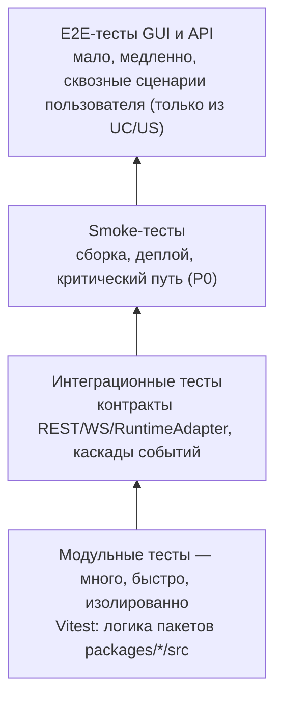

# Контроль качества — AIF Handoff: система автономного управления задачами

В этой директории фиксируются принципы контроля качества системы **AIF Handoff — автономное управление задачами** (`aif-handoff`): модульного монолита на Turborepo (TypeScript), реализующего hand-off-конвейер с AI-субагентами через подключаемые runtime-адаптеры и Kanban-дашборд в реальном времени. Документ определяет, как качество подтверждается тестированием на всех уровнях: от модульных тестов до сквозных сценариев GUI и API, как тесты связаны с требованиями системы и как автоматизация ведёт к целевому состоянию.

Контур контроля качества — **сама система AIF Handoff**: пакеты `@aif/shared`, `@aif/runtime`, `@aif/data`, `@aif/api`, `@aif/web`, `@aif/agent`, `@aif/mcp` (workspace `packages/`). Внешние системы — AI-провайдеры (Claude Agent SDK, Codex, OpenCode, OpenRouter), VCS-платформы (GitHub, GitLab), MCP-клиенты, браузер пользователя; тестируются **контракты** взаимодействия с ними (`contract-aif-runtime`, `contract-aif-rest-api`, `contract-aif-ws`, `contract-aif-github`, `contract-aif-gitlab`), но не их внутренняя функциональность.

Методологическая основа: Software Requirements Engineering (Wiegers & Beatty, 3rd ed.) — валидация требований как одна из четырёх дисциплин их разработки (Elicitation → Analysis → Specification → Validation). Ключевой постулат для QA: **каждое требование должно быть проверяемым** (verifiable), а тесты — одно из альтернативных представлений требований («test the requirements»).

---

## 1. Назначение и область применения

| Аспект                   | Значение                                                                                                                                                                                                                                                                                                                                                                                                                                                                |
| ------------------------ | ----------------------------------------------------------------------------------------------------------------------------------------------------------------------------------------------------------------------------------------------------------------------------------------------------------------------------------------------------------------------------------------------------------------------------------------------------------------------- |
| **Что описывает**        | Принципы контроля качества и уровни тестирования системы AIF Handoff, связь тестов с требованиями                                                                                                                                                                                                                                                                                                                                                                       |
| **Контур тестирования**  | Пакеты `packages/{shared,runtime,data,api,web,agent,mcp}`: `shared` (автомат стадий, константы, env, presenters), `runtime` (реестр/адаптеры/резолюция профилей), `data` (репозитории, транзакции, аудит), `api` (Hono REST + WebSocket), `web` (React SPA), `agent` (координатор + субагенты), `mcp` (инструменты `handoff_*`). AI-провайдеры, VCS, MCP-клиенты и браузер — внешние системы; проверяются контракты взаимодействия, а не их внутренняя функциональность |
| **Для кого**             | Разработчики, QA-инженеры, DevOps, ревьюеры, владельцы требований системы                                                                                                                                                                                                                                                                                                                                                                                               |
| **Место в спецификации** | QA-артефакты связаны с иерархией требований системы: `vision.md` (бизнес-цели §1.3, функции HF1–HF12 §2.1–2.2) → `use-cases/` (UC 11 доменов) → `business-rules/` (`BR-*`). Функциональные (`fun-req/`, `REQ-FR-*`) и нефункциональные (`nonfun-req/`, `REQ-NFR-*`) требования и реестр контрактов (`contracts/`) служат базой трассировки наравне с HF/UC (карта «требование → тест» — раздел 5). Тесты — forward-трассировка требований в реализацию                  |
| **Инструмент полноты**   | Матрица программирования качества (5 факторов × 4 этапа ЖЦ, раздел 2.4): каждая ячейка закрывается минимум одной измеримой проверкой (раздел 5.1)                                                                                                                                                                                                                                                                                                                       |

## 2. Методологическая основа

### 2.1. Тестирование как валидация требований (W&B, Validation)

- **Peer review / Inspection** — ревью требований и тестов наравне с кодом; одна из самых ценных практик качества.
- **Testing the requirements** — тест пишется как альтернативное представление требования: если требование нельзя проверить тестом — оно не готово.
- **Defining acceptance criteria** — критерии приёмки согласуются с владельцем продукта и становятся основой приёмочных сценариев (для AIF Handoff — критерии приёмки/DoD `vision.md` §1.4).
- **Defect checklist** — валидация набора требований: неполнота, неоднозначность, противоречивость, непроверяемость, отсутствие приоритета (используется при ревью `vision.md`, `use-cases/`, `business-rules/`).

### 2.2. Проверяемость требований

Характеристики отличного требования (W&B, Chapter 2) применяются к тестированию напрямую:

| Характеристика  | Значение для QA                                                                                                                                              |
| --------------- | ------------------------------------------------------------------------------------------------------------------------------------------------------------ |
| **Verifiable**  | Каждая функция HF1–HF12 имеет критерий приёмки (`vision.md` §1.4) или измеримый UC-сценарий; каждое BR — проверяемое правило. Без этого тест написать нельзя |
| **Unambiguous** | Однозначная формулировка → однозначный тест-сценарий                                                                                                         |
| **Complete**    | Набор тестов покрывает все сценарии и режимы требования (включая классы `as is`/`to be` UC и каналы GUI/API/Agent/Schedule)                                  |
| **Traceable**   | Каждый тест трассируется к требованию (матрица качества, раздел 5)                                                                                           |

### 2.3. Связь артефактов требований и тестов

```
vision.md (бизнес-цели §1.3; функции HF1–HF12 §2.1–2.2)
  ├─ use-cases/  (UC-<domain>.<subdomain>.<action>, каналы GUI|API|Agent|Schedule; as is / to be)
  │    ├─ business-rules/ (BR-*: факты, ограничения, триггеры, инференсы поведения системы)
  │    ├─ fun-req/ · nonfun-req/  (REQ-FR-*, REQ-NFR-* — каталоги требований)
  │    └─ contracts/ (реестр контрактов: runtime, REST, WS, data, DB-схема, scheduler, VCS, worktree)
  │         → модульные и интеграционные тесты, E2E GUI и API
  └─ c4/ (context/container/deployment/component-*) — источник контрактов и топологии
```

Функции `vision.md` — верхнеуровневый источник трассировки: HF1 (hand-off-конвейер) → тесты переходов стадий (`packages/data/src/taskTransitions.ts`, `packages/shared/src/stateMachine.ts`); HF3 (runtime-адаптеры) → контрактные и API-тесты `RuntimeAdapter` (`contract-aif-runtime`). UC описывают полное поведение и каналы, BR детализируют ограничения до проверяемых правил (например, `BR-constraint.task-lifecycle.transitions` — допустимые переходы стадий, `BR-trigger.automation.runtime-limit-gate` — блокировка при превышении лимита), доменные события (`TaskStageChanged`, `TaskGatePassed`, `TaskOwnershipTransferred`, `LimitExceeded`, `HeartbeatReceived`) — каскады для интеграционных тестов. Контракты (`docs/contracts/`) — источник integration-проверок, а не E2E.

Архитектурная база интеграционных и API-тестов — C4-модель (`c4/`): `context.md`, `container.md`, `deployment.md` фиксируют границы контейнеров (web/api/agent/mcp + библиотечные модули) и контракты, которые проверяются интеграционными тестами (раздел 4.2).

### 2.4. Матрица программирования качества — инструмент полноты

Полнота контроля качества оценивается по матрице программирования качества: **5 факторов обусловленности** (Среда, Эргономика, Функции, Аварии/Катастрофы, Технологическая обеспеченность ЖЦ) × **4 этапа жизненного цикла** (Проектирование и Разработка, Эксплуатация/Потребности, Эксплуатация/Сопровождение, Вывод из эксплуатации/Миграция). Каждая из 20 ячеек должна быть закрыта **как минимум одной измеримой проверкой**; незакрытая ячейка — «свободный параметр» и неконтролируемый риск для качества.

Для QA это означает:

- QA-покрытие не ограничивается этапом разработки (тестовая пирамида) — проверки распределены по всем ячейкам матрицы (см. раздел 5.1).
- Каждая проверка (гейт, критерий приёмки, тест) **измерима**: численное значение, диапазон или бинарный критерий с детерминированным алгоритмом проверки. Неизмеримый критерий ячейку не закрывает.
- Концентрация проверок только в ячейке «Функции × Эксплуатация» — критический перекос («ловушка 3.2»): вне контроля остаются сопровождение, вывод из эксплуатации, среда и человеческий фактор.

## 3. Принципы контроля качества

1. **Тестируемость требований.** Требование без проверяемого критерия — не готово (W&B: verifiable). Тест появляется вместе с требованием (Validation), а не после реализации.
2. **Тесты — артефакты требований.** Каждый тест трассируется к требованию: HF/UC → модульные/интеграционные, BR → интеграционные и E2E API, доменные события → интеграционные каскады, US/UC → E2E. Свод — матрица качества (раздел 5).
3. **Пирамида тестов.** Больше быстрых и дешёвых модульных тестов, меньше медленных сквозных; каждый уровень ловит свой класс дефектов и не дублирует нижележащий.
4. **Критичность определяет глубину.** Сценарии приоритетов P0–P2 покрываются на всех уровнях по убыванию: P0 — обязательно на каждом уровне, P2 — по решению. Критичные модули системы (автомат стадий задачи, транзакционные переходы и владение задачей, аудит-трейл, аутентификация/CSRF, runtime-лимиты, изоляция worktree) — максимальное покрытие.
5. **Негативные сценарии и границы обязательны.** Большинство дефектов — в обработке ошибок: недопустимый переход стадии, конфликт владения при handoff, превышение runtime-лимита, недоступный AI-провайдер (таймауты/ретраи), обрыв WebSocket, сбой VCS (rate-limit), повреждённые/невалидные payload-ы, повторные события (идемпотентность).
6. **Спектр окружений — часть теста.** Поддерживаемые версии Node (^20.19.0 / ≥22.12.0), браузер (chromium в E2E GUI), SQLite-файл БД, Docker (dev/prod compose) проверяются на каждом уровне, где поведение окружениезависимо (миграции БД, WebSocket, интерактивная сессия браузера, работа с git worktree).
7. **Автоматизация — целевое состояние.** Текущее состояние — автотесты на Vitest по всем пакетам (порог покрытия 70%), GitHub Actions CI (build/test/lint/security/mcpunit), Playwright-набор в `packages/web/e2e`; целевое — полный контур E2E API/нагрузочных гейтов (`ai:perf`, `ai:load`) и мутационного тестирования в CI.
8. **Стабильность тестов.** Тесты должны быть детерминированными: без «флаки», без зависимости от внешней среды (AI-провайдеры, VCS, реальная сеть — через заглушки и `vi.mock`), с фиксированными тестовыми данными. Нестабильный тест хуже отсутствующего — он обесценивает сигнал CI (реестр известных флейков — `docs/known-issues.md`).
9. **Безопасность тестируется отдельно и эшелонированно.** `npm audit` в CI (`security-audit.yml`), скиллы `aif-security-checklist`/`aif-review`, поиск секретов (husky/lint-staged); security-свойства системы (аутентификация session+CSRF, scrypt-пароли, rate-limit, изоляция задач по участникам, иммутабельный аудит, отсутствие секретов в логах) проверяются тестами, а не «отсутствием инцидентов».
10. **Shift-left.** Дефект дешевле на ранних стадиях: линтеры (ESLint/Prettier), статический анализ (tsc), модульные тесты и ревью выполняются до того, как код попадёт в интеграционные и сквозные прогоны.
11. **Полнота по жизненному циклу.** Контроль качества покрывает все четыре этапа ЖЦ: разработку, штатную эксплуатацию (конвейер задач, real-time, лимиты), сопровождение (миграции БД append-only, обновления, мониторинг/worktree-реконсиляция) и вывод из эксплуатации (утилизация worktree, очистка данных, отзыв доступа). Контроль только на этапе разработки не подтверждает качество продукта в руках пользователя (раздел 5.1).
12. **Измеримость гейтов.** Каждый гейт качества, критерий приёмки и порог входа/выхода выражается числом, диапазоном или бинарным критерием с алгоритмом проверки. «Проверено вручную» без измеримого результата гейтом не является.
13. **Среда и интеграции — объект тестирования.** Совместимость со средой (Node, браузер, Docker, SQLite, миграции) проверяется тестами наравне с функциями; внешние системы (AI-провайдеры, VCS) — интеграционные зависимости по контрактам, а не предмет доработки.

## 4. Уровни тестирования



| Уровень              | Что проверяет                                                                                                    | Основная база                                    | Среда выполнения                                            | Время прогона  |
| -------------------- | ---------------------------------------------------------------------------------------------------------------- | ------------------------------------------------ | ----------------------------------------------------------- | -------------- |
| Модульные тесты      | Логику единицы кода в изоляции                                                                                   | HF1–HF12, UC, BR, FR                             | Локально, CI                                                | Секунды–минуты |
| Интеграционные тесты | Взаимодействие процессов и контракты интерфейсов: REST (Hono), WebSocket, `@aif/data` ↔ SQLite, `RuntimeAdapter` | UC, BR, доменные события, контракты, C4          | CI, `createTestDb` (in-memory), реальный HTTP/WS на порту 0 | Минуты         |
| Smoke-тесты          | Жизнеспособность сборки и развёртывания, критический путь P0                                                     | HF1/HF2, P0-сценарии, `make gate-fast`           | CI (GitHub Actions), Docker compose                         | Минуты         |
| E2E-тесты GUI        | Пользовательские сценарии в браузере через React SPA (Kanban, детали, диалоги)                                   | UC GUI-канала; Playwright                        | Playwright chromium + dev-стек API/web                      | Десятки минут  |
| E2E-тесты API        | Сквозные пользовательские сценарии через публичные интерфейсы (REST/WS/координатор) без GUI                      | UC API/Schedule-канала, FR, контракты — контекст | Стенд: реальные процессы (compose), заглушки VCS/адаптеров  | Десятки минут  |

### 4.1. Модульные тесты (unit)

**Назначение.** Быстрая обратная связь при разработке: проверка отдельной функции, типа или модуля в изоляции от внешних зависимостей.

**Объект в проекте.** TypeScript-модули пакетов `packages/*/src`: `shared` (автомат стадий `stateMachine.ts`, `taskLifecycle.ts`, `runtimeLimitGate.ts`, `plannerDefaults.ts`, `presenters.ts`, `env.ts`), `data` (`taskTransitions.ts`, `taskOwnership.ts`, `audit.ts`, `participants.ts`, `authSessions.ts`, `tasks.ts`, `projects.ts`, `chat.ts`, `runtimeProfiles.ts`, `runtimeLimits.ts`, `codexIndex.ts`, `usage.ts`), `api` (маршруты, use-cases, middleware, сервисы), `runtime` (registry, resolution, errors, адаптеры `claude`/`codex`/`opencode`/`openrouter`), `agent` (координатор, субагенты, git-воркфлоу, worktree, гейты ревью), `web` (компоненты и хуки React), `mcp` (инструменты `handoff_*`, middleware). Файлы тестов — `packages/*/src/__tests__/*.test.ts(x)` (факт репозитория: сьюты во всех 7 пакетах).

**Правила.**

- Изоляция: моки и заглушки — по интерфейсам (`vi.mock`, фабрики fakes поверх `RuntimeAdapter`, репозиториев `@aif/data`, HTTP/VCS-клиентов); без сети, реальной БД (кроме `createTestDb` для data-слоя), реального GUI-цикла и реального времени (fake timers).
- Табличные тесты (`it.each` / `test.each`) — стандарт для наборов входных/выходных данных и граничных случаев.
- Критичные модули (автомат стадий, транзакционные переходы и владение задачей, аудит, аутентификация/CSRF, runtime-лимиты, резолюция профилей, изоляция worktree, конвертация review-решений) покрываются приоритетно.
- Unit-тесты пишутся для **всех** пакетов, реализующих требования (полный прогон — `npm test` / `turbo test`, покрытие — `npm run coverage` / `turbo coverage --concurrency=1`); «критичные пакеты» — приоритет написания и скоуп минимального порога `FG-COVERAGE`, а не ограничение набора тестируемых модулей.
- Порог покрытия: **70%** (lines/functions/branches/statements) на пакет (`vitest.config.ts` thresholds, fail-проверка активна в CI `tests.yml` через `npm run coverage`).
- Запуск: в агентском цикле — быстрый fail-fast гейт `make gate-fast` (build + `turbo test`); полный прогон — `make test`; статистика/покрытие — `make coverage` (все — нативные, без Docker; CI-эквивалент — `ci-test`/`ci-coverage` через docker compose, гейт `make gate`/`make ci-gate`).

**Критерии входа/выхода.** Вход: модуль реализован, интерфейсы выделены. Выход: тесты проходят (`vitest run`), покрытие пакета не ниже порога 70% (`FG-COVERAGE`, `gates.md` §6.4), отчёт покрытия публикуется в CI (артефакт `coverage`, `tests.yml`).

**Метрики.** Покрытие утверждений/веток (v8, cobertura/json-summary), время прогона, доля упавших тестов.

**Подробный гайд:** [unit-testing.md](unit-testing.md) — цели, источники правды, конвенции тестов, изоляция, анти-фейк, шаблоны.

### 4.2. Интеграционные тесты

**Назначение.** Проверка взаимодействия компонентов системы и внешних систем по контрактам: REST API (Hono), WebSocket-события, `@aif/data` ↔ SQLite, `RuntimeAdapter`, каскады доменных событий.

**Объект в проекте.**

- REST-контракт (`contract-aif-rest-api`, Hono, порт 3009): маршруты `tasks`, `projects`, `participants`, `auth`, `chat`, `runtimeProfiles`, `settings`, `codexAuth`, `github`, `gitlab`; zod-валидация запросов, аутентификация session+CSRF, rate-limit.
- WebSocket (`contract-aif-ws`, `packages/api/src/ws.ts`): события `TaskStageChanged`, `TaskGatePassed`, `TaskGateFailed`, `TaskOwnershipTransferred`, `TaskEscalated`, `HeartbeatReceived`, `LimitExceeded`; реальный клиент `ws` в тестах.
- Слой данных (`contract-aif-data`, `contract-aif-db-schema`): атомарные переходы стадий, владение и handoff задачи, иммутабельный аудит, миграции БД (append-only, `PRAGMA user_version`).
- Runtime-контракт (`contract-aif-runtime`): реестр адаптеров, резолюция профилей (task → project → system → env), таймауты, категоризация ошибок; адаптеры — через заглушки по контракту.
- Каскады доменных событий: прохождение гейта → `TaskGatePassed` → `TaskStageChanged` → WebSocket broadcast; handoff → `TaskOwnershipTransferred` → аудит; превышение лимита → `LimitExceeded` → блокировка задачи.
- Интеграция с внешними системами по контрактам: GitHub/GitLab REST (публикация PR/MR, синхронизация Issues — с реальными клиентами как контур или заглушками), git-worktree (изоляция, реконсиляция), node-cron (координатор, цикл 30 с).

**Источники информации.** Помимо требований (`HF`, `UC`, `BR`) и контрактов (`docs/contracts/`), ожидаемую структуру интеграции задают C4-диаграммы (`c4/`):

- **Контекст** (`c4/context.md`) — границы системы: web/api/agent/mcp, внешние AI-провайдеры, VCS, MCP-клиенты.
- **Контейнеры** (`c4/container.md`) — топология: контейнеры `web`, `api`, `agent`, `mcp` и БД SQLite (in-process), библиотечные модули `shared`/`runtime`/`data`.
- **Deployment** (`c4/deployment.md`) — Docker-сервисы (dev/prod compose), Angie-прокси, тома, порты.

C4 задаёт ожидаемую структуру: расхождение реализации с диаграммой (изменённый или добавленный маршрут API, новое WS-событие, отсутствующий компонент) — дефект, который должен ловиться интеграционным тестом. Диаграммы поддерживаются актуальными вместе с изменением контрактов.

**Среда.** `createTestDb` (in-memory SQLite через `@aif/data/db`), реальный HTTP/WS-сервер на эфемерном порту (`startServer`, `serverBootstrap.integration.test.ts`), реальный WS-клиент (`ws`); внешние системы — через заглушки по контрактам (адаптеры runtime, GitHub/GitLab) — недоступность внешних сервисов не должна ломать тесты (принцип 8).

**Правила.**

- Контрактные тесты по `docs/contracts/`: изменение контракта ломает тесты, а не продуктовую интеграцию (`useCases.contract.test.ts`, `participantWebSocket.integration.test.ts`).
- Обязательны негативные сценарии: недопустимый переход стадии, неверные учётные данные/CSRF, повреждённый payload, разрыв WebSocket (реконнект), недоступный адаптер runtime (таймауты/ретраи/fallback), rate-limit VCS, повторная обработка событий (идемпотентность ревью-решений), конфликт handoff при параллельных изменениях.
- Миграции БД: append-only (never renumber/edit merged migrations); проверка целостности данных при обновлении — отдельный класс сценариев (`REQ-NFR-data.compliance.database-migration-integrity`).

**Критерии входа/выхода.** Вход: контракты зафиксированы, стенд развёрнут (`createTestDb` + реальный сервер). Выход: контрактные и каскадные сценарии проходят на репрезентативном наборе окружений.

**Подробный гайд:** [integration.md](integration.md) — проектирование, стенды, процедура, assertions.

### 4.3. Smoke-тесты

**Назначение.** Быстрая проверка жизнеспособности: «монорепозиторий собрался, БД инициализировалась, API/веб поднялись, критический путь выполняется». Гейт перед полным регрессом и релизом.

**Виды.**

| Вид              | Что проверяет                                                                                                                           | Когда                                       |
| ---------------- | --------------------------------------------------------------------------------------------------------------------------------------- | ------------------------------------------- |
| Build smoke      | Сборка всех пакетов (`turbo build`), линт, типы (tsc); fail-fast `make gate-fast`                                                       | Каждый MR/push (GitHub Actions `build.yml`) |
| Install smoke    | `npm ci` + инициализация БД (`db:setup`, миграции), поднятие dev/prod-стеков                                                            | Каждая сборка, перед e2e                    |
| Deployment smoke | После развёртывания стенда (docker compose dev/prod): `/health` API и MCP отвечают, WebSocket открывается, критический путь выполняется | Каждый деплой стенда                        |

**Минимальный набор.** Критический путь P0 (не более 5–15 минут): сборка пакетов; `db:setup` (миграции применились); запуск API (3009) и ответ на health-запрос; создание задачи → переход стадии → получение WS-события; подключение к `@aif/mcp` (stdio/HTTP) и простой вызов инструмента.

**Правила.** Набор стабилен (никаких «флаки»), не зависит от внешних сервисов (провайдеры/VCS — заглушки), выполняется после сборки и перед глубокими уровнями. Провал smoke останавливает конвейер.

**Подробный гайд:** [smoke-testing.md](smoke-testing.md) — проектирование, процедура, стенды, assertions, анти-фейк и каталог smoke-сценариев (SM-\*).

### 4.4. E2E-тесты GUI

**Назначение.** Сквозная проверка пользовательских сценариев через веб-интерфейс — «система работает так, как её видит пользователь». Покрывает сценарии, которые невозможно проверить нижележащими уровнями: навигация по Kanban, drag & drop, детали задачи, диалоги handoff/участников/настроек, real-time обновления по WebSocket, ошибки пользовательского ввода.

**База.** UC с каналом `GUI` (`use-cases/`, `UC-dashboard.*`, `UC-handoff.*`, `UC-chat.*`, `UC-auth.*`, `UC-runtime.*`) и функции HF2/HF7/HF8/HF9 (§2.2 `vision.md`); US/функции из `vision.md` §2.2 как исходные якоря сквозных сценариев.

**Объект в проекте.** React SPA (`packages/web`): Kanban-доска (`Board`, `Column`, `TaskCard`, `AddTaskForm`), детали задачи (`TaskDetail`, ownership/handoff, `ExecutorTimeline`, план), чат, участники, проекты (`ProjectSelector`, `ProjectRuntimeSettings`), настройки (`RuntimeProfileForm`), layout (`Header`, `CommandPalette`), хуки (`useTasks`, `useProjects`, `useWebSocket`, `useRuntimeProfiles`). Real-time — через WebSocket (`useWebSocket`). Сценарии доступности (a11y, keyboard-only навигация, screen reader) — целевое состояние.

**Специфика.**

- Приложение работает в браузере, данные — через REST/WS к API (единственный канал связи web ↔ api).
- Drag & drop задач между колонками — отдельный класс сценариев (синхронизация с API, порядок позиций).
- WebSocket: обновления стадий/гейтов/handoff в реальном времени; реконнект при разрыве.
- Реальные пользовательские потоки: единственный способ проверить интерактивную сессию (ввод, навигацию, диалоги).

**Среда.** Playwright chromium (`packages/web/e2e/*.spec.ts`, `playwright.config.ts`): реальный стек API (3009) + web (5180); `webServer` поднимает dev-стек (`npm run dev`), `AIF_WEB_URL`/`AIF_SKIP_DEV_SERVER` для внешних окружений. Текущий набор: scroll-регрессии Kanban, `participants-mode.spec.ts`, perf-бюджеты (`e2e/perf/*`).

**Метрики.** Доля UC (GUI-канал), покрытых автоматизацией; время прогона; стабильность набора; LCP/DOM-ready бюджеты (`ai:perf`).

**Подробный гайд:** [e2e-gui-testing.md](e2e-gui-testing.md) — проектирование, стенды, процедура, assertions, анти-фейк и шаблоны E2E GUI-сценариев. Окружение и набор — `packages/web/e2e/README.md`.

### 4.5. E2E-тесты API

**Назначение.** Сквозная проверка пользовательских сценариев без GUI: «внешний инициатор → обработка реальными процессами (API/координатор/субагенты) → внешний наблюдаемый результат» через публичные интерфейсы. Проверяет то, что недостижимо на уровне единиц и компонентов: полный путь сценария через реальные процессы и протоколы. E2E API-кейс существует только при наличии UC/US-якоря; контрактные и транспортные проверки (REST, WS, `RuntimeAdapter`) исполняются на integration-уровне.

**База.** UC с каналами `API`/`Agent`/`Schedule` (`use-cases/`) и US/функции из `vision.md` §2.2 — источники E2E-сценариев; FR (`fun-req/`), BR (`business-rules/`), контракты (`docs/contracts/`) — контекст, уточняющий шаги и assertions, но не источник E2E-кейсов.

**Объект в проекте.**

| Контракт                                  | Направление                 | Примеры сценариев                                                                                          |
| ----------------------------------------- | --------------------------- | ---------------------------------------------------------------------------------------------------------- |
| REST API (Hono, `contract-aif-rest-api`)  | web/внешние клиенты ↔ `api` | CRUD задач и проектов, переходы стадий, handoff, участники/аутентификация, чат, runtime-профили, настройки |
| WebSocket (`contract-aif-ws`)             | `api` → `web` (broadcast)   | живые статусы стадий и гейтов, heartbeats, реконнект                                                       |
| `RuntimeAdapter` (`contract-aif-runtime`) | `api`/`agent` ↔ адаптеры    | запуск субагента через профиль, резюме сессий, лимиты/usage, таймауты и категоризация ошибок               |
| VCS (GitHub/GitLab)                       | `agent` → VCS               | публикация PR/MR, синхронизация Issues, CI-статусы                                                         |
| MCP (`handoff_*`)                         | MCP-клиенты ↔ `mcp`         | создание/обновление/поиск задач, push плана — как сквозной сценарий интеграции                             |

> Контрактные и транспортные проверки из этой таблицы исполняются на **integration-уровне** (`integration.md`). В E2E API они попадают только как часть сквозного UC-сценария (например, «агент завершил задачу → PR опубликован»), а не как самостоятельные проверки протокола.

**Правила.** Обязательны негативные сценарии и границы: недоступный провайдер (таймауты/ретраи/fallback между адаптерами), превышение runtime-лимита (блокировка задачи), неверные учётные данные, повторные команды (идемпотентность), параллельные задачи (конфликт владения/лимиты параллелизма), обрыв соединения, повреждённые payload-ы.

**Среда.** Стенд: реальные процессы (API + agent + data) — через dev/compose-стек; внешние системы (AI-провайдеры, VCS) — заглушки по контрактам либо реальные в тестовом контуре.

**Метрики.** Доля UC P0/P1, покрытых сквозными тестами; доля негативных сценариев в наборе; стабильность прогона; latency-бюджеты (`ai:load`).

**Подробный гайд:** [e2e-api-testing.md](e2e-api-testing.md) — проектирование, стенды, процедура, assertions, анти-фейк и шаблоны E2E API-сценариев.

## 5. Матрица качества

Матрица качества — свод трассировки «требование → уровень тестирования»: гарантия, что каждое требование имеет хотя бы один проверяющий тест, а каждый уровень — понятную базу требований. Это forward-трассировка требований в тесты (W&B: traceability) и основа метрики «покрытие требований тестами». Матрица рассматривается в двух срезах: трассировка требований в тесты (ниже) и полнота контроля качества по жизненному циклу (раздел 5.1).

| Артефакт                                                                             | Модульные               | Интеграционные                         | Smoke                      | E2E GUI                                                 | E2E API                                                    |
| ------------------------------------------------------------------------------------ | ----------------------- | -------------------------------------- | -------------------------- | ------------------------------------------------------- | ---------------------------------------------------------- |
| Vision — функции HF1–HF12 (`vision.md` §2.2)                                         | ✅ декомпозиция до кода | ✅ каскады и контракты                 | P0-потоки (HF1/HF2)        | ✅ GUI-канал (HF2/HF7/HF8/HF9)                          | ✅ API/Schedule-каналы                                     |
| UC — прецеденты (`use-cases/`)                                                       | —                       | ✅ каскады событий                     | P0-потоки                  | ✅ домены `dashboard`/`handoff`/`chat`/`auth`/`runtime` | ✅ домены `pipeline`/`integration`/`accounting`/`vcs-auto` |
| FR — функциональные требования (`fun-req/`, `REQ-FR-*`)                              | ✅                      | ✅                                     | —                          | —                                                       | —                                                          |
| NFR — атрибуты качества (`nonfun-req/`, `REQ-NFR-*`; ограничения — `vision.md` §2.6) | крипто/логика/лимиты    | нагрузка, отказоустойчивость, миграции | —                          | —                                                       | —                                                          |
| BR — бизнес-правила (`BR-*`)                                                         | ✅                      | ✅                                     | —                          | —                                                       | —                                                          |
| Доменные события (catalog: `use-cases/` §«События»)                                  | ✅ логика состояний     | ✅ каскады событий                     | —                          | —                                                       | —                                                          |
| C4 — архитектура (контракты, топология)                                              | —                       | ✅ основной источник контрактов        | ✅ топология развёртывания | —                                                       | —                                                          |
| Контракты (`contracts/`, реестр)                                                     | —                       | ✅ (контрактные тесты)                 | —                          | —                                                       | ✅ (в составе сквозных путей)                              |
| Безопасность (auth/CSRF, изоляция задач, аудит, лимиты)                              | ✅                      | ✅                                     | —                          | —                                                       | ✅                                                         |

Правила ведения матрицы:

- **Каждое требование P0/P1** имеет тест минимум на одном уровне; P2 — по решению владельца.
- **Непокрытое требование** — риск релиза: фиксируется в `open-questions.md` (артефакт создаётся по мере выявления, по RULES.md) и в ревью набора требований (W&B: collection completeness).
- Матрица обновляется при изменении требований (change control, W&B: impact analysis) и при добавлении тестов.
- Архитектурные артефакты (C4, ADR) — не требования, но источник контрактов и топологии: расхождение реализации с C4 — дефект, который должен ловить интеграционный тест (раздел 4.2).
- Каталоги `fun-req/` (49 FR), `nonfun-req/` (29 NFR), `business-rules/` и реестр `contracts/` — якоря трассировки наравне с HF/UC/BR (карта «артефакт → уровень» выше); при изменении состава каталогов строки матрицы обновляются.
- E2E-кейсы выводятся из UC/US по формальным правилам и ведутся как артефакты `aif-qa` (`change-summary.md`, `test-plan.md`, `test-cases.md`) в `.ai-factory/qa/<branch-slug>/`; правило «сиротский TC ⇒ отсутствующий контракт/источник» — из `test-cases.md`.

> Сверка на дату актуализации (2026-09-20): матрица отражает фактический состав артефактов проекта. Каталог `user-stories/` (Gherkin) отсутствует — E2E-источником служат UC и US/функции `vision.md` §2.2; каталог `domain/` — целевое состояние (модели событий и контекстов описаны в `use-cases/` и `architecture.md`).

### 5.1. Полнота контроля качества по жизненному циклу

Контрольный список полноты QA по матрице программирования качества (факторы × этапы ЖЦ, раздел 2.4). Каждая ячейка закрывается минимум одной **измеримой** проверкой; пустая или неизмеримая ячейка — свободный параметр и риск, фиксируемый в `open-questions.md` (при появлении) и закрываемый в целевом состоянии.

| Фактор \ Этап ЖЦ              | 1. Проектирование и Разработка                                                                                     | 2. Эксплуатация / Потребности                                                                                                                                                                        | 3. Эксплуатация / Сопровождение                                                                         | 4. Вывод из эксплуатации / Миграция                                                          |
| ----------------------------- | ------------------------------------------------------------------------------------------------------------------ | ---------------------------------------------------------------------------------------------------------------------------------------------------------------------------------------------------- | ------------------------------------------------------------------------------------------------------- | -------------------------------------------------------------------------------------------- |
| **1. Среда**                  | SCA (`npm audit`, CI `security-audit.yml`), лицензии, Node LTS; изоляция тест-среды от продуктивных данных         | Совместимость: Node 20/22, браузер chromium, Docker dev/prod, SQLite-файл; спектр MCP-клиентов (stdio/HTTP)                                                                                          | Обновления: миграции БД (append-only, `PRAGMA user_version`), деплой-обновления, откаты; аудит-следы    | Тесты очистки данных и worktree, отзыва доступа участника, деинсталляции/декомиссии стендов  |
| **2. Эргономика**             | Ревью UX/доступности требований GUI; онбординг команды                                                             | E2E GUI: Kanban, детали, диалоги, real-time; читаемость статусов; локализация; тёмная/светлая тема; a11y — целевое                                                                                   | Читаемость и фильтрация логов, панели мониторинга, диагностика эскалаций                                | Понятность процедуры деинсталляции/декомиссии для пользователя                               |
| **3. Функции**                | Модульные и интеграционные тесты; критерии приёмки до кода                                                         | E2E GUI/API, smoke P0 (создание задачи → стадия → WS-событие), совместимость контрактов                                                                                                              | Тесты обновления/отката, мониторинга состояния, каскадов событий, лимитов runtime                       | Тесты деактивации: завершение активных задач, запрет новых, очистка конфигурации             |
| **4. Аварии/Катастрофы**      | Негативные сценарии и обработка ошибок с первого дня (переходы, handoff, лимиты, WebSocket, VCS); SAST/`npm audit` | Failover: реконнект WS, реконнект адаптеров runtime, fallback-провайдер, деградация (агент недоступен — ручные операции), защита от атак (session+CSRF, rate-limit, изоляция задач), идемпотентность | Тесты восстановления после сбоя: перезапуск координатора, повторные переходы, бэкап/restore, heartbeats | Тесты миграции: корректное завершение задач, отсутствие «зависших» состояний, перенос данных |
| **5. Тех. обеспеченность ЖЦ** | CI/CD (GitHub Actions), ESLint/Prettier/tsc, Vitest, моки по интерфейсам, `npm run ai:validate`                    | Тестовые БД (`createTestDb`), заглушки внешних систем (адаптеры, VCS), детерминированные данные                                                                                                      | `known-issues.md`, стабильность тестов (анти-«флаки»), регламенты инцидентов инфраструктуры             | Утилизация worktree/стендов, вывод контейнеров, передача знаний и документации               |

## 6. Тестовые окружения и данные

**Статус (2026-09-20).** Фактически исполняется контур модульных и частично интеграционных тестов: нативные `make`-цели (`gate-fast`, `test`, `coverage`, `lint`, `gate`) и CI на GitHub Actions (`tests.yml`, `build.yml`, `lint.yml`, `security-audit.yml`, `mcpunit.yml`, `ai-review.yml`, `docker-build.yml`); покрытие порога 70% — enforced на пакет. E2E GUI — Playwright-набор (`packages/web/e2e`) на dev-стеке; E2E API и полный контур нагрузки (`ai:load`) — целевое состояние (частично: `packages/api/perf/run.mjs`, `ai:perf` для web).

- **Окружения**: локальный dev-стек (API 3009, web 5180, agent, MCP), Docker Compose dev/prod (`docker-compose.yml`, `.docker/`), GitHub Actions (`ubuntu-latest`, Node 22). Реальный стек E2E: API + agent + data + web.
- **Заглушки внешних систем**: на unit-уровне — `vi.mock` поверх интерфейсов (`RuntimeAdapter`, VCS-клиенты); на integration-уровне — заглушки адаптеров runtime и GitHub/GitLab, реальный WS-клиент (`ws`) и реальный HTTP-сервер на порту 0; недоступность реальных провайдеров/VCS не должна ломать тесты (принцип 8).
- **Тестовые данные**: фиксированные наборы (профили участников, runtime-профили, задачи, проекты, настройки БД), изолированные от продуктивных; генерация детерминированная; БД — `createTestDb` (in-memory) либо временный файл.
- **Стенды**: dev-стенд для каждого MR (GitHub Actions), стабильный тестовый стенд для полных прогонов (compose); деплой — через CI/`docker-build.yml`.

## 7. Тестирование NFR

NFR задают измеримые границы качества: каталог `nonfun-req/` (29 требований `REQ-NFR-*`) вместе с ограничениями и исключениями `vision.md` §2.6, критериями приёмки §1.4 и допущениями §2.7. Каждый NFR проверяется тестом по своим критериям приёмки (метрика + целевое значение):

| Категория качества | Как проверяется                                                                                                                                                                          | Примеры для AIF Handoff                                                                                                                                                    |
| ------------------ | ---------------------------------------------------------------------------------------------------------------------------------------------------------------------------------------- | -------------------------------------------------------------------------------------------------------------------------------------------------------------------------- |
| Производительность | Latency-бюджеты: замеры через `ai:perf` (web: LCP/DOM-ready), `ai:load` (API), `ai:protocol`; тайминги эндпоинтов                                                                        | `REQ-NFR-api.performance.coordinator-polling-latency` (≤30 с), `REQ-NFR-infra.performance.implementation-commit-latency` (≤5 с fallback), перф-бюджеты Playwright          |
| Доступность        | Отказоустойчивость: реконнект WS, таймауты/ретраи адаптеров, fallback-провайдер, восстановление координатора, перезапуск                                                                 | `REQ-NFR-api.availability.websocket-reconnect`, `runtime-adapter-timeouts`, `coordinator-resilience`, `REQ-NFR-integration.availability.runtime-provider-fallback`         |
| Безопасность       | `npm audit` (CI, blocking high/critical), скиллы `aif-security-checklist`; тесты session+CSRF, scrypt-паролей, rate-limit, изоляции задач, origin-валидации, отсутствия секретов в логах | `REQ-NFR-security.compliance.{session-auth, csrf-protection, password-storage, login-rate-limit, origin-validation}`, `REQ-NFR-api.compliance.rate-limit-requests`         |
| Приватность        | Проверка изоляции данных по участникам (`task-isolation`), защиты от утечек в аудите и логах                                                                                             | `REQ-NFR-ops.observability.audit-trail-completeness` (100% переходов), `BR-constraint.auth.task-isolation`                                                                 |
| Совместимость      | Прогоны на Node 20/22, браузере (Playwright), Docker; миграции БД с реальными файлами                                                                                                    | `REQ-NFR-data.compliance.database-migration-integrity`, `task-state-persistence`                                                                                           |
| Наблюдаемость      | Полнота и чистота логов/телеметрии: факт и результат операций, отсутствие секретов; структурированная категоризация ошибок (без string-matching логики)                                  | `REQ-NFR-ops.observability.{log-level-config, heartbeat-detection, error-categorization, activity-log-batching}`, `REQ-NFR-data.compliance.task-transactional-consistency` |

Security-инструменты в CI подключены на уровне репозитория (`.github/workflows/security-audit.yml`: runtime-dep audit blocking; полный audit — информационно) и применяются в общем конвейере.

## 8. CI/CD и автоматизация

### 8.1. Текущее состояние (факт репозитория)

- GitHub Actions — `.github/workflows/`: `build.yml` (сборка pnpm/turbo), `tests.yml` (vitest + coverage, артефакт `coverage`), `lint.yml` (ESLint/Prettier), `security-audit.yml` (`npm audit`), `mcpunit.yml` (unit-сьюты MCP), `ai-review.yml` (авто-ревью), `docker-build.yml` (сборка образов).
- Локальные команды — `Makefile` (нативные, без Docker): `make gate-fast` (build + `turbo test`, fail-fast), `make test` (полный прогон), `make coverage` (`turbo coverage --concurrency=1`), `make lint`, `make gate` (lint-check + build + test + coverage), `make ci-gate` (CI-эквивалент в Docker); комплексная валидация — `npm run ai:validate` (format:check → lint → test → coverage → build → ai:perf → ai:load → ai:protocol → checklist).
- **Факт на дату актуализации (2026-09-20)**: порог покрытия 70% на пакет — enforced в CI; отчёты v8/cobertura/json-summary загружаются артефактом; Playwright-набор (`packages/web/e2e`) — в репозитории (scroll-регрессии, participants-mode, perf-бюджеты); известные флейки и проблемы CI — `docs/known-issues.md` (Windows-флейки git-тестов, капризный `ai:perf` на локальных Windows-машинах, 0% покрытия `schema.ts` и др.).
- Docker — для разработки, тестирования и production-развёртывания (dev/prod compose, Angie-прокси).

### 8.2. Целевое состояние

Конвейер контроля качества системы (полностью автоматический):

```
lint (ESLint/Prettier/tsc) → unit (vitest + coverage 70%)
  → build (turbo) → smoke (build + db:setup + deployment)
  → integration (createTestDb + реальный HTTP/WS, заглушки VCS/адаптеров) → e2e API → e2e GUI (Playwright)
  → NFR (нагрузка ai:load, перф ai:perf, security, совместимость) → релизные гейты
```

- Быстрый набор (lint + unit + build smoke) — на каждый push/MR; полный набор (все уровни) — ночной прогон и перед релизом.
- **Реализовано:** unit во всех пакетах (native/CI), интеграционные контрактные сьюты (`useCases.contract.test.ts`, WS-интеграция), E2E GUI-набор Playwright; покрытие 70% enforced. **Целевое:** полный E2E API-контур на compose-стеке, мутационное тестирование (Stryker, порог 80%) в CI, нагрузочные гейты `ai:load` зафиксированы как релизные, авто-отчёт о покрытии требований (матрица качества) в CI.
- Пороги качества в CI: покрытие 70% на пакет (`FG-COVERAGE`, `gates.md` §6.4); стабильность (допустимая доля «флаки»), время прогона.
- Параллелизация по пакетам (turbo), изоляция тестов от внешних сервисов (заглушки).

## 9. Управление дефектами

- **Жизненный цикл**: `new → triage → in progress → fixed → verified → closed`; каждый дефект имеет severity и приоритет.
- **Классификация severity**: Blocker (блокирует релиз, потеря данных, безопасность), Critical, Major, Minor, Trivial.
- **Связь с требованиями**: дефект трассируется к требованию (HF/UC/BR/FR/NFR) и к тесту, который его пропустил; пропущенный класс дефектов → новый тест (регрессия навсегда).
- **Регресс**: повторный прогон затронутых уровней после фикса; полный регресс перед релизом.
- **Security-находки**: `npm audit` в CI (blocking high/critical), скиллы `aif-security-checklist`/`aif-review`; критичные уязвимости — гейт релиза. Реестр известных проблем — `docs/known-issues.md` (флейки, расхождения контрактов, пробелы покрытия).

## 10. Метрики качества

| Метрика                            | Что показывает                                                             | Источник                                              |
| ---------------------------------- | -------------------------------------------------------------------------- | ----------------------------------------------------- |
| Покрытие требований тестами        | Доля требований с проверяющим тестом (по матрице качества, раздел 5)       | Матрица качества, ревью набора                        |
| Покрытие матрицы контроля качества | Доля ячеек 5×4 (факторы × ЖЦ), закрытых измеримыми проверками (раздел 5.1) | Матрица 5.1, ревью набора                             |
| Покрытие кода                      | Доля утверждений/веток, покрытых модульными тестами (порог 70% на пакет)   | CI (v8, cobertura, json-summary; артефакт `coverage`) |
| Стабильность тестов                | Доля «флаки»-прогонов и повторных запусков                                 | CI-история, `known-issues.md`                         |
| Время прогона                      | Стоимость уровней: быстрый/полный набор                                    | CI                                                    |
| Распределение дефектов             | Доля дефектов, найденных на каждом уровне (эффективность уровней)          | Баг-трекер                                            |
| Escaped defects                    | Дефекты, ушедшие в релиз                                                   | Баг-трекер, поддержка                                 |
| Latency-бюджеты                    | LCP/DOM-ready (web), тайминги эндпоинтов и load-тестов                     | `ai:perf`, `ai:load`, Playwright perf-спеки           |

## 11. Роли и ответственность

| Роль                | Ответственность                                                                                                                 |
| ------------------- | ------------------------------------------------------------------------------------------------------------------------------- |
| Разработчик         | Модульные и интеграционные тесты своего пакета; запуск линтеров; покрытие пакета ≥ 70%; `make gate-fast` до выдачи результата   |
| QA-инженер          | Стратегия тестирования, E2E-сценарии (GUI/API), smoke-наборы, матрица качества, ведение `aif-qa`-артефактов (`.ai-factory/qa/`) |
| DevOps              | CI/CD (GitHub Actions), Docker-сборки, security-сканы (`npm audit`), стенды и нагрузочные гейты                                 |
| Ревьюер             | Ревью тестов наравне с кодом; ревью требований (W&B: peer review)                                                               |
| Владелец требований | Критерии приёмки, приоритизация, решение по P2-покрытию, порогам покрытия и открытым `TBD` (`vision.md` §1.4)                   |
| Архитектор          | Соответствие реализации C4/ADR, границы пакетов, контракты (AG-гейты)                                                           |

## 12. Связанные артефакты

- [Видение продукта](../vision.md) — бизнес-цели §1.3, функции HF1–HF12 (§2.1–2.2), критерии приёмки (§1.4), ограничения (§2.6), допущения (§2.7)
- [Глоссарий](../glossary.md) — термины предметной области
- [Прецеденты использования](../use-cases/README.md) — UC 11 доменов, каналы GUI/API/Agent/Schedule, события предметной области, индекс `USE-CASES-INDEX.md`
- [Бизнес-правила](../business-rules/README.md) — `BR-*`: проверяются интеграционными и API-тестами
- [Функциональные требования](../fun-req/README.md) — `REQ-FR-*` (49)
- [Нефункциональные требования](../nonfun-req/README.md) — `REQ-NFR-*` (29)
- [C4-модель](../c4/README.md) — контекст, контейнеры, deployment: источник контрактов и топологии (раздел 4.2)
- [Контракты](../contracts/README.md) — реестр `contract-aif-*` (runtime, REST, WS, data, DB-схема, scheduler, VCS, worktree) — якоря интеграционных тестов
- [Архитектура](../architecture.md) — пакеты, конвейер агента, автомат стадий, real-time, БД
- [ADR](../adr/README.md) — архитектурные решения (база AG-гейтов)
- [Известные проблемы](../known-issues.md) — реестр KI (флейки, расхождения, пробелы)
- [Процедура интеграционного тестирования](integration.md) — стенды, заглушки и процедура на основе контрактов
- [Smoke-тестирование](smoke-testing.md) — виды (build/install/deployment), процедура, стенды и каталог сценариев
- [E2E-тестирование GUI](e2e-gui-testing.md) — сквозные сценарии через React SPA (Playwright)
- [Каталог E2E GUI](../../packages/web/e2e/README.md) — окружение, спектры, запуск (`npm run perf --workspace=@aif/web`)
- [E2E-тестирование API](e2e-api-testing.md) — сквозные контракты REST/WS/RuntimeAdapter/VCS
- [Модульное тестирование](unit-testing.md) — конвенции, изоляция, шаблоны тестов
- [Гейты AI Factory](gates.md) — гейты для LLM-генерации артефактов и подтверждения достижения требований
- [Фитнес-функции](../.ai-factory/references/fitness-functions.md) — метрики + автоматизация + пороги = гейт
- [План переработки QA-артефактов](REWORK-PLAN.md) — чек-лист и словарь отображения для адаптации `docs/qa/`
- [Software Requirements Engineering (W&B)](../.ai-factory/references/software-requirements-wiegers-beatty.md) — методологическая база

> Каталоги требований существуют и связаны с этой матрицей: [Прецеденты](../use-cases/README.md) — `UC-*`; [Бизнес-правила](../business-rules/README.md) — `BR-*`; [Функциональные требования](../fun-req/README.md) — `REQ-FR-*`; [Нефункциональные требования](../nonfun-req/README.md) — `REQ-NFR-*`; [Контракты](../contracts/README.md) — реестр и профили; [ADR](../adr/README.md) — реестр архитектурных решений. QA-артефакты веток (`change-summary`/`test-plan`/`test-cases`) ведутся скиллом `aif-qa` в `.ai-factory/qa/<ветка>/`. Каталоги `domain/` и `user-stories/` — целевое состояние.
