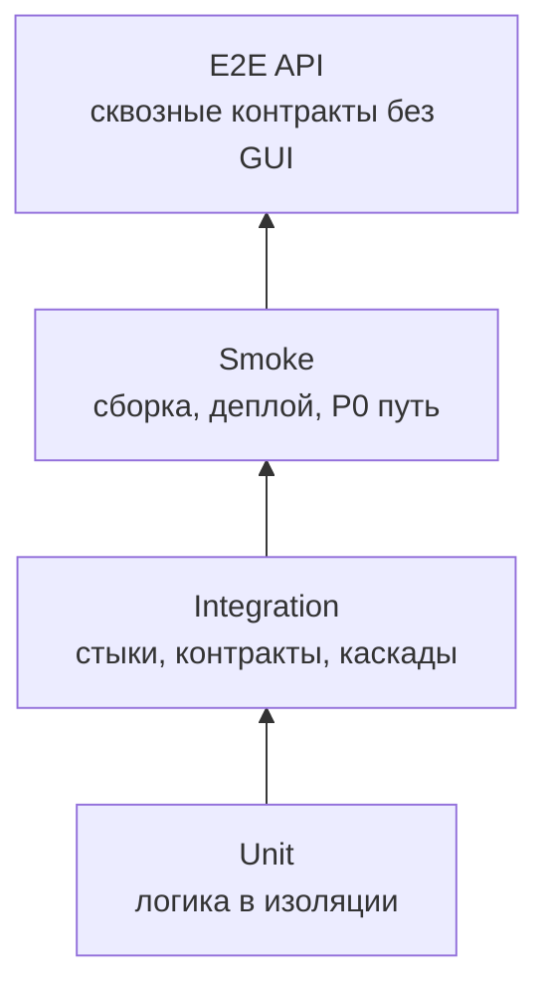
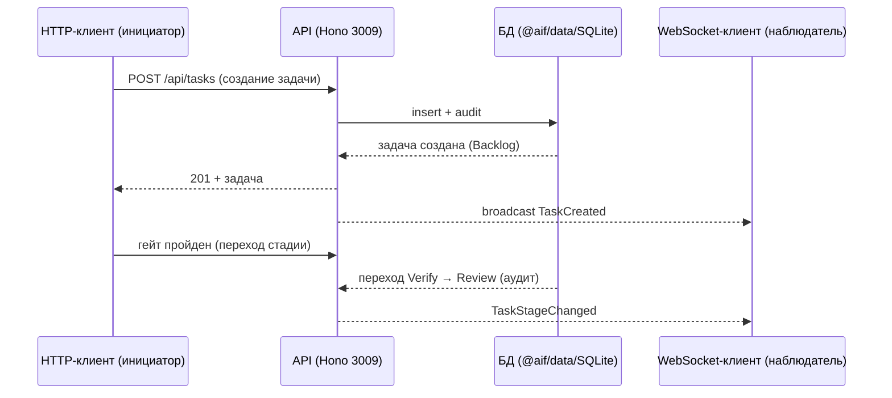

# E2E-тестирование API — AIF Handoff: система автономного управления задачами

> **Статус:** рабочий гайд для разработчиков, тестировщиков и ИИ-агентов.
> **Назначение:** описать, как проектировать, запускать, ревьюить и подтверждать сквозные API-тесты (E2E API) системы AIF Handoff так, чтобы они проверяли полный путь «внешний инициатор → обработка реальными процессами (API/координатор/субагенты) → внешний ответ/состояние» по публичным контрактам, а не имитировали достижение цели.
> **Методологическая база:** `README.md` §4.5 (E2E API) и §5 (матрица качества), `test-plan.md` (артефакты `aif-qa`), `gates.md` (FG-гейты); контракты `docs/contracts/` (`contract-aif-rest-api`, `contract-aif-ws`, `contract-aif-runtime`, `contract-aif-scheduler`, `contract-aif-github`, `contract-aif-gitlab`, `contract-aif-worktree`); `use-cases/`, `business-rules/`, `vision.md` — контекст для шагов, payload и assertions; код `packages/*/src` — только для понимания реализации, не источник правды. Для E2E API обязателен harness-каркас `Constrain / Inform / Verify / Correct`.

---

## 1. Место E2E API-тестов в стратегии качества

E2E API-тест проверяет **полный сквозной путь сценария через реальные процессы и публичные интерфейсы, без GUI и без вмешательства в середину пути**: внешний инициатор (HTTP-клиент, MCP-клиент, WebSocket-клиент) → запрос/сообщение → обработка реальными компонентами (API/координатор/субагенты/`@aif/data`) → внешний наблюдаемый результат (ответ, событие, состояние)

E2E API-тест отвечает на вопрос: «работает ли система как единое целое так, как этого требуют FR/BR/UC и контракты, когда внешний мир взаимодействует с ней только через публичные интерфейсы?». Он проверяет то, что недостижимо на уровне единиц и компонентов, и не должен превращаться в набор integration-проверок с контролем середины пути.

**Правило источников.** E2E API-сценарии выводятся из **UC с каналами `API`/`Agent`/`Schedule`** (`use-cases/`) и **US/функций** `vision.md` §2.2; UC и US — основные источники E2E-сценариев. FR (`fun-req/`), BR (`business-rules/`), контракты (`contracts/`) используются как контекст для шагов, payload и assertions. Если UC/US для пути нет, сценарий не является E2E API и должен быть отнесён к integration либо помечен как вне контура.



| Параметр          | Правило проекта                                                                                                                                      |
| ----------------- | ---------------------------------------------------------------------------------------------------------------------------------------------------- |
| Основная база     | UC с каналами `API`/`Agent`/`Schedule` (`use-cases/`) и US/функции `vision.md` §2.2 — источники E2E; HR/FR/BR, контракты `contracts/`, C4 — контекст |
| Объект            | Полные пользовательские пути «внешний инициатор → реальные процессы → внешний результат» через публичные интерфейсы (REST, WS, MCP, координатор)     |
| Среда             | Стенд E2E API: реальный стек (API + agent + data; dev/compose) + заглушки адаптеров runtime и VCS по контрактам                                      |
| Время             | Десятки минут; набор самый дорогой, выполняется после integration и smoke, прогон ночной/релизный                                                    |
| Выходной критерий | Сквозные P0/P1-сценарии из UC/US проходят с внешним оракулом и артефактами прогона; негативные сценарии и failure injection выполнены                |

**Граница с unit:** если зависимость заменена fake/mock/stub и проверяется единица кода — это unit (`unit-testing.md`).
**Граница с integration:** если проверяется один стык, контракт, ретрай, деградация транспорта или промежуточное состояние с контролем середины пути — это integration (`integration.md`). E2E API не проверяет контракт как цель; контракт допускается только как часть сквозного UC-сценария.
**Граница с smoke:** если проверяется только «сервисы поднялись, P0-путь дышит» за 5–15 минут — это smoke (`README.md` §4.3).
**Граница с E2E GUI:** если путь проходит через пользовательский интерфейс (браузер, Kanban, диалоги) — это E2E GUI (`e2e-gui-testing.md`). REST/WS-контракты проверяются E2E API реальными клиентами; управление через интерфейс — E2E GUI.

---

## 2. Цели E2E API-тестирования

E2E API-тест должен отвечать на один или несколько вопросов:

1. **Полный путь работает?** Внешний инициатор (HTTP-клиент, MCP-клиент, WS-клиент) взаимодействует с реальным стеком, и внешний результат/состояние соответствует ожидаемому.
2. **Сквозная согласованность?** Статусы и `task_id`/`session_id` согласованы между звеньями: запрос → обработка → событие → состояние в БД/аудите.
3. **Бизнес-инварианты держатся?** `BR-*` соблюдаются на всём пути: одна стадия перехода за раз, атомарный handoff, лимиты runtime, изоляция задач, идемпотентность обработки ревью-решений.
4. **Контракт выполнен на каждом сегменте?** Каждый сегмент пути валиден по `docs/contracts/` (OpenAPI, схемы WS-событий, типы `RuntimeAdapter`).
5. **Путь устойчив?** Обрыв на любом звене (WS, адаптер runtime, VCS, координатор) приводит к контролируемому ретраю/отказу/состоянию, а не к потере задачи или рассинхрону.
6. **NFR-прокси на уровне пути?** Сквозные latency-бюджеты, стабильность путей и чистота логов проверяются там, где их нельзя проверить нижележащими уровнями.
7. **Сценарий написан до реализации?** Где только возможно, сквозной сценарий проектируется и пишется до фичи и обязан быть «красным» до её реализации (раздел 16.3).
8. **Пользовательская ценность покрыта?** Сценарии выводятся из UC и US/функций `vision.md` §2.2; изменение истории пересматривает сценарий, а не наоборот.

E2E API — наиболее прямой способ валидации сквозных требований: если полный путь нельзя объективно проверить на стенде, это дефект требования, контракта или архитектуры (непроверяемость, неоднозначность, неполнота).

---

## 3. Что покрывать в первую очередь

### 3.1. Приоритеты

| Приоритет | Что обязательно покрывать E2E API                                                                                                                                                                       |
| --------- | ------------------------------------------------------------------------------------------------------------------------------------------------------------------------------------------------------- |
| P0        | Критический путь: создание задачи → автоматический проход стадий (конвейер) → событие WS; handoff с атомарным владением; лимиты runtime (блокировка/возобновление); аутентификация/CSRF; изоляция задач |
| P1        | Основные пути сессий и событий, сквозные негативные сценарии, идемпотентность повторных команд, консистентность состояний, VCS (PR/MR), MCP-инструменты                                                 |
| P2        | Редкие каналы/окружения, целевые модели (to be: rate-limit, RBAC с кастомными ролями, OTel-телеметрия, SSH)                                                                                             |

### 3.2. Объекты E2E API-тестирования

| Объект                                    | Что проверять сквозным путём                                                                                                                                            |
| ----------------------------------------- | ----------------------------------------------------------------------------------------------------------------------------------------------------------------------- |
| REST API (`contract-aif-rest-api`, Hono)  | CRUD задач и проектов, переходы стадий, handoff, участники/аутентификация, чат, runtime-профили, настройки — от внешнего клиента до реального API и БД                  |
| WebSocket (`contract-aif-ws`)             | события `TaskStageChanged`, `TaskGatePassed/Failed`, `TaskOwnershipTransferred`, `TaskEscalated`, `HeartbeatReceived`, `LimitExceeded` — от API до реального WS-клиента |
| `RuntimeAdapter` (`contract-aif-runtime`) | запуск/резюме сессий через профиль, usage/лимиты, таймауты/ретраи, fallback между адаптерами                                                                            |
| Координатор (`contract-aif-scheduler`)    | автоматические переходы стадий, гейты, эскалация — от БД через координатор к WS/аудиту                                                                                  |
| VCS (GitHub/GitLab)                       | синхронизация Issues, публикация PR/MR, CI-статусы — от agent через клиента к внешнему результату                                                                       |
| MCP (`handoff_*`)                         | createTask/getTask/listTasks/searchTasks/updateTask/pushPlan/annotatePlan/syncStatus — от MCP-клиента до `@aif/data` и API broadcast                                    |
| Лимиты/usage                              | блокировка при превышении, авто-пауза, возобновление по reset-времени                                                                                                   |

### 3.3. Критичные классы дефектов

Обязательные сквозные проверки для проекта:

- рассинхрон состояния между звеньями пути (задача переведена в БД, но WS-событие не отправлено/потеряно);
- потеря/дублирование команды на стыке REST↔координатор↔WS;
- нарушение `BR-*`, видимое только на полном пути (конфликт handoff, обход лимита, утечка данных между участниками);
- сбой аутентификации (сессия/CSRF) на одном из сегментов при общей валидности остальных;
- недоступность звена: нет ретрая/реконнекта, потерянная задача/событие;
- несоответствие внешнего результата контракту (неверное состояние, лишнее/отсутствующее поле);
- платформозависимое поведение пути (Windows-флейки git-тестов, `ai:perf` на локальных Windows-машинах) — фиксируется в `known-issues.md`.

---

## 4. Источники правды перед написанием сценария

Источник правды для E2E API-сценария — **UC, функции HF1–HF12 и US** (`vision.md` §2.2). Сценарий существует, потому что есть проверяемое поведение внешнего контура по публичным интерфейсам системы. Остальные артефакты — контекст: они уточняют шаги, payload и assertions.

**Основной источник (правило отбора):**

1. **`use-cases/`** — UC с каналами `API`/`Agent`/`Schedule` (`UC-pipeline.*`, `UC-dashboard.*`, `UC-handoff.*`, `UC-accounting.*`, `UC-integration.*`, `UC-runtime.*`, `UC-vcs-auto.*`); US/функции из `vision.md` §2.2 как исходные якоря.

**Контекст и детали:**

2. **`vision.md`** — функции HF1–HF12 (§2.2), ограничения §2.6, критерии приёмки §1.4.
3. **`business-rules/`** — `BR-*` (task-lifecycle, ownership, auth, audit, automation, git).
4. **Контракты** — `docs/contracts/` (REST OpenAPI, WS-события, типы `RuntimeAdapter`).
5. **Ограничения качества** — критерии приёмки `vision.md` §1.4, `nonfun-req/` (`REQ-NFR-*`).
6. **`test-plan.md`** — планы по функциям и уровни; scenario ID (`E2E-API-*`).
7. **C4** — `c4/context.md`, `c4/container.md`, `c4/deployment.md` — топология пути и внешние контракты.

Код и конфигурация `packages/*/src` используются только для понимания фактического поведения и диагностики; реализация **не является источником правды** — она может отставать от контрактов или содержать дефекты.

- **нет UC/US — нет E2E API**; сценарии без UC/US-якоря относятся к integration или явно фиксируются как вне контура;
- граничные случаи и негативные проверки, сводимые к контракту/транспорту, не дублируются в E2E;
- E2E API не использует fake/mock/stub вместо реальных процессов;
- oracle должен быть внешним наблюдателем, а не внутренним состоянием процесса.

---

## 5. Как выбирать E2E API-сценарии из требований

### 5.1. Алгоритм трассировки UC/US → E2E API-сценарий (UC/US — основной источник)

1. Найти UC с каналами `API`/`Agent`/`Schedule` в `use-cases/` и US/функцию в `vision.md` §2.2; если UC/US нет, E2E API-сценарий не создаётся.
2. Найти связанные `BR`/`FR` и контракты только как контекст: они уточняют шаги, payload и assertions.
3. Выписать критерий: «когда внешний инициатор отправляет X, система в целом возвращает/наблюдается Y».
4. Определить сквозной путь: внешний инициатор → сегменты → внешний наблюдатель.
5. Если проверка сводится к контракту, транспорту, ретраю или промежуточному состоянию, перенести её в integration.
6. Сформировать минимум: happy path, negative case, failure injection на уровне внешнего результата, консистентность внешнего наблюдения, oracle.
7. Привязать сценарий к UC/US/HF/BR в метаданных сценария или отчёте, помня, что UC/US — основной якорь.

### 5.2. Шаблон декомпозиции сценария

```text
UC (основной источник): UC-<domain>.<subdomain>.<action> (канал API/Agent/Schedule)
US: US/функция vision.md §2.2 (HF*)
Контекст: FR (fun-req/), BR-...
Сценарий QA: <E2E-API-ттт> (уровень E2E API)

Сквозной путь:
- initiator: <HTTP-клиент, MCP-клиент, WS-клиент, координатор>
- segments: <REST → API → @aif/data → WS/координатор → внешний результат>
- observer: <внешний статус: ответ API, WS-событие, состояние БД/аудита>

Предусловия:
- <реальный стек: API 3009 + agent + data (createTestDb/dev/compose)>
- <заглушки внешних систем: адаптеры runtime, GitHub/GitLab>
- <тестовые данные: участники, проекты, задачи, профили>

Проверки:
- happy path: <внешний вход> → <внешний результат + согласованные состояния на пути>
- negative: <невалидный вход/без прав> → <явный отказ на нужном сегменте>
- failure injection: <выключено звено: WS/адаптер/VCS> → <контролируемый retry/fallback/состояние>
- consistency: <состояния/ID согласованы между звеньями>
- oracle: <контракт сегмента, состояние в БД/аудите, событие на наблюдателе>

Артефакты:
- <команда запуска>
- <логи всех процессов>
- <сообщения/состояния/события по сегментам>
- <ссылка на CI/job>
```

### 5.3. Комментарии и метаданные трассировки

Для автоматизированных E2E API-тестов применяется машинно-проверяемый формат trace-комментариев: основной trace — на UC/HF (при наличии US — на US), далее контекст (BR/FR), по одному ID на строку.

```ts
// UC-pipeline.stage.auto-advance-task: задача автоматически переходит по стадиям после гейта.
// HF1.1: автоматическое прохождение стадий.
// BR-constraint.task-lifecycle.transitions: переходы только по допустимым правилам.
it("создаёт задачу и доводит её до следующей стадии по гейту", () => {
  // ...
});
```

Правила:

- **первая строка — основной trace** в формате `// UC-<domain>.<...>: ...`;
- далее — контекст: `HF*`, `BR-*`, `FR` (по одному ID на строку);
- описание после двоеточия формулирует проверяемое сквозное поведение, а не название файла;
- scenario ID из `test-plan.md` (`E2E-API-001`) указывается в имени теста, subtest name, metadata или отчёте;
- если проверяется дефект/KI без оформленного требования, указать ID KI (`known-issues.md`) и ближайший UC/HF/BR.

Для ручных или полуавтоматических прогонов трассировка фиксируется в отчёте (шаблон — раздел 21.3).

Связка гейтов: `FG-TEST` (сценарий покрывает acceptance criteria) → `FG-TRACE` (требование/BR ↔ сценарий) → `FG-TEST-QUALITY` (реальные assertions, negative cases) → `FG-MUTATION` для нижнего unit-слоя критичной логики; повторный контроль — в CI (см. `README.md` §8).

---

## 6. Объекты E2E API-тестирования

### 6.1. Сквозные контракты

| Контракт                                  | Направление               | Сквозной путь                                                  | Сценарии (примеры)      |
| ----------------------------------------- | ------------------------- | -------------------------------------------------------------- | ----------------------- |
| REST API (Hono, `contract-aif-rest-api`)  | клиент ↔ API              | HTTP-клиент → маршруты → use-cases → `@aif/data` → ответ/аудит | E2E-API-001…E2E-API-014 |
| WebSocket (`contract-aif-ws`)             | API → клиент              | API → `ws.ts` broadcast → WS-клиент                            | E2E-API-005…E2E-API-008 |
| `RuntimeAdapter` (`contract-aif-runtime`) | API/agent ↔ адаптер       | профиль → запуск сессии → usage/лимиты/ошибки                  | E2E-API-009…E2E-API-011 |
| Координатор (`contract-aif-scheduler`)    | БД ↔ координатор ↔ WS     | гейт → переход стадии → WS-событие → аудит                     | E2E-API-002…E2E-API-004 |
| VCS (GitHub/GitLab)                       | agent → VCS               | ветка/PR/MR/Issues → внешний результат                         | E2E-API-012…E2E-API-013 |
| MCP (`handoff_*`)                         | MCP-клиент → mcp → data   | инструмент → задача/план → API broadcast                       | E2E-API-014…E2E-API-016 |
| Лимиты/usage                              | API/agent → runtimeLimits | использование → лимит → блокировка/авто-пауза                  | E2E-API-010…E2E-API-011 |

### 6.2. Сквозные пути как объект проверки

E2E API проверяет не отдельные ответы, а цепочки причинно-следственных эффектов пользовательского сценария:

| Путь                       | Звенья                                                      | Что проверить                                                                               |
| -------------------------- | ----------------------------------------------------------- | ------------------------------------------------------------------------------------------- |
| Создание задачи → конвейер | HTTP-клиент → API → БД → координатор → стадии               | задача создана, проходит стадии по гейтам, аудит и WS-события на каждом шаге                |
| Handoff                    | HTTP-клиент → API → `taskOwnership` → аудит → WS            | владение передано атомарно, история записана, событие доставлено                            |
| Лимиты                     | API/agent → `runtimeLimitGate` → блокировка → возобновление | превышение лимита блокирует работу, событие `LimitExceeded`, возобновление по reset-времени |
| МЦП-инструмент             | MCP-клиент → `mcp` → `@aif/data` → API broadcast            | задача создана/обновлена через MCP, статус синхронизирован                                  |
| Ошибка адаптера            | agent → адаптер (заглушка) → таймаут → классификация        | категоризированная ошибка, ретрай/fallback, задача не потеряна                              |

Правила пути:

- фиксировать `task_id`/`session_id` или другой идентификатор связи событий между звеньями;
- проверять промежуточные состояния через внешние статусы (ответ API, WS-событие, БД/аудит), а не через внутренние структуры процесса;
- добавлять negative case: разрыв одного звена должен давать контролируемую ошибку/ретрай;
- при падении сохранять логи всех процессов цепочки.

### 6.3. Что НЕ является E2E API

- проверка одного REST/WS-стыка (integration);
- GUI-сценарии (E2E GUI);
- проверка «процесс жив» (smoke);
- прогон с заменой реальных процессов fake-реализацией (запрещено, раздел 8.1);
- полный E2E-путь с контролем середины (это integration).

---

## 7. Тестовые стенды и окружения

### 7.1. Классы стендов

| Стенд                     | Состав                                                                                               | Назначение                                       |
| ------------------------- | ---------------------------------------------------------------------------------------------------- | ------------------------------------------------ |
| Dev / CI быстрый набор    | Пакет как процесс: `vitest run`, lint                                                                | unit + build smoke + быстрые проверки на MR/push |
| Основной стенд интеграции | Реальный HTTP/WS-сервер + `createTestDb` + точечные заглушки                                         | integration-сценарии                             |
| **Стенд E2E API**         | **Реальный стек (API + agent + data; dev/compose) + заглушки адаптеров runtime и VCS по контрактам** | **E2E API-сценарии, NFR-прокси**                 |
| Compose-стенд             | docker compose dev/prod: api/web/agent/mcp                                                           | деплой-проверки, полный контур                   |
| E2E GUI стенд             | Playwright chromium + dev-стек                                                                       | GUI-сценарии                                     |

> Статус (2026-09-20): основной стенд интеграции реализован (in-process реальный HTTP/WS + `createTestDb`); полный контур реальных процессов (compose) для E2E API — целевое состояние; фактически исполняется контур unit + integration (CI `tests.yml`) и Playwright-набор (локально).

### 7.2. Обязательные свойства стенда E2E API

- Реальные процессы (API/agent/data) запущены; они не заменяются эмуляторами.
- Внешние системы — **согласованный контур**: заглушки адаптеров runtime, GitHub/GitLab; изолированы от продуктивных.
- Инициатор и наблюдатель — внешние по отношению к процессам: HTTP-клиент, WS-клиент, MCP-клиент.
- Данные детерминированные; тестовые токены/пароли — только тестовые.
- Топология соответствует `c4/container.md`/`c4/deployment.md` (web ↔ api по сети; api/agent — через `@aif/data`).
- Логи всех процессов, версии пакетов и контрактов сохраняются как артефакты (раздел 10, Шаг 6).
- Стенд допускает fault injection: остановку/отключение любого звена пути (WS, адаптер, VCS, координатор) для негативных сценариев.

### 7.3. Правило выбора стенда

| Если нужно проверить                                    | Использовать                |
| ------------------------------------------------------- | --------------------------- |
| Полный путь «HTTP/WS/MCP-клиент → API → БД/координатор» | Стенд E2E API (dev/compose) |
| Путь через интерфейс браузера                           | E2E GUI стенд               |
| Один стык/каскад с контролем середины                   | Основной стенд интеграции   |
| Деплой-путь и окружения                                 | Compose-стенд (smoke)       |

---

## 8. Заглушки и эмуляторы

### 8.1. Главное правило

В E2E API-тесте **реальные процессы системы не могут быть заменены fake/mock/stub**. Эмуляция допустима только на внешнем контуре — там, где в продуктиве находятся AI-провайдеры, VCS, MCP-клиенты.

Примеры:

- проверяем «создание задачи → конвейер» → реальный API + реальная БД; адаптеры runtime — заглушки;
- проверяем «PR публикуется» → реальный agent + заглушка GitHub REST;
- проверяем «лимит блокирует» → реальный API/`runtimeLimitGate`, тестовые лимиты.

### 8.2. Тестовый контур внешних систем

| Сервис контура                               | Роль в E2E API                    | Что эмулирует                                                   |
| -------------------------------------------- | --------------------------------- | --------------------------------------------------------------- |
| Адаптеры runtime (заглушка `RuntimeAdapter`) | инициатор/наблюдатель AI-операций | `run`/`listModels`/`resume`/`forkSession`, usage, ошибки, обрыв |
| GitHub REST (заглушка)                       | внешний VCS                       | Issues, PR/MR, CI-статусы, rate-limit                           |
| GitLab REST (заглушка)                       | внешний VCS                       | Issues, MR, CI-статусы, rate-limit                              |
| MCP-клиент                                   | внешний инициатор                 | вызовы инструментов `handoff_*` через stdio/HTTP                |

Правило: контур внешних систем **не является предметом проверки**, но он — независимый оракул. Заглушки задают контрактные ответы по `docs/contracts/`, а не «как удобно текущей реализации».

### 8.3. Внешние клиенты

- HTTP-клиент (fetch/undici) — REST-сценарии;
- WS-клиент (`ws`) — real-time сценарии;
- MCP-клиент (SDK или переносной тестовый) — инструменты `handoff_*`;
- заглушка адаптера runtime — как инициатор/наблюдатель AI-операций.

---

## 9. Инстансы сервисов

### 9.1. Контур: реальные процессы

| Инстанс                      | Роль в E2E API-пути                                                      |
| ---------------------------- | ------------------------------------------------------------------------ |
| API (Hono, реальный процесс) | REST + WS + `@aif/data` in-process                                       |
| Data (SQLite)                | БД (createTestDb/dev/compose): задачи, проекты, участники, аудит, лимиты |
| Координатор (agent)          | опрос БД, субагенты, гейты, эскалация, git-воркфлоу                      |
| Web (React SPA)              | в E2E API не используется (это E2E GUI); API-пути — через HTTP/WS        |

### 9.2. Контур заглушек внешних систем

Заглушки адаптеров runtime (`RuntimeAdapter`), GitHub/GitLab REST, MCP-клиент (инициатор), тестовая конфигурация и данные.

### 9.3. Минимальный набор по типу пути

| Тип E2E API-пути        | Минимально поднять                           |
| ----------------------- | -------------------------------------------- |
| Создание/переходы задач | API + БД (+ WS для события)                  |
| Handoff/владение        | API + БД (аудит) + WS                        |
| Лимиты/usage            | API/agent + БД (runtimeLimits)               |
| Runtime-адаптер         | API/agent + заглушка адаптера                |
| VCS (PR/MR)             | agent + заглушка GitHub/GitLab + git-каталог |
| MCP-инструмент          | mcp + API + БД                               |
| Полный конвейер         | API + agent + БД + WS + заглушка адаптера    |

---

## 10. Процедура E2E API-тестирования

### Шаг 0. Подготовка входных критериев

1. Проверить, что unit-уровень зелёный для затронутых пакетов (`npm test`).
2. Проверить, что integration-сценарии по затронутым стыкам зелёные (нижний уровень пирамиды).
3. Проверить контракты: `docs/contracts/` согласован с реализацией; `npm run ai:protocol`.
4. Зафиксировать версии: commit SHA, версии пакетов, версии контрактов, конфигурацию стенда.
5. Выбрать E2E API-сценарии из §12 и `test-plan.md` по изменению/риску.
6. Подготовить тестовые данные из §13.
7. Убедиться, что продуктивные секреты и окружения не используются.

### Шаг 1. Развернуть стенд

1. Поднять полный контур тестовых внешних систем из §9.2.
2. Поднять реальные процессы из §9.1 (dev-стек или compose).
3. Проверить deployment-smoke:
   - API `/health` отвечает; WS-handshake выполняется; БД мигрирована;
   - создание/чтение задачи проходят;
   - аудит и WS-события видны.
4. Очистить или инициализировать состояние: БД, сессии, проекты/задачи.
5. Сохранить стартовые логи и конфигурацию стенда.

### Шаг 2. Выполнить conformance-проверки сегментов пути

Перед сквозными сценариями убедиться, что каждый сегмент пути валиден по контракту (иначе падение сквозного сценария будет нелокализуемым):

- REST: path/method, schema (zod/OpenAPI), статусы, ошибки;
- WS: схема события, порядок, доставка подписчикам;
- `RuntimeAdapter`: контракт интерфейса (типы, usage, ошибки);
- БД/миграции: транзакции, аудит, `PRAGMA user_version`.

### Шаг 3. Выполнить сквозные E2E API-сценарии

Harness-правило для каждого пути:

- **Constrain:** заданы `max_steps`, `max_retries`, `timeout`, cost/time budget и allowlist действий;
- **Inform:** зафиксированы trace, версия контракта, входные payload и стартовое состояние;
- **Verify:** проверяются внешний результат, состояние в системе и наблюдаемые артефакты (логи/события/trace-id);
- **Correct:** для recoverable ошибок выполняются retry/fallback, для terminal — stop + escalation с фиксацией причины.

Прогнать наборы уровня `E2E API` из `test-plan.md`.

Для каждого пути обязательно:

1. **Happy path** — полный путь с внешним оракулом.
2. **Negative path** — невалидный вход/отсутствие прав отклоняется на нужном сегменте.
3. **Failure injection** — выключено звено → контролируемый retry/fallback/состояние.
4. **Consistency** — статусы/ID согласованы между звеньями.
5. **Observability** — событие/лог/метрика с correlation ID доказывают прохождение.

### Шаг 4. Выполнить негативные и security-gap сценарии

Прогнать security-сценарии:

- неверные учётные данные/отсутствие сессии/CSRF отклоняются;
- rate-limit (login-rate-limit, API rate-limit) работает по порогам;
- изоляция задач по участникам (`BR-constraint.auth.task-isolation`) соблюдается на всём пути;
- секреты (токены, пароли) не попадают в логи и аудит;
- аудит иммутабелен.

Если сценарий отражает целевое, но ещё не реализованное поведение (rate-limit на уровне адаптера, RBAC с кастомными ролями), он помечается как expected fail / known gap, а не passed.

### Шаг 5. Выполнить окруженческие E2E API-пути

На соответствующих окружениях проверить полный путь:

- Docker compose dev/prod: старт всех сервисов, health, тома;
- Node 20/22: поведение путей на поддерживаемых версиях;
- известные флейки CI (Windows-специфика) — `docs/known-issues.md`.

Текущее ограничение: `ai:perf` капризен на локальных Windows-машинах; Windows-флейки git-тестов зафиксированы в `known-issues.md`. Окруженческие пути подтверждаются CI и compose-стендом.

### Шаг 6. Зафиксировать результат

Сценарий считается завершённым только если есть:

- список выполненных scenario IDs;
- trace на UC/US (основной; HF/BR/FR — контекст);
- версии пакетов и контрактов;
- команда запуска или инструкция ручного прогона;
- логи всех процессов (API, agent, БД, заглушки);
- входные сообщения и фактические состояния/события по сегментам пути;
- результат контрактной валидации;
- подтверждение negative case и failure injection;
- ссылка на CI/job или архив локального прогона;
- дефект с воспроизводимыми шагами при падении.

**Источники логов для факт-чекинга и разбора полётов** (собираются со стенда как артефакты, привязываются к scenario ID и таймстампам):

| Источник               | Где взять                          | Для чего нужен при разборе                             |
| ---------------------- | ---------------------------------- | ------------------------------------------------------ |
| API                    | `LOG_LEVEL=debug`, stdout/лог-файл | маршруты, валидация, use-cases, WS-broadcast, ошибки   |
| Agent                  | лог координатора                   | стадии, гейты, субагенты, VCS-операции, лимиты         |
| Data/БД                | `createTestDb`/файл БД, снимки     | состояния задач, аудит, владение                       |
| Заглушки адаптеров/VCS | лог заглушки                       | ответы/ошибки внешних систем (независимый наблюдатель) |
| WS/MCP                 | логи клиентов                      | события/инструменты (внешние наблюдатели)              |

Дополнительные источники доказательств: HTTP-захваты (буквальные request/response), WS-сообщения, аудит-записи. Правила сбора: логи пишутся с уровнем `debug`; секреты (токены, пароли) в логи не выводятся. Логи — материал для диагностики, **не основной oracle**: assertions строятся по внешнему наблюдателю (ответ API, WS-событие, БД/аудит) и контрактной валидации (раздел 14).

---

## 11. Специфика по областям системы

Ниже — сквозные проверки по областям. Сценарии фиксируют поведение системы по UC и функциям HF (US/UC — основной источник).

### 11.1. Конвейер и стадии (HF1/HF5; `contract-aif-rest-api`, `contract-aif-scheduler`)

E2E API-проверки:

- полный путь создания задачи: HTTP-клиент → API → БД → задача в Backlog (E2E-API-001);
- автоматический проход стадии по гейту: координатор выбирает задачу → переход → WS-событие → аудит (E2E-API-002);
- ручной оверрайд стадии с корректными правами (E2E-API-003);
- эскалация после исчерпания ретраев (E2E-API-004).

Обязательные negative cases: недопустимый переход, переход без прав, переход несуществующей задачи, повторный переход (идемпотентность/код ошибки).

### 11.2. Владение и handoff (HF7; `taskOwnership`)

E2E API-проверки:

- атомарный handoff с валидацией прав и историей исполнителей (E2E-API-005);
- WS-событие `TaskOwnershipTransferred` + аудит;
- гонка двух параллельных handoff — ровно один победитель (E2E-API-006).

Обязательные negative cases: handoff несуществующему участнику, handoff без прав, повторный handoff.

### 11.3. Лимиты и учёт (HF6; `runtimeLimitGate`, `runtimeLimits`, `usage`)

E2E API-проверки:

- учёт каждого вызова runtime, агрегаты usage;
- превышение лимита → блокировка/авто-пауза задачи, событие `LimitExceeded`;
- возобновление по reset-времени (E2E-API-010/011).

Обязательные negative cases: лимит не задан — работа разрешена; на границе лимита — детерминированное решение; восстановление после авто-паузы — корректный отбор задач.

### 11.4. Аутентификация и участники (HF9; `authSessions`, `participants`)

E2E API-проверки:

- регистрация/вход/выход, session + CSRF на полном пути;
- изоляция задач по участникам: чужая задача недоступна;
- rate-limit на попытки входа (целевое состояние).

Обязательные negative cases: неверный пароль/сессия/CSRF — 401/403; доступ к чужой задаче — отказ; удаление последнего админа — отказ.

### 11.5. Аудит и наблюдаемость (HF10; `audit`)

E2E API-проверки:

- каждый переход стадии/владение фиксируется в аудите с актором и снимком состояния;
- иммутабельность: нет перезаписи/удаления записей;
- отсутствие секретов в аудите и логах (E2E-API-008).

Обязательные negative cases: попытка записи без актора — отказ; батчинг не теряет записи при сбое; ошибки категоризируются структурно.

### 11.6. Runtime и адаптеры (HF3; `contract-aif-runtime`)

E2E API-проверки:

- запуск/резюме сессий по профилю (task → project → system → env);
- таймауты/ретраи, fallback между адаптерами;
- категоризация ошибок (без string-matching), usage-запись (E2E-API-009).

Обязательные negative cases: недоступный провайдер → категоризированная ошибка; таймаут без потери задачи; повторный запуск идемпотентен.

### 11.7. VCS и worktree (HF4/HF11; `contract-aif-github/gitlab`, `contract-aif-worktree`)

E2E API-проверки:

- синхронизация Issues, публикация ветки/PR/MR, план-ревью гейт;
- CI-статусы и идемпотентность ревью-решений;
- изоляция worktree и git-операции под lock (E2E-API-012/013).

Обязательные negative cases: rate-limit VCS — ретраи с backoff; конфликт ветки/коммит-конвенции — отказ до git-операции; stale-регистрация worktree — очистка.

### 11.8. MCP-инструменты (HF2/HF7; инструменты `handoff_*`)

E2E API-проверки:

- создание/обновление/поиск задач, push плана через MCP → `@aif/data` → API broadcast;
- ошибки инструментов (невалидные аргументы, неизвестный инструмент) — структурированные JSON-RPC ошибки;
- аутентификация HTTP-транспорта (Bearer) (E2E-API-014…016).

Обязательные negative cases: невалидный аргумент → `-32602`; без Bearer → 401 (`mcp_authentication_required`); второй клиент в single-session → `-32600`.

### 11.9. Совместимость, открытые и целевые области (to be)

E2E API-проверки:

- пути на Node 20/22, dev/compose-стек;
- to be-области (rate-limit API, RBAC с кастомными ролями, OTel-телеметрия, SSH-управление) — целевая модель: сценарий исполняется как expected fail / known gap до реализации.

---

## 12. Каталог E2E API-сценариев

Свод идентификаторов с уровнем `E2E API`: сценарии — `test-plan.md`/`test-cases.md` (`.ai-factory/qa/<branch-slug>/`), ID набора `E2E-API-*`:

| Область                  | UC (основной trace)                                                                                                                | Идентификаторы сценариев (примеры)                                |
| ------------------------ | ---------------------------------------------------------------------------------------------------------------------------------- | ----------------------------------------------------------------- |
| Конвейер и стадии        | `UC-pipeline.stage.auto-advance-task`, `UC-pipeline.manual-override.intervene-task-stage`                                          | E2E-API-001…E2E-API-004                                           |
| Владение и handoff       | `UC-handoff.transfer.ownership-to-executor`                                                                                        | E2E-API-005…E2E-API-006                                           |
| Лимиты и учёт            | `UC-accounting.tracking.record-runtime-call`, `UC-accounting.blocking.block-on-limit-exceeded`                                     | E2E-API-010…E2E-API-011                                           |
| Аутентификация/участники | `UC-auth.registration.sign-up-participant`, `UC-auth.roles.assign-participant-role`                                                | E2E-API-007                                                       |
| Аудит и наблюдаемость    | `UC-audit.logging.audit-state-transition`, `UC-audit.heartbeat.receive-agent-heartbeat`                                            | E2E-API-008                                                       |
| Runtime/адаптеры         | `UC-runtime.profile.configure-project-runtime`, `UC-runtime.override.override-profile-for-task`                                    | E2E-API-009                                                       |
| VCS/worktree             | `UC-integration.issues.sync-github-issue`, `UC-integration.pr-mr.publish-github-pr`, `UC-vcs-auto.mr.publish-atomic-merge-request` | E2E-API-012…E2E-API-013                                           |
| Bootstrap-синхронизация  | `UC-integration.issues.bootstrap-project-sync-and-create-task`                                                                     | to be (нуждается в стенде с контролируемой VCS, см. known-issues) |
| MCP                      | инструменты `handoff_*` (каталог `packages/mcp/src/tools`)                                                                         | E2E-API-014…E2E-API-016                                           |
| Чат (HF8)                | `UC-chat.project-context.consult-ai-assistant`, `UC-chat.task-context.discuss-task-with-ai`                                        | E2E-API-017 (L-08c/L-08d)                                         |
| Realtime                 | `UC-dashboard.realtime.receive-live-status-updates`                                                                                | E2E-API-005…E2E-API-008                                           |

Правила:

- пользовательские E2E-сценарии выводятся из UC/US (основной trace); HF/FR/BR/контракты — контекст; детализация кейса — шаги, данные, oracle, негативы — в `test-cases.md`;
- сценарий с уровнем только `integration` не входит в E2E API-набор; сценарий с уровнями `E2E API, integration` в E2E API-наборе исполняется как полный путь (без контроля середины);
- `to be`-области → кейсы-целевые модели: исполняются как expected fail / known gap до реализации.

---

## 13. Тестовые данные

Полный перечень — `test-plan.md` §5. Для E2E API-сценариев использовать фиксированные наборы:

| Группа              | Данные                                                                                |
| ------------------- | ------------------------------------------------------------------------------------- |
| Участники           | фиксированные аккаунты (админ, участник, гость), роли по `BR-fact.auth.roles`         |
| Проекты/задачи      | `project-alpha`/`project-beta`; задачи `task-001…` с известными статусами/владельцами |
| Runtime-профили     | профили `default`/`claude`/`codex`/`openrouter` + per-task overrides                  |
| Лимиты              | used/limit на границе (для `runtimeLimitGate`)                                        |
| Сессии/CSRF         | тестовые session-токены и CSRF-пары                                                   |
| VCS                 | мок-ответы GitHub/GitLab: PR/MR, Issues, CI-статусы, rate-limit                       |
| MCP                 | тестовые аргументы инструментов `handoff_*`                                           |
| Состояния и события | стадии задач; события WS по схеме `docs/contracts/websocket/events.md`                |

Правила данных:

- не использовать продуктивные секреты;
- хранить тестовые данные рядом со сценарием или в выделенном каталоге test fixtures;
- фиксировать версию fixture при изменении контракта;
- минимум один валидный и один невалидный набор данных на критичный сегмент пути;
- для retry/idempotency использовать повторяемые ID (`task_id`, `session_id`), чтобы результат был воспроизводим;
- данные должны быть согласованы **между звеньями пути**: один и тот же ID/статус в запросе, событии и состоянии БД.

---

## 14. Качество assertions и оракула

### 14.1. Что является реальной проверкой

Хороший E2E API-тест не ограничивается «процесс не упал» или «ответ получен». Он проверяет минимум один независимый внешний oracle:

- ответ/событие, наблюдаемое внешним наблюдателем (HTTP-клиент, WS-клиент, MCP-клиент);
- schema validation по контракту каждого сегмента пути;
- состояние у внешнего наблюдателя (статус задачи, полученное событие, аудит);
- согласованность состояний/ID между звеньями пути;
- отсутствие запрещённого эффекта: нет дубля обработки, нет секретов в логах, нет доступа к чужой задаче;
- сквозной лог/событие с `task_id`/`session_id` (диагностика прохождения).

Плохо:

```text
Scenario E2E-API-002: passed, потому что API вернул 200.
```

Лучше:

```text
Scenario E2E-API-002: passed.
- Задача переведена Verify → Review после прохождения гейта (аудит, actor, snapshot).
- WS-клиент получил TaskStageChanged с корректным payload.
- Состояния согласованы на всех звеньях пути (БД = аудит = WS).
```

### 14.2. Независимый оракул

Ожидаемый результат берётся из требований, контрактов и внешнего наблюдателя, а не из текущей реализации. Если код возвращает поле, которого нет в контракте, тест должен подсветить расхождение, а не расширить expected result без изменения спецификации.

Приоритет oracle:

1. **UC/US (Gherkin `Then`/критерий из `vision.md` §2.2)** — ожидаемый результат сценария;
2. `docs/contracts/` (OpenAPI, схемы WS-событий, типы `RuntimeAdapter`) — форма и payload;
3. `vision.md` (HF1–HF12, §2.6), `business-rules/`, `use-cases/` — контекст и критерии;
4. C4 (`c4/container.md`, `c4/context.md`);
5. `test-plan.md`/`test-cases.md`;
6. внешний наблюдатель (HTTP/WS/MCP-клиент, заглушка, БД/аудит) как независимый оракул;
7. текущий код — только для понимания реализации и диагностики.

Внешний наблюдатель — **независимый оракул**: заглушки задают контрактные ответы по `docs/contracts/` и наблюдают результаты, не полагаясь на внутренние состояния процессов.

### 14.3. Negative assertions

Для каждого P0/P1 E2E API-пути должен быть хотя бы один negative assertion:

- невалидный payload/подпись отклонён на нужном сегменте;
- неавторизованный запрос отклонён;
- выключенное звено → контролируемый retry/fallback/ошибка, без потери данных;
- duplicate/replay не меняет состояние повторно;
- таймаут не оставляет систему в неконсистентном состоянии.

---

## 15. Детерминированность и anti-flake

E2E API-тесты самые дорогие и потенциально нестабильные, поэтому детерминизм обязателен.

### 15.1. Таксономия причин флаки

| Категория                | Типичная причина                                                           | Пример в проекте                         |
| ------------------------ | -------------------------------------------------------------------------- | ---------------------------------------- |
| Синхронизация            | ожидание по таймеру вместо polling внешнего наблюдателя; таймауты на грани | ожидание WS-события, перехода стадии     |
| Состояние стенда/контура | незачищенные БД/сессии/данные, общий namespace                             | остаточные задачи, использованные сессии |
| Внешний контур           | нестабильная заглушка адаптера/VCS                                         | задержки заглушек, обрывы                |
| Параллелизм              | параллельные прогоны с общими ID/портами                                   | конфликт общих БД/портов                 |
| Окружение                | загрузка машины, платформенные различия                                    | таймауты, Windows-флейки git-тестов      |
| Fault injection          | недетерминированный обрыв звена пути                                       | обрыв WS/адаптера/VCS                    |

### 15.2. Правила детерминизма

- не использовать продуктивные внешние сервисы;
- не зависеть от текущего времени без контролируемого окна (fake timers где применимо);
- не использовать случайные ID (`task_id`, `session_id`) без записи значения в отчёт;
- очищать состояние стенда (БД, сессии) перед сценарием;
- задавать явные timeouts и retries на каждом сегменте пути;
- ожидать события по condition/polling с внешнего наблюдателя, а не фиксированным ожиданием, где возможно;
- запускать сценарии в изолированном окружении: уникальные ID, отдельная БД;
- **идентичность пути**: один сценарий — один путь; объединение путей затрудняет локализацию дефекта;
- при flake фиксировать причину: race, timeout, shared state, external dependency, platform issue.

### 15.3. Методы детекции

- повторные прогоны на стенде (vitest `--repeat`);
- история прогонов в CI: падение при неизменном коде и стенде — кандидат в флаки;
- метрика стабильности набора (`README.md` §10): доля флаки-прогонов ≤ порога (целевое состояние).

### 15.4. Жизненный цикл флаки-сценария

Сценарий, который «иногда проходит», не является подтверждением требования. Если сценарий нестабилен:

1. **Завести дефект** с владельцем; приложить логи всех процессов, версии и конфигурацию стенда.
2. **Карантин** с зарегистрированным дефектом; «тихий» пропуск без дефекта запрещён.
3. **Устранить корень** по таксономии (15.1): синхронизация, состояние стенда, контур внешних систем, fault injection; не увеличивать таймаут «для стабилизации».
4. **Верифицировать**: N успешных прогонов подряд на чистом стенде (N ≥ 5).
5. **Вернуть** сценарий в набор, закрыть дефект.

---

## 16. Защита от имитации результатов (анти-фейк)

E2E API — самый дорогой уровень, и его результат проще всего имитировать: заявить «стенд развёрнут, сквозной путь прошёл» без фактического исполнения. Поэтому результат принимается только по проверяемым артефактам.

### 16.1. Векторы имитации

| Вектор                                                | Пример                                                    | Механизм обнаружения                             |
| ----------------------------------------------------- | --------------------------------------------------------- | ------------------------------------------------ |
| «Зелёный» отчёт без прогона                           | заявлено «E2E-API-002, E2E-API-008 прошли» без логов и CI | обязательные артефакты §16.4                     |
| Эмулятор вместо реального процесса                    | процессы заменены fake-реализацией                        | правило §8.1: эмуляция только на внешнем контуре |
| Слабый oracle                                         | «ответ получен» без внешнего наблюдателя и контракта      | assertions §14                                   |
| Сокращённый путь                                      | проверен сегмент API→БД, но не путь до WS-события         | шаг 3 раздела 10, чек полноты пути §19           |
| Проверка по логам процесса вместо внешнего результата | «прошло», потому что в логе API нет ошибки                | oracle = внешний наблюдатель §14.2               |
| Пропуск negative/failure injection                    | сценарии обрывов звеньев не запускались                   | обязательный шаг 4 и DoD §18                     |
| Подгонка expected под текущий код                     | тест закрепляет рассинхрон состояний как норму            | приоритет oracle §14.2                           |
| Фальшивый CI/лог                                      | лог не содержит command, SHA, versions                    | чек артефактов §16.4 и fresh-context §16.5       |

### 16.2. Слои защиты

| Слой                | Что закрывает                           | Механизм                                                  | Гейт                    |
| ------------------- | --------------------------------------- | --------------------------------------------------------- | ----------------------- |
| 1. Требование       | Неоднозначность/непроверяемость пути    | Проверяемый и однозначный критерий, `G1-METRIC`           | Ревью набора требований |
| 2. Привязка         | «Сценарий не про то требование»         | Комментарий `// UC-<...>/HF<N>/BR-<ID>: ...` (раздел 5.3) | `FG-TRACE`              |
| 3. Декомпозиция     | Пропуск части критериев пути            | Каждый критерий → конкретный сценарий (раздел 5)          | `FG-TEST`               |
| 4. Чувствительность | Сценарий, который не может упасть       | Red-first, sabotage (раздел 16.3)                         | `FG-TEST-QUALITY`       |
| 5. Оракул           | Оракул = система сама себя (тавтология) | Внешний наблюдатель: клиент/заглушка, контракт            | `FG-TEST`, conformance  |
| 6. Независимость    | Слепые пятна автора                     | Fresh-context ревьюер, саботаж-агент                      | Ревью (раздел 19)       |
| 7. Исполнение       | «Я запустил и всё зелёное»              | Артефакты прогона, CI — доверенный исполнитель            | DoD (раздел 18)         |
| 8. Пирамида         | Фейк на нижних уровнях                  | Integration/unit перепроверяют поведение                  | CI, пирамида            |

### 16.3. Red-first на уровне сценария

Сценарий считается качественным, если есть одно из подтверждений:

- до реализации он падал на отсутствующей функции или невыполненном контракте;
- при выключении любого звена пути (WS, адаптер, VCS, координатор) он падает ожидаемо;
- при подмене валидного payload на invalid он падает ожидаемо;
- при намеренной поломке контракта/подписи/`task_id` он падает ожидаемо.

Red-first не означает ломать продуктивную ветку. Достаточно временного локального изменения, feature flag, sabotage branch или controlled fault injection на тестовом стенде.

На уровне требований TDD означает: сквозной сценарий пишется до реализации фичи и до неё обязан быть «красным» (сервис без фичи, контракт не выполнен). Где это невозможно (код уже существует) — применяется sabotage-проверка: намеренная поломка звена/контракта должна ронять сценарий.

### 16.4. Артефакты прогона вместо заявлений

Минимальный набор доказательств:

- команда запуска или playbook;
- commit SHA и версии пакетов;
- версии контрактов и fixtures;
- логи всех процессов (API, agent, БД, заглушки);
- request/response/messages/events по каждому сегменту пути;
- вывод contract/schema validation;
- подтверждение negative case и failure injection;
- подтверждение red-first/sabotage для P0/P1 сценариев;
- ссылка на CI/job или архив локального прогона.

Если артефактов нет, статус сценария — **not verified**, даже если агент написал «passed».

### 16.5. Свежая верификация

Fresh-context reviewer или второй ИИ-агент должен:

1. прочитать только требование, контракт, сценарий и артефакты;
2. проверить, что scenario ID и trace ID совпадают;
3. убедиться, что подняты реальные процессы и внешние заглушки/клиенты;
4. убедиться, что oracle внешний, а не логи процессов;
5. сверить payload каждого сегмента с контрактом;
6. проверить наличие negative assertion;
7. проверить, что вывод «passed» следует из артефактов, а не из текста автора.

---

## 17. Команды запуска и автоматизация

### 17.1. Синхронизация контрактов

Синхронизация контрактов и реализации:

```sh
npm run build --workspace=@aif/runtime   # tsc-проверка типов RuntimeAdapter
npm run ai:protocol                      # protocol-проверка codex-контракта
```

Ожидаемый результат: типы/схемы контрактов (`docs/contracts/`) синхронизированы с реализацией `packages/*/src`.

### 17.2. E2E API-тесты (Playwright, реальный стек)

Настоящий E2E API-уровень — Playwright-спектры `packages/web/e2e/api/*.spec.ts`, которые ходят в сервис `api` напрямую (REST + WS через внешний клиент, без браузера UI):

```sh
make e2e                              # поднимает docker-compose (включая тестовый GitLab) и гоняет API + GUI E2E
make e2e-api                          # API-спектры против docker-compose (стек поднимается автоматически)
npm run e2e:api --workspace=@aif/web   # E2E API-спектры (health, task lifecycle, handoff, comments, WS, projects, runtime)
npm run e2e:gui --workspace=@aif/web   # GUI-спектры (браузер)
npm run test --workspace=@aif/api      # unit + in-process интеграционные (.integration.test.ts / .e2e.test.ts)
docker compose --env-file .env.e2e -f docker-compose.yml -f docker-compose.e2e.yml up -d  # полный контур (Включая GitLab)
```

E2E-стек разворачивается через `docker-compose.e2e.yml` (расширение базового compose)
с собственным окружением `.env.e2e` (шаблон `.env.e2e.example`), в котором host-порты
изолированы от dev: API `3210`, web `5280`, mcp `3211`, GitLab `8929`/`2289`. В стек
добавлен тестовый GitLab CE с полным доступом для сценариев Issue → MR → Approve →
comment → merge: root-пароль и PAT фиксированы (`GITLAB_ROOT_PASSWORD`/`GITLAB_TOKEN`
в `.env.e2e`), тестовый репозиторий `root/e2e-target` провижинится скриптом при
старте. `GITLAB_ROOT_PASSWORD` обязан проходить проверку сложности GitLab (без
словарных слов и без username `root`): иначе первичный сиид `003_admin.rb` падает и
root-пользователь не создаётся. Готовность GitLab проверяется по `GET /users/sign_in`
(`/-/health` доступен только с loopback и из host отдаёт `404`). Спектры получают
`GITLAB_TOKEN`/`GITLAB_WEB_URL` от `scripts/e2e-docker.mjs`.
Правило изоляции портов — в `.ai-factory/RULES.md`.

Правила:

- тяжёлые тесты требуют стенда E2E API и не входят в быстрый набор CI (полный контур — ночной/релизный прогон);
- адреса стенда задаются через test config/env;
- тесты не должны обращаться к продуктивным endpoint;
- секреты только тестовые;
- `it.skip` допустим только с явной причиной отсутствующего стенда и не должен скрывать обязательный P0/P1 гейт;
- для наблюдения использовать внешних клиентов (HTTP, WS, MCP), а не внутренние структуры процессов.

### 17.3. Локальный playbook ручного сценария

Если сценарий пока ручной, в отчёте фиксировать:

```text
Scenario: <ID>
Trace: <UC-<...>/HF<N>> (основной); <BR/FR> (контекст)
Build: <commit SHA, version>
Stand: <среда: dev/compose, процессы, заглушки>
Command/playbook: <шаги с точными payload>
Expected: <контракт/требование/внешний наблюдатель>
Actual: <наблюдаемый ответ/состояние/событие>
Artifacts: <логи всех процессов, payload, CI link>
Result: passed/failed/blocked/not verified
```

### 17.4. Связь с CI

Целевое состояние CI (`README.md` §8.2):

1. `FG-BUILD` — сборка пакетов (`turbo build`).
2. `FG-UNIT` — unit-тесты и покрытие (70%) для затронутых пакетов.
3. Контрактная синхронизация — `docs/contracts/` согласован с реализацией.
4. `FG-TRACE` — HF/UC/BR ↔ тесты/сценарии.
5. `FG-INTEGRATION` — integration-сценарии на стенде (in-process).
6. E2E API — сквозные контракты REST/WS/runtime/VCS через реальный стек с заглушками внешних систем (**целевое состояние**).
7. Security-проверки — сценарии auth/CSRF/изоляции и проверка отсутствия секретов в логах.

Быстрый набор (lint + unit + build smoke) — на каждый push/MR; полный набор (включая E2E API) — ночной прогон и перед релизом. Пока гейт не автоматизирован, его требования проверяются ревью и артефактами прогона.

---

## 18. Definition of Done для E2E API-теста

E2E API-тест или сценарий считается готовым, если:

- [ ] есть **обязательная привязка к UC/HF** (канал `API`/`Agent`/`Schedule`) — основной trace; `BR-*`, FR — контекст;
- [ ] указан scenario ID из `test-plan.md` или создан новый ID;
- [ ] указаны контракты и версии всех сегментов пути;
- [ ] определён полный путь: внешний инициатор → звенья → внешний наблюдатель;
- [ ] все компоненты на пути — реальные процессы;
- [ ] внешние системы — согласованный контур (заглушки адаптеров/VCS), а не точечные заглушки там, где нужен сквозной путь;
- [ ] есть happy path с внешним оракулом;
- [ ] есть negative case и failure injection для P0/P1;
- [ ] проверяется консистентность статусов/ID между звеньями;
- [ ] oracle независим от текущей реализации;
- [ ] сценарий детерминирован и изолирован по данным;
- [ ] есть red-first/sabotage evidence для критичных сценариев;
- [ ] сценарий написан до реализации, где возможно (TDD на уровне требований, раздел 16.3);
- [ ] сохранены артефакты прогона (логи, payload, CI/job);
- [ ] результат подтверждён CI или явно помечен как локальный/ручной;
- [ ] known gaps помечены как expected fail / blocked, а не passed.

---

## 19. Чек-лист ревью E2E API-сценария

### 19.1. Трассировка

- [ ] Есть основной trace на UC/HF (канал `API`/`Agent`/`Schedule`) и контекст `BR-*`/FR в комментарии/metadata/отчёте.
- [ ] ID реально существует в `use-cases/`/`vision.md`/`business-rules/`/`fun-req/`.
- [ ] Есть scenario ID (`E2E-API-*`) с уровнем E2E API.
- [ ] Есть ссылки на контракты и версии всех сегментов пути.

### 19.2. Полнота пути

- [ ] Путь полный: внешний инициатор → все звенья → внешний наблюдатель.
- [ ] Ни одно звено системы не заменено fake/эмулятором.
- [ ] Внешний контур — полный, согласованный между сервисами.
- [ ] Oracle внешний (клиент/заглушка/БД-аудит), а не внутренние логи процессов.
- [ ] Сценарий не дублирует unit/integration и не подменяет E2E GUI.

### 19.3. Полнота сценариев

- [ ] Есть happy path.
- [ ] Есть negative case.
- [ ] Есть failure injection (выключение звена) там, где применимо.
- [ ] Есть проверка консистентности статусов/ID между звеньями.
- [ ] Есть boundary/retry/idempotency/restart там, где применимо.

### 19.4. Качество проверки

- [ ] Assertions проверяют внешний результат, схему, состояние в БД/аудите, событие.
- [ ] Нет always-pass проверок.
- [ ] Expected result не скопирован из текущей реализации без сверки с контрактом.
- [ ] Security-sensitive данные не выводятся в логах.

### 19.5. Артефакты и воспроизводимость

- [ ] Есть команда запуска или playbook.
- [ ] Зафиксированы commit SHA, версии пакетов, версии контрактов.
- [ ] Приложены логи всех процессов.
- [ ] Приложены payload/messages/responses по сегментам.
- [ ] Есть CI/job или архив локального прогона.
- [ ] Flake/skip/blocker объяснены явно.

---

## 20. Инструкция для ИИ-агента: генерация E2E API-тестов

Используй этот алгоритм при любой задаче «добавь E2E API-тест», «покрой сквозной путь», «исправь баг на полном пути».

### Шаг 1. Найди сквозной путь

Определи, что нужно проверить:

- новый или изменённый сквозной поток (задача, конвейер, handoff, MCP, VCS);
- изменение контракта сегмента пути;
- регресс домена, видимый только на полном пути;
- security-gap на сегменте;
- NFR-прокси (`httpStatus`, время пути, доступность).

Найди внешнего инициатора и внешнего наблюдателя. Если середину пути можно проверить отдельно без потери смысла — это integration, а не E2E API.

### Шаг 2. Найди источники правды

Минимально прочитай:

1. `use-cases/` — UC канала `API`/`Agent`/`Schedule` по пути (US/функции `vision.md` §2.2 — основной источник при наличии);
2. `docs/contracts/README.md` и спецификацию затрагиваемого контракта (REST/WS/data/runtime);
3. `test-plan.md`/`test-cases.md` по scenario ID (уровень E2E API);
4. `vision.md` (HF1–HF12, §2.6) и `business-rules/` по trace ID — контекст;
5. `docs/c4/` при изменении топологии;
6. код `packages/*/src` — только для понимания фактических процессов и конфигурации; не источник правды.

Если UC/HF для пути нет — используй integration-уровень (раздел 4); при наличии US — основной источник E2E API.

Если данных недостаточно — сформулируй вопрос. Не выдумывай поведение.

### Шаг 3. Составь мини-план сценария

Перед написанием теста или отчёта выпиши. Где возможно, следуй TDD на уровне сценариев: сценарий пишется до реализации и должен быть «красным» до неё (раздел 16.3):

```text
Scenario ID: <ID>
Trace: UC-<domain>.<subdomain>.<action>/HF<N> (основной); BR-..., FR (контекст)
Path:
- initiator: <HTTP/WS/MCP-клиент, координатор>
- segments: <REST/WS → API → @aif/data → WS/координатор → результат>
- observer: <клиент, заглушка, БД/аудит>
Contracts: contract-aif-<id>@<version> для каждого сегмента
Processes: real <API, agent, data>; stubs <адаптер runtime, GitHub/GitLab>
Assertions:
- happy: <внешний oracle>
- negative: <oracle>
- failure injection: <какое звено выключить и ожидаемое поведение>
- consistency: <статусы/ID между звеньями>
Artifacts: <что будет сохранено>
```

### Шаг 4. Реализуй или опиши прогон

Если пишешь автоматизированный тест:

- используй суффикс `.e2e.test.ts`/`.integration.test.ts`, если тест требует стенда;
- добавь trace-комментарии: основной `// UC-<...>/HF<N>: ...`, затем контекст `// BR-<ID>: .../FR: ...`;
- используй внешних наблюдателей (HTTP/WS/MCP-клиенты, заглушки), а не внутренние структуры процессов;
- не обращайся к продуктивным endpoint;
- проверяй контракт/внешнее состояние/событие;
- сохраняй диагностические логи всех процессов при падении.

Если пишешь ручной playbook:

- укажи точные шаги с конкретными payload;
- используй конкретные тестовые данные;
- опиши expected result через контракт/требование/внешнего наблюдателя;
- перечисли обязательные артефакты.

### Шаг 5. Запусти проверку

Предпочтительный порядок:

0. red-first/sabotage evidence: сценарий падает до реализации фичи или при намеренной поломке звена/контракта (раздел 16.3);
1. контрактная синхронизация (`docs/contracts/`);
2. unit для затронутых пакетов;
3. integration для затронутых стыков;
4. E2E API-сценарий на стенде;
5. negative/security-сценарий;
6. broader suite/CI, если доступно.

Не пиши «прошло», если команду не запускал или нет артефактов. Пиши честно: `not run`, `blocked`, `not verified`.

### Шаг 6. Самопроверка перед ответом

Перед финальным ответом проверь:

- [ ] есть основной trace на UC/HF (канал `API`/`Agent`/`Schedule`) и контекст BR/FR;
- [ ] есть контракты и версии всех сегментов;
- [ ] путь полный, компоненты не заменены fake;
- [ ] oracle внешний;
- [ ] есть negative case и failure injection;
- [ ] есть проверка консистентности статусов;
- [ ] есть команда/CI/logs или честно указано, что прогон не выполнялся;
- [ ] anti-fake требования §16 выполнены;
- [ ] known gaps не названы passed.

---

## 21. Шаблоны для генерации

### 21.1. Карточка E2E API-сценария

```md
### <Scenario-ID>. <Название>

**Trace:** `UC-<...>/HF<N>` (основной); `BR-...` (контекст)
**Contracts:** `contract-aif-<id>@<version>` для каждого сегмента  
**Path:** `<initiator> → <сегмент> → ... → <observer>`  
**Priority:** P0/P1/P2

#### Preconditions

- Real processes: `<API, agent, data>`
- Stubs: `<адаптер runtime, GitHub/GitLab>`
- Test data: `<fixture IDs>`

#### Steps

1. <step>
2. <step>
3. <step>

#### Expected result

- <внешний ответ/событие/состояние, валидное по контракту>
- <состояния согласованы между звеньями>
- <negative/failure injection assertion>

#### Artifacts

- <логи всех процессов>
- <payload по сегментам>
- <CI/job>
```

### 21.2. E2E API-test skeleton (Vitest)

```ts
import { describe, expect, it } from "vitest";
import { createTestDb } from "@aif/data/db";

// UC-<domain>.<subdomain>.<action>/HF<N>: <проверяемое сквозное поведение>.
// BR-<ID>: <проверяемое бизнес-правило> (контекст).
describe("E2E-API-002: авто-переход стадии по гейту", () => {
  it("переводит задачу и публикует WS-событие", async () => {
    // arrange: подключиться к стенду (реальный API + БД + заглушки), загрузить fixtures
    // act: инициировать от внешнего инициатора (HTTP-клиент / координатор)
    // assert: валидировать результат внешнего наблюдателя, контракт каждого сегмента,
    //         консистентность состояний/ID, negative/failure-injection assertions
  });
});
```

### 21.3. Отчёт ручного прогона

```md
# E2E API run report

- Scenario: `<ID>`
- Trace: `UC-<...>/HF<N>` (основной); `BR-...` (контекст)
- Contracts: `contract-aif-<id>@<version>` (по сегментам)
- Commit: `<SHA>`
- Build: `<versions>`
- Stand: `<среда/топология: API, agent, data, заглушки>`
- Result: `passed | failed | blocked | not verified`

## Evidence

- Command/playbook: `<...>`
- Logs (все процессы): `<path/link>`
- Payloads/state/events по сегментам: `<path/link>`
- Contract validation: `<output/link>`
- Red-first/sabotage evidence: `<path/link>`
- Consistency check: `<состояния/ID по звеньям>`

## Notes

- Defects: `<links>`
- Open questions: `<links>`
- Known gaps: `<links>`
```

### 21.4. Диаграмма сквозного пути (для документации сценария)



---

## 22. Что не надо делать

- Не принимать E2E API-сценарий без trace на UC/HF (основной источник); BR/FR — только контекст.
- Не заменять реальные процессы fake/эмулятором.
- Не проверять только «процесс не упал» или сегмент пути вместо полного пути.
- Не использовать внутренние логи процессов как основной oracle.
- Не копировать expected result из текущего кода без сверки с контрактом.
- Не пропускать negative cases и failure injection для P0/P1.
- Не использовать продуктивные endpoint, секреты (токены, пароли).
- Не скрывать `it.skip`, flake или expected fail под статусом passed.
- Не классифицировать ошибки по подстроке сообщения (правило проекта: только `category`/`adapterCode`/`httpStatus`).
- Не смешивать в одном сценарии несколько путей, если дефект потом нельзя локализовать.
- Не заявлять CI/стендовый прогон без ссылки на job/logs/artifacts.

---

## 23. Риски и ограничения

Свод рисков — `test-plan.md` §10. Ключевые для E2E API-уровня:

- **Полный контур не автоматизирован:** набор E2E API-сценариев создаётся вместе с тестами; до этого прогоны — ручные с артефактами или in-process интеграционные.
- **Внешние системы:** сценарии зависят от заглушек адаптеров/VCS; реальные провайдеры/облако на стенде не используются.
- **Окружения:** Windows-флейки git-тестов и `ai:perf` на локальных Windows-машинах (`known-issues.md`); редкие окружения требуют нативной среды или эмуляции.
- **To be:** rate-limit API, RBAC с кастомными ролями, OTel-телеметрия, SSH-управление — целевая модель; expected fail / known gap до реализации.
- **Открытые вопросы:** `TBD-*` (`vision.md` §1.4) влияют на ожидаемое поведение.
- **Каскады:** полные пути требуют согласованного состояния стенда, fault-injection-возможностей и качественных артефактов.
- **Гейт CI E2E API:** пока не автоматизирован (см. `README.md` §8.2) — подтверждение ревью и артефактами прогона.

---

## 24. Связанные артефакты

- [README.md](README.md) — методология, уровни тестирования, §4.5 (E2E API), матрица качества.
- [unit-testing.md](unit-testing.md) — unit-уровень, trace-комментарии, anti-fake и test-quality gates.
- [integration.md](integration.md) — граница между integration и E2E API, стенды и заглушки.
- `test-plan.md` — планы по функциям (уровни), тестовые данные, риски (`.ai-factory/qa/<branch-slug>/`).
- [smoke-testing.md](smoke-testing.md) — критический путь P0.
- [e2e-gui-testing.md](e2e-gui-testing.md) — путь через интерфейс.
- [gates.md](gates.md) — FG-гейты и целевой конвейер (см. §8 `README.md`).
- [Видение продукта](../vision.md) — функции HF1–HF12, критерии приёмки §1.4, ограничения §2.6.
- [Прецеденты использования](../use-cases/README.md) — UC каналов `API`/`Agent`/`Schedule` (основной источник).
- [Бизнес-правила](../business-rules/README.md) — `BR-*`.
- [Функциональные требования](../fun-req/README.md) — `REQ-FR-*`.
- [Нефункциональные требования](../nonfun-req/README.md) — `REQ-NFR-*`.
- [Контракты](../contracts/README.md) — `contract-aif-*` — источник правды контрактов.
- [C4-модель](../c4/README.md) — топология пути (`container.md`, `context.md`).
- [Архитектура](../architecture.md) — пакеты, конвейер агента, автомат стадий, real-time.
- [Глоссарий](../glossary.md) — термины.
- [Известные проблемы](../known-issues.md) — реестр KI.
- [API Reference](../api.md) — REST-эндпоинты и WS-события.
