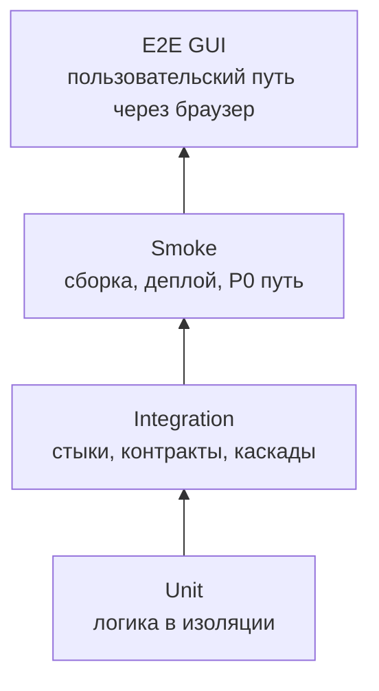
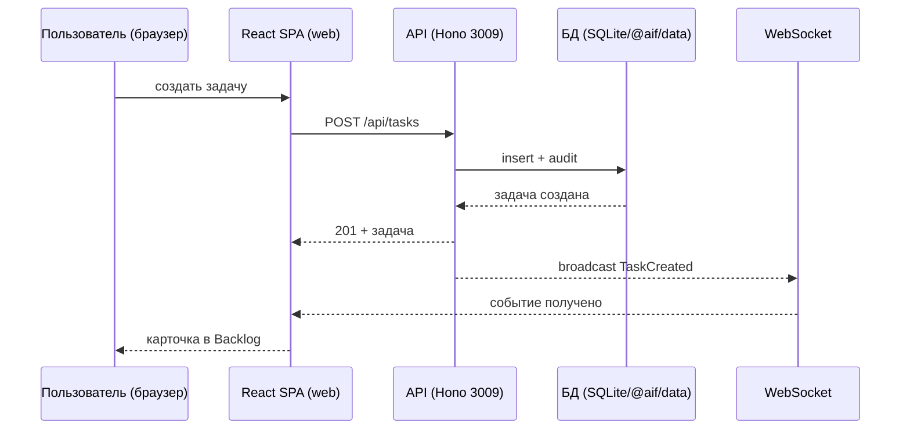

# E2E-тестирование GUI — AIF Handoff: система автономного управления задачами

> **Статус:** рабочий гайд для разработчиков, тестировщиков и ИИ-агентов.
> **Назначение:** описать, как проектировать, запускать, ревьюить и подтверждать сквозные GUI-тесты (E2E GUI) системы AIF Handoff так, чтобы они проверяли полный путь «пользователь → браузер (React SPA) → API → реальное состояние», а не имитировали достижение цели скриншотом или mock-данными. GUI — React SPA (`packages/web`), отдельного GUI-процесса нет: web-приложение общается с API по REST и WebSocket (`c4/container.md`).
> **Методологическая база:** `README.md` §4.4 (E2E GUI) и §5 (матрица качества), `test-plan.md` (артефакты `aif-qa`), `gates.md` (FG-гейты), `e2e-api-testing.md` (граница с E2E API); `use-cases/` (UC с каналом `GUI`), `business-rules/` (`BR-*`), `vision.md` (HF2, HF7–HF9, ограничения §2.6); код `packages/web` — только для понимания реализации, не источник правды. Для E2E GUI обязателен harness-каркас `Constrain / Inform / Verify / Correct`.
> **Актуализация (2026-09-20):** E2E GUI — Playwright chromium (`packages/web/e2e/*.spec.ts`, `playwright.config.ts`); набор исполняется против реального dev-стека (API 3009 + web 5180), включая scroll-регрессии Kanban, `participants-mode.spec.ts` и perf-бюджеты (`e2e/perf/*`). Каталог окружения — `packages/web/e2e/README.md`.

---

## 1. Место E2E GUI-тестов в стратегии качества

E2E GUI-тест отвечает на вопрос: «работает ли система так, как её видит и как с ней взаимодействует пользователь — навигация по Kanban-доске, детали задачи, диалоги, real-time обновления, ошибки, доступность?». Он проверяет то, что недостижимо на нижележащих уровнях: видимость и корректность UI-состояний, действия пользователя (drag & drop, ввод в формах, переходы по интерфейсу), real-time события, ошибки пользовательского ввода. Он не должен превращаться в набор unit-проверок компонентов/hook-ов с контролем середины пути.

**Правило источников (UC с каналом `GUI` + US/функции `vision.md` — источник E2E GUI).** E2E GUI-сценарий выводится из **UC с каналом `GUI`** (`use-cases/`: `UC-dashboard.*`, `UC-handoff.*`, `UC-chat.*`, `UC-auth.*`, `UC-runtime.*`) и **US/функций** `vision.md` §2.2 (HF2 — дашборд, HF7 — handoff, HF8 — чат, HF9 — участники). UC задают пользовательский путь через интерфейс; BR, FR и контракты — контекст: они уточняют шаги, ожидаемые состояния и assertions. Сценарий без UC/US-якоря допускается только как явно оформленное исключение (техническое поведение по BR/KI) с пометкой в карточке сценария.



| Параметр          | Правило проекта                                                                                                                                                                                               |
| ----------------- | ------------------------------------------------------------------------------------------------------------------------------------------------------------------------------------------------------------- |
| Основная база     | **UC с каналом `GUI`** (`use-cases/`) + **US/функции** `vision.md` §2.2 — источники сценария; контекст — BR (`BR-constraint.*`, `BR-trigger.*`), `contract-aif-rest-api`/`contract-aif-ws`, `c4/container.md` |
| Объект            | React SPA (`packages/web`): Kanban-доска, детали задачи, диалоги (handoff/участники/настройки), чат, проекты, real-time обновления, ошибки ввода                                                              |
| Среда             | Стенд E2E GUI: Playwright chromium + реальный dev-стек (API 3009 + web 5180 + data); заглушки адаптеров runtime/VCS при необходимости                                                                         |
| Время             | Десятки минут; набор дороже unit/integration, выполняется после integration и smoke                                                                                                                           |
| Выходной критерий | Сквозные P0/P1 GUI-сценарии проходят с внешним оракулом и артефактами (скриншоты/трассы/video); негативные сценарии выполнены                                                                                 |

**Граница с unit:** если заменяются зависимости (`vi.mock`, fake-репозитории) и проверяется единица кода/компонент/hook — это unit (`unit-testing.md`).
**Граница с integration:** если проверяется один стык (`api` ↔ БД/WS) без пользовательского сценария — это integration (`integration.md`).
**Граница с smoke:** если проверяется только «приложение загрузилось, health отвечает» за 5–15 минут — это deployment smoke (`README.md` §4.3).
**Граница с E2E API:** если путь не проходит через пользовательский интерфейс (REST/WS/координатор) — это E2E API (`e2e-api-testing.md`).

## 2. Цели E2E GUI-тестирования

E2E GUI-тест должен отвечать на один или несколько вопросов:

1. **Пользовательский сценарий работает через интерфейс?** Действие в браузере (создать задачу, перетащить карточку, открыть диалог handoff, сохранить настройки) приводит к ожидаемому результату.
2. **GUI отображает актуальное состояние?** Статус задачи, гейты, владелец, runtime-профиль, real-time события согласованы с реальным состоянием API/БД, а не с mock.
3. **Действия в GUI приводят к реальным изменениям?** Создание/переход/передача задачи меняют состояние в API и БД; GUI отражает результат.
4. **Состояние согласовано между GUI и сервером?** Статусы в интерфейсе и в ответах API не противоречат друг другу; смена состояния извне (координатор, другой пользователь) отображается в GUI через WebSocket.
5. **Ошибки понятны пользователю?** Ошибки валидации форм, недоступный сервер, конфликт handoff/перехода показываются явным сообщением, а не «молчанием» или падением.
6. **Негативные и граничные сценарии безопасны?** Неверный ввод, повторные действия, пустые списки, недоступный API — корректное состояние, без потери данных.
7. **Сценарий доступен (a11y)?** Клавиатурная навигация, видимый фокус, корректные ARIA-атрибуты — целевое состояние (WCAG).
8. **Окруженческое поведение корректно?** Браузер chromium, реальный WS, dev/prod-стек, тёмная/светлая тема.
9. **Сценарий написан до реализации?** Где только возможно, сквозной GUI-сценарий проектируется до фичи и обязан быть «красным» до её реализации (раздел 16.3).

E2E GUI — наиболее прямой способ валидации пользовательского опыта: если сценарий пользователя нельзя объективно проверить через интерфейс на стенде, это дефект требования или архитектуры (непроверяемость, неоднозначность, неполнота).

## 3. Что покрывать в первую очередь

### 3.1. Приоритеты

| Приоритет | Что обязательно покрывать E2E GUI                                                                                                                                                                                     |
| --------- | --------------------------------------------------------------------------------------------------------------------------------------------------------------------------------------------------------------------- |
| P0        | Kanban-доска: отображение колонок/карточек, создание задачи (`AddTaskForm`), drag & drop между колонками; детали задачи и переходы стадий; real-time обновления (стадии, гейты, handoff); аутентификация (вход/выход) |
| P1        | Диалоги handoff/участников, чат, настройки runtime-профиля, проекты; статусы гейтов и логи; ошибки и пустые состояния; тёмная/светлая тема                                                                            |
| P2        | Детали отображения, локализация, редкие сценарии (to be)                                                                                                                                                              |

### 3.2. Объекты E2E GUI-тестирования

| Объект                                                                                       | Что проверять сквозным пользовательским путём                                                                                                         |
| -------------------------------------------------------------------------------------------- | ----------------------------------------------------------------------------------------------------------------------------------------------------- |
| Kanban-доска (`Board`, `Column`, `TaskCard`, `AddTaskForm`)                                  | отображение колонок по стадиям, карточки с приоритетом/владельцем, создание задачи, drag & drop с сохранением порядка                                 |
| Детали задачи (`TaskDetail`, ownership/handoff, `ExecutorTimeline`, план, комментарии, логи) | просмотр/изменение, переходы стадий, передача владения, комментарии, история исполнителей                                                             |
| Диалоги                                                                                      | `ParticipantManagementDialog`, `ProjectRuntimeSettings`, `RuntimeProfileForm`, `GlobalSettingsDialog`, `WarmupDialog` — валидация, сохранение, ошибки |
| Real-time (`useWebSocket`, notifications)                                                    | обновление статусов/гейтов/handoff без перезагрузки; реконнект                                                                                        |
| Аутентификация (`LoginPage`, session/CSRF)                                                   | вход/выход, ошибки входа, редиректы                                                                                                                   |
| UI-примитивы (`components/ui/*`)                                                             | поведение при навигации с клавиатуры, доступность (целевое)                                                                                           |

### 3.3. Критичные классы дефектов

Обязательные сквозные проверки для проекта:

- рассинхрон GUI ↔ сервер: GUI показывает устаревший статус/владельца, а API — актуальное (или наоборот);
- GUI отображает mock/фиктивные данные как реальные;
- drag & drop не сохраняет новый порядок/стадию (потеря позиции, конфликт параллельных правок);
- real-time не работает: событие не доходит до подписанного клиента, реконнект теряет состояние;
- формы: невалидный ввод не объяснён или приводит к неконсистентному состоянию;
- handoff: диалог передачи не проверяет права/цель, владелец не обновляется;
- a11y-нарушения: элементы без текстовых альтернатив, недоступная клавиатурная навигация, невидимый фокус (целевое);
- окруженческое поведение: тёмная/светлая тема, WS-соединение, dev/prod-прокси.

## 4. Источники правды перед написанием сценария

Источник правды для E2E GUI-сценария — **UC с каналом `GUI`** (`use-cases/`) и **US/функции** `vision.md` §2.2. UC/US/BR/FR — контекст трассировки. Исключение — сценарий технического поведения без UC/US (BR/KI): оформляется явно в карточке сценария.

1. **`use-cases/`** — UC с каналом `GUI` (`UC-dashboard.*`, `UC-handoff.*`, `UC-chat.*`, `UC-auth.*`, `UC-runtime.*`) — источник сценария; **`vision.md`** — функции HF2/HF7/HF8/HF9 (§2.2), ограничения §2.6.
2. **`business-rules/`** — `BR-*`: `BR-fact.ownership.*`, `BR-constraint.ownership.handoff`, `BR-constraint.auth.task-isolation`, `BR-fact.audit.observability`.
3. **Контракты** — `contract-aif-rest-api` (REST), `contract-aif-ws` (реальное время).
4. **C4** — `c4/container.md`, `c4/context.md` (web — только сетевые вызовы к API).
5. **`test-plan.md`** — сценарии `L-*` (артефакты `aif-qa` в `.ai-factory/qa/<branch-slug>/`).
6. **`docs/known-issues.md`** — известные проблемы, влияющие на GUI.

Код и конфигурация `packages/web` используются только для понимания фактического поведения и диагностики; реализация **не является источником правды**.

Правило для ИИ-агента: **не выдумывать элементы UI и детали контракта**. Если UC/требование и реализация расходятся, не «чинить» сценарий под реализацию молча — зафиксировать расхождение как дефект, открытый вопрос или KI (`known-issues.md`).

## 5. Как выбирать E2E GUI-сценарии из требований

### 5.1. Алгоритм трассировки UC/US → E2E GUI-сценарий

1. Найти UC проверяемого поведения с каналом `GUI` (`use-cases/`) и соответствующую US/функцию (`vision.md` §2.2) — источники сценария; для технического поведения без UC — оформить явное исключение.
2. Найти связанные `BR-*`/ограничения для контекста.
3. Выписать критерий: «когда пользователь делает X в интерфейсе, API/БД изменяет Y, состояние Z согласовано между GUI и сервером».
4. Определить сквозной путь: пользователь → React-компонент → `lib/api.ts` (REST) → API → БД/WS → наблюдаемый результат.
5. Найти сценарий в `test-plan.md` (`L-*`) или создать новый ID.
6. Разделить проверки по уровням: чистая логика/компонент → unit; стык API/WS с контролем середины → integration; полный пользовательский путь → E2E GUI; путь без GUI → E2E API.
7. Сформировать минимум: happy path, negative case, fallback (API недоступен), real-time проверка, oracle.
8. Привязать сценарий к UC (основной источник) и HF/BR (контекст) в метаданных сценария или отчёте.

### 5.2. Шаблон декомпозиции сценария

```text
UC (основной источник): UC-<domain>.<subdomain>.<action> (канал GUI)
Контекст: US/функция vision.md §2.2 (HF*), BR-<ID>, contract-aif-rest-api/ws
Сценарий QA: <L-ID> (уровень E2E GUI)

Сквозной путь:
- initiator: <пользователь в браузере (chromium)>
- segments: <компонент (Board/TaskDetail/Dialog) → lib/api.ts → API → БД/WS>
- observer: <экран пользователя (скриншот/DOM) + внешнее состояние (ответ API, WS-событие, БД)>

Предусловия:
- <dev-стек: API 3009 + web 5180; Playwright chromium>
- <тестовые данные: участники, проекты, задачи; сессия>

Проверки:
- happy path: <действие пользователя> → <результат + согласованное состояние API/БД>
- negative: <невалидный ввод/ошибка> → <явное сообщение/состояние>
- fallback: <API недоступен> → <понятное состояние, без падения>
- consistency: <статусы GUI ↔ API ↔ WS согласованы>
- oracle: <что видит пользователь + состояние системы за интерфейсом>

Артефакты:
- <команда запуска/playbook>
- <скриншоты с таймстампами, трассы Playwright>
- <DOM/a11y-дерево окна>
- <логи API/координатора>
- <ссылка на CI/job>
```

### 5.3. Комментарии и метаданные трассировки

Для автоматизированных E2E GUI-тестов применяется машинно-проверяемый формат trace-комментариев: **первая строка — основной trace на UC** (`UC-<domain>.<...>`, канал GUI); далее контекст (HF/US/BR/KI), по одному ID на строку.

```ts
// UC-dashboard.board.view-kanban-columns: пользователь видит колонки Kanban (основной источник).
// HF2.1: просмотр изменений по стадиям (контекст).
// BR-fact.audit.observability: статусы согласованы с аудитом (контекст).
it("отображает колонки Kanban и карточки задач", () => {});
```

Правила:

- **первая строка — основной trace на UC** (`UC-<domain>.<...>`); ID должен существовать в `use-cases/`; для исключений без UC — HF/US, BR или KI;
- далее — контекст: `BR-*`, HF (по одному ID на строку);
- описание после двоеточия формулирует проверяемое пользовательское поведение, а не название файла;
- scenario ID из `test-plan.md` (`L-02`) указывается в имени теста, metadata или отчёте;
- если проверяется известная проблема без оформленного требования, указать ID KI (`known-issues.md`) и ближайший UC/HF/BR.

Связка гейтов: `FG-TEST` → `FG-TRACE` (требование/BR ↔ сценарий) → `FG-TEST-QUALITY` (реальные assertions, negative cases); повторный контроль — в CI (см. `README.md` §8).

## 6. Объекты E2E GUI-тестирования

### 6.1. Элементы интерфейса как контракт UI

| Элемент        | Реализация                                                                                                            | Ключевые состояния/значения                                                           | Сценарии      |
| -------------- | --------------------------------------------------------------------------------------------------------------------- | ------------------------------------------------------------------------------------- | ------------- |
| Kanban-доска   | `Board`, `Column`, `TaskCard`, `AddTaskForm`                                                                          | колонки по стадиям, карточки (приоритет/владелец/гейты), создание задачи, drag & drop | L-01, L-02    |
| Детали задачи  | `TaskDetail`, ownership/handoff, `ExecutorTimeline`, план, комментарии, логи                                          | поля, переходы стадий, handoff, комментарии, история                                  | L-03, L-04    |
| Диалоги        | `ParticipantManagementDialog`, `ProjectRuntimeSettings`, `RuntimeProfileForm`, `GlobalSettingsDialog`, `WarmupDialog` | валидация, сохранение, ошибки                                                         | L-05, L-06    |
| Real-time      | `useWebSocket`, notifications                                                                                         | обновление статусов без перезагрузки, реконнект                                       | L-07          |
| Аутентификация | `LoginPage`, session/CSRF                                                                                             | вход/выход, ошибки, редиректы                                                         | L-08          |
| UI-примитивы   | `components/ui/*`                                                                                                     | поведение, доступность (целевое)                                                      | фон всех L-\* |

### 6.2. Сквозные GUI-пути как объект проверки

| Путь              | Звенья                                                        | Что проверить                                           |
| ----------------- | ------------------------------------------------------------- | ------------------------------------------------------- |
| Создание задачи   | пользователь → `AddTaskForm` → API → БД → доска               | задача создана, отображается в Backlog, аудит записан   |
| Drag & drop       | пользователь → `Board` → API (переход/порядок) → БД           | стадия/порядок обновлены, GUI согласован                |
| Детали/handoff    | пользователь → `TaskDetail` → API → WS → GUI                  | владелец обновлён, история записана, событие доставлено |
| Real-time         | другой клиент/координатор меняет стадию → WS → `useWebSocket` | статус обновляется без перезагрузки                     |
| Настройки/профиль | пользователь → `RuntimeProfileForm` → API → БД                | профиль сохранён и применяется                          |
| Аутентификация    | пользователь → `LoginPage` → API (session+CSRF)               | сессия создана, доступ к задачам ограничен по роли      |

Правила пути:

- фиксировать состояние GUI через внешние средства чтения (DOM/a11y-дерево/скриншот Playwright), а не через внутренние структуры приложения (state React);
- проверять системный эффект действия через внешний oracle: ответ API, WS-событие, БД, аудит — а не только «кнопка нажалась»;
- добавлять negative case: недоступный API, невалидный ввод, повторные действия;
- при падении сохранять скриншоты, трассы Playwright, DOM/a11y-дерево и логи API.

### 6.3. Что НЕ является E2E GUI

- проверка стыка `api` ↔ БД/WS с контролем середины (integration);
- unit-тесты компонентов/hook-ов (`packages/web/src/__tests__`, jsdom, @testing-library/react);
- проверка «приложение загрузилось, health отвечает» (deployment smoke);
- прогон с заменой данных на mock внутри GUI, когда сценарий заявлен как E2E (запрещено, раздел 8.2);
- скриншот без проверки содержимого/состояния;
- REST/WS-контракты без пользовательского пути — это E2E API (`e2e-api-testing.md`).

## 7. Тестовые стенды и окружения

### 7.1. Классы стендов

| Стенд                     | Состав                                                                                            | Назначение                                          |
| ------------------------- | ------------------------------------------------------------------------------------------------- | --------------------------------------------------- |
| Dev / CI быстрый набор    | Пакет как процесс: `vitest run` + lint                                                            | unit + build smoke + быстрые проверки на MR/push    |
| Основной стенд интеграции | Реальный HTTP/WS-сервер + `createTestDb`                                                          | integration-сценарии                                |
| **Стенд E2E GUI**         | **Playwright chromium + реальный dev-стек (API 3009 + web 5180 + data)** + заглушки адаптеров/VCS | **E2E GUI-сценарии, real-time, окруженческие пути** |
| a11y-стенд (план)         | Стенд E2E GUI + axe/Screen Reader                                                                 | сценарии доступности (WCAG)                         |
| Compose-стенд             | docker compose dev/prod: api/web/agent/mcp                                                        | деплой-проверки, полный контур                      |

> Статус (2026-09-20): стенд E2E GUI реализован — Playwright Set (`packages/web/e2e/*.spec.ts`), `webServer` поднимает dev-стек (`npm run dev`), `AIF_WEB_URL`/`AIF_SKIP_DEV_SERVER` для внешних окружений. Текущий набор: scroll-регрессии Kanban, `participants-mode.spec.ts`, perf-бюджеты (`e2e/perf/*`). a11y-автоматизация — целевое состояние.

### 7.2. Обязательные свойства стенда E2E GUI

- **Реальный браузер**: Playwright chromium (`packages/web/playwright.config.ts`, `baseURL http://localhost:5180`); headless-режим допустим, но сквозной сценарий обязан проходить через реальный DOM браузера (не jsdom).
- **Реальный стек**: API (3009) и web (5180) — реальные процессы (`webServer` авто-старт `npm run dev` при отсутствии сервера); БД — реальная (dev-БД или `createTestDb` в API-процессе).
- **Внешние системы**: адаптеры runtime/VCS — заглушки по контрактам; недоступность реальных провайдеров не должна ломать тесты (`README.md` принцип 8).
- **Детерминированное окружение**: браузер chromium, фиксированные версии, тестовые данные; отключение анимаций при необходимости.
- **Средства чтения UI**: DOM/a11y-дерево через Playwright (`getByRole`, `getByText`), скриншоты по требованию; чтение состояния за интерфейсом — через ответы API/WS/БД.
- Данные детерминированные; тестовые участники/проекты/задачи — только тестовые.
- Топология соответствует `c4/container.md` (web ↔ api только по сети).
- Стенд допускает fault injection: остановку API, отключение WS, смену темы.

### 7.3. Правило выбора стенда

| Если нужно проверить                         | Использовать               |
| -------------------------------------------- | -------------------------- |
| Полный пользовательский путь через интерфейс | Стенд E2E GUI (Playwright) |
| Доступность (keyboard-only, ARIA)            | a11y-стенд (план)          |
| Стык API/WS с контролем середины             | Основной стенд интеграции  |
| Деплой-путь (compose, health)                | Compose-стенд (smoke)      |
| Путь без GUI (REST/WS/координатор)           | Стенд E2E API              |

## 8. Заглушки и эмуляторы

### 8.1. Главное правило

В E2E GUI-тесте **React SPA и API не заменяются fake/mock/stub**, и интерфейс не может быть «эмулирован в памяти»: сквозной путь обязан проходить через реальный браузер и реальный API. Эмуляция допустима только на внешнем контуре — адаптеры runtime (заглушка по контракту `RuntimeAdapter`), GitHub/GitLab REST.

Примеры:

- проверяем «Kanban-доска → создание задачи» → реальный web + реальный API + `createTestDb`;
- проверяем «real-time обновление» → реальный web + реальный API + WS-событие от координатора/другого клиента;
- проверяем «деградация при недоступном адаптере» → реальный web/API без адаптера (раздел 8.2).

### 8.2. Режим имитации внешних систем — только негативные сценарии

Поведение GUI при недоступных внешних системах (адаптер runtime, VCS) — **отдельный негативный сценарий**:

- сценарий **«без внешней системы»** — единственный штатный случай: проверяется, что GUI/API показывают понятное состояние и ручные операции работают без падения;
- в happy-path E2E GUI-сценариях mock-режим **запрещён**: он имитирует данные и обесценивает результат прогона (анти-фейк, раздел 16);
- если сценарий случайно выполнился с подменёнными данными, это **дефект стенда/конфигурации**: статус сценария — `not verified`.

### 8.3. Внешний контур как фон и наблюдатель

| Сервис контура              | Роль в E2E GUI-пути                                                             |
| --------------------------- | ------------------------------------------------------------------------------- |
| Адаптеры runtime (заглушка) | источник AI-операций (планы, реализации, ревью) и их статусов, отображаемых GUI |
| GitHub/GitLab (заглушка)    | PR/MR-статусы, Issues, CI-статусы, отображаемые в GUI                           |

Контур внешних систем **не является предметом проверки**, но он — независимый оракул состояния за интерфейсом: GUI обязан отображать то, что реально происходит в API/БД.

### 8.4. Инструменты UI-автоматизации — интерфейс чтения, не замена

Playwright — это **способ читать и управлять реальным GUI** (DOM/a11y-дерево/скриншоты), а не замена GUI: он работает с живым браузером и реальным стеком и не должен использоваться для «прорисовки» ожидаемого результата в обход приложения.

Правила из skill-context `aif-qa`:

- упорядоченные состояния проверять через разрешение обоих DOM-элементов и сравнение позиций (не `textContent.indexOf`);
- scroll-цепочки — только через реальное нативное колесо (`page.mouse.wheel`) над реально скроллируемым контентом;
- гонки «late-response» для асинхронных мутаций — отдельные кейсы (и immediate-эффект, и поздний ответ);
- пользовательские значения, совпадающие с встроенными ключами (например, `Pinned`/`Other`) — в таблицах коллизий.

## 9. Инстансы сервисов

### 9.1. Контур: реальные процессы

| Инстанс              | Роль в E2E GUI-пути                                          |
| -------------------- | ------------------------------------------------------------ |
| Web (React SPA)      | реальный браузер chromium + `packages/web` dev-сервер (5180) |
| API (Hono)           | реальный процесс (3009): REST + WS + `@aif/data` in-process  |
| Data (SQLite)        | БД dev/`createTestDb`: задачи, проекты, участники, аудит     |
| Адаптеры runtime/VCS | по контракту — заглушки                                      |

### 9.2. Контур заглушек

Заглушка адаптера runtime (`RuntimeAdapter`), заглушки GitHub/GitLab, тестовая конфигурация и данные.

### 9.3. Минимальный набор по типу сценария

| Тип E2E GUI-пути                           | Минимально поднять                                   |
| ------------------------------------------ | ---------------------------------------------------- |
| Kanban-доска, создание задачи (L-01, L-02) | web 5180 + API 3009 + БД                             |
| Детали/handoff/чаты (L-03, L-04)           | web 5180 + API 3009 + БД + WS                        |
| Диалоги/настройки (L-05, L-06)             | web 5180 + API 3009 + БД                             |
| Real-time (L-07)                           | web 5180 + API 3009 + WS + второй клиент/координатор |
| Аутентификация (L-08)                      | web 5180 + API 3009 (session/CSRF)                   |
| Деградация (без адаптера)                  | web 5180 + API 3009 без заглушки адаптера            |

## 10. Процедура E2E GUI-тестирования

### Шаг 0. Подготовка входных критериев

1. Проверить, что нижележащие уровни зелёные: `npm test` (локально — `make test`).
2. Зафиксировать версии: commit SHA, версии пакетов, версии контрактов.
3. Выбрать сценарии из §12 и `test-plan.md` по изменению/риску.
4. Подготовить тестовые данные из §13.
5. Убедиться, что продуктивные секреты не используются.

### Шаг 1. Развернуть стенд

1. Подготовить Playwright chromium: `npm run perf:install --workspace=@aif/web`.
2. Поднять dev-стек (API 3009 + web 5180) — авто-старт через `webServer` (`playwright.config.ts`) или вручную (`npm run dev`).
3. Проверить deployment smoke: web 200, API `/health` 200, WS открывается.
4. Очистить или инициализировать состояние: БД, сессии, проекты/задачи.
5. Сохранить стартовые логи.

### Шаг 2. Выполнить сквозные E2E GUI-сценарии

Harness-правило для каждого GUI-пути:

- **Constrain:** заданы `max_steps`, лимиты ретраев/таймаутов и границы допустимых действий;
- **Inform:** зафиксированы trace, предусловия, версия UI/API-контрактов и тестовые данные;
- **Verify:** проверяется внешний пользовательский результат, согласованность с API/WS и артефакты (скриншоты/trace/video/logs);
- **Correct:** recoverable ошибки обрабатываются через retry/fallback, terminal — через stop + escalation с фиксацией причины.

Прогнать наборы `L-*` уровня `E2E GUI` из `test-plan.md`. Для каждого пути: happy path → negative → fallback (API/адаптер недоступен) → real-time → consistency → oracle.

### Шаг 3. Выполнить негативные и security-сценарии

- неверный ввод в формах (пустые/длинные/неверные значения) → понятное сообщение;
- доступ к чужой задаче/проекту → отказ/скрытие (`BR-constraint.auth.task-isolation`);
- неверный пароль/сессия/CSRF → 401/403, понятное сообщение;
- секреты не выводятся в GUI и логах.

### Шаг 4. Выполнить окруженческие и a11y-прогоны

- тёмная/светлая тема; реальный WS; dev-стек;
- a11y (keyboard-only, ARIA, видимый фокус) — целевое состояние (WCAG).

Текущее ограничение: E2E GUI на GitHub Actions — целевое состояние (Playwright-набор исполняется локально/на dev-машине; CI-джоб — план). Компонентные тесты (`packages/web/src/__tests__`) исполняются в CI `tests.yml`.

### Шаг 5. Зафиксировать результат

Сценарий завершён только при наличии: scenario IDs; trace на UC (основной источник; контекст HF/BR); версий; команды запуска; скриншотов/трасс; DOM/a11y-дерева; логов; подтверждения negative/fallback; ссылки на CI/job или архива; дефекта с шагами при падении.

## 11. Специфика по элементам интерфейса

### 11.1. Kanban-доска

- колонки по стадиям (Backlog → … → Accepted), карточки с приоритетом/владельцем/гейтами;
- создание задачи (`AddTaskForm`): валидация, создание в Backlog;
- drag & drop между колонками: стадия и порядок сохраняются (ORM-позиция);
- пустые колонки/состояния.

### 11.2. Детали задачи

- отображение полей, статуса, гейтов, владельца, плана (TaskPlan), логов;
- переходы стадий через интерфейс (ручной оверрайд, где разрешён);
- handoff: диалог передачи, права, история исполнителей (`ExecutorTimeline`);
- комментарии и чат.

### 11.3. Диалоги и формы

- `ParticipantManagementDialog`: добавление/роли/удаление участников, admin-инварианты;
- `ProjectRuntimeSettings`/`RuntimeProfileForm`: выбор провайдера/модели, сохранение, валидация;
- `GlobalSettingsDialog`/`WarmupDialog`: настройки, прогресс;
- негатив: невалидный ввод → понятное сообщение без записи.

### 11.4. Real-time и уведомления

- обновление статусов/гейтов/handoff через WebSocket без перезагрузки;
- реконнект после разрыва;
- ошибки real-time показаны пользователю.

### 11.5. Аутентификация

- вход/выход (session+CSRF);
- ошибки входа (неверный пароль, rate-limit);
- ограничение доступа по ролям.

### 11.6. Тема и доступность

- тёмная/светлая тема — читаемость статусов (см. `docs/ui-theme-colors.md`);
- a11y: keyboard-only навигация, ARIA — целевое состояние (WCAG); компонентные тесты (`packages/web/src/__tests__`) — базовый контур.

## 12. Каталог E2E GUI-сценариев

Свод идентификаторов с уровнем `E2E GUI`: сценарии — `test-plan.md` (артефакты `aif-qa`), ID набора `L-*`:

| Область                                                 | Источник (основной trace)                                                                       | Идентификаторы сценариев (примеры) |
| ------------------------------------------------------- | ----------------------------------------------------------------------------------------------- | ---------------------------------- |
| Kanban-доска: просмотр, создание, drag & drop           | `UC-dashboard.board.view-kanban-columns`, `UC-dashboard.detail.view-task-details`               | L-01, L-02                         |
| Детали задачи: переходы, handoff, комментарии           | `UC-pipeline.manual-override.intervene-task-stage`, `UC-handoff.transfer.ownership-to-executor` | L-03, L-04                         |
| Диалоги: участники, настройки проектов, runtime-профили | `UC-runtime.profile.configure-project-runtime`, `UC-auth.roles.assign-participant-role`         | L-05, L-06                         |
| Real-time: статусы/гейты, реконнект                     | `UC-dashboard.realtime.receive-live-status-updates`                                             | L-07                               |
| Аутентификация                                          | `UC-auth.registration.sign-up-participant`, `BR-constraint.auth.sessions`                       | L-08                               |
| a11y (план)                                             | WCAG, keyboard-only                                                                             | L-09 (целевое)                     |

Правила:

- пользовательские E2E GUI-сценарии выводятся из UC (канал `GUI`) и US/функций `vision.md` §2.2; исключение без UC (BR/KI) оформляется явно; детализация кейса — шаги, данные, oracle, негативы — в `test-cases.md` (`.ai-factory/qa/<branch-slug>/`);
- сценарий с уровнем только `integration` не входит в E2E GUI-набор.

## 13. Тестовые данные

| Группа          | Данные                                                                                |
| --------------- | ------------------------------------------------------------------------------------- |
| Участники       | тестовые аккаунты (админ, участник, гость), роли по `BR-fact.auth.roles`              |
| Проекты/задачи  | `project-alpha`/`project-beta`; задачи `task-001…` с известными статусами/владельцами |
| Runtime-профили | профили `default`/`claude`/`codex`/`openrouter` + per-task overrides                  |
| Сессии/CSRF     | тестовые session-токены и CSRF-пары                                                   |
| Другие данные   | комментарии, планы, логи задач                                                        |

Правила данных: без продуктивных секретов; фикстуры рядом со сценарием; повторяемые ID; версия фикстуры фиксируется при изменении контракта.

## 14. Качество assertions и оракула

### 14.1. Что является реальной проверкой

Хороший E2E GUI-тест не ограничивается «элемент появился». Он проверяет минимум один независимый oracle:

- содержимое DOM/a11y-дерева (текст, состояние, видимость) через Playwright;
- системный эффект действия: состояние API/БД/аудита после действия;
- согласованность состояний GUI ↔ API ↔ WS;
- отсутствие запрещённого эффекта: задача не создана без прав, порядок карточек не потерян, секреты не в логах.

Плохо: «L-02: passed, потому что страница открылась». Хорошо: «L-02: passed — после создания задачи через форму карточка появилась в колонке Backlog, API вернул 201, аудит записан, WS-событие доставлено».

### 14.2. Независимый оракул

Ожидаемый результат берётся из требований и внешнего наблюдателя, а не из текущей реализации. Приоритет: UC/US (пользовательское поведение) → HF/BR → контракты (`contract-aif-rest-api`/`contract-aif-ws`) → `test-plan.md` → внешний наблюдатель (API, WS, БД) → код (только для диагностики).

### 14.3. Negative assertions

Для каждого P0/P1 E2E GUI-пути — минимум один negative assertion: невалидный ввод отклонён; доступ без прав отклонён; API недоступен — понятное состояние; сбой не оставляет систему в неконсистентном состоянии.

## 15. Детерминированность и anti-flake

### 15.1. Таксономия причин флаки

| Категория        | Типичная причина                                | Пример в проекте                         |
| ---------------- | ----------------------------------------------- | ---------------------------------------- |
| Синхронизация    | ожидание по таймеру вместо polling состояния UI | ожидание WS-обновления статуса           |
| Состояние стенда | незачищенные БД/сессии/данные между прогонами   | остаточные задачи, использованные сессии |
| Внешние системы  | нестабильная заглушка адаптера/VCS              | задержки, обрывы                         |
| Окружение        | загрузка машины, браузерные особенности         | DPI, анимации, таймауты под нагрузкой    |
| UI-автоматизация | нестабильные селекторы/скриншоты                | зависимость от темы/локали               |

### 15.2. Правила детерминизма

- чистое окружение (чистая БД/сессии до прогона); фиксированные версии;
- polling состояния UI вместо `sleep` (`expect(...).toBeVisible()` в Playwright); явные timeouts (в `playwright.config.ts`: `expect.timeout 10s`, `actionTimeout 15s`);
- без продуктивных сервисов и секретов; без случайных ID без записи значения;
- очистка состояния перед сценарием;
- один сценарий — один путь; при flake — фиксация причины (race, timeout, shared state, UI-селектор, внешняя система).

### 15.3. Методы детекции

- повторные прогоны на стенде; история CI: падение при неизменном коде и стенде — кандидат в флаки;
- метрика стабильности (`README.md` §10): доля флаки-прогонов ≤ порога (целевое состояние).

### 15.4. Жизненный цикл флаки-сценария

1. Завести дефект с владельцем (скриншоты, трассы, логи, версии).
2. Карантин с зарегистрированным дефектом; «тихий» пропуск запрещён.
3. Устранить корень по таксономии (15.1), не увеличивая таймауты.
4. Верифицировать: N успешных прогонов подряд (N ≥ 5) на чистом стенде.
5. Вернуть сценарий в набор, закрыть дефект.

## 16. Защита от имитации результатов (анти-фейк)

E2E GUI — самый дорогой уровень, и его результат проще всего имитировать: заявить «сценарий прошёл» по скриншоту без проверки содержимого. Результат принимается только по проверяемым артефактам.

### 16.1. Векторы имитации

| Вектор                            | Пример                                         | Механизм обнаружения                       |
| --------------------------------- | ---------------------------------------------- | ------------------------------------------ |
| «Зелёный» отчёт без прогона       | заявлено «L-02 прошёл» без артефактов          | обязательные артефакты §16.4               |
| Скриншот без проверки             | «страница открылась» без содержимого/состояния | assertions по DOM/a11y-дереву              |
| Mock вместо реального стека       | данные GUI из mock в happy-path                | правило §8.2                               |
| Слабый oracle                     | «кнопка нажалась» без системного эффекта       | внешний oracle §14.2                       |
| Проверка по внутренним структурам | чтение React state вместо DOM                  | чтение UI через DOM/a11y-дерево            |
| Подгонка expected под текущий код | закрепление бага как нормы                     | приоритет oracle §14.2                     |
| Фальшивый CI/лог                  | лог без command, SHA, versions                 | чек артефактов §16.4 и fresh-context §16.5 |

### 16.2. Слои защиты

1. **Проверяемые требования** — сценарий связан с UC (канал `GUI`); HF/BR — контекст.
2. **Внешний oracle** — DOM/a11y-дерево и состояние API/БД за интерфейсом.
3. **Реальный стек** — SPA/API не заменяются mock.
4. **Red-first** — сценарий красный до реализации или при намеренной поломке.
5. **Артефакты прогона** — скриншоты/трассы/DOM и CI/job.
6. **Fresh-context review** — второй агент/ревьюер сверяет артефакты с требованиями.
7. **Пирамида тестов** — unit/integration/E2E API перепроверяют поведение ниже.

### 16.3. Red-first на уровне сценария

- до реализации он падал на отсутствующей функции; при выключении API/WS/звена падает ожидаемо; при подмене валидных данных на невалидные падает ожидаемо; при намеренной поломке (убрана проверка/условие) падает ожидаемо.

### 16.4. Артефакты прогона вместо заявлений

- команда запуска/playbook; commit SHA и версии; скриншоты с таймстампами, трассы Playwright (`trace: retain-on-failure`), видео; DOM/a11y-дерево; логи API; подтверждение negative/fallback; ссылка на CI/job. Без артефактов статус — `not verified`.

### 16.5. Свежая верификация

Fresh-context reviewer проверяет: требование/контракт/сценарий/артефакты; scenario/trace ID совпадают; поднят реальный стек; oracle внешний; negative-assertions есть; вывод «passed» следует из артефактов.

## 17. Команды запуска и автоматизация

### 17.1. Нижние уровни и настоящий E2E GUI

- unit/component: `npm run test --workspace=@aif/web` (jsdom, `packages/web/src/__tests__`);
- E2E GUI: Playwright (`packages/web/playwright.config.ts`, `testDir: ./e2e`):

```sh
npm run perf:install --workspace=@aif/web   # установка chromium (один раз)
npm run perf --workspace=@aif/web           # запуск спектров (webServer авто-старт dev-стека)
npm run perf:report --workspace=@aif/web    # HTML-отчёт
```

- переменные окружения: `AIF_SKIP_DEV_SERVER=1` (не поднимать dev-сервер), `AIF_WEB_URL` (внешний URL web), `AIF_E2E_ISOLATED_UI=true` (изолированный web dev);
- наблюдение — через DOM/a11y-дерево Playwright и внешние состояния (API/WS/БД), а не через внутренние структуры приложения.

### 17.2. Связь с CI

CI (`README.md` §8.2): `FG-BUILD` → `FG-UNIT` → контрактная синхронизация → `FG-TRACE` → `FG-INTEGRATION` → E2E GUI. **Текущее состояние**: компонентные тесты web в CI (`tests.yml`); E2E GUI-набор Playwright исполняется локально/на dev-машине; CI-джоб на GitHub Actions для E2E GUI — целевое состояние.

## 18. Definition of Done для E2E GUI-теста

- [ ] Есть привязка к UC (канал `GUI`) и контекст HF/BR; указан scenario ID.
- [ ] Указан контракт (`contract-aif-rest-api`/`contract-aif-ws`) и версия; определён полный GUI-путь.
- [ ] Web и API — реальные (браузер chromium + реальный процесс API).
- [ ] Есть happy path с внешним oracle (DOM + состояние API/БД).
- [ ] Есть negative/fallback (API недоступен, невалидный ввод) и real-time проверка.
- [ ] Проверяется согласованность состояний GUI ↔ API ↔ WS.
- [ ] Oracle независим от реализации.
- [ ] Сценарий детерминирован; есть red-first/sabotage evidence; артефакты сохранены.
- [ ] Известные пробелы (a11y и др.) помечены expected fail / known gap, а не passed.

## 19. Чек-лист ревью E2E GUI-сценария

### 19.1. Трассировка

- [ ] Есть основной trace на UC (`UC-<domain>.<...>`, канал GUI); для исключений без UC — HF/BR/KI; контекст BR указан.
- [ ] ID существует в `use-cases/` (для исключений — `vision.md`/`business-rules/`/`known-issues.md`).
- [ ] Есть scenario ID (`L-*`) и ссылка на контракт/версию.

### 19.2. Полнота пути

- [ ] Путь полный: пользователь → компонент → API → БД/WS → наблюдаемый результат.
- [ ] Web/API не заменены mock; oracle внешний.
- [ ] Сценарий не дублирует unit/integration и не подменяет E2E API.

### 19.3. Полнота сценариев

- [ ] Happy path, negative, fallback, real-time, consistency.

### 19.4. Качество проверки

- [ ] Assertions по DOM/a11y-дереву и системному эффекту; нет always-pass; expected не скопирован из кода; секреты не в логах.

### 19.5. Артефакты и воспроизводимость

- [ ] Команда/playbook; commit SHA и версии; скриншоты/трассы/DOM; логи; CI/job; flake/skip объяснены.

## 20. Инструкция для ИИ-агента: генерация E2E GUI-тестов

### Шаг 1. Найди сквозной GUI-путь

Определи: по какой области — Kanban/детали/handoff/диалоги/реальное время/аутентификация. Найди внешнего инициатора (пользователь в браузере) и наблюдателя (DOM + состояние API/БД за интерфейсом).

### Шаг 2. Найди источники правды

`use-cases/` (UC с каналом `GUI` — источник); контекст — `vision.md` (HF), `business-rules/`, `test-plan.md`, `docs/contracts/`; код `packages/web` — только для понимания. Прочитай `packages/web/e2e/README.md` и `playwright.config.ts` для конвенций набора.

### Шаг 3. Составь мини-план сценария

Scenario ID, trace (UC — основной источник; HF/BR — контекст), путь, предусловия, проверки (happy/negative/fallback/consistency), oracle, артефакты.

### Шаг 4. Реализуй или опиши прогон

Автотест — Playwright spec (`*.spec.ts` в `packages/web/e2e/`): реальный браузер + реальный API; ручной playbook — с точными шагами и скриншотами.

### Шаг 5. Запусти проверку

Red-first/sabotage; unit/integration; E2E GUI на стенде; negative; CI. Без артефактов пиши честно `not run`/`blocked`/`not verified`.

### Шаг 6. Самопроверка перед ответом

- [ ] trace на UC (основной; исключение без UC оформлено); контракт и версия; путь полный; стек реальный; oracle внешний; negative/fallback есть; артефакты есть; known gaps не названы passed.

## 21. Шаблоны для генерации

### 21.1. Карточка E2E GUI-сценария

```md
### <L-ID>. <Название>

**Trace:** `UC-<domain>.<...>` (основной источник, канал GUI); `HF*`, `BR-...` (контекст)
**Priority:** P0/P1/P2

#### Preconditions

- dev-стек (API 3009 + web 5180); Playwright chromium
- Test data: <участники, проекты, задачи, сессия>

#### Steps

1. <действие пользователя в браузере>

#### Expected result

- <UI-результат по DOM/a11y-дереву>
- <системный эффект: ответ API, состояние БД/аудита, WS-событие>
- <negative/fallback assertion>

#### Artifacts

- <скриншоты/трассы, логи API, CI/job>
```

### 21.2. Шаблон GUI-автотеста (skeleton)

```ts
import { test, expect } from "@playwright/test";

test("L-02: создание задачи через форму", async ({ page }) => {
  // arrange: открыть web (baseURL), залогиниться, очистить БД
  // act: ввести название в AddTaskForm и сохранить
  // assert: карточка появилась в Backlog; API 201; аудит записан
});
```

### 21.3. Отчёт ручного прогона

```md
# E2E GUI run report

- Scenario: <L-ID>
- Trace: <UC-<domain>.<...>> (основной); <HF/BR-\*> (контекст)
- Commit/Build: <SHA>, <versions>
- Stand: <dev-стек, браузер chromium, Playwright>
- Result: `passed | failed | blocked | not verified`

## Evidence

- Скриншоты/трассы Playwright: <path/link>
- Логи API: <path/link>
- Системный эффект (API/WS/БД): <path/link>
- Red-first/sabotage evidence: <path/link>
```

### 21.4. Диаграмма сквозного GUI-пути



## 22. Что не надо делать

- Не принимать E2E GUI-сценарий без trace на UC (кроме явно оформленных исключений без UC).
- Не заменять web/API fake-эмулятором; не использовать mock-данные в happy-path.
- Не проверять только «страница открылась» без содержимого/состояния.
- Не использовать внутренние структуры приложения (React state) как основной oracle.
- Не копировать expected из кода без сверки с требованием.
- Не пропускать negative/fallback и real-time проверки для P0/P1.
- Не использовать продуктивные endpoint, секреты (токены, пароли).
- Не скрывать flake/expected fail под passed.
- Не заявлять CI/стендовый прогон без ссылки на job/logs/artifacts.

## 23. Риски и ограничения

- **Автоматизация:** E2E GUI-набор Playwright существует (`packages/web/e2e`), но CI-джоб — целевое состояние; полный a11y-контур (WCAG) — план.
- **Интерактивные сессии:** E2E GUI требует реального браузера и dev/полного стека; ограниченный параллелизм (`workers: 1` в конфиге Playwright).
- **Окружения:** `ai:perf` капризен на локальных Windows-машинах; Windows-флейки git-тестов — `known-issues.md`.
- **Внешние системы:** сценарии зависят от заглушек адаптеров/VCS; реальные провайдеры на стенде не используются.
- **To be/пробелы:** a11y (WCAG), локализация — планируются; до реализации — expected fail / known gap.
- **Открытые вопросы:** `TBD-*` (`vision.md` §1.4) влияют на ожидаемое поведение.

## 24. Связанные артефакты

- [README.md](README.md) — методология, уровни тестирования, §4.4 (E2E GUI), матрица качества.
- [unit-testing.md](unit-testing.md) — unit-уровень, trace-комментарии, анти-фейк.
- [integration.md](integration.md) — граница с integration, стенды и заглушки.
- [e2e-api-testing.md](e2e-api-testing.md) — REST/WS-контур без GUI.
- [smoke-testing.md](smoke-testing.md) — критический путь P0.
- [gates.md](gates.md) — FG-гейты.
- [Каталог E2E GUI](../../packages/web/e2e/README.md) — набор Playwright: спектры, запуск, отчёт.
- [Конфигурация Playwright](../../packages/web/playwright.config.ts) — testDir, baseURL, webServer, бюджеты.
- [Видение продукта](../vision.md) — HF2/HF7–HF9, ограничения §2.6, роли §3.1.
- [Прецеденты использования](../use-cases/README.md) — UC с каналом `GUI`.
- [Бизнес-правила](../business-rules/README.md) — `BR-*`.
- [Контракты](../contracts/README.md) — `contract-aif-rest-api`, `contract-aif-ws`.
- [C4-модель](../c4/README.md) — `container.md`, `context.md`.
- [Глоссарий](../glossary.md) — термины.
- [Известные проблемы](../known-issues.md) — реестр KI.
- [UI theme colors](../ui-theme-colors.md) — цветовые пары для проверки читаемости в темах.
