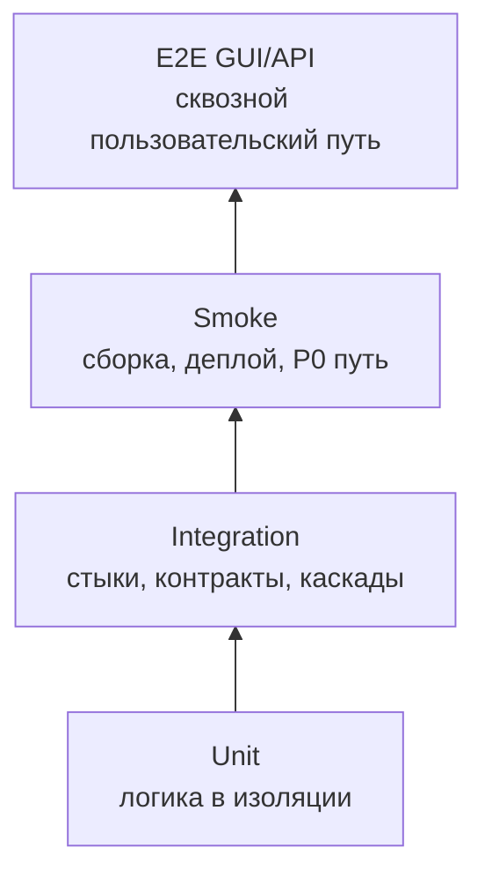

# Интеграционное тестирование — AIF Handoff: система автономного управления задачами

> **Статус:** рабочий гайд для разработчиков, тестировщиков и ИИ-агентов.  
> **Назначение:** описать, как проектировать, запускать, ревьюить и подтверждать интеграционные тесты системы AIF Handoff так, чтобы они проверяли реальные требования, контракты и взаимодействие процессов/пакетов, а не имитировали достижение цели.  
> **Методологическая база:** `README.md` (пирамида тестов, матрица качества, shift-left; §4.2), `gates.md` (FG/AG-гейты), контракты `docs/contracts/` (`contract-aif-runtime`, `contract-aif-rest-api`, `contract-aif-ws`, `contract-aif-data`, `contract-aif-db-schema`, `contract-aif-scheduler`, `contract-aif-github`, `contract-aif-gitlab`, `contract-aif-worktree`), доменные события (`use-cases/` §«События предметной области»), C4-документация (`c4/context.md`, `c4/container.md`, `c4/deployment.md`); код `packages/*/src` — только для понимания реализации, не источник правды. Для integration-уровня обязателен harness-каркас `Constrain / Inform / Verify / Correct`.

---

## 1. Место интеграционных тестов в стратегии качества

Интеграционный тест проверяет **стык нескольких реальных компонентов**: пакет ↔ пакет, контейнер ↔ контейнер, сервер ↔ БД, событие ↔ последующая реакция системы.

Интеграционный тест отвечает на вопрос: «работает ли согласованное поведение системы на границе компонентов так, как требуют FR/BR/UC и контракт?». Он не заменяет unit-тесты и не должен превращаться в полный E2E без возможности локализовать дефект.



| Параметр          | Правило проекта                                                                                                                                                                                                                                                                              |
| ----------------- | -------------------------------------------------------------------------------------------------------------------------------------------------------------------------------------------------------------------------------------------------------------------------------------------- |
| Основная база     | Контракты `docs/contracts/` (`contract-aif-*`); `vision.md` (HF1–HF12, ограничения §2.6), `business-rules/` (`BR-*`), `use-cases/`; `fun-req/` (`REQ-FR-*`), `nonfun-req/` (`REQ-NFR-*`)                                                                                                     |
| Объект            | Взаимодействие реальных компонентов: HTTP-сервер (Hono) ↔ маршруты/use-cases; WebSocket-сервер ↔ клиенты; `@aif/data` ↔ SQLite (миграции, транзакции); `@aif/runtime` ↔ адаптеры (по контракту `RuntimeAdapter`); координатор ↔ БД/субагенты; VCS-интеграции (GitHub/GitLab); node-cron цикл |
| Среда             | `createTestDb` (in-memory SQLite), реальный HTTP/WS-сервер на эфемерном порту, заглушки адаптеров/VCS по контрактам, docker compose (dev/prod) для контура реальных процессов                                                                                                                |
| Время             | Минуты; набор тяжелее unit, но должен быть воспроизводимым                                                                                                                                                                                                                                   |
| Выходной критерий | Контрактные, каскадные и негативные сценарии проходят с артефактами прогона                                                                                                                                                                                                                  |

**Граница с unit:** если зависимость заменена fake/mock/stub и проверяется один пакет/метод/use case — это unit (`unit-testing.md`).  
**Граница с E2E API:** если проверяется весь путь «внешний запрос → обработка → ответ» без вмешательства в середину — это E2E API (`README.md` §4.5).  
**Граница с smoke:** если проверяется только «сервис поднялся, health отвечает, P0 путь жив» — это smoke (`README.md` §4.3).

---

## 2. Цели интеграционного тестирования

Интеграционный тест должен проверять один или несколько классов поведения:

1. **Контракт выполнен?** Запросы, ответы, сообщения, error codes, обязательные поля и версии соответствуют `docs/contracts/` (REST OpenAPI, WS-события, типы `RuntimeAdapter`/`@aif/data`).
2. **Компоненты совместимы?** Producer и consumer одинаково понимают формат, статусы, enum (стадии задачи), идентификатор (task id / session id), retry и timeout.
3. **Каскад событий работает?** Событие в одном компоненте приводит к ожидаемому действию в другом: например, `TaskGatePassed → TaskStageChanged → WebSocket broadcast`.
4. **Негативный сценарий безопасен?** Невалидный payload, недопустимый переход стадии, обрыв WebSocket/адаптера, неверные учётные данные отклоняются явно.
5. **Состояние сохраняется?** Состояние задачи, владение, аудит и конфигурация переживают рестарт/перезапуск координатора там, где это требуется.
6. **Дефект локализуем?** При падении понятно, какой стык сломан: контракт, транспорт (HTTP/WS/in-process), бизнес-правило, БД/миграция или внешняя система.
7. **Сценарий написан до реализации?** Где только возможно, сценарии проектируются и пишутся до фичи (TDD на уровне требований): до реализации сценарий обязан быть «красным» (раздел 16.3).

Тест — это операционное представление требования. Если сценарий нельзя объективно проверить на стенде, это дефект требования или контракта: непроверяемость, неоднозначность, неполнота или отсутствие критериев приёмки.

---

## 3. Что покрывать в первую очередь

### 3.1. Приоритеты

| Приоритет | Что обязательно покрывать integration-уровнем                                                                                                                                                                     |
| --------- | ----------------------------------------------------------------------------------------------------------------------------------------------------------------------------------------------------------------- |
| P0        | Атомарные переходы стадий и владение/handoff (транзакции, конфликты), иммутабельный аудит, аутентификация/CSRF, runtime-лимиты (блокировка/авто-пауза), изоляция worktree; корректность каскадов доменных событий |
| P1        | Основные потоки REST/WS, retry/timeout/idempotency, `RuntimeAdapter`-стыки, миграции БД, поведение при рестарте координатора, VCS (PR/MR, CI-статусы)                                                             |
| P2        | Редкие окружения, planned/to-be контракты (rate-limit, OTel-телеметрия), диагностические сценарии, GUI-зависимые интеграции                                                                                       |

### 3.2. Объекты интеграционного тестирования

| Объект                                                        | Что проверять                                                                                                                                                                               |
| ------------------------------------------------------------- | ------------------------------------------------------------------------------------------------------------------------------------------------------------------------------------------- |
| REST-контракт `contract-aif-rest-api` (Hono)                  | `api ↔ клиенты`: маршруты `tasks`, `projects`, `participants`, `auth`, `chat`, `runtimeProfiles`, `settings`, `codexAuth`, `github`, `gitlab`; zod-валидация, статусы, сериализация, ошибки |
| WebSocket `contract-aif-ws`                                   | `api ↔ web`: события `TaskStageChanged`, `TaskGatePassed`, `TaskGateFailed`, `TaskOwnershipTransferred`, `TaskEscalated`, `HeartbeatReceived`, `LimitExceeded`; broadcast, реконнект        |
| Слой данных `contract-aif-data` / `contract-aif-db-schema`    | `api`/`agent` ↔ `@aif/data` ↔ SQLite: транзакционные переходы, владение, аудит, миграции (append-only, `PRAGMA user_version`)                                                               |
| Runtime-контракт `contract-aif-runtime`                       | `api`/`agent` ↔ адаптеры: резолюция профилей, запуск/резюме сессий, usage/лимиты, таймауты, категоризация ошибок                                                                            |
| Координатор `contract-aif-scheduler`                          | БД ↔ координатор: выбор задач, гейты стадий, node-cron цикл 30 с, wake-канал                                                                                                                |
| VCS-интеграции (`contract-aif-github`, `contract-aif-gitlab`) | `agent` → GitHub/GitLab: синхронизация Issues, публикация ветки/PR/MR, CI-статусы; rate-limit                                                                                               |
| Изоляция `contract-aif-worktree`                              | `agent` ↔ git: создание/очистка worktree, реконсиляция БД ↔ ФС, stash-before-remove                                                                                                         |
| Каскады событий                                               | `TaskGatePassed → TaskStageChanged → WS broadcast → аудит`; handoff → `TaskOwnershipTransferred` → аудит; `LimitExceeded` → блокировка                                                      |
| Инфраструктура                                                | миграции БД (append-only), конфигурация/env, `db:setup`, порты/health, координатор resilience после рестарта                                                                                |

### 3.3. Критичные классы дефектов

Обязательные негативные и граничные проверки:

- невалидный, неполный или несовместимый REST/WS payload;
- несовпадение версии контракта или breaking change без депрекации (OpenAPI/WS-события/TS-типы);
- неверные учётные данные/CSRF/отсутствие сессии;
- plaintext-секреты (токены, пароли) там, где они не должны передаваться;
- недоступность адаптера runtime/VCS и корректный fallback/retry (реконнект WS, переключение провайдера);
- дубликаты команд, повторная доставка, повторный переход стадии (идемпотентность);
- out-of-order события и потеря идентификатора задачи/сессии;
- рестарт координатора/API в середине сценария;
- превышение runtime-лимита, истёкшая сессия, clock skew;
- миграции: попытка переопределить применённую миграцию, конфликт версий (`PRAGMA user_version`).

---

## 4. Источники правды перед написанием сценария

Источник правды для integration-сценария — **контракты и требования**, а не реализация. Перед генерацией или запуском сценария человек или ИИ-агент должен прочитать минимальный набор источников:

1. **Контракт** — `docs/contracts/README.md` и спецификации (`rest/aif-api.md`, `websocket/events.md`, `adapter/runtime-adapter.md`, `data/data-layer.md`): методы, сообщения, enum, ошибки.
2. **Требования** — функции HF1–HF12 и ограничения `vision.md` (§2.6), `business-rules/` (`BR-*`), `use-cases/`, `fun-req/` (`REQ-FR-*`), `nonfun-req/` (`REQ-NFR-*`).
3. **План тестирования** — артефакты `aif-qa` в `.ai-factory/qa/<branch-slug>/` (`test-plan.md`, `test-cases.md`) — сценарии по функциям.
4. **C4-документация** — `c4/context.md`, `c4/container.md`, `c4/deployment.md`.

Код и конфигурация `packages/*/src` используются только для понимания реализации и диагностики; реализация **не является источником правды** — она может отставать от контрактов или содержать дефекты.

Правило для ИИ-агента: **не выдумывать детали контракта и бизнес-логики**. Если контракт, требование и код расходятся, не «чинить» сценарий под текущую реализацию молча. Нужно зафиксировать расхождение как дефект, открытый вопрос или security-gap.

---

## 5. Как выбирать интеграционные сценарии из требований

### 5.1. Алгоритм трассировки требование/BR → integration-сценарий

1. Найти требование (функцию HF1–HF12, UC, `BR-*`), которое реализуется изменением.
2. Выписать проверяемый критерий: «когда компонент A отправляет X, компонент B принимает Y и меняет состояние Z».
3. Определить границу интеграции:
   - REST-стык `api ↔ web/клиенты`;
   - WS-стык (broadcast, реконнект);
   - БД-стык `@aif/data ↔ SQLite` (транзакции, миграции);
   - runtime-стык `адаптер ↔ резолюция профилей`;
   - каскад доменных событий;
   - restart/persistence;
   - VCS/worktree стык.
4. Найти контракт в `docs/contracts/` (спецификация/типы) или в zod-схемах.
5. Найти сценарий в `test-plan.md` (`.ai-factory/qa/<branch-slug>/`) или создать новый ID при расширении плана.
6. Разделить проверки по уровням:
   - чистая логика и mapper → unit;
   - два или больше реальных компонентов / контракт / заглушки внешних систем → integration;
   - полный путь пользователя/API без вмешательства → E2E.
7. Сформировать минимум: happy path, negative case, boundary/retry/idempotency, observability/assertion.
8. Привязать сценарий к HF/UC/BR и контракту в описании теста или отчёте.

### 5.2. Шаблон декомпозиции сценария

```text
Требование: HF/UC/BR (REQ-FR-<domain>.<area>.<action> из каталога `fun-req/`)
Бизнес-правило: BR-<ID>
Контракт: contract-aif-<id>@<version> (docs/contracts/)
Сценарий QA: <IN-ттт> (интеграционный набор) или ID из test-plan.md

Граница интеграции:
- from: <компонент/клиент/процесс>
- to: <компонент/заглушка>
- transport: <HTTP REST / WebSocket / in-process @aif/data / RuntimeAdapter / git>

Предусловия:
- <какие реальные компоненты подняты: API-сервер на порту 0, WS-сервер, createTestDb>
- <какие заглушки внешнего стыка подняты: адаптеры runtime, GitHub/GitLab>
- <какие тестовые данные загружены: участники, профили, задачи>

Проверки:
- happy path: <вход> → <ожидаемый ответ/состояние/событие>
- negative: <ошибка зависимости/невалидный payload/неверные учётные данные> → <ожидаемый отказ>
- boundary: <timeout/retry/duplicate/restart> → <ожидаемое поведение>
- trace/observability: <лог/событие/состояние в аудите>

Артефакты:
- <команда запуска>
- <логи процессов>
- <сообщения/состояния/схемная валидация>
- <ссылка на CI/job>
```

### 5.3. Комментарии и метаданные трассировки

Для автоматизированных integration-тестов применяется тот же машинно-проверяемый формат trace-комментариев, что и в unit-тестах:

```ts
// HF1.1: задача автоматически переходит на следующую стадию после гейта.
// BR-constraint.task-lifecycle.transitions: недопустимый переход запрещён.
it("переводит задачу Verify → Review после прохождения гейта", () => {
  // ...
});
```

Правила:

- одна строка — один HF/UC/BR ID (для FR — ID `REQ-FR-*` из каталога `fun-req/`);
- описание после двоеточия формулирует проверяемое поведение, а не название файла;
- ID должен существовать в `vision.md`, `use-cases/` или `business-rules/`;
- если сценарий основан на `test-plan.md`, дополнительно указывать ID сценария в имени теста, subtest name, metadata или отчёте: например, `IN-007`;
- если сценарий фиксирует дефект или известную проблему без отдельного требования, указать ID KI (`known-issues.md`) и ближайший HF/UC/BR.

Для ручных или полуавтоматических прогонов трассировка фиксируется в отчёте:

```text
Scenario: IN-007
Trace: HF1.1, BR-constraint.task-lifecycle.transitions
Contract: contract-aif-rest-api@0.1.0, contract-aif-ws@1.0.0
Result: passed
Artifacts: ci-job-123, logs/in-007-2026-09-20.zip
```

Связка гейтов: `FG-TEST` (сценарий покрывает acceptance criteria) → `FG-TRACE` (требование/BR ↔ тест/сценарий) → `FG-TEST-QUALITY` (есть real assertions и negative cases) → `FG-MUTATION` для нижнего unit-слоя критичной логики.

---

## 6. Контракты и объекты интеграции

### 6.1. REST-контракт `contract-aif-rest-api`

| Контракт                                  | Направление     | Источник правды                                                           | Сценарии   |
| ----------------------------------------- | --------------- | ------------------------------------------------------------------------- | ---------- |
| `contract-aif-rest-api` (Hono, порт 3009) | клиенты ↔ `api` | `docs/contracts/rest/aif-api.md`, zod-схемы `packages/api/src/schemas.ts` | `IN-api-*` |

Маршруты: `GET/POST /api/tasks`, `GET/PATCH /api/tasks/:id`, `POST /api/tasks/:id/transition`, `POST /api/tasks/:id/handoff`, `GET/POST /api/projects`, `GET/PUT /api/projects/:id/runtime-profile`, `POST /api/chat`, `POST /api/auth/*`, `GET/PUT/PATCH /api/settings`, участники, runtime-профили, VCS-маршруты.

Проверять:

- совместимость request/response сообщений;
- обязательные поля и валидацию (zod);
- error codes/status codes HTTP;
- deadline/timeout/retry и обработку ошибок;
- backward compatibility при изменении OpenAPI-спецификации;
- поведение consumer при unknown/optional fields.

### 6.2. WebSocket-контракт `contract-aif-ws`

| Контракт          | Направление               | Источник правды                                                | Сценарии  |
| ----------------- | ------------------------- | -------------------------------------------------------------- | --------- |
| `contract-aif-ws` | `api` → `web` (broadcast) | `docs/contracts/websocket/events.md`, `packages/api/src/ws.ts` | `IN-ws-*` |

События: `TaskStageChanged`, `TaskGatePassed`, `TaskGateFailed`, `TaskOwnershipTransferred`, `TaskEscalated`, `HeartbeatReceived`, `LimitExceeded`. Реальный клиент — `ws` (библиотека) из теста, сервер — `setupWebSocket` на реальном HTTP-сервере (`startServer`, порт 0).

Проверять:

- доставку события подписанному клиенту (аутентифицированному наблюдателю);
- формат payload и соответствие схеме события;
- реконнект после разрыва (авто-восстановление, идемпотентность подписки);
- отсутствие события неаутентифицированному/неуполномоченному клиенту;
- порядок событий и отсутствие потерь при каскаде стадий.

### 6.3. Слой данных и миграции (`contract-aif-data`, `contract-aif-db-schema`)

| Объект                  | Что проверять                                                                                                                                                                                      |
| ----------------------- | -------------------------------------------------------------------------------------------------------------------------------------------------------------------------------------------------- |
| Репозитории `@aif/data` | транзакционные переходы (`taskTransitions`), владение/handoff (`taskOwnership`), аудит (immutable), участники (admin-инварианты), сессии/CSRF, tasks/projects/chat, runtime-профили, лимиты, usage |
| Миграции                | append-only, `PRAGMA user_version`, идемпотентное повторное применение (`isIgnorableMigrationError`), целостность данных при обновлении (`REQ-NFR-data.compliance.database-migration-integrity`)   |
| Атомарность             | конфликт параллельных переходов/ручного handoff — ровно один победитель, аудит защищён                                                                                                             |

### 6.4. Runtime-контракт и координатор

| Объект                   | Что проверять                                                                                                                                                                   |
| ------------------------ | ------------------------------------------------------------------------------------------------------------------------------------------------------------------------------- |
| `contract-aif-runtime`   | резолюция профилей (task → project → system → env), запуск/резюме сессий через адаптер, usage-запись, лимиты и блокировка, таймауты, категоризация ошибок (без string-matching) |
| `contract-aif-scheduler` | цикл координатора: выбор задач по готовности, гейты стадий, node-cron 30 с + wake, single-flight/дебаунс, эскалация и ретраи                                                    |
| VCS/worktree             | GitHub/GitLab (Issues, PR/MR, CI-статусы), worktree lifecycle (создание/очистка/реконсиляция), git-операции под lock                                                            |

Внутренности AI-провайдеров и VCS — вне контура: проверяются контракты (`RuntimeAdapter`, REST GitHub/GitLab), а не их реализация (`c4/context.md`, `c4/container.md`).

### 6.5. Каскады доменных событий

Каскадный сценарий проверяет не один ответ, а цепочку причинно-следственных эффектов (каталог — `use-cases/README.md` §«События предметной области»):

| Каскад                                                     | Что проверить                                                                                                             |
| ---------------------------------------------------------- | ------------------------------------------------------------------------------------------------------------------------- |
| `TaskGatePassed → TaskStageChanged → WS broadcast → audit` | после прохождения гейта стадия меняется, затем событие доходит до подписчиков и фиксируется в аудите в правильном порядке |
| `TaskOwnershipTransferred → аудит → WS broadcast`          | handoff передаёт владение, пишет аудит и уведомляет клиентов                                                              |
| `LimitExceeded → блокировка задачи`                        | превышение лимита блокирует работу и публикует событие                                                                    |
| `HeartbeatReceived → обновление расчётного состояния`      | зависшие/упавшие задачи эскалируются (stale-детекция)                                                                     |
| Ревью-решение (VCS) → `resolve-review-decision`            | идемпотентная обработка решений, событие не теряется                                                                      |

Правила каскада:

- фиксировать идентификатор задачи (`task_id`) или другой идентификатор связи событий;
- проверять промежуточные состояния, а не только финальный результат;
- добавлять negative case: разрыв одного звена (обрыв WS, сбой адаптера) должен давать контролируемую ошибку/ретрай;
- при падении сохранять логи всех компонентов цепочки.

---

## 7. Тестовые стенды и окружения

### 7.1. Классы стендов

| Стенд                     | Состав                                                                                                                                     | Назначение                                          |
| ------------------------- | ------------------------------------------------------------------------------------------------------------------------------------------ | --------------------------------------------------- |
| Dev / CI быстрый набор    | Пакет как процесс: `vitest run`; lint (`make lint`); unit + build smoke                                                                    | unit + build smoke + быстрые проверки на MR/push    |
| Основной стенд интеграции | Реальный HTTP/WS-сервер на порту 0 (`startServer`) + `createTestDb` (in-memory) + заглушки адаптеров runtime и GitHub/GitLab по контрактам | интеграционные и часть E2E API сценариев            |
| Compose-стенд             | docker compose dev/prod: `api`, `agent`, `web`, `mcp`, тома `db-data`/`projects`                                                           | контур реальных процессов, деплой-проверки, E2E API |
| E2E GUI стенд             | Playwright chromium + dev-стек (API 3009, web 5180)                                                                                        | GUI-сценарии, real-time, интерактивная сессия       |

> Статус (2026-09-20): основной стенд интеграции реализован как in-process набор (реальный HTTP/WS + `createTestDb`) — примеры: `serverBootstrap.integration.test.ts`, `participantWebSocket.integration.test.ts`, `useCases.contract.test.ts`. Compose-стенд для полного контура реальных процессов и E2E API — целевое состояние.

### 7.2. Обязательные свойства основного стенда

- Проверяемые компоненты запускаются как **реальные процессы/инстансы** (реальный HTTP-сервер, реальный WS), без замены проверяемого компонента эмулятором.
- Заглушки внешних систем (адаптеры runtime, GitHub/GitLab) изолированы от продуктивного контура.
- Тестовые секреты — токены, пароли, `MCP_AUTH_TOKEN` — не пересекаются с продуктивными.
- Данные детерминированные: один и тот же сценарий на чистом стенде даёт один и тот же результат.
- Топология соответствует `c4/container.md` (контейнеры `web`/`api`/`agent`/`mcp`, БД SQLite in-process, библиотечные модули).
- Логи, конфигурация, версии пакетов и версии контрактов сохраняются как артефакты.

### 7.3. Правило выбора стенда

| Если нужно проверить         | Использовать                                                                       |
| ---------------------------- | ---------------------------------------------------------------------------------- |
| REST/WS-контракт             | Реальный HTTP/WS-сервер на порту 0 + реальный WS-клиент (`ws`)                     |
| БД-стык/миграции             | `createTestDb` (in-memory) или временный файл + реальные репозитории `@aif/data`   |
| Runtime-контракт             | Реальные `registry`/`resolution` + заглушка адаптера по контракту `RuntimeAdapter` |
| Каскад доменных событий      | Реальные API-процессы + `createTestDb` (состояния/аудит)                           |
| Restart/persistence          | Реальный процесс + реальная БД/конфигурация на стенде                              |
| Полный пользовательский путь | E2E API/GUI поверх стенда (compose / Playwright)                                   |

---

## 8. Заглушки и эмуляторы

### 8.1. Главное правило

В интеграционном тесте заглушки допустимы **только на внешнем стыке**, который не является предметом проверки. Проверяемый компонент нельзя заменять fake-реализацией.

Примеры:

- проверяем REST/WS-стык → реальный HTTP/WS-сервер; заглушка — адаптер runtime (если провайдер не развёрнут);
- проверяем БД-стык → реальные репозитории `@aif/data` + реальный SQLite (`createTestDb`);
- проверяем каскад событий → реальный API-процесс; заглушка — VCS-клиент (GitHub/GitLab) по контракту;
- GUI без сервера — это не основной integration, а отдельный GUI/E2E режим (`e2e-gui-testing.md`).

### 8.2. Тестовый контур внешних систем

| Канал             | Заглушка / эмулятор                                               | Что эмулирует                                       | Используется в |
| ----------------- | ----------------------------------------------------------------- | --------------------------------------------------- | -------------- |
| `RuntimeAdapter`  | fake-адаптер по интерфейсу (`run/listModels/resume/listSessions`) | провайдер недоступен/таймаут/лимит/корректный ответ | IN-runtime-\*  |
| GitHub REST       | мок-клиент (`vi.fn()` на клиенте)                                 | Issues, PR/MR, CI-статусы, rate-limit               | IN-vcs-\*      |
| GitLab REST       | мок-клиент                                                        | Issues, MR, CI-статусы, rate-limit                  | IN-vcs-\*      |
| WebSocket-клиенты | реальный `ws`-клиент из теста                                     | подписка, сообщения, реконнект                      | IN-ws-\*       |
| Провайдеры/облако | не используются в integration (по принципу детерминизма)          | —                                                   | —              |

### 8.3. Локальные mock/fake/stub

- **`vi.mock` + фабрики fakes** — для unit-тестов, не для основного integration-прогона.
- **In-memory fake интерфейсов** (`RuntimeAdapter`, репозитории) — unit или component-level проверка, не замена реального HTTP/WS/БД стыка.
- **Test client** допустим как внешний инициатор: HTTP-клиент, WS-клиент (`ws`), Hono `app.request`.

---

## 9. Инстансы сервисов

### 9.1. Контур: реальные процессы

| Инстанс                          | Роль                                        | Основные стыки                                                           |
| -------------------------------- | ------------------------------------------- | ------------------------------------------------------------------------ |
| API-сервер (Hono, `startServer`) | реальный HTTP+WS-процесс на эфемерном порту | REST (клиенты), WS (broadcast), `@aif/data` (in-process), `@aif/runtime` |
| `@aif/data`                      | in-process слой доступа к БД                | SQLite (in-process, `createTestDb`), репозитории                         |
| Координатор `@aif/agent`         | опрос БД, запуск субагентов                 | БД, `@aif/runtime`, внутренний HTTP (`internalApi`), git                 |
| Web (React SPA)                  | в E2E GUI — реальный браузер                | REST/WS к API                                                            |

### 9.2. Контур заглушек внешних систем

| Инстанс                      | Роль                                                                      |
| ---------------------------- | ------------------------------------------------------------------------- |
| Заглушка адаптера runtime    | `run`/`listModels`/`resume`/`forkSession` — по контракту `RuntimeAdapter` |
| Заглушки GitHub/GitLab       | REST-ответы: PR/MR, Issues, CI-статусы, rate-limit                        |
| Тестовая конфигурация/данные | детерминированные входные данные (участники, профили, задачи)             |

### 9.3. Минимальный набор по типу сценария

| Тип сценария     | Минимально поднять                                                             |
| ---------------- | ------------------------------------------------------------------------------ |
| REST-контракт    | HTTP-сервер на порту 0 + `createTestDb` + заглушка runtime (при необходимости) |
| WebSocket        | HTTP+WS-сервер (`setupWebSocket` + `startServer`) + реальный `ws`-клиент       |
| БД-стык/миграции | `createTestDb` + реальные репозитории `@aif/data`                              |
| Каскад событий   | API-сервер + `createTestDb` (аудит/состояния) + WS-клиент                      |
| Runtime-контракт | `registry`/`resolution` + fake-адаптер                                         |
| VCS/worktree     | `@aif/agent`-модули + мок GitHub/GitLab + временный git-каталог                |

---

## 10. Процедура интеграционного тестирования

### Шаг 0. Подготовка входных критериев

1. Проверить, что unit-уровень зелёный для затронутых пакетов: `npm test` (локально — `make test`) или CI job.
2. Проверить синхронизацию контрактов (`docs/contracts/`) с реализацией (типы, zod-схемы, WS-события).
3. Зафиксировать версии: commit SHA, версии пакетов, версии контрактов, конфигурацию стенда.
4. Выбрать сценарии из §12 и `test-plan.md` по изменению/риску.
5. Подготовить тестовые данные из §13.
6. Убедиться, что продуктивные секреты (токены, пароли, `MCP_AUTH_TOKEN`) и окружения не используются.

### Шаг 1. Развернуть стенд

1. Поднять `createTestDb` (временный/in-memory SQLite) и применить миграции (`runMigrations`).
2. Поднять реальный HTTP/WS-сервер (`startServer`, порт 0) с нужными маршрутами/сервисами.
3. Проверить health/deployment smoke:
   - `/health` отвечает 200;
   - WS-handshake выполняется;
   - записи репозиториев создаются/читаются;
   - аудит пишется.
4. Очистить или инициализировать состояние: БД, сессии, профили, задачи.
5. Сохранить стартовые логи и конфигурацию стенда.

### Шаг 2. Выполнить conformance-проверки

Для каждого проверяемого контракта выполнить conformance-набор (`IN-api-*`, `IN-ws-*`, `IN-contract-*`):

- REST: path/method, request/response schema, status/error mapping, валидация zod;
- WS: схема события, порядок, доставка подписчикам;
- `@aif/data`: транзакционность, аудит, миграции;
- синхронизация типов/схем с реализацией;
- целостность: `docs/contracts/` согласован с `packages/*/src`.

Минимум assertions:

- сообщение/состояние валидируется независимым контрактом (OpenAPI/схема события/типы);
- негативный payload (невалидное тело, неверный переход) отклоняется;
- breaking change контракта не проходит без обновления версии и трассировки;
- лог/событие содержит идентификатор задачи/сессии, если он предусмотрен.

### Шаг 3. Выполнить доменные сценарии

Harness-правило для каждого сценария:

- **Constrain:** зафиксированы лимиты `max_retries`, `timeout`, допустимые точки отказа и бюджет прогона;
- **Inform:** явно указан trace (HF/UC/BR/REQ-FR/REQ-NFR), контракт и входные данные;
- **Verify:** проверяются внешний результат, состояние и наблюдаемость (логи/события/аудит);
- **Correct:** описано поведение при recoverable/terminal ошибках (retry/fallback/escalation/stop).

Прогнать интеграционные наборы с уровнем `integration` из `test-plan.md`/`test-cases.md`.

Для каждой области обязательно:

1. **Happy path** — основной поток работает на реальных компонентах.
2. **Negative path** — ошибка зависимости, невалидный payload, неверные учётные данные, таймаут обработаны явно.
3. **Boundary/retry/idempotency** — дубликаты команд, повторная доставка, restart или обрыв соединения не ломают состояние.
4. **Observability** — есть логи, события и состояния, позволяющие доказать прохождение.

### Шаг 4. Выполнить security-gap сценарии

Прогнать security-сценарии:

- неверные учётные данные/CSRF/отсутствие сессии отклоняются;
- rate-limit (login-rate-limit, API rate-limit) работает по порогам;
- изоляция задач по участникам (`BR-constraint.auth.task-isolation`) соблюдается;
- секреты (токены, пароли) не попадают в логи и аудит;
- аудит иммутабелен (нет перезаписи/удаления записей).

Если сценарий отражает целевое, но ещё не реализованное поведение (например, rate-limit на уровне адаптера, RBAC с кастомными ролями), он помечается как expected fail / known gap, а не как passed.

### Шаг 5. Выполнить окруженческие проверки

На соответствующих окружениях проверить:

- Docker compose dev/prod: старт всех сервисов, health, тома, порты;
- миграции на реальном файле БД (создание/обновление);
- Node 20/22: поведение пакетов на поддерживаемых версиях;
- известные флейки CI (Windows-специфика) — `docs/known-issues.md`.

Текущее ограничение: `ai:perf` капризен на локальных Windows-машинах; Windows-флейки git-тестов фиксируются в `known-issues.md`. Окруженческие проверки подтверждаются CI и compose-стендом.

### Шаг 6. Зафиксировать результат

Сценарий считается завершённым только если есть:

- список выполненных scenario IDs;
- trace на HF/UC/BR и контракты;
- версии компонентов и контрактов;
- команда запуска или инструкция ручного прогона;
- логи всех участвующих компонентов;
- входные сообщения и фактические состояния/события;
- результат контрактной валидации;
- ссылка на CI/job или архив локального прогона;
- дефект с воспроизводимыми шагами при падении.

---

## 11. Специфика по областям системы

### 11.1. Переходы стадий и гейты (HF1/HF5; `contract-aif-rest-api`, `contract-aif-data`)

Проверять integration-уровнем:

- ручной переход стадии (`POST /api/tasks/:id/transition`) с корректными правами;
- автоматический переход по гейту (координатор): соответствие топологии стадий (`taskLifecycle`);
- запись в иммутабельный аудит каждого перехода (100% переходов — `REQ-NFR-ops.observability.audit-trail-completeness`);
- WS-событие `TaskStageChanged` доходит до подписанного клиента;
- конфликт параллельных переходов — ровно один победитель.

Обязательные negative cases:

- переход с неверным актором/без прав;
- недопустимый переход (нарушение автомата `stateMachine.ts`);
- переход несуществующей задачи / неверный ID;
- повторный переход из той же стадии (идемпотентность/код ошибки).

### 11.2. Владение и handoff (HF7; `taskOwnership`)

Проверять:

- атомарный handoff между участниками (assignee/executor), история исполнителей;
- валидация прав: владелец/админ/участник (`BR-fact.ownership.*`, `BR-constraint.ownership.*`);
- WS-событие `TaskOwnershipTransferred` + аудит;
- гонка двух параллельных handoff — ровно один победитель.

Negative/boundary:

- handoff несуществующему участнику;
- handoff без прав;
- повторный handoff в одной транзакции.

### 11.3. Runtime-лимиты и учёт (HF6; `runtimeLimitGate`, `runtimeLimits`)

Проверять:

- превышение лимита → блокировка/авто-пауза задачи (`BR-trigger.automation.runtime-limit-gate`);
- учёт каждого вызова runtime (`REQ-FR-accounting.tracking.record-runtime-call`), агрегаты usage;
- разрешение работы после reset-времени;
- события `LimitExceeded`/`RuntimeCallRecorded`.

Negative/boundary:

- лимит не задан — работа разрешена;
- ровно на границе лимита — детерминированное решение;
- восстановление после `auto-pause` — корректный отбор задач.

### 11.4. Realtime и WebSocket (HF2; `contract-aif-ws`)

Проверять:

- broadcast событий стадий/гейтов/handoff всем подписанным клиентам;
- аутентифицированный наблюдатель получает target-события (правило skill-context: assert через authenticated observer);
- реконнект после разрыва, отсутствие потерь событий;
- порядок событий при быстром каскаде стадий.

Negative/boundary:

- неаутентифицированный клиент не получает события;
- разрыв соединения во время каскада — контролируемое восстановление;
- потеря подписки после реконнекта — повторная подписка.

### 11.5. Аудит и наблюдаемость (HF10; `audit`)

Проверять:

- иммутабельность записей аудита (нет перезаписи/удаления);
- actor identity в каждой записи;
- полнота: каждый переход стадии фиксируется (100%);
- отсутствие секретов в аудите и логах.

Negative/boundary:

- попытка записи без актора — отказ;
- батчинг activity log не теряет записи при сбое;
- ошибка runtime категоризируется структурно (без string-matching).

### 11.6. Аутентификация и участники (HF9; `authSessions`, `participants`)

Проверять:

- регистрация/вход/выход, session + CSRF;
- роли и admin-инварианты участников;
- изоляция задач по участникам;
- rate-limit на попытки входа (целевое — `REQ-NFR-security.compliance.login-rate-limit`).

Negative/boundary:

- неверный пароль/сессия/CSRF — 401/403;
- удаление последнего админа — отказ;
- задача чужого участника недоступна.

### 11.7. VCS и изоляция worktree (HF4/HF11; `contract-aif-github/gitlab/worktree`)

Проверять:

- синхронизация Issues (GitHub/GitLab) — мок-клиент;
- публикация ветки/PR/MR, plan review gate;
- CI-статусы и проверки;
- worktree: создание, очистка (stash-before-remove), реконсиляция БД ↔ ФС;
- git-операции под per-project lock.

Negative/boundary:

- rate-limit VCS — ретраи с backoff, идемпотентность (`REQ-NFR-integration.availability.vcs-rate-limit-resilience`);
- конфликт ветки/commit-конвенции — отказ до git-операции;
- stale-регистрация worktree — очистка.

### 11.8. Координатор и resilience (HF1; `coordinator`, `pollScheduler`)

Проверять:

- выбор задач по готовности (гейты стадий) на реальной БД;
- двойной триггер (cron 30 с + wake), single-flight/дебаунс;
- восстановление после рестарта без потери контекста (`REQ-NFR-api.availability.coordinator-resilience`);
- эскалация после исчерпания ретраев.

Negative/boundary:

- сбой адаптера после старта задачи — cleanup счётчиков/локов и прогресс последующих задач (правило concurrency-покрытия);
- повторный poll без новых задач — no-op;
- зависшая задача — stale-детекция и эскалация (heartbeat).

### 11.9. Открытые и целевые области

- rate-limit API (Фаза 3), OTel-телеметрия (Фаза 5), RBAC с кастомными ролями, SSH-управление, расширенный аудит — помечать `to be`;
- тест фиксирует целевую модель до реализации; до готовности — expected fail / known gap, а не passed.

---

## 12. Каталог интеграционных сценариев

Полные описания — в `test-plan.md`/`test-cases.md` (`.ai-factory/qa/<branch-slug>/`). Ниже свод идентификаторов с уровнем `integration`. Идентификаторы набора: `IN-<область>-<номер>`.

| Область                           | Идентификаторы сценариев (примеры) |
| --------------------------------- | ---------------------------------- |
| Переходы стадий и гейты (HF1/HF5) | IN-pipeline-001…IN-pipeline-008    |
| Владение и handoff (HF7)          | IN-ownership-001…IN-ownership-005  |
| Runtime-лимиты и учёт (HF6)       | IN-limits-001…IN-limits-005        |
| Realtime/WebSocket (HF2)          | IN-ws-001…IN-ws-006                |
| Аудит и наблюдаемость (HF10)      | IN-audit-001…IN-audit-004          |
| Аутентификация и участники (HF9)  | IN-auth-001…IN-auth-006            |
| VCS и worktree (HF4/HF11)         | IN-vcs-001…IN-vcs-006              |
| Координатор и resilience (HF1)    | IN-coord-001…IN-coord-005          |
| Контракты (согласованность)       | IN-contract-001…IN-contract-004    |

Сценарии с уровнем `E2E API` не входят в основной интеграционный набор, но могут быть пройдены на том же стенде как следующий уровень.

---

## 13. Тестовые данные

Полный перечень — `test-plan.md` §5. Для интеграционных сценариев использовать фиксированные наборы:

| Группа          | Данные                                                                                        |
| --------------- | --------------------------------------------------------------------------------------------- |
| Участники       | фиксированные аккаунты (админ, участник, гость); роли по `BR-fact.auth.roles`                 |
| Проекты/задачи  | проекты `project-alpha`/`project-beta`, задачи `task-001…` с известными статусами/владельцами |
| Runtime-профили | профили `default`/`claude`/`codex`/`openrouter` + per-task overrides                          |
| Лимиты          | used/limit значения на границе (для `runtimeLimitGate`)                                       |
| Сессии/CSRF     | тестовые session-токены и CSRF-пары                                                           |
| БД/миграции     | файл БД для проверки миграций; версии `user_version`                                          |
| События         | ожидаемые payload события WS по схеме `docs/contracts/websocket/events.md`                    |
| VCS             | мок-ответы GitHub/GitLab для PR/MR/Issues/rate-limit                                          |

Правила данных:

- не использовать продуктивные секреты;
- хранить тестовые данные рядом со сценарием или в выделенном каталоге test fixtures;
- фиксировать версию fixture при изменении контракта;
- иметь минимум один валидный и один невалидный набор данных на критичный контракт;
- для retry/idempotency использовать повторяемые ID (`task_id`, `session_id`), чтобы результат был воспроизводим.

---

## 14. Качество assertions и оракула

### 14.1. Что является реальной проверкой

Хороший integration-тест не ограничивается «процесс не упал» или «ответ получен». Он проверяет минимум один независимый oracle:

- schema validation по OpenAPI/схеме события/типам;
- expected status/error code;
- изменение состояния задачи/владения/аудита;
- публикацию события ожидаемому получателю (WS-клиент);
- отсутствие запрещённого эффекта: нет секретов в логах, нет повторной обработки duplicate-события, нет записи аудита при отказе;
- audit/log/событие с идентификатором задачи/сессии.

Плохо:

```text
Scenario IN-pipeline-002: passed, потому что ответ пришёл.
```

Лучше:

```text
Scenario IN-pipeline-002: passed.
- Переход Verify → Review зафиксирован в аудите (actor, state snapshot).
- WS-клиент получил TaskStageChanged с корректным payload.
- Нет секретов в логах API.
```

### 14.2. Независимый оракул

Ожидаемый результат берётся из требований и контрактов, а не из текущей реализации. Если код возвращает поле, которого нет в контракте, тест должен подсветить расхождение, а не расширить expected result без изменения спецификации.

Приоритет oracle:

1. `docs/contracts/` (OpenAPI, схемы WS-событий, типы `RuntimeAdapter`/`@aif/data`);
2. `vision.md` (HF1–HF12, §2.6), `business-rules/` (`BR-*`), `use-cases/`;
3. C4 (`c4/context.md`, `c4/container.md`);
4. `test-plan.md`/`test-cases.md`;
5. текущий код — только для понимания реализации и диагностики.

### 14.3. Negative assertions

Для каждого P0/P1 integration-сценария должен быть хотя бы один negative assertion:

- invalid payload отклонён;
- unauthorized request отклонён;
- dependency unavailable приводит к retry/fallback/error state;
- duplicate/replay не меняет состояние повторно;
- timeout не оставляет систему в неконсистентном состоянии.

---

## 15. Детерминированность и anti-flake

Интеграционные тесты дороже и потенциально нестабильнее unit, поэтому детерминизм обязателен.

### 15.1. Таксономия причин флаки

| Категория           | Типичная причина                                                | Пример в проекте                                              |
| ------------------- | --------------------------------------------------------------- | ------------------------------------------------------------- |
| Синхронизация       | ожидание по таймеру вместо condition/polling; таймауты на грани | ожидание WS-события, перехода стадии                          |
| Состояние стенда    | незачищенные состояние/БД/сессии между прогонами                | старые задачи, использованные сессии, остаточные аудит-записи |
| Внешние зависимости | реальный провайдер/VCS с непредсказуемой задержкой              | реальный HTTP в тесте (сеть недоступна)                       |
| Параллелизм         | параллельные тесты с общим файлом/портом/БД                     | общая in-memory БД, общий порт                                |
| Окружение           | загрузка CI/машины, платформенные различия                      | таймауты под нагрузкой, Windows-флейки git-тестов             |
| Данные              | случайные/разделяемые ID                                        | случайные `task_id`, `session_id`                             |

### 15.2. Правила детерминизма

- не использовать продуктивные внешние сервисы;
- не зависеть от текущего времени без контролируемого окна (fake timers где применимо);
- не использовать случайные ID (`task_id`, `session_id`) без записи значения в отчёт;
- очищать состояние стенда (БД, сессии) перед сценарием;
- задавать явные timeouts и retries;
- ожидать события по condition/polling, а не фиксированным ожиданием, где возможно;
- запускать сценарии в изолированном окружении: уникальные ID, отдельная БД;
- при flake фиксировать причину: race, timeout, shared state, external dependency, platform issue.

### 15.3. Методы детекции

- повторный прогон набора: `npx vitest run --repeat=2 --no-coverage` для затронутых сьютов;
- история прогонов в CI: падение при неизменном коде и стенде — кандидат в флаки;
- метрика «стабильность тестов» (`README.md` §10): доля флаки-прогонов ≤ порога (целевое состояние, enforced в CI).

### 15.4. Жизненный цикл флаки-сценария

Сценарий, который «иногда проходит», не является подтверждением требования. Если сценарий нестабилен:

1. **Завести дефект** с владельцем; приложить логи всех компонентов, конфигурацию стенда и версии.
2. **Карантин** с зарегистрированным дефектом; «тихий» пропуск без дефекта запрещён.
3. **Устранить корень** по таксономии (15.1): синхронизация, состояние стенда, данные; не увеличивать таймаут «для стабилизации».
4. **Верифицировать**: N успешных прогонов подряд на чистом стенде (N ≥ 5).
5. **Вернуть** сценарий в набор, закрыть дефект.

---

## 16. Защита от имитации результатов (анти-фейк)

Интеграционный уровень — естественный «детектор лжи» для unit-слоя: реальные процессы и контракты не позволяют сфейкать поведение одним моком. Но сам интеграционный прогон агент может имитировать: заявить «стенд развёрнут, сценарии прошли» без фактического исполнения. Поэтому интеграционный результат принимается только по проверяемым артефактам.

### 16.1. Векторы имитации

| Вектор                             | Пример                                                 | Механизм обнаружения                                     |
| ---------------------------------- | ------------------------------------------------------ | -------------------------------------------------------- |
| «Зелёный» отчёт без прогона        | заявлено «IN-pipeline-002, IN-ws-003 прошли» без логов | обязательные артефакты §16.4                             |
| Заглушка вместо реального процесса | проверяемый API/WS-сервер заменён эмулятором           | правило §8.1: stub только на внешнем стыке               |
| Слабый oracle                      | «ответ получен» вместо проверки состояния/события      | контрактные проверки (шаг 2 раздела 10) и assertions §14 |
| Пропуск negative cases             | security-сценарии не запускались                       | обязательный шаг 4 и DoD §18                             |
| Сокращённый каскад                 | проверен один ответ без downstream-события WS/аудита   | правила каскадов §6.5                                    |
| Подгонка expected к текущему коду  | тест закрепляет баг как норму                          | приоритет oracle §14.2                                   |
| Фальшивый CI/лог                   | лог не содержит command, SHA, versions                 | чек артефактов §16.4 и fresh-context §16.5               |

### 16.2. Слои защиты

1. **Проверяемые требования** — сценарий связан с HF/UC/BR (для FR — `REQ-FR-*` из каталога `fun-req/`).
2. **Контракт как независимый оракул** — OpenAPI/схемы WS/типы проверяют форму и семантику сообщений.
3. **Реальные компоненты внутри контура** — нельзя заменить проверяемый компонент fake-реализацией.
4. **Red-first** — сценарий должен быть красным до реализации или при намеренной поломке.
5. **Артефакты прогона** — принимаются логи и CI/job, а не текстовое заявление агента.
6. **Fresh-context review** — второй агент/ревьюер сверяет артефакты с требованиями без доверия к автору реализации.
7. **Саботаж-проверка** — намеренное нарушение контракта/каскада должно ронять сценарий.
8. **Пирамида тестов** — unit (`unit-testing.md` §14) ловит локальную ложь, integration проверяет реальные стыки, E2E подтверждает сквозной путь.

### 16.3. Red-first на уровне сценария

Сценарий считается качественным, если есть одно из подтверждений:

- до реализации он падал на отсутствующей функции или невыполненном контракте;
- при выключении нужного компонента он падает ожидаемо;
- при подмене валидного payload на invalid он падает ожидаемо;
- при намеренной поломке схемы/контракта/идентификатора задачи он падает ожидаемо.

Red-first не означает ломать продуктивную ветку. Достаточно временного локального изменения, feature flag, sabotage branch или controlled fault injection на тестовом стенде.

На уровне требований TDD означает: сценарий пишется до реализации фичи и до неё обязан быть «красным» (сервис без фичи, контракт не выполнен). Где это невозможно (код уже существует) — применяется sabotage-проверка: намеренная поломка контракта/каскада должна ронять сценарий.

### 16.4. Артефакты прогона вместо заявлений

Минимальный набор доказательств:

- команда запуска или playbook;
- commit SHA и версии пакетов;
- версии контрактов и fixtures;
- логи всех компонентов сценария;
- request/response/messages/events;
- вывод contract/schema validation;
- подтверждение negative case;
- подтверждение red-first/sabotage для P0/P1 сценариев;
- ссылка на CI/job или архив локального прогона.

Если артефактов нет, статус сценария — **not verified**, даже если агент написал «passed».

### 16.5. Свежая верификация

Fresh-context reviewer или второй ИИ-агент должен:

1. прочитать только требование, контракт, сценарий и артефакты;
2. проверить, что scenario ID и trace ID совпадают;
3. убедиться, что подняты реальные компоненты, а не fake проверяемого;
4. сверить payload с контрактом;
5. проверить наличие negative assertion;
6. проверить, что вывод «passed» следует из артефактов, а не из текста автора.

---

## 17. Команды запуска и автоматизация

### 17.1. Синхронизация контрактов

Синхронизация контрактов и реализации:

```sh
npm run build --workspace=@aif/runtime   # tsc-проверка типов контракта RuntimeAdapter
npm run ai:protocol                      # protocol-проверка codex-контракта
```

Ожидаемый результат: типы/схемы контрактов (`docs/contracts/`) синхронизированы с реализацией `packages/*/src`.

### 17.2. Integration-тесты (Vitest)

Рекомендуемый паттерн для автоматизированных integration-тестов — реальный сервер на эфемерном порту:

```sh
npm run test --workspace=@aif/api     # включает *.integration.test.ts
```

Если integration-тесты разнесены по пакетам, запускать затронутый пакет:

```sh
npm run test --workspace=@aif/<пакет>
```

Правила:

- тяжёлые тесты помечаются суффиксом `.integration.test.ts` либо отдельным suite;
- тесты не должны случайно обращаться к продуктивным endpoint;
- адреса стенда задаются через test config/env (порт 0 → эфемерный);
- секреты только тестовые;
- `it.skip` допустим только с явной причиной отсутствующего стенда и не должен скрывать обязательный P0/P1 гейт.

### 17.3. Локальный playbook ручного сценария

Если сценарий пока ручной, в отчёте фиксировать:

```text
Scenario: <ID>
Trace: <HF/UC/BR; REQ-FR-* для FR>
Build: <commit SHA, version>
Stand: <среда, процессы, stubs>
Command/playbook: <steps>
Expected: <contract/requirement oracle>
Actual: <observed state/event>
Artifacts: <logs, payloads, CI link>
Result: passed/failed/blocked/not verified
```

### 17.4. Связь с CI

Целевое состояние CI:

1. `FG-BUILD` — сборка пакетов (`turbo build`).
2. `FG-UNIT` — unit-тесты и покрытие (70%) для затронутых пакетов.
3. Контрактная синхронизация — `docs/contracts/` согласован с реализацией.
4. `FG-TRACE` — HF/UC/BR ↔ тесты/сценарии.
5. `FG-TEST-QUALITY` — нет always-pass, есть assertions и negative cases.
6. `FG-INTEGRATION` — выбранный набор integration-сценариев прошёл на стенде (in-process).
7. Security-проверки — сценарии auth/CSRF/изоляции и проверка отсутствия секретов в логах.

Пока гейт не автоматизирован, его требования проверяются ревью и артефактами прогона.

---

## 18. Definition of Done для integration-теста

Integration-тест или сценарий считается готовым, если:

- [ ] есть привязка к HF/UC/BR (для FR — `REQ-FR-*` из каталога `fun-req/`) или KI (`known-issues.md`);
- [ ] указан scenario ID из `test-plan.md` или создан новый ID;
- [ ] указан проверяемый контракт и версия;
- [ ] определены реальные процессы и допустимые stubs;
- [ ] есть happy path;
- [ ] есть negative/boundary case для P0/P1;
- [ ] oracle независим от текущей реализации;
- [ ] проверяется не только «ответ получен», но и схема/состояние/событие/лог;
- [ ] сценарий детерминирован и изолирован по данным;
- [ ] есть red-first/sabotage evidence для критичных сценариев;
- [ ] сценарий написан до реализации, где возможно (TDD на уровне требований, раздел 16.3);
- [ ] сохранены артефакты прогона;
- [ ] результат подтверждён CI или явно помечен как локальный/ручной;
- [ ] known gaps помечены как expected fail / blocked, а не passed.

---

## 19. Чек-лист ревью integration-сценария

### 19.1. Трассировка

- [ ] Есть HF/UC/BR ID в комментарии/metadata/отчёте.
- [ ] ID реально существует в `vision.md`/`use-cases/`/`business-rules/` (для FR — в `fun-req/`).
- [ ] Есть scenario ID (`IN-*` из набора или `test-plan.md`).
- [ ] Есть ссылка на контракт и версию.

### 19.2. Граница интеграции

- [ ] Проверяемый компонент поднят как реальный процесс/инстанс.
- [ ] Stub используется только на внешнем стыке.
- [ ] Сценарий не дублирует unit и не подменяет E2E.
- [ ] При падении можно локализовать сломанный стык.

### 19.3. Полнота сценариев

- [ ] Есть happy path.
- [ ] Есть negative case.
- [ ] Есть boundary/retry/idempotency/restart там, где применимо.
- [ ] Каскад проверяется полностью, а не по одному промежуточному ответу.

### 19.4. Качество проверки

- [ ] Assertions проверяют schema/status/state/event/log.
- [ ] Нет always-pass проверок.
- [ ] Expected result не скопирован из текущей реализации без сверки с контрактом.
- [ ] Security-sensitive данные не выводятся в логах.

### 19.5. Артефакты и воспроизводимость

- [ ] Есть команда запуска или playbook.
- [ ] Зафиксированы commit SHA, версии пакетов, версии контрактов.
- [ ] Приложены логи всех компонентов.
- [ ] Приложены payload/messages/responses.
- [ ] Есть CI/job или архив локального прогона.
- [ ] Flake/skip/blocker объяснены явно.

---

## 20. Инструкция для ИИ-агента: генерация integration-тестов

### Шаг 1. Найди цель изменения

Определи, что нужно проверить:

- новый или изменённый контракт;
- изменение межкомпонентного взаимодействия;
- регресс домена;
- security-gap;
- persistence/restart;
- окруженческое поведение.

Не начинай со скрипта запуска. Сначала найди требование и oracle.

### Шаг 2. Найди источники правды

Минимально прочитай:

1. `docs/contracts/README.md` и спецификацию затрагиваемого контракта (REST/WS/data/runtime);
2. `docs/vision.md` (HF1–HF12, §2.6) или `docs/business-rules/` (`BR-*`) по trace ID;
3. `test-plan.md`/`test-cases.md` по scenario ID;
4. `docs/c4/` при изменении границ (`context.md`, `container.md`);
5. код `packages/*/src` — только для понимания фактических процессов и конфигурации; не источник правды.

Если данных недостаточно — сформулируй вопрос. Не выдумывай поведение.

### Шаг 3. Составь мини-план сценариев

Перед написанием теста или отчёта выпиши. Где возможно, следуй TDD на уровне сценариев: сценарий пишется до реализации и должен быть «красным» до неё (раздел 16.3):

```text
Scenario IDs:
- <ID>: <что проверяет>

Trace:
- HF/UC/BR: <критерий>

Contracts:
- contract-aif-<id>@<version> (docs/contracts/)

Components:
- real: <HTTP/WS-сервер, createTestDb, registry>
- stubs: <адаптер runtime, GitHub/GitLab>

Assertions:
- happy: <oracle>
- negative: <oracle>
- boundary/retry/restart: <oracle>

Artifacts:
- <что будет сохранено>
```

### Шаг 4. Реализуй или опиши прогон

Если пишешь автоматизированный тест:

- используй суффикс `.integration.test.ts` или отдельный suite, если тест требует стенда;
- добавь trace-комментарии `// HF/UC/BR-...: ...` (для FR — ID `REQ-FR-*` из каталога `fun-req/`);
- не обращайся к продуктивным endpoint;
- проверяй contract/state/event;
- сохраняй полезные диагностические логи при падении.

Если пишешь ручной playbook:

- укажи точные шаги;
- используй конкретные тестовые данные;
- опиши expected result через контракт/требование;
- перечисли обязательные артефакты.

### Шаг 5. Запусти проверку

Предпочтительный порядок:

0. red-first/sabotage evidence: сценарий падает до реализации фичи или при намеренной поломке контракта/каскада (раздел 16.3);
1. контрактная синхронизация; 2. unit для затронутых пакетов; 3. нужный integration-сценарий; 4. negative/security-сценарий; 5. broader suite/CI, если доступно.

Не пиши «прошло», если команду не запускал или нет артефактов. Пиши честно: `not run`, `blocked`, `not verified`.

### Шаг 6. Самопроверка перед ответом

Перед финальным ответом проверь:

- [ ] есть trace на HF/UC/BR или KI (`known-issues.md`);
- [ ] есть контракт и версия;
- [ ] проверяемый компонент не заменён fake;
- [ ] есть negative case;
- [ ] oracle независим от реализации;
- [ ] есть команда/CI/logs или честно указано, что прогон не выполнялся;
- [ ] anti-fake требования §16 выполнены;
- [ ] known gaps не названы passed.

---

## 21. Шаблоны для генерации

### 21.1. Карточка integration-сценария

```md
### <Scenario-ID>. <Название>

**Trace:** `HF/UC/BR-...`  
**Contract:** `contract-aif-<id>@<version>` (docs/contracts/)  
**Boundary:** `<компонент> → <заглушка/клиент>`  
**Priority:** P0/P1/P2

#### Preconditions

- Real components: `<list>`
- Stubs: `<list>`
- Test data: `<fixture IDs>`

#### Steps

1. <step>
2. <step>
3. <step>

#### Expected result

- <contract/state/event assertion>
- <negative/boundary assertion>

#### Artifacts

- <logs>
- <payloads>
- <CI/job>
```

### 21.2. Integration-test skeleton (Vitest)

```ts
import { afterEach, describe, expect, it } from "vitest";
import { startServer } from "../serverBootstrap.js";
import { createTestDb } from "@aif/data/db";

// HF/UC/BR-<ID>: <проверяемое интеграционное поведение>.
describe("IN-pipeline-002: переход Verify → Review", () => {
  afterEach(() => {
    /* закрыть сервер/БД */
  });

  it("переводит задачу и публикует WS-событие", async () => {
    // arrange: createTestDb + startServer (port 0), seed задача в Verify
    // act: выполнить переход, подключить WS-клиент
    // assert: state изменён, аудит записан, WS-клиент получил TaskStageChanged
  });
});
```

### 21.3. Отчёт ручного прогона

```md
# Integration run report

- Scenario: `<ID>`
- Trace: `HF/UC/BR-...`
- Contract: `contract-aif-<id>@<version>`
- Commit: `<SHA>`
- Build: `<versions>`
- Stand: `<среда/топология>`
- Result: `passed | failed | blocked | not verified`

## Evidence

- Command/playbook: `<...>`
- Logs: `<path/link>`
- Payloads/state/events: `<path/link>`
- Contract validation: `<output/link>`
- Red-first/sabotage evidence: `<path/link>`

## Notes

- Defects: `<links>`
- Open questions: `<links>`
- Known gaps: `<links>`
```

---

## 22. Что не надо делать

- Не принимать integration-сценарий без trace на HF/UC/BR (или KI).
- Не заменять проверяемый компонент fake-реализацией.
- Не проверять только «процесс не упал».
- Не копировать expected result из текущего кода без сверки с контрактом.
- Не пропускать negative cases для P0/P1.
- Не использовать продуктивные endpoint, секреты (токены, пароли), реальные провайдеры/VCS.
- Не скрывать `it.skip`, flake или expected fail под статусом passed.
- Не смешивать в одном сценарии слишком много доменов, если дефект потом нельзя локализовать.
- Не заявлять CI/стендовый прогон без ссылки на job/logs/artifacts.

---

## 23. Риски и ограничения

Свод рисков — `test-plan.md` §10. Ключевые для интеграционного уровня:

- **Полный контур не автоматизирован:** набор integration-сценариев in-process существует (`*.integration.test.ts`), но полный контур реальных процессов (compose) и E2E API — целевое состояние; до этого прогоны — ручные с артефактами или in-process.
- **Внешние системы:** сценарии зависят от заглушек адаптеров/VCS; реальные провайдеры на стенде не используются (принцип детерминизма).
- **Окружения:** Windows-флейки git-тестов и `ai:perf` на локальных Windows-машинах (`known-issues.md`); редкие окружения требуют нативной среды или эмуляции.
- **To be:** rate-limit API, RBAC с кастомными ролями, OTel-телеметрия, SSH-управление — целевая модель; expected fail / known gap до реализации.
- **Открытые вопросы:** `TBD-*` (`vision.md` §1.4) влияют на ожидаемое поведение.
- **Каскады:** многошаговые цепочки событий требуют согласованного состояния стенда и качественных артефактов.

---

## 24. Связанные артефакты

- [README.md](README.md) — методология, уровни тестирования, матрица качества.
- [unit-testing.md](unit-testing.md) — unit-уровень, trace-комментарии, anti-fake и test-quality gates.
- [smoke-testing.md](smoke-testing.md) — критический путь P0 (SM-\*).
- [e2e-api-testing.md](e2e-api-testing.md) — следующий уровень (сквозные контракты).
- [e2e-gui-testing.md](e2e-gui-testing.md) — E2E GUI (Playwright).
- [gates.md](gates.md) — `FG-BUILD`, `FG-UNIT`, `FG-TEST`, `FG-TRACE`, `FG-TEST-QUALITY`, `FG-MUTATION` и целевые гейты.
- [Видение продукта](../vision.md) — функции HF1–HF12, ограничения §2.6.
- [Прецеденты использования](../use-cases/README.md) — UC 11 доменов и события предметной области.
- [Бизнес-правила](../business-rules/README.md) — `BR-*`.
- [Функциональные требования](../fun-req/README.md) — `REQ-FR-*`.
- [Нефункциональные требования](../nonfun-req/README.md) — `REQ-NFR-*`.
- [Контракты](../contracts/README.md) — `contract-aif-*` — источник правды контрактов.
- [C4-модель](../c4/README.md) — контейнеры, компоненты, топология (`context.md`, `container.md`, `deployment.md`).
- [Архитектура](../architecture.md) — пакеты, конвейер агента, автомат стадий, real-time.
- [Глоссарий](../glossary.md) — термины.
- [Известные проблемы](../known-issues.md) — реестр KI.
- `.ai-factory/qa/<branch-slug>/` — артефакты `aif-qa` (change-summary/test-plan/test-cases) по веткам.
- Открытые вопросы (`open-questions.md`) — лакуны требований и `TBD` (артефакт создаётся по мере выявления, по RULES.md).
