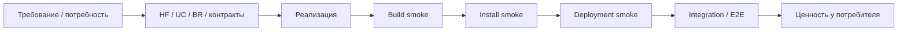

# Smoke-тестирование — AIF Handoff: система автономного управления задачами

> **Статус:** рабочий гайд для разработчиков, тестировщиков, DevOps и ИИ-агентов.
> **Назначение:** описать smoke как быстрый и детерминированный способ проверить, что сборка, установка и стенд **живы** и готовы двигаться дальше по CI/CD. Smoke отвечает не на вопрос «верна ли функциональность», а на вопрос «есть ли сигналы жизнеспособности, достаточные для перехода к более дорогим проверкам и релизу».
> **Методологическая база:** `README.md` §4.3, §5, §8; `gates.md` (`FG-BUILD`, `FG-UNIT`, `FG-REGRESSION`); `vision.md` (функции HF1–HF12, ограничения §2.6); `use-cases/`, `business-rules/`, `contracts/`, `c4/`. Для smoke-контуров обязателен harness-каркас `Constrain / Inform / Verify / Correct`.

---

## 1. Smoke в системе качества

Smoke — это **проверка сигналов жизнеспособности**, а не функциональная верификация.

| Сигнал      | Что проверяем                                                                                                                          |
| ----------- | -------------------------------------------------------------------------------------------------------------------------------------- |
| Связь       | API-сервер (3009) слушает и отвечает на health; WebSocket открывается; MCP `/health` отвечает; БД (SQLite) инициализирована миграциями |
| Процесс     | пакеты собрались (`turbo build`); сервер `api` стартовал и не упал; координатор `agent` запущен; `mcp` поднят (stdio/HTTP)             |
| Отображение | web-приложение (5180) отвечает, SPA загружается, Kanban-доска рендерится                                                               |
| Состояние   | задача создаётся → переходит стадии → событие доходит до WebSocket-клиента                                                             |
| Артефакт    | зависимости установлены (`npm ci`), БД создана (`db:setup`), версии пакетов и commit SHA зафиксированы                                 |

Функциональность как таковая — правильность расчётов, валидаций, бизнес-правил и обработок ошибок — **не smoke**. Это зона unit, integration и E2E.



### Smoke, gate и US — не одно и то же

| Понятие | Роль                                   |
| ------- | -------------------------------------- |
| Smoke   | Быстрая проверка жизнеспособности      |
| Gate    | Решение: можно ли продвигать дальше    |
| US      | Требование о пользовательской ценности |

Smoke даёт данные для gate-решения. US описывает ценность и, если касается критического пути, может усиливать трассировку, но не является источником smoke-набора.

---

## 2. Что smoke покрывает в первую очередь

### 2.1. Три вида smoke

| Вид              | Что проверяет                                                                         | Когда                    |
| ---------------- | ------------------------------------------------------------------------------------- | ------------------------ |
| Build smoke      | Сборка монорепозитория, линт, типы, артефакты                                         | Каждый MR/push           |
| Install smoke    | Установка зависимостей, инициализация БД/миграций, запуск dev/производственных стеков | Перед глубокими уровнями |
| Deployment smoke | Критический путь после деплоя стенда                                                  | Каждый деплой стенда     |

### 2.2. Что smoke не делает

- не проверяет подробную функциональную корректность;
- не заменяет integration и E2E;
- не покрывает детальные негативные сценарии и границы;
- не доказывает бизнес-ценность, если нет внешнего сигнала жизнеспособности;
- не использует fake/mock/stub в критическом пути (реальные процессы API/agent/data; заглушки — только на внешнем контуре: адаптеры runtime, VCS).

### 2.3. Минимальный смысл каждого вида

- **Build**: «собирается ли монорепозиторий вообще».
- **Install**: «ставятся ли зависимости и инициализируется ли стек (БД, миграции)».
- **Deployment**: «готов ли стенд принимать дальнейшие проверки и релиз».

---

## 3. Источники правды и граница с требованиями

Smoke строится только из:

1. **P0-функций HF1–HF12** — критические функции системы (`vision.md` §2.2);
2. **Ограничений и критериев приёмки** — `vision.md` §1.4, §2.6;
3. **UC P0** — когда они есть и помогают уточнить критический путь (`use-cases/`);
4. **Контрактов** — `contract-aif-rest-api` (REST), `contract-aif-ws` (WebSocket), `contract-aif-data`/`contract-aif-db-schema` (БД и миграции), MCP-инструменты;
5. **C4** — топология контейнеров и стенда (`c4/context.md`, `c4/container.md`, `c4/deployment.md`).

### Правило трассировки

1. Определить вид smoke: build / install / deployment.
2. Найти P0 HF/UC/BR и соответствующие контракты.
3. Свести их к одному минимальному сценарию жизнеспособности.
4. Отделить smoke от integration/E2E: если нужен детальный негатив, граница или полный пользовательский путь — это уже не smoke.
5. Зафиксировать scenario ID, trace и артефакты.

### Про US

US/UC не являются обязательным источником smoke. Каталог UC создан; UC P0 на критическом пути (создание задачи, переход стадии, real-time событие) усиливают трассировку сценариев SM-D-\*, но базовый smoke-набор по-прежнему строится на HF/UC/BR и контрактах.

---

## 4. Объекты smoke-проверки

### 4.1. Build smoke

Проверяем:

- сборку всех пакетов монорепозитория (`turbo build`, `npm run build` — tsc + vite);
- отсутствие ошибок компиляции и типов (TypeScript strict);
- прохождение линтеров (`make lint` — ESLint/Prettier) и быстрых тестов (`make test`, vitest);
- согласованность версий пакетов (workspace `*`-зависимости);
- отсутствие секретов в артефактах сборки;
- синхронизацию контрактов с реализацией (`npm run ai:protocol` — protocol-проверка codex; типы `RuntimeAdapter` — tsc).

### 4.2. Install smoke

Проверяем:

- установку зависимостей на чистом окружении (`npm ci`, Node ^20.19.0 / ≥22.12.0);
- инициализацию БД: `db:setup` (миграции применяются, `PRAGMA user_version` корректен);
- запуск dev-стека (`npm run dev`: API 3009, web 5180, agent, MCP);
- production-стек (docker compose prod: сервисы `api`/`web`/`agent`/`mcp`, тома, Angie);
- конфигурацию по умолчанию (`.env`, `DATABASE_URL`, `MCP_AUTH_TOKEN`, логирование);
- повторный запуск идемпотентен (повторный `db:setup` не ломает БД).

### 4.3. Deployment smoke

Проверяем сигналы жизнеспособности критического пути:

- сервисы подняты (compose dev/prod) и health отвечают: API `/health`, MCP `/health` (`{"status":"ok"}`);
- WebSocket-канал открывается (`ws://…/ws`), handshake проходит;
- создание задачи через REST → переход стадии (ручной или гейтовый) → WS-событие доходит до клиента;
- чтение/запись в БД через API (репозитории работают, аудит пишется);
- MCP: подключение (stdio/HTTP с Bearer-токеном) и вызов простого инструмента (`handoff_*`);
- версии на стенде совпадают с релизом.

### 4.4. Что не является smoke

- функциональные подробности конвейера (качество планов, review-конвергенция, кодировки/форматы);
- негативы про неверные переходы, конфликты handoff, лимиты runtime;
- полный пользовательский путь через браузер;
- полный контрактный путь с детальными assertions (зона integration/E2E);
- нагрузка, отказоустойчивость, длительная стабильность.

---

## 5. Окружения, заглушки и оракул

### 5.1. Стенды

| Стенд              | Назначение                                                                          |
| ------------------ | ----------------------------------------------------------------------------------- |
| CI / быстрый набор | Build smoke и проверка сборки (GitHub Actions `build.yml`, `tests.yml`, `lint.yml`) |
| Dev-стек           | Install smoke: локальный запуск API+web+agent+MCP                                   |
| Compose-стенд      | Deployment smoke: docker compose dev/prod, health, критический путь                 |
| E2E-стенд          | Проверка браузерного контура с реальным браузером (Playwright) — следующий уровень  |
| Редкие окружения   | Эмуляция только для P2                                                              |

> Статус (2026-09-20): исполняется CI/быстрый набор (build + unit + покрытие 70% — GitHub Actions); dev-стека и compose-стенда достаточно для deployment smoke на локальной машине/CI; полный E2E-контур и нагрузочные гейты — целевое состояние.

### 5.2. Обязательные свойства стенда

- чистый снапшот (чистый checkout, свежие `node_modules` или отказ от кэша);
- детерминированные окружение, локаль и пути;
- реальные процессы `api`/`agent`/`data` в критическом пути;
- заглушки внешних систем как согласованный фон (адаптеры runtime, VCS) — только при необходимости;
- измеримый бюджет времени (≤15 минут);
- наблюдаемость: логи, состояния, версии, артефакты;
- возможность fault injection для негативного smoke (недоступный MCP-токен, отключённый агент).

### 5.3. Заглушки и эмуляция

- в критическом пути процессы не подменяются fake/mock/stub;
- заглушки допустимы только на внешнем контуре: адаптеры runtime (вместо реального провайдера), GitHub/GitLab REST (вместо реального VCS);
- web-клиент — реальный браузер в E2E, а не самодельная заглушка;
- редкие окружения допускается проверять через эмуляцию, но это пометка `P2`, а не замена нативного прогона.

### 5.4. Что считается оракулом

Oracle — это внешний наблюдатель, а не текст «команда прошла»:

- HTTP-статус health-запроса (`200` на `/health`);
- WS-handshake/сообщение, полученное реальным WS-клиентом;
- запись/строка в БД (через API или прямой read из теста);
- файл/путь/хэш (БД, отчёты, артефакты);
- версия пакета и commit SHA.

---

## 6. Процедура smoke-тестирования

### Шаг 0. Подготовка

Harness-настройка перед прогоном:

- **Constrain:** определить `max_steps`, `max_retries`, `timeout`, budget времени;
- **Inform:** зафиксировать scope smoke, trace, версии и стартовое состояние;
- **Verify:** определить детерминированные критерии pass/fail для каждого smoke-вида;
- **Correct:** определить действия при recoverable/terminal сбоях (retry/fallback/escalation/stop).

- подтвердить, что предыдущий уровень зелёный;
- зафиксировать commit SHA, версии, конфигурацию стенда;
- выбрать smoke-вид;
- подготовить тестовые данные (участники, проекты, задачи, тестовые токены);
- исключить продуктивные секреты и окружения.

### Шаг 1. Build smoke

- сборка (`turbo build` / `npm run build`), линтеры (`make lint`, format:check);
- типы (tsc) и быстрый тестовый прогон (`make test`, `make test-fast`);
- фиксация версий и хэшей;
- остановка конвейера при падении.

### Шаг 2. Install smoke

- чистый checkout;
- `npm ci` (Node в заявленном диапазоне);
- `db:setup` (миграции применяются без ошибок);
- запуск dev-стека; health-запросы к API и MCP;
- повторный прогон (идемпотентность).

### Шаг 3. Deployment smoke

- поднять compose-стенд (dev/prod) и заглушки (при необходимости);
- подтвердить процессы и порты (`/health`);
- пройти критический путь P0 (создать задачу → перевести стадию → получить WS-событие);
- проверить версии;
- уложиться в бюджет времени.

### Шаг 4. Негативный smoke

- внешние системы недоступны (нет адаптера runtime/VCS), но система жива: API отвечает, БД работает, ручные операции возможны (деградация);
- неверный/отсутствующий MCP-токен → 401, остальной сервис жив;
- сценарий устойчив на чистом снапшоте.

### Шаг 5. Окруженческие прогоны

- install smoke на Node 20/22;
- Windows — до полной автоматизации может быть ручной контур (известные флейки — `known-issues.md`);
- редкие окружения — только как P2/эмуляция.

### Шаг 6. Фиксация результата

В результате должны быть:

- scenario ID;
- trace на HF/UC/BR и контракты;
- версии, хэши, снапшот стенда;
- команда запуска или playbook;
- логи и состояния;
- вывод health-проверок и WS-сообщений;
- ссылка на CI/job или архив ручного прогона;
- дефект, если smoke упал.

---

## 7. Каталог smoke-сценариев

### 7.1. Build smoke

| ID      | Проверка                                              | Окружение | Приоритет |
| ------- | ----------------------------------------------------- | --------- | --------- |
| SM-B-01 | Сборка всех пакетов (`turbo build`)                   | CI        | P0        |
| SM-B-02 | Версии пакетов и хэши артефактов согласованы          | CI        | P0        |
| SM-B-03 | `npm test` и линтеры (`make lint`)                    | CI        | P0        |
| SM-B-04 | Типы компилируются (tsc strict), нет ошибок типов     | CI        | P0        |
| SM-B-05 | Нет секретов и запрещённых зависимостей (`npm audit`) | CI        | P0        |
| SM-B-06 | `format:check` (Prettier) проходит                    | CI        | P1        |
| SM-B-07 | Protocol-проверка контрактов (`npm run ai:protocol`)  | CI        | P1        |
| SM-B-08 | SBOM для поставляемых сборок                          | CI        | P1        |
| SM-B-09 | Docker-образы dev/prod собираются                     | CI        | P1        |
| SM-B-10 | Покрытие порога 70% не упало (`npm run coverage`)     | CI        | P0        |

### 7.2. Install smoke

| ID      | Проверка                                                      | Окружение    | Приоритет |
| ------- | ------------------------------------------------------------- | ------------ | --------- |
| SM-I-01 | `npm ci` на чистом checkout (Node 20/22)                      | CI/dev       | P0        |
| SM-I-02 | `db:setup`: миграции применяются, `user_version` корректен    | CI/dev       | P0        |
| SM-I-03 | Dev-стек поднимается: API 3009, web 5180, agent, MCP          | dev          | P0        |
| SM-I-04 | `/health` API отвечает 200                                    | dev/compose  | P0        |
| SM-I-05 | MCP `/health` отвечает `{"status":"ok"}`                      | dev/compose  | P0        |
| SM-I-06 | Повторный `db:setup` идемпотентен                             | CI/dev       | P1        |
| SM-I-07 | Производственный стек (compose prod) поднимается              | prod-compose | P1        |
| SM-I-08 | Конфигурация по умолчанию валидна (`.env`, `DATABASE_URL`)    | dev          | P0        |
| SM-I-09 | Upgrade схемы БД из старой версии проходит (миграции)         | dev          | P1        |
| SM-I-10 | Повторная установка не теряет данные (тома/БД)                | dev          | P2        |
| SM-I-11 | Редкие окружения проверены через эмуляцию                     | эмуляция     | P2        |
| SM-I-12 | MCP HTTP с Bearer-токеном: верный токен — 200, неверный — 401 | dev          | P0        |

### 7.3. Deployment smoke

| ID      | Проверка                                                            | Приоритет |
| ------- | ------------------------------------------------------------------- | --------- |
| SM-D-01 | После деплоя сервисы живы (api/agent/web/mcp), health отвечает      | P0        |
| SM-D-02 | WebSocket-канал открывается (handshake) и клиент получает сообщение | P0        |
| SM-D-03 | Создание задачи через REST (`POST /api/tasks`)                      | P0        |
| SM-D-04 | Переход стадии задачи фиксируется (ручной/гейтовый)                 | P0        |
| SM-D-05 | WS-событие (`TaskStageChanged`) доходит до подписанного клиента     | P0        |
| SM-D-06 | Система работает без внешних адаптеров (деградация): API/БД живы    | P0        |
| SM-D-07 | Разрыв WS-соединения не роняет API (реконнект возможен)             | P0        |
| SM-D-08 | MCP-клиент подключается и вызывает инструмент `handoff_*`           | P1        |
| SM-D-09 | Аудит пишется при создании/переходе задачи                          | P1        |
| SM-D-10 | Логи и базовые события (старт/стоп сервисов) видны                  | P1        |
| SM-D-11 | Версии пакетов, контрактов и SHA совпадают                          | P0        |
| SM-D-12 | Отсутствие MCP-токена не роняет основной API                        | P0        |
| SM-D-13 | Повторный деплой/перезапуск сохраняет состояние задач               | P1        |
| SM-D-14 | Критический путь укладывается в 15 минут, прогон стабилен           | P0        |
| SM-D-15 | Сквозной контур «заглушка адаптера → задача → WS-событие» через MCP | P0        |
| SM-D-16 | Web-приложение отвечает и SPA загружается (HTTP 200 + рендер)       | P1        |

SM-D-15 — сквозной контур «MCP-клиент → `mcp` → `@aif/data` → API broadcast»: проверяется на стенде с заглушками внешних систем (адаптеры runtime при необходимости).

### 7.4. Функциональные акценты

- `HF1` (hand-off-конвейер): SM-D-03, SM-D-04, SM-D-05
- `HF2` (дашборд/real-time): SM-D-02, SM-D-05, SM-D-16
- `HF3` (runtime-адаптеры): SM-D-06 (деградация, адаптеры недоступны)
- `HF9` (участники/аутентификация): SM-D-12 (401 без токена), SM-I-12
- `HF10` (аудит): SM-D-09
- MCP-интеграция: SM-D-08, SM-D-15

### 7.5. Базовый набор

Обязательный минимум deployment smoke:
SM-D-01, SM-D-02, SM-D-03, SM-D-04, SM-D-05, SM-D-12.
Это и есть основной сигнал жизнеспособности критического пути.

---

## 8. Качество smoke

### 8.1. Детерминизм и anti-flake

Smoke — частый прогон, поэтому флейки дорогие.

Правила:

- чистые снапшоты;
- фиксированные версии, локаль и пути;
- polling вместо `sleep`;
- один сценарий — одна жизнеспособность;
- при флаке — дефект и карантин, а не увеличение таймаута.

### 8.2. Anti-fake

Нельзя принимать за smoke:

- «джоба зелёная» без артефактов;
- «команда прошла», но состояние не изменилось;
- старую сборку или старый стенд;
- отсутствующий oracle;
- частичный прогон, выданный за полный.

### 8.3. Definition of Done

Smoke-сценарий готов, если:

- есть trace на P0 HF/UC/BR и контракты;
- есть scenario ID из `SM-*`;
- выбран вид smoke и внешний oracle;
- подтверждён минимальный P0-набор;
- заданы negative assertion и бюджет времени;
- артефакты сохранены;
- провал сценария останавливает конвейер.

---

## 9. CI/CD и автоматизация

### 9.1. Целевая цепочка

```text
FG-BUILD → FG-UNIT → SMOKE → integration → E2E → release/deploy
```

### 9.2. Команды-ориентиры

```sh
# build smoke
npm run build        # turbo build (tsc + vite)
npm test             # vitest (turbo test)
make lint            # ESLint/Prettier

# install smoke
npm ci               # установка зависимостей
npm run db:setup     # миграции БД
npm run dev          # dev-стек (API 3009, web 5180, agent, MCP)

# deployment smoke
docker compose up -d                    # dev-стенд
curl -f http://localhost:3009/health     # API health
curl -f http://localhost:3100/health     # MCP health
# + критический путь: создать задачу → переход → WS-событие
```

### 9.3. Правила

- build smoke — быстрый набор на каждый push/MR (GitHub Actions `build.yml`, `tests.yml`, `lint.yml`, `security-audit.yml`);
- install/deployment smoke — после готовности стенда (compose);
- провал smoke останавливает дальнейшее продвижение;
- пока CI не автоматизирует весь набор, ручной прогон подтверждается артефактами.

---

## 10. Чек-лист ревью smoke-сценария

- [ ] Трассировка идёт от P0 HF/UC/BR и контрактов.
- [ ] Сценарий действительно smoke, а не integration/E2E.
- [ ] Выбран правильный вид smoke.
- [ ] Oracle внешний.
- [ ] Нет подмены реальных процессов fake/mock/stub.
- [ ] Есть negative assertion.
- [ ] Время укладывается в бюджет.
- [ ] Есть артефакты прогона и ссылка на CI/job.
- [ ] Флаки и skip не скрыты под `passed`.

---

## 11. Что не надо делать

- Не превращать smoke в integration/E2E.
- Не проверять только код возврата или зелёную джобу.
- Не использовать внутренние логи как основной oracle.
- Не подменять критический путь заглушками.
- Не заявлять прогон без артефактов.
- Не скрывать флаки и expected fail.
- Не смешивать в одном сценарии несколько независимых жизнеспособностей.
- Не превышать бюджет 15 минут без waiver.

---

## 12. Риски и ограничения

- Windows-контур может быть ручным до полной автоматизации (известные Windows-флейки git-тестов — `known-issues.md`; `ai:perf` капризен на локальных Windows-машинах).
- Часть возможностей (rate-limit API, OTel-телеметрия, RBAC с кастомными ролями) — целевая модель (`vision.md` §2.5) и не должна исполняться как существующая.
- smoke не покрывает негатив и границы, поэтому эти дефекты остаются риском integration/E2E.
- smoke зависит от согласованного стенда с заглушками (адаптеры runtime, VCS), но не должен зависеть от реальных провайдеров/облака.
- редкие окружения допускаются как эмуляция, но не заменяют нативный/локальный прогон.
- E2E GUI-контур (Playwright) и нагрузочные гейты — целевое состояние; до их автоматизации соответствующие проверки исполняются локально с артефактами.

---

## 13. Связанные артефакты

- [README.md](README.md) — стратегия QA, §4.3 smoke, §8 CI/CD
- [gates.md](gates.md) — FG-гейты (`FG-BUILD`, `FG-UNIT`, `FG-REGRESSION`)
- [integration.md](integration.md) — следующий уровень за smoke
- [e2e-gui-testing.md](e2e-gui-testing.md) — E2E GUI
- [e2e-api-testing.md](e2e-api-testing.md) — E2E API
- [Видение продукта](../vision.md) — функции HF1–HF12, ограничения §2.6
- [Прецеденты использования](../use-cases/README.md) — UC P0 критического пути
- [Бизнес-правила](../business-rules/README.md) — `BR-*`
- [Контракты](../contracts/README.md) — `contract-aif-*` (REST/WS/data)
- [C4-модель](../c4/README.md) — топология контейнеров и стенда (`context.md`, `container.md`, `deployment.md`)
- [Известные проблемы](../known-issues.md) — реестр KI
- [README.md §10](README.md#10-метрики-качества-и-пороговые-значения) — метрики и пороги
- [Правила проекта](../../.ai-factory/RULES.md) — правила ведения репозитория
