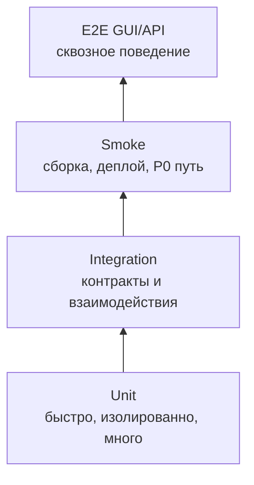

# Модульное тестирование — AIF Handoff: система автономного управления задачами

> **Статус:** рабочий гайд для разработчиков и ИИ-агентов.  
> **Назначение:** описать, как проектировать, писать, ревьюить и запускать модульные тесты для TypeScript-модулей пакетов `@aif/*` (`packages/*/src`) так, чтобы тесты подтверждали требования, давали быструю обратную связь и были пригодны для автоматической генерации.  
> **Методологическая база:** `README.md` (пирамида тестов, матрица качества, измеримость, shift-left), `gates.md` (FG-гейты), `../.ai-factory/references/software-requirements-wiegers-beatty.md` (Validation: testing the requirements, acceptance criteria, traceability), функции HF1–HF12 (`vision.md`), UC (`use-cases/`), BR (`business-rules/`). На дату актуализации unit-тесты ведутся во всех пакетах (`packages/*/src/__tests__/*.test.ts(x)`, Vitest) — гайд задаёт правила их поддержки и расширения.

---

## 1. Место unit-тестов в стратегии качества

Модульный тест проверяет **единицу кода в изоляции**: функцию, класс, use case или модуль без реальной сети, внешних провайдеров, продуктивной БД, реального времени и браузерного окружения.



| Параметр          | Правило проекта                                                                                                                                                                                                                                           |
| ----------------- | --------------------------------------------------------------------------------------------------------------------------------------------------------------------------------------------------------------------------------------------------------- |
| Основная база     | Функции HF1–HF12 и ограничения `vision.md` §2.6, `business-rules/` (`BR-*`), UC `use-cases/`; `fun-req/` (`REQ-FR-*`), `nonfun-req/` (`REQ-NFR-*`)                                                                                                        |
| Объект            | TypeScript-модули пакетов `@aif/shared`, `@aif/runtime`, `@aif/data`, `@aif/api`, `@aif/web`, `@aif/agent`, `@aif/mcp` (файлы `packages/*/src/`)                                                                                                          |
| Среда             | Локально у разработчика/агента (нативно, без Docker) и в CI (GitHub Actions `tests.yml`); в итеративном цикле агента — быстрый fail-fast гейт `make gate-fast`, полный прогон — `make test`                                                               |
| Команда-гейт      | Затронутый пакет: `npm run test --workspace=@aif/<пакет>` (Vitest); быстрый агентский цикл — `npx vitest run --no-coverage` (`make test-fast`); полный прогон с покрытием — `make coverage` (turbo `coverage --concurrency=1`); в CI — `npm run coverage` |
| Время             | Секунды–минуты; unit-набор не должен требовать стенда                                                                                                                                                                                                     |
| Выходной критерий | Тесты детерминированно проходят, проверяют критерии приёмки и не являются always-pass/пустыми; покрытие пакета ≥ 70% (lines/functions/branches/statements)                                                                                                |

Unit-тесты — первый обязательный гейт реализации требования (HF/UC/BR; FR — `REQ-FR-*` из каталога `fun-req/`). По `gates.md`: задача от агента или разработчика не считается принятой, если не проходят `FG-BUILD` и `FG-UNIT`.

---

## 2. Цели unit-тестирования

Unit-тест должен отвечать на один или несколько вопросов:

1. **Требование реализовано?** Критерий приёмки требования (HF/UC/BR; критерии приёмки `vision.md` §1.4) выражен проверкой.
2. **Граничные случаи корректны?** Пустые значения, минимумы/максимумы, дубликаты, неверные статусы, повреждённые payload, таймауты.
3. **Ошибки обрабатываются явно?** Неверный ключ, невалидный JSON, недоступный репозиторий, неожиданный HTTP-статус, ошибка записи.
4. **Поведение детерминированно?** Сортировка стабильна, ID воспроизводимы, результат не зависит от порядка ключей объекта, времени или внешней среды.
5. **Регрессия будет поймана?** Если изменить существенную строку бизнес-логики, тест должен упасть.
6. **Тест написан до кода?** Где только возможно, работа идёт по TDD: тест (red) → реализация (green) → рефакторинг. Красный тест до реализации — прямое доказательство, что тест проверяет поведение, а не дублирует реализацию (раздел 14.3).

По W&B тесты — альтернативное представление требований. Если требование нельзя объективно проверить unit-тестом или другим уровнем тестирования, это дефект требования: непроверяемость, неоднозначность или неполнота.

---

## 3. Что покрывать в первую очередь

### 3.1. Приоритеты

| Приоритет | Что обязательно покрывать unit-тестами                                                                                                                                                                                                                                 |
| --------- | ---------------------------------------------------------------------------------------------------------------------------------------------------------------------------------------------------------------------------------------------------------------------- |
| P0        | Критичный путь конвейера: автомат переходов стадий (`stateMachine.ts`), транзакционные переходы и владение/handoff (`taskTransitions.ts`, `taskOwnership.ts`), иммутабельный аудит, аутентификация/CSRF, runtime-лимиты, резолюция runtime-профилей, изоляция worktree |
| P1        | Бизнес-логика лимитов и usage, маппинг view-моделей, координатор и субагенты (без реальных провайдеров), REST/WS-обработчики, MCP-инструменты, хуки и компоненты React                                                                                                 |
| P2        | Локальная логика без высокой критичности, если тест дешёвый или предотвращает известную регрессию                                                                                                                                                                      |

### 3.2. Объекты в текущем коде

| Пакет          | Что тестировать unit-уровнем                                                                                                                                                                                                                                                                                                          | Примеры областей                                                                                                                                                                      |
| -------------- | ------------------------------------------------------------------------------------------------------------------------------------------------------------------------------------------------------------------------------------------------------------------------------------------------------------------------------------- | ------------------------------------------------------------------------------------------------------------------------------------------------------------------------------------- |
| `@aif/shared`  | автомат стадий задачи и допустимые переходы, task lifecycle (single coordinator topology), `runtimeLimitGate` (pure, env-driven), `plannerDefaults` (mode-driven), `presenters` (row → view-model), `env` (валидация), константы, `withTimeout`                                                                                       | `stateMachine`, `taskLifecycle`, `runtimeLimitGate`, `plannerDefaults`, `presenters`, `env`                                                                                           |
| `@aif/data`    | репозитории и транзакции: переходы стадий, владение/handoff (атомарность), аудит (immutable-записи), участники и admin-инварианты, auth-сессии, tasks/projects/chat, runtime-профили и лимиты, codex-index, usage (агрегация), migrations (append-only) — через `createTestDb` (in-memory SQLite)                                     | `taskTransitions`, `taskOwnership`, `audit`, `participants`, `authSessions`, `tasks`, `projects`, `settings`, `chat`, `runtimeProfiles`, `runtimeLimits`, `codexIndex`, `usage`, `db` |
| `@aif/runtime` | реестр адаптеров (`registry`), резолюция профилей (task → project → system → env fallback), категоризация ошибок (`errors`, без string-matching), model-discovery с кэшем, промпт-политики, workflow spec, адаптеры через контракт `RuntimeAdapter` (мок транспорта)                                                                  | `registry`, `resolution`, `errors`, `capabilities`, `modelDiscovery`, `flowControl`, `adapters/*`                                                                                     |
| `@aif/api`     | use-cases (create/update/handoff/delete/taskEvents/qaRun/commitGeneration), правовая проверка `taskPolicy`, middleware (logger/rateLimit/zod), маршруты (валидация, статусы, ошибки — без реального сервера через Hono app in-memory), сервисы (runtime, codexIndex, fastFix, roadmapGeneration)                                      | `use-cases/*`, `middleware/*`, `routes/*`, `services/*`, `schemas`                                                                                                                    |
| `@aif/agent`   | координатор и poll-логика (без реального node-cron — через детерминированные триггеры), субагенты (planner/implementer/verifier/reviewer — чистая логика промптов и обработки результата), git-воркфлоу (GitHub/GitLab — через мок REST-клиента), worktree lifecycle, гейты ревью (`reviewGate`), стейдж-аборты, категоризация ошибок | `coordinator`, `pollScheduler`, `subagents/*`, `gitConventions`, `githubWorkflow`, `gitlabWorkflow`, `worktreeLifecycle`, `reviewGate`, `stageAbort`, `errorClassifier`               |
| `@aif/web`     | утилиты (`lib/utils`), api-клиент (через mock fetch), хуки (useTasks/useProjects/useWebSocket/useRuntimeProfiles), компоненты (Kanban, TaskCard, TaskDetail, диалоги, ui-примитивы) — через @testing-library/react + jsdom                                                                                                            | `lib/*`, `hooks/*`, `components/*`                                                                                                                                                    |
| `@aif/mcp`     | инструменты `handoff_*` (createTask/getTask/listTasks/searchTasks/updateTask/pushPlan/annotatePlan/syncStatus), middleware (errorHandler/rateLimit), транспорты/окружение                                                                                                                                                             | `tools/*`, `middleware/*`, `utils/*`, `env`                                                                                                                                           |

Реальная сеть, реальный AI-провайдер, реальный VCS, браузер и интерактивная сессия — не unit, а integration/E2E (`integration.md`, `e2e-api-testing.md`, `e2e-gui-testing.md`).

### 3.3. Критичные классы дефектов

Обязательные негативные и граничные проверки для проекта:

- недопустимый переход стадии задачи (нарушение автомата, повторный переход, переход из неверного состояния);
- конфликт владения при handoff (параллельные изменения, смена исполнителя), нарушение executor-history;
- превышение runtime-лимита — блокировка/авто-пауза задачи (`runtimeLimitGate`, `runtimeLimits`);
- повреждённый/невалидный payload (zod-валидация маршрутов, MCP-инструментов, web-форм);
- обрыв WebSocket, реконнект, потерянные события (broadcast);
- ошибка/таймаут адаптера runtime, недоступный провайдер, fallback между адаптерами, категоризация без string-matching;
- rate-limit VCS (GitHub/GitLab), повторные ревью-события (идемпотентность);
- границы: пустые значения, дубликаты, длинные строки, неверные ID, истёкшие TTL/сессии;
- security-ограничения: отсутствие секретов (токенов, паролей) в логах и аудите, session+CSRF, изоляция задач по участникам (`BR-constraint.auth.task-isolation`), иммутабельность аудита;
- миграции БД: append-only, корректный `PRAGMA user_version`, идемпотентность восстановления.

---

## 4. Источники правды перед написанием теста

Источник правды для unit-теста — **требования и контракты**, а не реализация. Перед генерацией unit-теста человек или ИИ-агент должен прочитать минимальный набор источников:

1. **Требование** — функция HF1–HF12 и критерии приёмки/ограничения `vision.md` (§1.4, §2.6), `business-rules/` (`BR-*`), UC `use-cases/`; `fun-req/` (`REQ-FR-*`), `nonfun-req/` (`REQ-NFR-*`).
2. **Контракт**, если тестируется mapper/handler payload: `docs/contracts/` (`contract-aif-runtime`, `contract-aif-rest-api`, `contract-aif-ws`, `contract-aif-data`) — типы и схемы.
3. **Существующие `__tests__/*.test.ts` рядом** — стиль, naming, helpers, fake-объекты.
4. **Архитектурный контекст**, если тест влияет на границы пакетов: `docs/c4/`, `docs/architecture.md` (clean architecture, lint-guard границы БД).

Код тестируемого пакета читается только для понимания реализации и API; он **не является источником правды**: реализация может отставать от требований или содержать дефекты, которые тест должен ловить, а не закреплять.

Правило для ИИ-агента: **не выдумывать бизнес-логику**. Если в требованиях и контрактах не указано, как обрабатывать случай, тест должен либо фиксировать текущее очевидное поведение, либо создать вопрос в ревью/плане, а не навязывать новое правило.

---

## 5. Как выбирать тесты из требований

### 5.1. Алгоритм трассировки FR → unit-тест

1. Найти требование (функцию HF1–HF12, UC или `BR-*`), которое реализуется изменением.
2. Выписать критерии приёмки как бинарные утверждения: «при X система возвращает Y», «при Z возвращает ошибку E».
3. Разделить проверки по уровням:
   - чистая доменная логика, mapper, validator, state machine → unit;
   - несколько реальных компонентов/процессов → integration;
   - полный пользовательский/API путь → E2E.
4. Для unit-части определить минимальную единицу кода и её зависимости.
5. Заменить зависимости на fake/mock/stub (`vi.mock`, фабрики fakes).
6. Добавить позитивный, негативный и граничный сценарии.
7. Добавить комментарий трассировки в формате `// HF<N>/UC-<ID>/BR-<ID>: <описание>` (один ID на строку, раздел 6.6). Если тест покрывает дефект без отдельного требования, указать ID дефекта/регрессии и связанное требование при наличии.

### 5.2. Шаблон декомпозиции критерия

```text
Требование: функция/UC/BR (для FR — REQ-FR-<domain>.<area>.<action> из каталога `fun-req/`)
Критерий: <объективно проверяемое утверждение>

Unit-тесты:
- happy path: <валидный вход> → <ожидаемый результат>
- negative: <невалидный вход/ошибка зависимости> → <ожидаемая ошибка>
- boundary: <пусто/min/max/дубликат/истёкший TTL> → <ожидаемый результат>
- regression: <известный дефект> → <не повторяется>

Не unit:
- integration: <контракт/каскад>
- E2E: <сквозной путь>
```

### 5.3. Пример

```text
Требование: автоматический переход стадии только после прохождения гейта (UC-pipeline.stage.auto-advance-task; BR-constraint.task-lifecycle.transitions).

Unit:
- при выполнении условий гейта стадия меняется на ожидаемую (например, Verify → Review);
- при нарушении инварианта (недопустимый переход) возвращается структурированная ошибка категории;
- повторный переход из той же стадии идемпотентен или отклоняется с кодом.

Integration:
- переход фиксируется в иммутабельном аудите и рассылается через WebSocket broadcast.

E2E API:
- пользователь видит новую стадию и событие в реальном времени.
```

---

## 6. Конвенции тестов (Vitest/TypeScript)

### 6.1. Расположение и package

- Файл теста: `packages/<pkg>/src/__tests__/<module>.test.ts`, для React-компонентов — `<Component>.test.tsx` в том же каталоге `__tests__` (факт репозитория).
- React-компоненты тестируются через `@testing-library/react` + jsdom (environment jsdom, `setupFiles` — `src/__tests__/setup.ts`), см. `packages/web/vitest.config.ts`.
- Для пакетов `api`/`runtime`/`data`/`agent`/`shared`/`mcp` используется node-среда; параметры порогов и exclude — в `vitest.config.ts` каждого пакета (порог 70%, exclude `dist`/`node_modules`/`e2e`).
- Сгенерированный код и транзитные реэкспорты напрямую unit-тестами не покрываются; тестируются функции и модули вокруг сетей/транспортов.

### 6.2. Naming

Использовать понятные имена в стиле текущего кода:

```ts
describe("taskLifecycle", () => {
  it("распознаёт допустимый переход", () => {});
});

describe("TaskCard", () => {
  it("отображает статус и приоритет", () => {});
});

it("отклоняет недопустимый переход стадии", () => {});
```

Рекомендуемый формат:

```text
<Subject> — <ExpectedBehavior>
<Subject> — <Condition> — <ExpectedBehavior>
```

Хорошее имя теста должно отвечать на вопрос «какое поведение сломалось?» без чтения всего тела.

### 6.3. Структура Arrange / Act / Assert

```ts
describe("useCase.createTask", () => {
  it("создаёт задачу в статусе Backlog", async () => {
    // arrange
    const repo = new InMemoryTaskRepo();
    const uc = new CreateTaskUseCase(repo);

    // act
    const task = await uc.execute({ title: "Задача" });

    // assert
    expect(task.status).toBe("Backlog");
    expect(task.id).toBeDefined();
  });
});
```

Комментарии `arrange/act/assert` не обязательны. Добавляйте их только если тест сложный.

### 6.4. Table-driven tests

Для наборов входов/выходов использовать `it.each` / `test.each`:

```ts
describe("runtimeLimitGate.shouldPause", () => {
  it.each([
    { name: "лимит исчерпан — пауза", used: 100, limit: 100, want: true },
    { name: "лимит не исчерпан — без паузы", used: 50, limit: 100, want: false },
    { name: "лимит не задан — без паузы", used: 10, limit: null, want: false },
  ])("$name", ({ used, limit, want }) => {
    expect(shouldPause({ used, limit })).toBe(want);
  });
});
```

Правила:

- `name` обязателен и описывает бизнес-смысл кейса.
- В таблице должны быть не только happy path, но и invalid/boundary cases.

### 6.5. Проверки ошибок

Ошибки проверяются как часть контракта поведения:

```ts
it("отклоняет недопустимый переход с категорией ошибки", async () => {
  const result = await transition({ from: "Done", to: "Backlog" });
  expect(result.ok).toBe(false);
  expect(result.error.category).toBe(RuntimeErrorCategory.BAD_TRANSITION);
});
```

Правила проекта (структурированные ошибки, без string-matching):

- проверять **поля ошибки** (`category`, `adapterCode`, `httpStatus`, `code`), а не текст сообщения;
- для ранних выходов использовать `expect(...).rejects.toThrow(...)` только при тестировании контракта исключений;
- фрагмент сообщения — только если другого контракта нет.

Не проверять полный текст ошибки, если он не является пользовательским или контрактным сообщением: это делает тест хрупким (правило проекта — классификация только через структурированные поля).

### 6.6. Комментарий трассировки

Каждый unit-тест или логическая группа table-driven subtest должна содержать комментарий трассировки в формате `// HF<N>/UC-<ID>/BR-<ID>: <описание>` (для FR — из каталога `fun-req/`: `// REQ-FR-<ID>: <описание>`), где `<описание>` — кратко, какое правило проверяется.

```ts
// HF1.1: задача автоматически переходит на следующую стадию после гейта.
// BR-constraint.task-lifecycle.transitions: недопустимый переход запрещён.
it("переводит задачу Verify → Review после прохождения гейта", () => {
  // ...
});
```

Правила формата:

- **Один ID на строку** — комментарий содержит ровно один идентификатор требования (HF/UC/BR) или бизнес-правила и описание после двоеточия. Если тест покрывает несколько требований, добавляется несколько строк.
- **ID должен существовать** в `vision.md`, `use-cases/` или `business-rules/` (для FR — в `fun-req/`). Несуществующий или изменённый ID — дефект трассировки, который должен ловить гейт `FG-TRACE`.
- Если тест фиксирует регрессию, но связанного требования пока нет, указать ID дефекта и ближайший `HF/UC/BR`; отсутствие связанного требования — повод вынести вопрос в ревью.

Формат обязателен, потому что он делает трассировку машинно-проверяемой: гейт `FG-TRACE` (раздел 6.7) сверяет ID в комментариях с реестром требований и подтверждает двустороннюю связь требование ↔ тест.

### 6.7. Связь с гейтом качества тестов (FG-TEST-QUALITY)

Гайд реализует требования гейта качества тестов `FG-TEST-QUALITY` из `gates.md` (проверка: детерминизм, отсутствие тривиальных/always-pass/пустых тестов и `it.skip`-заглушек, наличие реальных проверок и негативных сценариев). Соответствие проверяется на ревью и планируется в CI.

| Требование гейта `FG-TEST-QUALITY`                                                | Где в гайде                                                                      |
| --------------------------------------------------------------------------------- | -------------------------------------------------------------------------------- |
| Детерминизм, отсутствие «флаки»                                                   | раздел 10 (детерминированность и anti-flake), раздел 11 (параллельность и гонки) |
| Нет тривиальных / always-pass / пустых тестов, `it.skip`/`describe.skip`-заглушек | раздел 9.1 (реальные проверки), раздел 20 (что не надо делать)                   |
| Реальные проверки (assert), а не «выполнилось без ошибки»                         | раздел 9 (качество assertions)                                                   |
| Наличие негативных сценариев                                                      | раздел 3.3 (критичные классы дефектов), разделы 8.x (по пакетам)                 |
| Тест должен падать при поломке логики (убивать мутацию)                           | раздел 13 (мутационное тестирование)                                             |
| Двусторонняя трассировка FR ↔ тест, нет «сиротских» тестов                        | раздел 6.6 (комментарий трассировки) → гейт `FG-TRACE`                           |
| Критерии приёмки покрыты автоматическим тестом                                    | раздел 5 (выбор тестов из требований) → гейт `FG-TEST`                           |

Связка гейтов: `FG-TEST` (критерии приёмки покрыты) → `FG-TRACE` (требование ↔ тест, комментарий формата `// HF<N>/UC-<ID>/BR-<ID>: ...`) → `FG-TEST-QUALITY` (качество самих тестов) → `FG-MUTATION` (тест убивает мутации в критичных пакетах).

### 6.8. Helpers

Повторяющуюся подготовку выносить в helpers и фабрики:

```ts
function setupTestDb() {
  return createTestDb(); // in-memory SQLite через @aif/data/db
}

function createFakeRuntimeAdapter(overrides: Partial<RuntimeAdapter> = {}): RuntimeAdapter {
  return {
    run: vi.fn().mockResolvedValue({ ok: true }),
    listModels: vi.fn().mockResolvedValue([]),
    ...overrides,
  };
}
```

---

## 7. Изоляция зависимостей

### 7.1. Что нельзя использовать в unit-тесте

Unit-тест не должен зависеть от:

- реального AI-провайдера (Claude Agent SDK, Codex, OpenRouter) и реального HTTP к ним;
- реального GitHub/GitLab API и сети;
- настоящего времени без возможности управления (fake timers);
- абсолютных путей разработчика или CI;
- порядка выполнения тестов;
- состояния уже запущенных процессов (dev-серверы, БД);
- продуктивных секретов: токенов, паролей, `MCP_AUTH_TOKEN`, сессионных ключей;
- браузерного движка (кроме jsdom для web-компонентов) — реальный браузер это E2E GUI.

Если нужна реальная сеть, реальный провайдер, VCS, браузер, VM или системный сервис — это уже integration/smoke/E2E, а не unit.

Исключение: `createTestDb` (in-memory SQLite) на unit-уровне допустимо для репозиториев `@aif/data` — это in-process, без внешних сервисов (см. `packages/data/src/db.ts`, subpath `@aif/data/db`).

### 7.2. Fake, stub, mock: когда что использовать

| Тип  | Когда применять                                        | Пример                                                                    |
| ---- | ------------------------------------------------------ | ------------------------------------------------------------------------- |
| Fake | Простая in-memory реализация интерфейса с состоянием   | `InMemoryTaskRepo`, fake-адаптер runtime с предсказуемым `run()`          |
| Stub | Возвращает заранее заданный ответ, состояния почти нет | stub VCS-клиента с фиксированным PR/MR-ответом                            |
| Mock | Проверяет ожидания вызовов интерфейса                  | `vi.fn()` + `expect(mock).toHaveBeenCalledWith(...)` для HTTP/WS-клиентов |
| Spy  | Запоминает вызовы для последующей проверки             | logger hook, подписчик событий WebSocket, callback usage-sink             |

Правило проекта (из `README.md` §4.1): моки и заглушки — по интерфейсам (`RuntimeAdapter`, репозитории `@aif/data`, HTTP/VCS-клиенты) через `vi.mock`/фабрики fakes; без реального транспорта.

### 7.3. Интерфейсы для тестируемости

Если код невозможно протестировать без сети/времени/ФС, выделите зависимость в интерфейс/тип:

```ts
export interface Clock {
  now(): Date;
}

export interface TokenStore {
  save(token: Token): Promise<void>;
  load(): Promise<Token | null>;
}
```

Не нужно создавать интерфейс «на всякий случай». Выделяйте его, когда есть реальная внешняя зависимость или несколько реализаций.

### 7.4. Время

Не использовать `new Date()`/`setTimeout` напрямую в бизнес-логике, если поведение зависит от времени. Для TTL, retry, deadline и expiration вводить clock/timer abstraction или использовать fake timers (`vi.useFakeTimers()`).

Плохо:

```ts
await new Promise((r) => setTimeout(r, 2000));
```

Лучше (fake timers):

```ts
vi.useFakeTimers();

// ...выполнить действие...

await vi.advanceTimersByTimeAsync(10_000);
expect(spy).toHaveBeenCalledTimes(1);

vi.useRealTimers();
```

### 7.5. Файловая система

Для временных файлов использовать `os.tmpdir()` + уникальный префикс или in-memory варианты. Не писать в рабочую директорию репозитория и системные пути (известный флейк: запись в глобальный git config в `ai:validate` — `docs/known-issues.md`).

### 7.6. Переменные окружения

Использовать `vi.stubEnv` / `vi.unstubAllEnvs` (или ручное сохранение/восстановление):

```ts
vi.stubEnv("LOG_LEVEL", "debug");
const result = parseEnv();
expect(result.logLevel).toBe("debug");
vi.unstubAllEnvs();
```

Не менять глобальное окружение без автоматического восстановления.

---

## 8. Специфика по пакетам системы

> Система — модульный монолит из семи пакетов; lint-guard границы БД: `api`/`agent`/`runtime` читают и пишут БД только через `@aif/data`. Unit-тесты пишутся по модулям пакетов; внешние системы (провайдеры, VCS, MCP-клиенты) в unit-тестах не используются — только их интерфейсы и контракты.

### 8.1. `@aif/shared` — автомат стадий и общая логика (HF1, HF5; BR task-lifecycle)

Unit-проверки:

- `stateMachine.ts`: допустимые и недопустимые переходы стадий (Backlog → Planning → Improve → Plan Review → Implementing → Verify → Review → Done → Accepted; `blocked_external`, ручные переходы, auto-queue), идемпотентность;
- `taskLifecycle.ts`: single coordinator topology (from/inProgress/onSuccess) — корректные каскады;
- `runtimeLimitGate.ts`: решение «пауза/продолжить» по использованию и лимиту (pure, env-driven) — табличные тесты;
- `plannerDefaults.ts`: defaultsForMode (skills-mode флаги: `useSubagents=false` → Improve/Verify вставки);
- `presenters.ts`: row → view-model маппинг (статус, гейты, ownership, прогресс), границы (null-поля, длинные строки);
- `env.ts`/`loadEnv.ts`: валидация обязательных/опциональных переменных, дефолты, ошибки при невалидных значениях;
- `constants.ts`, `withTimeout.ts`, `pathValidation.ts`, `planPath.ts`, `taskExecutionRoot.ts`.

Обязательные negative cases:

- недопустимый переход (например, Verify → Backlog без ручного оверрайда) — категоризированная ошибка;
- `withTimeout` — завершение по таймауту и отмена по AbortSignal;
- env — отсутствие обязательной переменной возвращает понятную ошибку, а не throw с текстом.

### 8.2. `@aif/data` — репозитории, транзакции, аудит (HF1/HF7/HF10; BR ownership/audit)

Unit-проверки (все — через `createTestDb`, in-memory SQLite):

- `taskTransitions.ts`: атомарные переходы с валидацией актора (`actorId`), конфликт параллельных переходов и защита (транзакция/версия), запись в аудит;
- `taskOwnership.ts`: атомарный handoff (assignee/executor), проверка прав (админ/владелец/участник), история исполнителей, запрет невалидной смены;
- `audit.ts`: иммутабельные записи, actor identity, state snapshot, батчинг activity log;
- `participants.ts`: жизненный цикл участников, admin-инварианты (нельзя удалить последнего админа и т.п.);
- `authSessions.ts`: создание/продление/аннулирование сессий, CSRF-токен, хеширование паролей (scrypt);
- `tasks.ts`/`projects.ts`/`chat.ts`/`runtimeProfiles.ts`/`runtimeLimits.ts`/`codexIndex.ts`/`usage.ts`: CRUD и лимитные сценарии, агрегаты usage;
- `db.ts`: миграции append-only, `PRAGMA user_version`, идемпотентность повторного применения (isIgnorableMigrationError).

Обязательные negative cases:

- переход с неверным актором или без прав — отказ, запись в аудит отсутствует;
- handoff при гонке — ровно один победитель;
- превышение лимита — блокирующая запись, повтор после reset-времени;
- дублирующая запись usage — атомарное приращение без потерь.

### 8.3. `@aif/runtime` — реестр, резолюция, ошибки, адаптеры (HF3; contract-aif-runtime)

Unit-проверки:

- `registry.ts`: регистрация/поиск адаптеров, дубликаты, неизвестный runtime;
- `resolution.ts`: резолюция профиля task → project → system → env (fallback-цепочка), missing/частичная конфигурация;
- `errors.ts`: классификация через структурированные поля (`category`, `adapterCode`, `httpStatus`) — **без string-matching по сообщению** (правило проекта), иерархия ошибок;
- `capabilities.ts`/`workflowSpec.ts`/`promptPolicy.ts`: assertion перед выполнением, выбор workflow, fallback на slash-команду;
- `bootstrap.ts`: регистрация встроенных адаптеров (claude/codex/opencode/openrouter);
- `modelDiscovery.ts`: список моделей + валидация соединения, кэш и TTL;
- адаптеры: контрактные unit-тесты вокруг публичного API адаптера с моком транспорта (SDK/CLI/HTTP), таймауты (`timeouts.ts`), trust-токен (`trust.ts`), `flowControl`/`usageSink`.

Обязательные negative cases:

- недоступный провайдер → категоризация (timeout/connection/rate-limit), fallback на другой адаптер;
- лимит/usage — отказ до выполнения и корректное приращение после;
- невалидный/частично определённый профиль → дефолты системы, а не NaN/undefined;
- таймаут без превышения бюджета по умолчанию (спец. кейс: explicit per-call timeout и AbortSignal, `docs/known-issues.md` контекст).

### 8.4. `@aif/api` — use-cases, middleware, маршруты (HF2/HF7/HF8/HF9; contract-aif-rest-api/ws)

Unit-проверки:

- `use-cases/*`: createTask/updateTask/handoffTask/deleteTask/taskEvents (applyTaskEvent)/qaRun/taskPlan/commitGeneration/runChatTurn (порты WS инжектятся)/taskPolicy (canMutateTask) — через fake-репозитории, без реального сервера;
- `middleware/*`: logger (маркеры `[FIX]`/`[FIX:*]` не попадают в production-логи), rateLimit (пороги, burst), zodValidator (400/422 на невалидных телах);
- `routes/*`: обработчики на Hono app in-memory (без реального слушателя): статусы, ошибки, сериализация ответов;
- `services/*`: runtime (выбор адаптера), codexIndex, fastFix, roadmapGeneration, commitGeneration — с fakes;
- `schemas.ts`: валидация запросов, границы (пустые/длинные/неверные типы).

Обязательные negative cases:

- невалидное тело → 4xx с понятным сообщением (минимум полей без утечки деталей);
- отсутствие сессии/CSRF → 401/403;
- лимит rate-limit → 429, burst-разрешён в рамках лимита;
- конфликт handoff/перехода → структурированная ошибка, состояние не изменено.

### 8.5. `@aif/agent` — координатор, субагенты, VCS, worktree (HF1/HF4/HF5/HF11; contract-aif-scheduler/github/gitlab/worktree)

Unit-проверки:

- `coordinator.ts`/`pollScheduler.ts`: выбор задач, готовых к переходу; двойной триггер (cron + wake); single-flight/дебаунс; обработка задач с недоступным адаптером (ретраи, эскалация); без реального node-cron — детерминированные триггеры;
- `subagents/*` (planner/improver/implementer/verifier/reviewer): построение промпта, парсинг результата, обработка ошибок, лимиты итераций — через fake-адаптер;
- `gitConventions.ts`: резолвер ветки/коммита (branch/commit conventions), границы (длина, запрещённые символы);
- `githubWorkflow.ts`/`gitlabWorkflow.ts`: публикация PR/MR, синхронизация Issues, CI-статусы — через мок REST-клиента; идемпотентность ревью-решений;
- `worktreeLifecycle.ts`/`worktreeReconcile.ts`: создание/очистка worktree, stash-before-remove, реконсиляция БД ↔ ФС, stale-регистрации;
- `reviewGate.ts`/`reviewContract.ts`: гейт на lightModel, конвергенция ревью-цикла, условия остановки/эскалации;
- `stageAbort.ts`/`stageErrorHandler.ts`/`errorClassifier.ts`/`loopGuard.ts`: аборт после старта работы (cleanup счётчиков/локов), классификация, защита от бесконечных циклов;
- `autoQueueCommit.ts`/`planReviewCommit.ts`/`planReviewPublisher.ts`: правила коммитов (ожидание git-готовности, plan-only коммит, publisher).

Обязательные negative cases:

- сбой адаптера ПОСЛЕ старта задачи — cleanup лимитов/локов и прогресс последующих задач на следующем опросе (правило concurrency-покрытия из skill-context `aif-qa`);
- конфликт ветки/commit-конвенции — отказ до git-операции;
- rate-limit VCS — ретраи с backoff, идемпотентность;
- повторный poll без новых задач — no-op без побочных эффектов.

### 8.6. `@aif/web` — компоненты и хуки React (HF2/HF7/HF8/HF9; GUI-канал)

Unit-проверки (jsdom + @testing-library/react):

- `lib/utils.ts`, `lib/api.ts` (api-клиент через mock fetch), `lib/notifications.ts`, storage/attachment-утилиты;
- hooks: `useTasks`, `useProjects`, `useWebSocket` (подключение, реконнект, auth), `useRuntimeProfiles`, `useChat`, `useKeyboardShortcut`, `useEditMode`;
- компоненты Kanban: `Board`, `Column`, `TaskCard`, `AddTaskForm` (создание, валидация формы, drag&drop-состояние);
- детали задачи: `TaskDetail`, ownership/handoff (диалог передачи), `ExecutorTimeline`, комментарии, план, логи;
- диалоги: `ParticipantManagementDialog`, `ProjectRuntimeSettings`, `RuntimeProfileForm`, `GlobalSettingsDialog`, `WarmupDialog`;
- ui-примитивы (`components/ui/*`): Badge, Button, Dialog, DropdownMenu, Select, Tabs, Tooltip и т.д. (по списку `__tests__`).

Правила (skill-context `aif-qa`):

- упорядоченные состояния проверять через разрешение обоих DOM-элементов и сравнение позиций (не `textContent.indexOf`);
- scroll-цепочки — только через реальное нативное колесо (`page.mouse.wheel`) в E2E, не синтетические события;
- гонки «late-response» для асинхронных мутаций (два ответа, второй меняет порядок) — отдельные кейсы;
- пользовательские значения, совпадающие с встроенными ключами (например, `Pinned`/`Other`) — в таблицах коллизий.

### 8.7. `@aif/mcp` — инструменты handoff\_\* и middleware (HF2/HF7; contract MCP)

Unit-проверки:

- `tools/*`: createTask/getTask/listTasks/searchTasks/updateTask/pushPlan/annotatePlan/syncStatus/runtimeTaskMetadata — валидация входных JSON-schema, формат ответа, обработка ошибок (через fake-репозиторий);
- `middleware/*`: errorHandler (структурированный JSON-RPC error, `code`/`category`), rateLimit (порядок, burst);
- `server.ts`/`env.ts`/`stdioEnv.ts`: выбор транспорта (stdio/HTTP), порты, Bearer-токен (`MCP_AUTH_TOKEN`), multi-session флаг (`AIF_MCP_HTTP_MULTI_SESSION_ENABLED`);
- `sync/*`: конфликты и их разрешение при двусторонней синхронизации.

Обязательные negative cases:

- неизвестный инструмент/метод → JSON-RPC error с кодом (например, `-32601`);
- невалидный аргумент → `-32602`; пустой поисковый запрос → пустой результат, а не throw;
- HTTP без Bearer → 401 (`code: "mcp_authentication_required"`); второй клиент в single-session → `-32600`.

---

## 9. Качество assertions

### 9.1. Тест должен иметь реальную проверку

Плохо:

```ts
it("создаёт задачу", async () => {
  await createTask({ title: "x" });
});
```

Хорошо:

```ts
it("создаёт задачу в статусе Backlog", async () => {
  const task = await createTask({ title: "x" });
  expect(task).toMatchObject({ title: "x", status: "Backlog" });
  expect(task.id).toBeTruthy();
});
```

### 9.2. `expect` против нескольких проверок

- Ранний выход (fail-fast) — когда дальнейшие проверки невозможны: `expect(...).toBe(...)` до продолжения; для асинхронных — `await expect(promise).rejects.toThrow(...)`.
- Несколько независимых расхождений — собрать в одном `expect`-блоке несколько утверждений (Vitest продолжает выполнение) или отсортировать по значимости.

### 9.3. Сравнение структур

- Для объектов целиком: `expect(actual).toEqual(expected)` (глубокое сравнение) или `toMatchObject`/`toMatchSnapshot` где уместно.
- Для выборочных полей: `toMatchObject` + явные точечные проверки.
- Не переусердствовать с точными временными метками и авто-генерируемыми ID: проверять наличие/формат, а не конкретное значение.

Не добавлять новую тестовую библиотеку без необходимости (Vitest + jest-dom уже в проекте).

---

## 10. Детерминированность и anti-flake

Unit-тест должен давать одинаковый результат на локальной машине, в CI и при повторном запуске.

### 10.1. Таксономия причин флаки

| Категория           | Типичная причина                                       | Пример в проекте                                              |
| ------------------- | ------------------------------------------------------ | ------------------------------------------------------------- |
| Тайминги            | реальные `setTimeout`/таймауты вместо ожидания события | ожидание WS-события, TTL сессии, retry-интервалы адаптеров    |
| Гонки               | общее mutable-состояние, порядок асинхронных операций  | общий `runtimeRegistry` (singleton), кэши, порядок промисов   |
| Порядок             | зависимость от порядка запуска тестов                  | разделяемые файлы/порты/глобальный git config между тестами   |
| Внешние зависимости | реальная сеть/сервисы в пути                           | реальный AI-провайдер, VCS, MCP в unit-тесте                  |
| Окружение           | загрузка CI, платформенные различия                    | таймауты под нагрузкой, Windows-специфика (`known-issues.md`) |
| Слабые assertions   | проверка полного текста ошибки, «не упало»             | `String(err).includes(...)`, отсутствие assert после вызова   |

### 10.2. Чек-лист anti-flake

- [ ] Нет зависимости от реального времени без fake timers/deadline.
- [ ] Нет `setTimeout`/`sleep` как ожидания события; асинхронные переходы ожидаются через promise/событие.
- [ ] Нет реальной сети и внешних сервисов.
- [ ] Нет зависимости от порядка ключей объекта/асинхронных операций.
- [ ] Временные файлы — в `os.tmpdir()`/in-memory; не пишется в репозиторий и глобальный git config.
- [ ] Env меняется через `vi.stubEnv` с восстановлением.
- [ ] Тестовые данные фиксированы и не используют production secrets.
- [ ] Тест не зависит от других тестов и порядка запуска.
- [ ] Параллельные тесты не используют общий mutable state.
- [ ] Проверки ошибок устойчивы: `category`/`code`/`httpStatus`/поля, а не случайный текст.

### 10.3. Методы детекции

- повторный прогон: `npx vitest run --repeat=5 --no-coverage` по пакету (или `--retry`) выявляет нестабильность;
- `fileParallelism: false` в `packages/api/vitest.config.ts` и `workers: 1` в Playwright — осознанные ограничения параллелизма там, где тесты делят ресурсы;
- линтеры тестов (eslint-plugin-vitest и др.) — целевое (связка с гейтом `FG-TEST-QUALITY` в CI);
- тест, упавший при неизменном коде хотя бы раз в CI, — кандидат в флаки: зафиксировать и разобрать, а не игнорировать (`docs/known-issues.md`).

### 10.4. Жизненный цикл флаки-теста

Если тест иногда падает — это дефект теста или кода (глоссарий, `flakyTest`):

1. **Завести дефект** с владельцем; приложить лог прогона, команду запуска и окружение.
2. **Карантин**: пометить тест и исключить из гейта — только вместе с зарегистрированным дефектом; «тихий» карантин (`it.skip`/`.only` без дефекта) запрещён.
3. **Устранить корень** по таксономии (10.1), а не симптом: не увеличивать таймаут «для стабилизации».
4. **Верифицировать**: N успешных прогонов подряд (`--repeat=N`, N ≥ 5) локально и в CI.
5. **Вернуть** тест в набор, закрыть дефект.

Повторные прогоны «до зелёного» без анализа причины запрещены.

---

## 11. Параллельность и гонки

CI запускает vitest с workers по умолчанию; для пакетов с разделяемыми ресурсами выключен `fileParallelism` (факт — `packages/api`). Локально для затронутого пакета также прогнать с `--pool=threads`/`--poolOptions`:

```bash
npm run test --workspace=@aif/api
```

Правила:

- Параллельные тесты — только без общего состояния, портов, глобальных env, временных singleton-ов.
- Для `it.each` никаких общих мутабельных объектов между кейсами — создавать данные в теле каждого кейса.
- Глобальные registries и singleton-клиенты (`runtimeRegistry`) сбрасывать через `afterEach`/`beforeEach`.
- Если race-проблема поймана, не отключать тест: исправить синхронизацию или изоляцию.

---

## 12. Покрытие: как использовать метрику

Покрытие — полезная метрика, но не цель сама по себе. Для проекта важнее покрытие **критериев приёмки и рисков**, чем общий процент строк.

Команды:

```bash
npm run coverage            # turbo coverage --concurrency=1 (порог 70% на пакет)
npm run coverage --workspace=@aif/<пакет>
```

Порог покрытия каждого пакета зафиксирован в `vitest.config.ts` (lines/functions/branches/statements ≥ 70%) и enforce-ится в CI — `tests.yml` запускает `npm run coverage` (порог из `gates.md` §6.4, `FG-COVERAGE`).

Правила интерпретации:

- 90% покрытия без негативных сценариев не подтверждает качество.
- Низкое покрытие критичного модуля (автомат стадий, транзакции/handoff, аудит, auth/CSRF, runtime-лимиты) — высокий риск.
- Покрытие транзитных реэкспортов/сгенерированного кода не повышает доверие; фокус на доменной логике и boundary adapters (известный пробел: `schema.ts` 0% в собственном отчёте shared — `docs/known-issues.md`).
- Новый FR P0/P1 должен добавлять тесты на критерии приёмки, даже если общий процент покрытия уже высокий.

---

## 13. Мутационное тестирование для критичных пакетов

`gates.md` вводит целевой гейт `FG-MUTATION`: тесты критичных пакетов должны «убивать» мутации. Это особенно важно для:

- автомата стадий и переходов (`@aif/shared/stateMachine`, `@aif/data/taskTransitions`);
- владения/handoff и аудита (`@aif/data/taskOwnership`, `audit`);
- аутентификации и CSRF (`@aif/data/authSessions`, middleware API);
- runtime-лимитов и резолюции профилей (`@aif/shared/runtimeLimitGate`, `@aif/runtime/resolution`);
- изоляции worktree и git-операций (`@aif/agent/worktreeLifecycle`, `gitConventions`);
- запретов бизнес-правил (`BR-*`).

Практическое правило до внедрения инструмента: при ревью теста задавать вопрос **«какое изменение в коде этот тест поймает?»**. Если убрать важную проверку, поменять знак сравнения, разрешить недопустимый статус или игнорировать ошибку зависимости, тест должен упасть.

Мутационное тестирование — один из слоёв защиты от имитации достижения цели; полный набор механизмов и связь с гейтами — раздел 14.

---

## 14. Защита от имитации достижения цели (анти-фейк)

ИИ-агенты могут «имитировать» выполнение задачи: тест формально есть и проходит, но не проверяет требование, не может упасть или проверяет реализацию, а не критерий приёмки. Защита слоёная; мутационное тестирование (раздел 13) закрывает только один слой — чувствительность.

### 14.1. Векторы имитации

| Вектор                            | Пример                                                    | Механизм обнаружения                                     |
| --------------------------------- | --------------------------------------------------------- | -------------------------------------------------------- |
| Assert-less / always-pass         | `await createTask({ title: "x" })` без проверок           | Ревью (раздел 17), статический анализ, `FG-TEST-QUALITY` |
| Overfit к реализации              | «проверка», что функция вернула то же, что возвращает код | Сверка с требованием/контрактом, fresh-context ревью     |
| Слабый орáкул                     | «не упало» вместо «вернулась ошибка E»                    | Сверка с критерием приёмки, `FG-TEST`                    |
| Тест против неверного фейка       | fake-репозиторий с другим контрактом, чем реальный        | Сверка fake с контрактом, интеграционные тесты           |
| Подгонка кода под тест            | реализация написана так, чтобы тест прошёл                | Fresh-context ревью, контракт как орáкул                 |
| Удаление/ослабление старых тестов | деградация регрессионного набора                          | Ревью diff, `FG-REGRESSION`, CI                          |
| Заявление вместо артефакта        | «тесты прошли» без логов и отчёта                         | DoD: артефакты прогона обязательны (раздел 14.4)         |
| Неоднозначное требование          | «быстро»/«надёжно» → любая реализация легальна            | Проверяемость требований (W&B, `G1-METRIC`)              |

### 14.2. Слои защиты

| Слой                | Что закрывает                                        | Механизм                                                 | Гейт                         |
| ------------------- | ---------------------------------------------------- | -------------------------------------------------------- | ---------------------------- |
| 1. Требование       | Неоднозначность/непроверяемость — легальная имитация | Verifiable + unambiguous (W&B), `G1-METRIC`              | Ревью набора требований      |
| 2. Привязка         | «Тест не про то требование»                          | Комментарий `// HF<N>/UC-<ID>/BR-<ID>: ...` (раздел 6.6) | `FG-TRACE`                   |
| 3. Декомпозиция     | Пропуск части критериев                              | Каждый критерий приёмки → конкретный тест (раздел 5)     | `FG-TEST`                    |
| 4. Чувствительность | Тест, который не может упасть                        | Red-first, мутации (раздел 13)                           | `FG-MUTATION`                |
| 5. Орáкул           | Орáкул = код (тавтология)                            | Контракты/схемы как независимый орáкул, conformance      | `FG-TEST`, контрактные тесты |
| 6. Независимость    | Слепые пятна автора                                  | Fresh-context ревьюер, саботаж-агент                     | Ревью (раздел 17)            |
| 7. Исполнение       | «Я запустил и всё зелёное»                           | Артефакты прогона, CI — доверенный исполнитель           | DoD (раздел 16)              |
| 8. Пирамида         | Фейк unit-уровня                                     | Integration/E2E перепроверяют unit-поведение             | CI, пирамида                 |

### 14.3. Red-first (ключевой механизм)

Новый тест обязан **сначала упасть**: на текущем коде (для нового требования/критерия) или на мутанте (для существующей логики). Тест, который никогда не падал, не доказывает, что он проверяет поведение.

Практика:

- для нового поведения: стандартный TDD-цикл (раздел 2, пункт 6): тест пишется до реализации, прогнать на текущем коде (должен быть `FAIL`) → реализовать → тест зелёный;
- для существующей логики: внести мутацию → тест должен упасть → откатить мутацию;
- артефакт «красного» прогона (лог с `FAIL`) прикладывается к задаче.

### 14.4. Артефакты прогона вместо заявлений

DoD (раздел 16) требует прикладывать к задаче:

- лог/вывод vitest с результатами прогона затронутого пакета;
- отчёт покрытия (json-summary/cobertura) для затронутого пакета;
- артефакт «красной» фазы (раздел 14.3), если тест новый;
- ссылку на прогон в CI.

CI — единственный доверенный исполнитель: локальный прогон у агента обязателен (shift-left), но финальное подтверждение — в CI (`tests.yml`).

### 14.5. Независимая верификация

- **Fresh-context ревью**: второй агент/ревьюер без контекста реализации проверяет тест на соответствие требованию, а не коду (`+check` в aif-qa/aif-review).
- **Саботаж-агент**: отдельный агент намеренно вносит баг в код; тест обязан его поймать (адверсариальный вариант мутаций).
- **Контракт как орáкул**: ожидаемый результат для mapper/handler берётся из схемы (`docs/contracts/`, zod-схемы, TS-типы), а не из текущего ответа кода.

---

## 15. Команды запуска

Монорепозиторий Turborepo (npm workspaces); команды запускаются из корня репозитория или через `--workspace`.

### 15.1. Один пакет

```bash
npm run test --workspace=@aif/shared
```

### 15.2. Один тест/файл

```bash
npx vitest run packages/shared/src/__tests__/stateMachine.test.ts --no-coverage
# или по имени:
npm run test --workspace=@aif/agent -- stateMachine
```

### 15.3. Весь монорепозиторий

```bash
npm test            # turbo test
npm run coverage    # turbo coverage --concurrency=1
```

### 15.4. Coverage пакета

```bash
npm run coverage --workspace=@aif/api
```

### 15.5. С учётом текущего CI-паттерна

В CI (GitHub Actions, `tests.yml`) используется полный прогон с покрытием:

```bash
npm test
npm run coverage   # порог 70% на пакет — enforced (fail при нарушении)
```

Известные ограничения из `docs/known-issues.md`: Windows-флейки git-тестов при полном параллельном прогоне в agent-пакете; `ai:validate` капризен на локальных Windows-машинах (запись в глобальный git config); `schema.ts` в shared имеет 0% в собственном отчёте после переноса сьютов в data. Платформозависимое поведение должно быть изолировано интерфейсами и проверяться без снятия платформ; реальные интеграции (провайдеры, VCS) — на integration/E2E/стенде.

---

## 16. Definition of Done для unit-тестов

Для изменения кода в `packages/*/src` минимальный DoD:

- [ ] Каждый тест или группа subtest содержит комментарий трассировки в формате `// HF<N>/UC-<ID>/BR-<ID>: ...` — один ID на строку, ID существует в `vision.md`/`use-cases/`/`business-rules/` (для FR — `REQ-FR-*` из каталога `fun-req/`; основа `FG-TRACE`).
- [ ] Тест проходит `FG-TEST-QUALITY`: детерминизм, реальные проверки, негативные сценарии, без `it.skip`/`.only`-заглушек и always-pass assertions.
- [ ] Для каждого изменённого требования P0/P1 есть unit-тест на локально проверяемые критерии приёмки.
- [ ] Добавлены negative/boundary cases, если есть обработка ошибок, статусы, payload, подписи, timeout, retry.
- [ ] Зависимости изолированы fake/mock/stub; нет реального провайдера, VCS, сети, браузера.
- [ ] Тесты детерминированны и не flaky.
- [ ] Нет пустых тестов, `skip`/`only` без зарегистрированного дефекта, always-pass assertions.
- [ ] Тесты читаемы: имя отражает поведение, данные конкретны.
- [ ] Запущен `vitest run` для затронутого пакета; покрытие пакета не ниже 70%.
- [ ] Для критичных модулей вручную оценено, ловит ли тест существенную мутацию.
- [ ] Если требование непроверяемо или неоднозначно — вопрос вынесен в ревью/`open-questions.md`, а не скрыт догадкой в тесте.
- [ ] Новый тест был «красным» до реализации (TDD/red-first, разделы 2 и 14.3) или на мутанте; артефакт «красного» прогона приложен.
- [ ] Результат подтверждён артефактами прогона (вывод vitest, отчёт покрытия), а не заявлением (раздел 14.4).

---

## 17. Чек-лист ревью unit-теста

### 17.1. Трассировка

- [ ] Комментарий трассировки в формате `// HF<N>/UC-<ID>/BR-<ID>: ...`, один ID на строку; ID существует в реестре требований (`vision.md`/`use-cases/`/`business-rules/`).
- [ ] Понятно, какое требование, бизнес-правило или дефект покрывает тест.
- [ ] Тест проверяет критерий приёмки, а не только текущую реализацию.
- [ ] Нет orphan-тестов без понятной ценности.

### 17.2. Изоляция

- [ ] Внешние зависимости заменены fake/mock/stub.
- [ ] Нет реального времени, сети, портов, продуктивных файлов.
- [ ] Тестовые данные локальны и безопасны.

### 17.3. Полнота сценариев

- [ ] Есть happy path.
- [ ] Есть negative path.
- [ ] Есть boundary cases.
- [ ] Для state machine есть допустимые и недопустимые переходы.
- [ ] Для mapper/serializer есть обязательные поля, неизвестные/пустые значения и invalid payload.

### 17.4. Качество проверки

- [ ] Тест проходит `FG-TEST-QUALITY`: не тривиальный, не always-pass, не `skip`, детерминирован, с реальными проверками.
- [ ] Тест падает при реальной поломке поведения.
- [ ] Assertions проверяют результат и побочные эффекты, если они важны.
- [ ] Ошибки проверяются устойчиво (структурированные поля, а не текст).
- [ ] Нет чрезмерной хрупкости к несущественным деталям.

### 17.5. Сопровождаемость

- [ ] Тест легко прочитать без знания всей системы.
- [ ] Helpers не скрывают важные условия сценария.
- [ ] Нет большого дублирования setup-а.
- [ ] Новые зависимости оправданы.

---

## 18. Инструкция для ИИ-агента: генерация unit-тестов

Используй этот алгоритм при любой задаче «добавь тесты», «покрой модуль», «исправь баг с тестом».

### Шаг 1. Найди границы

1. Определи пакет: `@aif/shared`, `@aif/runtime`, `@aif/data`, `@aif/api`, `@aif/web`, `@aif/agent`, `@aif/mcp` (границы — `docs/c4/`, `docs/architecture.md`).
2. `package.json` пакета — окружение (node/jsdom), скрипты `test`/`coverage`, порог в `vitest.config.ts`.
3. Найди тестируемый модуль и существующие `src/__tests__/*.test.ts(x)` рядом.
4. Определи, это unit или нужен другой уровень. Если нужен реальный провайдер, VCS, браузер, WS-сервер в сети или GUI-цикл — это не unit.

### Шаг 2. Найди источник поведения

1. Прочитай связанные требования: `vision.md` (функции HF1–HF12, ограничения §2.6), `business-rules/` (`BR-*`), `use-cases/`, план тестирования — они определяют ожидаемое поведение (`fun-req/` — `REQ-FR-*`, `nonfun-req/` — `REQ-NFR-*`).
2. Если тестируется контрактный mapper/handler — прочитай `docs/contracts/` (типы и схемы) или zod-схемы.
3. Прочитай код функции/типа/use case только для понимания реализации; код — не источник правды.
4. Зафиксируй assumptions. Не выдумывай отсутствующее поведение.

### Шаг 3. Составь мини-план тестов

Для каждого поведения заполни. Где возможно, следуй TDD: сначала тест и его «красный» прогон, затем реализация (раздел 2); для уже существующего кода убедись, что тест падает на мутанте или намеренной поломке (раздел 14.3):

```text
Subject: <функция/тип/usecase/компонент>
Requirement/Reason: <HF/UC/BR или ID дефекта>
Trace comment: // HF<N>/UC-<ID>/BR-<ID>: <краткое проверяемое правило> (один ID на строку)
Cases:
- <happy path>
- <negative path>
- <boundary path>
Dependencies to fake/mock: <список>
Command: npm run test --workspace=@aif/<пакет> -- <module>
```

### Шаг 4. Напиши тесты в стиле пакета

- Добавь обязательный комментарий трассировки над тестом или группой subtest в формате `// HF<N>/UC-<ID>/BR-<ID>: <описание>` — один ID на строку (раздел 6.6).
- Проверь соответствие `FG-TEST-QUALITY` (раздел 6.7): тест детерминирован, содержит реальные проверки и негативные сценарии, не является always-pass и не содержит `skip`-заглушек.
- Используй встроенный Vitest (`describe`/`it`/`expect`) и стиль текущих тестов пакета.
- Для React — `@testing-library/react` + jsdom (факт: `packages/web/src/__tests__/`).
- Helpers выноси в фабрики/функции.
- Данные делай конкретными: `task-001`, `project-alpha`, runtime `claude`, профиль `default`, `Content-Type: application/json`.
- Для таблиц добавляй `name`.

### Шаг 5. Запусти проверку

Если тест пишется до реализации (TDD), порядок: 1) «красный» прогон нового теста на текущем коде (должен быть `FAIL`); 2) реализация; 3) «зелёный» прогон. Для существующего кода — проверка на мутанте/саботаже.

Минимум:

```bash
npm run test --workspace=@aif/<затронутый-пакет>
```

Лучше для всей системы:

```bash
npm test
npm run coverage   # если затронуто покрытие порога
```

Если команда не запускается из-за отсутствующих зависимостей, toolchain или платформы — явно сообщи это в результате и укажи, что было проверено статически.

### Шаг 6. Самопроверка перед ответом

- [ ] Тесты не требуют внешних сервисов.
- [ ] Тесты должны упасть при поломке проверяемой логики.
- [ ] Негативные сценарии включены.
- [ ] Нет лишнего изменения production-кода ради удобства теста, кроме оправданного выделения интерфейса/clock.
- [ ] Финальный ответ содержит изменённые файлы и команды валидации.
- [ ] Анти-фейк (раздел 14): тест не assert-less/always-pass, проверяет требование (не реализацию), при возможности подтверждён «красной» фазой и артефактом прогона.

---

## 19. Шаблоны для генерации

### 19.1. Table-driven pure function

```ts
import { describe, expect, it } from "vitest";
import { shouldPause } from "./runtimeLimitGate.js";

describe("runtimeLimitGate.shouldPause", () => {
  it.each([
    { name: "лимит исчерпан — пауза", input: { used: 100, limit: 100 }, want: true },
    { name: "в пределах лимита — без паузы", input: { used: 99, limit: 100 }, want: false },
    { name: "лимит не задан — без паузы", input: { used: 10, limit: null }, want: false },
  ])("$name", ({ input, want }) => {
    expect(shouldPause(input)).toBe(want);
  });
});
```

### 19.2. Use case with fake repository

```ts
class InMemoryTaskRepo implements TaskRepository {
  tasks = new Map<string, Task>();
  failWith: Error | null = null;

  async findById(id: string): Promise<Task | null> {
    if (this.failWith) throw this.failWith;
    return this.tasks.get(id) ?? null;
  }
}

describe("DeleteTaskUseCase", () => {
  it("возвращает ошибку при сбое репозитория", async () => {
    const repo = new InMemoryTaskRepo();
    repo.failWith = new DatabaseError("db down");
    const uc = new DeleteTaskUseCase(repo);

    await expect(uc.execute({ id: "task-001" })).rejects.toMatchObject({
      category: "infra",
    });
  });
});
```

### 19.3. HTTP handler without real server

```ts
import { Hono } from "hono";
import { describe, expect, it } from "vitest";
import { tasksRoute } from "./routes/tasks.js";

describe("POST /api/tasks", () => {
  it("возвращает 400 на невалидном теле", async () => {
    const app = new Hono().route("/api/tasks", tasksRoute({ repo: new InMemoryTaskRepo() }));

    const res = await app.request("/api/tasks", {
      method: "POST",
      headers: { "Content-Type": "application/json" },
      body: JSON.stringify({ invalid: true }),
    });

    expect(res.status).toBe(400);
    expect(await res.json()).toMatchObject({ error: expect.anything() });
  });
});
```

### 19.4. Таймаут/отмена без реального ожидания

```ts
import { afterEach, describe, expect, it, vi } from "vitest";

describe("withTimeout", () => {
  afterEach(() => vi.useRealTimers());

  it("НЕ прерывает запрос в пределах бюджета по умолчанию", async () => {
    vi.useFakeTimers();
    const promise = withTimeout(() => Promise.resolve("ok"));
    await vi.advanceTimersByTimeAsync(10_000);
    await expect(promise).resolves.toBe("ok");
  });

  it("прерывает по истечении явного таймаута", async () => {
    vi.useFakeTimers();
    const promise = withTimeout(() => new Promise(() => {}), 1_000);
    await vi.advanceTimersByTimeAsync(1_001);
    await expect(promise).rejects.toMatchObject({ category: "timeout" });
  });
});
```

---

## 20. Что не надо делать

- Не писать тесты только ради процента покрытия.
- Не тестировать приватную реализацию, если можно проверить устойчивое поведение через публичный API модуля.
- Не использовать реальные сервисы в unit-тесте.
- Не добавлять `setTimeout`/`sleep` для «стабилизации».
- Не читать/писать реальные пользовательские пути и глобальный git config.
- Не использовать production secrets, настоящие токены и сертификаты.
- Не оставлять `it.skip`, `todo`, пустые assertions без зарегистрированного риска; `.only` запрещён в коммитах.
- Не делать тест зависимым от порядка запуска.
- Не классифицировать ошибки по подстроке сообщения (правило проекта: только `category`/`adapterCode`/`httpStatus`).
- Не утверждать новое бизнес-правило тестом, если оно не подтверждено требованиями или кодом.

---

## 21. As-is пробелы unit-покрытия и известные ограничения

> Зафиксировано на дату актуализации (2026-09-20): ветки, которые unit-тест не покрывает без изменения кода или без реального окружения. Для каждой строки — причина пробела и куда уходит покрытие (integration / E2E / стенд / ручной прогон). Реестр известных проблем — `docs/known-issues.md`.

| Код / модуль                                                       | Причина as-is пробела                                                                   | Куда уходит покрытие                                                     |
| ------------------------------------------------------------------ | --------------------------------------------------------------------------------------- | ------------------------------------------------------------------------ |
| `@aif/shared/schema.ts` (0% в собственном отчёте shared)           | Сьюты по schema перенесены в `@aif/data`; собственный отчёт shared не видит этой логики | `@aif/data` тесты (createTestDb)                                         |
| `@aif/agent` — git-тесты при полном параллельном прогоне           | Windows-флейки (запись в глобальный git config, fileParallelism)                        | CI-сервер, изоляция тестов (последовательный прогон)                     |
| Реальные транспорты адаптеров runtime (SDK/CLI/HTTP к провайдерам) | Внешняя сеть и учётные данные                                                           | Integration/стенд; unit покрыт публичный API адаптера с моком транспорта |
| Реальный WebSocket/HTTP-сервер на порту                            | Реальный сетевой слушатель                                                              | Integration (`serverBootstrap.integration.test.ts`)                      |
| Браузерные сценарии (drag&drop, плеер событий, scroll)             | Реальный браузер                                                                        | E2E GUI (Playwright `packages/web/e2e`)                                  |
| `ai:validate` (полный набор)                                       | Капризен на локальных Windows-машинах (перф/нагрузка)                                   | CI; локально — по пакетам                                                |
| `@aif/web` покрытие                                                | `include`-список ограничен избранными компонентами (см. `web/vitest.config.ts`)         | Расширение include — целевое; E2E GUI                                    |
| MCP HTTP-transport (bearer/multi-session)                          | Часть проверок требует реального HTTP-сервера                                           | Unit (in-memory Hono) + integration                                      |

---

## 22. Связанные артефакты

- [README.md](README.md) — верхнеуровневая стратегия качества, уровни тестирования, матрица качества.
- [gates.md](gates.md) — гейты качества тестов: `FG-TEST` (критерии приёмки), `FG-TRACE` (двусторонняя трассировка требование ↔ тест), `FG-TEST-QUALITY` (детерминизм, реальные проверки, негативные сценарии), `FG-MUTATION` (мутации критичных пакетов), `FG-COVERAGE` (70%).
- [integration.md](integration.md) — граница между unit и integration, стенды и заглушки.
- [smoke-testing.md](smoke-testing.md) — критический путь P0.
- [e2e-api-testing.md](e2e-api-testing.md) — сквозные API-сценарии.
- [e2e-gui-testing.md](e2e-gui-testing.md) — сквозные GUI-сценарии (Playwright).
- [План переработки QA-артефактов](REWORK-PLAN.md) — словарь отображения и чек-лист адаптации `docs/qa/`.
- [Видение продукта](../vision.md) — функции HF1–HF12, критерии приёмки §1.4, ограничения §2.6.
- [Прецеденты использования](../use-cases/README.md) — UC 11 доменов и события предметной области.
- [Бизнес-правила](../business-rules/README.md) — `BR-*`.
- [Функциональные требования](../fun-req/README.md) — `REQ-FR-*`.
- [Нефункциональные требования](../nonfun-req/README.md) — `REQ-NFR-*`.
- [Контракты](../contracts/README.md) — `contract-aif-*` — источник правды для mapper/handler-тестов.
- [C4-модель](../c4/README.md) — границы пакетов и контракты.
- [Архитектура](../architecture.md) — пакеты, конвейер агента, автомат стадий, real-time.
- [Глоссарий](../glossary.md) — термины.
- [Известные проблемы](../known-issues.md) — реестр KI.
- `packages/*/src` — код системы; файлы тестов ведутся в `packages/*/src/__tests__/` по этому гайду.
