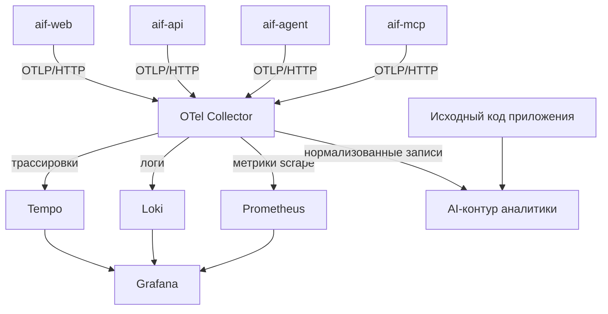

[← Configuration](configuration.md) · [Back to README](../README.md) · [Providers →](providers.md)

# Архитектура телеметрии

> **Статус:** предложено (MVP). Подсистема ещё не реализована; этот документ фиксирует архитектурные концепты. Решения оформлены шестью ADR (таблица ниже); требования разных уровней — в цепочке трассировки под диаграммой.

## Цель

Единая коррелированная картина продакшен-наблюдения для четырёх процессов (`api`, `agent`, `mcp`, `web`) и трёх типов сигналов (трассировки, метрики, логи) — пригодная и для человека (Grafana), и для будущего AI-разбора (первопричины, аномалии, оптимизация маршрутизации).

Ключевой принцип — **корреляция вместо содержимого**: телеметрия несёт _идентификаторы, категории, длительности и исходы_, а не сырые промпты/ответы. У AI-аналитика есть доступ к исходному коду приложения, поэтому «что система из себя представляет» логировать не нужно — нужно «какой запуск, какая стадия, какая ошибка, какая стоимость».

## Два контура потребления, один пайплайн



- **Operational-контур** (Tempo + Loki + Prometheus + Grafana) отвечает на «что происходит сейчас».
- **AI-контур** потребляет те же нормализованные OTLP-записи, соединённые корреляционными ключами; собственного формата ему нет — тот же контракт, что у Grafana.

## Зафиксированные концепты MVP

| №   | Концепт                                                                                                                                                                 | ADR                                                                                                     |
| --- | ----------------------------------------------------------------------------------------------------------------------------------------------------------------------- | ------------------------------------------------------------------------------------------------------- |
| 1   | OpenTelemetry — единый стандарт; OTel Collector — единственная точка политик (redaction, sampling, cardinality guard)                                                   | [ADR-DES.OPS.otel-collector-adoption](adr/ADR-DES.OPS.otel-collector-adoption.md)                       |
| 2   | Self-hosted бэкенды: Tempo (трассировки), Loki (логи), Prometheus (метрики, pull с collector), Grafana                                                                  | [ADR-DES.OPS.grafana-backend-stack](adr/ADR-DES.OPS.grafana-backend-stack.md)                           |
| 3   | Единый контракт схемы: один resource-набор, semconv-first, пространство `aif.*`, cardinality policy, `aif.schema.version`                                               | [ADR-DES.OPS.telemetry-schema-contract](adr/ADR-DES.OPS.telemetry-schema-contract.md)                   |
| 4   | `pino` остаётся фреймворком журналирования; OTLP-доставка — аддитивный мост с внедрением trace context                                                                  | [ADR-DES.OPS.pino-otel-log-bridge](adr/ADR-DES.OPS.pino-otel-log-bridge.md)                             |
| 5   | Ручная instrumentация на существующих швах (реестр `wrapAdapter`, Hono middleware, стадии координатора, `@aif/data`, MCP); `@aif/runtime` сохраняет OTel-свободный порт | [ADR-DES.PROCESS.manual-seam-instrumentation](adr/ADR-DES.PROCESS.manual-seam-instrumentation.md)       |
| 6   | Корреляционная модель async-трасс: трасса на прогон стадии, span links, логическая трасса задачи по `aif.task.id`, захват содержимого — opt-in по умолчанию             | [ADR-DES.PROCESS.correlation-first-async-traces](adr/ADR-DES.PROCESS.correlation-first-async-traces.md) |

## Цепочка требований

Все элементы — статус «предложено», Фаза 5 roadmap (`vision.md` §2.5):

| Уровень          | Элементы                                                                                                                                                                                                                                                                                                                                                               |
| ---------------- | ---------------------------------------------------------------------------------------------------------------------------------------------------------------------------------------------------------------------------------------------------------------------------------------------------------------------------------------------------------------------- |
| Vision (функции) | [HF10.4–HF10.6](vision.md) — сквозная трасса задачи, управление телеметрией, AI-разбор инцидентов                                                                                                                                                                                                                                                                      |
| Бизнес-правила   | [BR-fact.audit.otel-telemetry-backbone](business-rules/BR-fact.audit.otel-telemetry-backbone.md), [BR-constraint.audit.telemetry-correlation-contract](business-rules/BR-constraint.audit.telemetry-correlation-contract.md), [BR-constraint.audit.telemetry-content-minimality](business-rules/BR-constraint.audit.telemetry-content-minimality.md)                   |
| Прецеденты       | [UC-audit.telemetry.view-task-telemetry](use-cases/UC-audit.telemetry.view-task-telemetry.md), [UC-audit.telemetry.control-content-capture](use-cases/UC-audit.telemetry.control-content-capture.md)                                                                                                                                                                   |
| Функциональные   | [REQ-FR-audit.telemetry.emit-correlated-signals](fun-req/REQ-FR-audit.telemetry.emit-correlated-signals.md), [REQ-FR-audit.telemetry.bridge-pino-logs](fun-req/REQ-FR-audit.telemetry.bridge-pino-logs.md), [REQ-FR-audit.telemetry.control-content-capture](fun-req/REQ-FR-audit.telemetry.control-content-capture.md)                                                |
| Нефункциональные | [REQ-NFR-ops.observability.otel-export-resilience](nonfun-req/REQ-NFR-ops.observability.otel-export-resilience.md), [REQ-NFR-ops.observability.telemetry-overhead-budget](nonfun-req/REQ-NFR-ops.observability.telemetry-overhead-budget.md), [REQ-NFR-ops.observability.telemetry-cardinality-cap](nonfun-req/REQ-NFR-ops.observability.telemetry-cardinality-cap.md) |

## Корреляция через async-границы

Задачи переходят между стадиями через поллинг SQLite (каждые 30 с), поэтому W3C trace context не может пересекать эту границу. Модель:

```
прогон planning (трасса #1) ──link──► прогон implementing (трасса #2) ──link──► прогон review (трасса #3)
        │ aif.task.id                        │ aif.task.id                          │ aif.task.id
```

- Каждый **прогон стадии** — одна ограниченная трасса: `invoke_workflow {aif.stage}` → `invoke_agent {gen_ai.agent.name}` → `execute_tool {gen_ai.tool.name}` / `chat {gen_ai.request.model}`.
- Прогоны связываются span links с типизацией `aif.link.type` (`stage_transition`, `retry`, `queue_handoff`, `tool_call`).
- **Логическая трасса задачи** собирается AI и операторами по атрибуту `aif.task.id` плюс links — намеренно _не_ одна физическая трасса (долгоживущие трассы ломают tail sampling).
- Родительский `traceparent` персистится на существующих иммутабельных записях истории/аудита (append-only миграция), поэтому корреляция переживает перезапуски процессов.

## Что захватывается и что намеренно нет

| Всегда                                                                                                                 | Только по opt-in                                                                                                     | Никогда по умолчанию                  |
| ---------------------------------------------------------------------------------------------------------------------- | -------------------------------------------------------------------------------------------------------------------- | ------------------------------------- |
| ID: `trace_id`, `aif.task.id`, `aif.project.id`, `gen_ai.conversation.id` (реальный session id), `gen_ai.tool.call.id` | `gen_ai.input.messages`, `gen_ai.output.messages`, `gen_ai.system_instructions`, `gen_ai.tool.call.arguments/result` | Полные промпты/выводы routine-трафика |
| Исходы: `error.type` (структурированные категории), `gen_ai.response.finish_reasons`, status                           | Содержимое интерактивных вопросов инструментов                                                                       | Секреты / токены провайдеров          |
| Количества и время: `gen_ai.usage.*` (inclusive totals), `aif.cost.usd`, длительности, TTFT                            | Подробная декомпозиция retry                                                                                         | High-cardinality свободный текст      |

Лимиты Loki (64 KB / 128 полей structured metadata; non-retryable 400 при переполнении) и перенос `exception.stacktrace` в тело лога transform-процессором collector — обязательная часть конструкции моста.

## Карта точек съёма

| Шов (существует сегодня)                           | Телеметрия                                                  |
| -------------------------------------------------- | ----------------------------------------------------------- |
| `packages/runtime/src/registry.ts` (`wrapAdapter`) | спаны `invoke_agent`/`chat`, токены, модель, длительность   |
| `packages/api/src/middleware/logger.ts` (Hono)     | HTTP-спаны сервера + RED-метрики                            |
| `packages/api/src/ws.ts`, WebSocket                | спаны connect/broadcast (ручные; WS не проходит через Hono) |
| `packages/agent/src/coordinator.ts`                | трассы прогонов стадий + links                              |
| `packages/data/src/*` (единый шлюз БД)             | семантические `db.*` спаны на границе репозиториев          |
| `packages/mcp/src/server.ts`                       | `mcp.*` спаны на обоих транспортах                          |
| `packages/agent/src/notifier.ts`, `internalApi.ts` | исходящие HTTP-спаны + propagation контекста                |
| `packages/web` (браузер)                           | трассы `aif-web`, fetch-спаны, лениво загружаемый SDK       |

Порт телеметрии в `@aif/runtime` соседствует с capability-флагами адаптеров (`usageReporting` и др.), но не расширяет их: capability-контракты остаются зоной `docs/providers.md`.

## Объём MVP и отложенное

**В MVP (концепты зафиксированы сейчас):** пайплайн collector + бэкенды; resource/attribute-контракт; мост pino; трассы прогонов стадий + `aif.task.id`; флаги `AIF_TELEMETRY_ENABLED` / `AIF_TELEMETRY_LOG_BRIDGE` / `AIF_TELEMETRY_CONTENT_CAPTURE` (по умолчанию выключены); non-throwing экспортёры с bounded queues и shutdown flush.

**Сознательно отложено (Фаза 2+):** `schema-contract.yaml` + CI-валидация; матрица политик выборки с числами; retention и cost model; pipeline аудита redaction; мультиарендность / RBAC для AI-хранилища; схемы признаков и технология AI-хранилища (ClickHouse/Parquet); GitOps/canary для конфига collector; **обязательства синхронизации при имплементации** — добавление пакета `@aif/telemetry` в `.ai-factory/ARCHITECTURE.md` и структуру `AGENTS.md`, Docker Sync Rule (`.docker/Dockerfile`, compose-сервисы), регистрация `AIF_TELEMETRY_*` в `envSchema`. Эти пункты — параметризация; инварианты выше они не меняют.

## Известные ограничения интеграции (из исследования)

- ESM: документация OTel JS рассчитана на CJS; автоинструментация требует `--experimental-loader=@opentelemetry/instrumentation/hook.mjs` — исключено решением о ручной instrumentation.
- `drizzle-orm@0.45.2` экспортирует заглушку `./tracing` без публичного API — DB-спаны идут от границы `@aif/data`, а не от Drizzle.
- `@opentelemetry/sdk-logs` — `0.x` (экспериментальный) — причина, по которой `pino` остаётся источником истины, а OTLP аддитивен.
- stdio MCP резервирует stdout под JSON-RPC — экспортёры только OTLP, никогда console.
- `agent`/`mcp` завершаются синхронно (`process.exit(0)`) — flush на остановке является обязательным, а не опциональным.
- Tail sampling stateful (все спаны трассы должны попасть в один экземпляр collector в окне `decision_wait`) — причина ограниченных трасс на прогон стадии вместо одной долгоживущей.

## Куда копать дальше

- ADR из таблицы выше — шесть зафиксированных решений.
- [Каталог ADR](adr/README.md) — правила именования и полный индекс.
- [Бизнес-правила](business-rules/README.md), [прецеденты](use-cases/README.md), [FR](fun-req/README.md), [NFR](nonfun-req/README.md) — цепочка требований, трассируемая на HF10.4–HF10.6.
- [Справочник GenAI semconv](../.ai-factory/references/opentelemetry-genai-semconv.md) — закреплённый реестр `gen_ai.*`/`mcp.*` для контракта схемы.
- [Архитектура](architecture.md) — границы модулей, которые должен соблюдать порт телеметрии.
- [Конфигурация](configuration.md) — место новых флагов `AIF_TELEMETRY_*`.

## See Also

- [Конфигурация](configuration.md) — переменные окружения (включая будущие `AIF_TELEMETRY_*`)
- [Провайдеры](providers.md) — capability-контракты адаптеров, соседствующие с портом телеметрии
- [ADR-DES.OPS.otel-collector-adoption](adr/ADR-DES.OPS.otel-collector-adoption.md) — решение о хребте сбора
