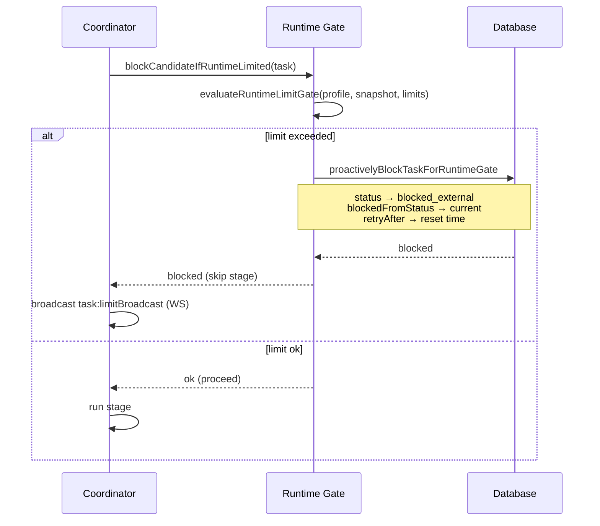

[← UC-accounting.limits.configure-project-limits](UC-accounting.limits.configure-project-limits.md) · [Back to README](../README.md) · [UC-handoff.transfer.ownership-to-executor →](UC-handoff.transfer.ownership-to-executor.md)

# UC-accounting.blocking.block-on-limit-exceeded: Блокировка задачи при превышении лимита

**Актор:** Coordinator (Agent) → Runtime Gate

**Приоритет:** P1

**Ключевая функция:** HF6.3 Блокировка при превышении

**Канал:** Agent (coordinator, data layer)

**Описание:** Перед запуском stage runner Coordinator проверяет runtime-гейт через `evaluateRuntimeLimitGate`. Если лимит проекта превышен, задача блокируется (`blocked_external`) с указанием причины, snapshot-ом лимитов и временем retry-окна.

**Диаграмма последовательности:**

**Основной поток:**

1. Coordinator вызывает `blockCandidateIfRuntimeLimited(task)` перед запуском stage.
2. `evaluateRuntimeLimitGate` проверяет `RuntimeLimitSnapshot` проекта и runtime-профиля.
3. Если любое окно лимита превышено (source=BLOCKED), задача блокируется:
   - `status` → `blocked_external`
   - `blockedFromStatus` → текущий статус задачи
   - `retryAfter` → время сброса окна
   - Сохраняется `runtimeLimitSnapshot` с деталями
4. Coordinator отправляет WS-событие `task:limitBroadcast`.
5. При превышении coordinator инкрементирует `retryCount`.

**Альтернативные потоки:**

- **A1. Retry после reset:** `resolveRuntimeGateRetryAfter` вычисляет `retryAfter` на основе окон лимита или политики провайдера.
- **A2. WARNING:** если лимит близок к исчерпанию, задача не блокируется, но в лог пишется предупреждение.
- **A3. Provider block:** при HTTP 429 (rate limit) адаптер парсит заголовки `Retry-After` и передаёт через `RuntimeLimitEventPayload`.

**Постусловия:** Задача заблокирована с указанием причины и времени retry. WS-уведомление отправлено.

**Источник требований:** HF6.3 Блокировка при превышении, BR-trigger.automation.runtime-limit-gate
