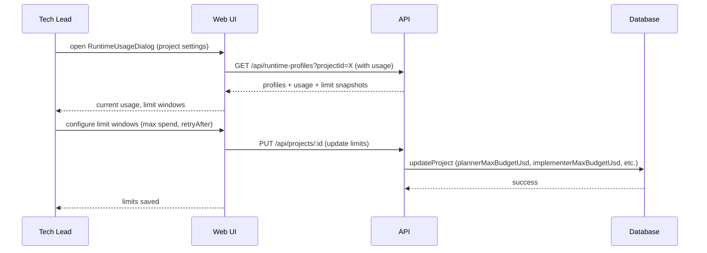

[← UC-accounting.tracking.record-runtime-call](UC-accounting.tracking.record-runtime-call.md) · [Back to README](../README.md) · [UC-accounting.blocking.block-on-limit-exceeded →](UC-accounting.blocking.block-on-limit-exceeded.md)

# UC-accounting.limits.configure-project-limits: Конфигурация лимитов использования на уровне проекта

**Актор:** Tech Lead / Admin

**Приоритет:** P1

**Ключевая функция:** HF6.2 Лимиты на уровне проекта

**Канал:** GUI (RuntimeUsageDialog) / API

**Описание:** Администратор настраивает лимиты для проекта: максимальный бюджет (USD), лимиты токенов (input/output), временные окна. Лимиты применяются в runtime-гейте перед выполнением каждой стадии конвейера.

**Диаграмма последовательности:**

**Основной поток:**

1. Пользователь с ролью `admin` открывает RuntimeUsageDialog.
2. UI показывает текущие лимиты проекта (plannerMaxBudgetUsd, implementerMaxBudgetUsd, reviewSidecarMaxBudgetUsd, planCheckerMaxBudgetUsd).
3. UI показывает агрегированное использование (токены, стоимость) по профилям.
4. Администратор настраивает лимиты и окна сброса.
5. Лимиты применяются в `evaluateRuntimeLimitGate` при запуске stage.

**Альтернативные потоки:**

- **A1. Runtime-provider лимиты:** Snapshots лимитов могут быть получены от провайдера (rate limits, spending limits) через runtime адаптеры.
- **A2. Precision:** лимиты могут быть `EXACT` (точные данные от провайдера) или `HEURISTIC` (вычисленные).

**Постусловия:** Лимиты проекта сохранены. Runtime-гейт использует их для блокировки при превышении.

**Источник требований:** HF6.2 Лимиты на уровне проекта, BR-trigger.automation.runtime-limit-gate
