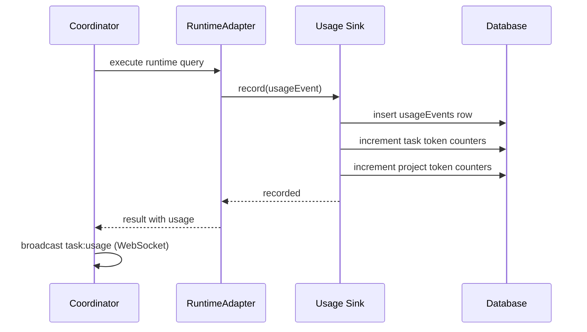

[← UC-vcs-auto.plan-review.publish-plan-for-approval](UC-vcs-auto.plan-review.publish-plan-for-approval.md) · [Back to README](README.md) · [UC-accounting.limits.configure-project-limits →](UC-accounting.limits.configure-project-limits.md)

# UC-accounting.tracking.record-runtime-call: Учёт каждого вызова runtime

**Актор:** Coordinator / API (Agent)

**Приоритет:** P0

**Ключевая функция:** HF6.1 Учёт каждого вызова runtime

**Канал:** Agent (usage sink) / API

**Описание:** Каждый вызов runtime-адаптера фиксируется в `UsageEvent`: источник (`source`), runtimeId, providerId, transport, workflowKind, количество токенов (input, output, total), стоимость в USD. Данные персистентно хранятся в таблице `usageEvents` и аггрегируются на уровне задачи, проекта и чат-сессии.

**Диаграмма последовательности:**

**Основной поток:**

1. При выполнении runtime-запроса `RuntimeAdapter` вызывает `usageSink.record(usageEvent)`.
2. `createDbUsageSink` создаёт запись в `usageEvents` с метаданными: source, runtimeId, providerId, projectId, taskId/chatSessionId.
3. Синк инкрементирует счётчики токенов и стоимости на задаче (`incrementTaskTokenUsage`).
4. Синк инкрементирует счётчики на проекте (`incrementProjectTokenUsage`).
5. Coordinator отправляет WS-событие `task:usage` с обновлёнными значениями.
6. UI отображает usage в RuntimeUsageDialog.

**Альтернативные потоки:**

- **A1. Chat usage:** для чат-сессий usage записывается на `chatSessions` через `incrementChatSessionTokenUsage`.
- **A2. Нестандартный источник:** для Codex адаптера usage может собираться из файлов (`readCodexSessionLimitSnapshotsFromAppend`).

**Постусловия:** Вызов runtime учтён. Счётчики задачи и проекта обновлены.

**Источник требований:** HF6.1 Учёт каждого вызова runtime, BR-trigger.automation.runtime-limit-gate
