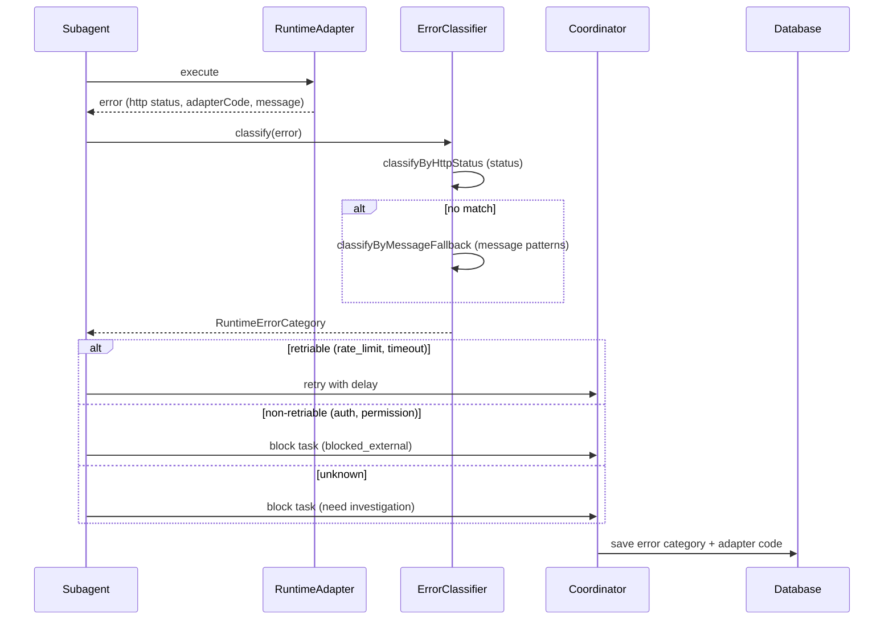

[← UC-audit.heartbeat.receive-agent-heartbeat](UC-audit.heartbeat.receive-agent-heartbeat.md) · [Back to README](../README.md) · [UC-integration.issues.sync-github-issue →](UC-integration.issues.sync-github-issue.md)

# UC-audit.errors.classify-runtime-error: Категоризация ошибок выполнения runtime

**Актор:** Coordinator (Agent) → ErrorClassifier

**Приоритет:** P1

**Ключевая функция:** HF10.3 Категоризация ошибок

**Канал:** Agent (error handling pipeline)

**Описание:** При сбое выполнения runtime-запроса ErrorClassifier категоризирует ошибку по `RuntimeErrorCategory`: rate_limit, auth, timeout, tool_error, permission, internal_error, not_found, invalid_request, provider_error, capacity, moderation, unknown. Категория определяет стратегию retry (retriable/non-retriable) и логику блокировки.

**Диаграмма последовательности:**

**Основной поток:**

1. Runtime-адаптер возвращает ошибку с HTTP-статусом, adapter code и message.
2. ErrorClassifier применяет классификацию:
   - `classifyByHttpStatus(status)` — точное совпадение по статусу.
   - `classifyByMessageFallback(message)` — pattern matching на тексте сообщения (fallback).
3. Результат — `RuntimeErrorCategory`: retriable или non-retriable.
4. Coordinator выбирает стратегию:
   - Retriable: задача перезапускается с задержкой.
   - Non-retriable: задача блокируется с диагностикой.

**Альтернативные потоки:**

- **A1. Provider-specific codes:** адаптер передаёт `adapterCode` (e.g., `rate_limit_exceeded`, `context_length_exceeded`).
- **A2. Structured errors:** `RuntimeError` содержит `category`, `adapterCode`, `httpStatus`. Consumer никогда не парсит `message` для классификации.

**Постусловия:** Ошибка категоризирована. Задача либо перезапущена, либо заблокирована. Диагностика сохранена.

**Источник требований:** HF10.3 Категоризация ошибок, BR-audit.observability
