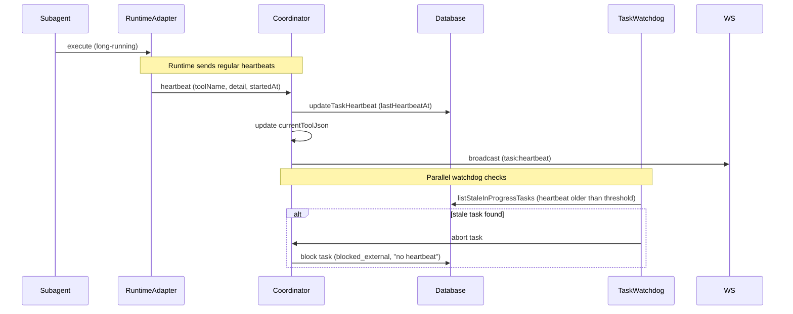

[← UC-audit.logging.audit-state-transition](UC-audit.logging.audit-state-transition.md) · [Back to README](../README.md) · [UC-audit.errors.classify-runtime-error →](UC-audit.errors.classify-runtime-error.md)

# UC-audit.heartbeat.receive-agent-heartbeat: Получение хартбитов от выполняющихся агентов

**Актор:** Coordinator (Agent) → Runtime Adapter

**Приоритет:** P1

**Ключевая функция:** HF10.2 Хартбиты выполнения

**Канал:** Agent (runtime adapter events)

**Описание:** Во время выполнения runtime-запроса адаптер периодически отправляет хартбиты (сигналы жизни) Coordinator-у. Coordinator обновляет `lastHeartbeatAt` на задаче и проверяет, не зависло ли выполнение. При отсутствии хартбита дольше заданного таймаута задача считается зависшей.

**Диаграмма последовательности:**

**Основной поток:**

1. Во время выполнения runtime-запроса адаптер отправляет хартбиты через `RuntimeSubagentStartCallback`.
2. Coordinator обновляет `lastHeartbeatAt` и `currentToolJson` (название инструмента, детали).
3. WebSocket-событие `task:heartbeat` отправляется в UI для отображения прогресса.
4. `taskWatchdog.ts` периодически проверяет `listStaleInProgressTasks()` — задачи с хартбитом старше `AGENT_STAGE_RUN_TIMEOUT_MS`.
5. При stale-задаче watchdog блокирует её.

**Альтернативные потоки:**

- **A1. Heartbeat timeout:** если heartbeat не получен дольше таймаута, `releaseStaleTaskClaims` разблокирует задачу.
- **A2. Tool tracking:** `setTaskInFlightTool` сохраняет текущий инструмент (имя, детали, startedAt).

**Постусловия:** Хартбит записан. UI обновлён. Watchdog может обнаружить зависшие задачи.

**Источник требований:** HF10.2 Хартбиты выполнения, BR-fact.audit.observability
