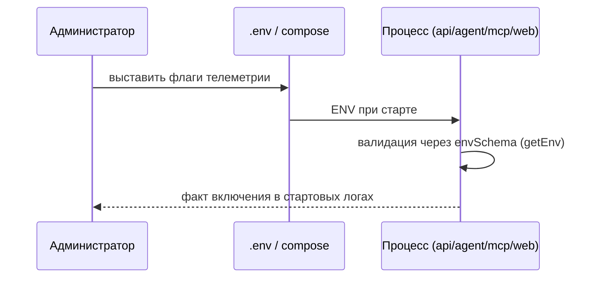

# UC-audit.telemetry.control-content-capture: Управление захватом содержимого

**Статус:** proposed · **Класс:** to be (Фаза 5, `vision.md` §2.5)

**Актор:** Администратор

**Приоритет:** P2

**Ключевая функция:** HF10.5 Управление телеметрией (предложено)

**Канал:** Config (env) / Mixed

**Описание:** Администратор включает или отключает телеметрию и захват содержимого AI-взаимодействий явными флагами окружения (`AIF_TELEMETRY_ENABLED`, `AIF_TELEMETRY_LOG_BRIDGE`, `AIF_TELEMETRY_CONTENT_CAPTURE`). Настройки применяются при старте процесса; поведение приложения при выключенных флагах не меняется.

**Диаграмма последовательности:**

**Основной поток:**

1. Администратор редактирует флаги в `.env` (или compose-окружении).
2. Процесс при старте валидирует значения zod-схемой окружения.
3. При `AIF_TELEMETRY_ENABLED=true` инициализируется OTel-стек и экспорт в collector; иначе используется noop-реализация.
4. Захват содержимого остаётся выключенным, пока явно не включён `AIF_TELEMETRY_CONTENT_CAPTURE`; при включении содержимое проходит сокрытие и усечения.

**Альтернативные потоки:**

- **A1. Некорректное значение флага:** запуск падает с валидационной ошибкой `getEnv` — тот же механизм, что для остального конфигурационного окружения.
- **A2. Включённый захват без включённой телеметрии:** захват проигнорирован; в стартовый лог выводится предупреждение.

**Постусловия:** Состояние флагов зафиксировано в конфигурации развёртывания; при выключенных флагах отправка сетевых запросов к collector отсутствует.

**Источник требований:** HF10.5 (`vision.md` §2.2), `BR-constraint.audit.telemetry-content-minimality`, `ADR-DES.PROCESS.correlation-first-async-traces`
