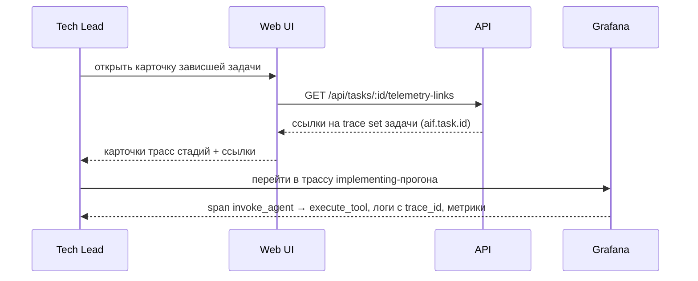

# UC-audit.telemetry.view-task-telemetry: Просмотр сквозной телеметрии задачи

**Статус:** proposed · **Класс:** to be (Фаза 5, `vision.md` §2.5)

**Актор:** Tech Lead / Разработчик

**Приоритет:** P1

**Ключевая функция:** HF10.4 Сквозная трасса задачи (предложено)

**Канал:** GUI (карточка задачи) / Grafana

**Описание:** Пользователь открывает телеметрию задачи из её карточки: дерево трассировок прогонов стадий, связанные логи и метрики. Прогоны стадий сшиты в логическую трассу задачи по ключу `aif.task.id` и span links; переходы log→trace и metric→trace работают через Grafana.

**Диаграмма последовательности:**

**Основной поток:**

1. Пользователь открывает карточку задачи, находящейся в проблемной стадии.
2. UI запрашивает у API корреляционные ссылки телеметрии задачи (набор `trace_id` прогонов стадий и `aif.task.id`).
3. API возвращает ссылки, если телеметрия включена и хранилище доступно.
4. UI отображает переход к обобщённому представлению задачи в Grafana.
5. Пользователь видит дерево прогонов, связанные логи и метрики; причина сбоя локализована без ручного сопоставления логов процессов.

**Альтернативные потоки:**

- **A1. Телеметрия выключена:** ссылки не отображаются; доступны только локальные логи (`as is`-поведение сохраняется).
- **A2. Хранилище недоступно:** ссылки скрыты или помечены как недоступные; конвейер работает неограниченно.
- **A3. Задача без прогонов:** ссылок нет (для задачи ещё не создавалось трасс).

**Постусловия:** Причина сбоя локализована на уровне конкретной стадии, вызова адаптера или инструмента; содержимое AI-взаимодействий в телеметрии отсутствует (BR-constraint.audit.telemetry-content-minimality).

**Источник требований:** HF10.4 (`vision.md` §2.2), `BR-fact.audit.otel-telemetry-backbone`, `BR-constraint.audit.telemetry-correlation-contract`, `docs/telemetry.md`
