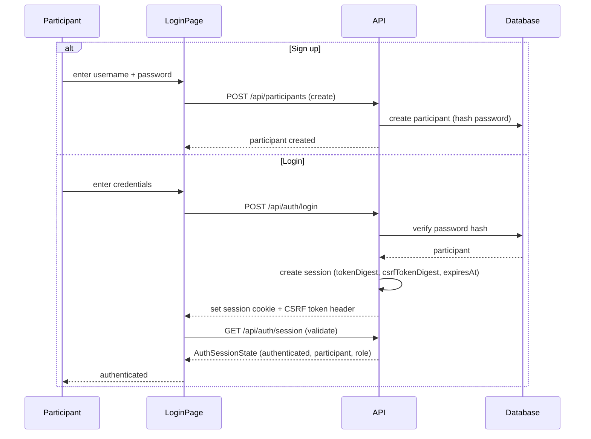

[← UC-chat.task-context.discuss-task-with-ai](UC-chat.task-context.discuss-task-with-ai.md) · [Back to README](README.md) · [UC-auth.roles.assign-participant-role →](UC-auth.roles.assign-participant-role.md)

# UC-auth.registration.sign-up-participant: Регистрация и вход участника

**Актор:** Participant (User)

**Приоритет:** P1

**Ключевая функция:** HF9.1 Регистрация и вход

**Канал:** GUI (LoginPage) / API

**Описание:** Участник регистрируется в системе через API, создаётся запись в `participants` с хешированным паролем и ролью. Аутентификация через сессии: создаётся `participantSession` с токеном, CSRF-токеном и временем истечения.

**Диаграмма последовательности:**

**Основной поток:**

1. При включённом `PARTICIPANTS_MODE_ENABLED` приложение показывает LoginPage.
2. **Регистрация:** пользователь отправляет POST /api/participants с username, password, displayName.
3. API создаёт запись в `participants` с `passwordHash` (bcrypt), `role=member`, `active=true`.
4. **Вход:** пользователь отправляет POST /api/auth/login с credentials.
5. API проверяет пароль, создаёт сессию (`participantSessions`) с токеном, CSRF-токеном и expiry.
6. UI получает `AuthSessionState` с `authenticated=true`, `participant`, `role`.
7. Все последующие запросы включают session cookie и CSRF-токен.

**Альтернативные потоки:**

- **A1. Неверный пароль:** API возвращает 401, UI показывает ошибку.
- **A2. Сессия истекла:** middleware проверяет `expiresAt` — если истекла, возвращает 401.
- **A3. Первый admin:** первый зарегистрированный участник получает роль `admin`.
- **A4. Logout:** POST /api/auth/logout — `revokeAt` на сессии.

**Постусловия:** Участник аутентифицирован. Сессия активна. UI отображает проекты и задачи.

**Источник требований:** HF9.1 Регистрация и вход, BR-constraint.auth.credentials, BR-constraint.auth.sessions, BR-fact.auth.roles
