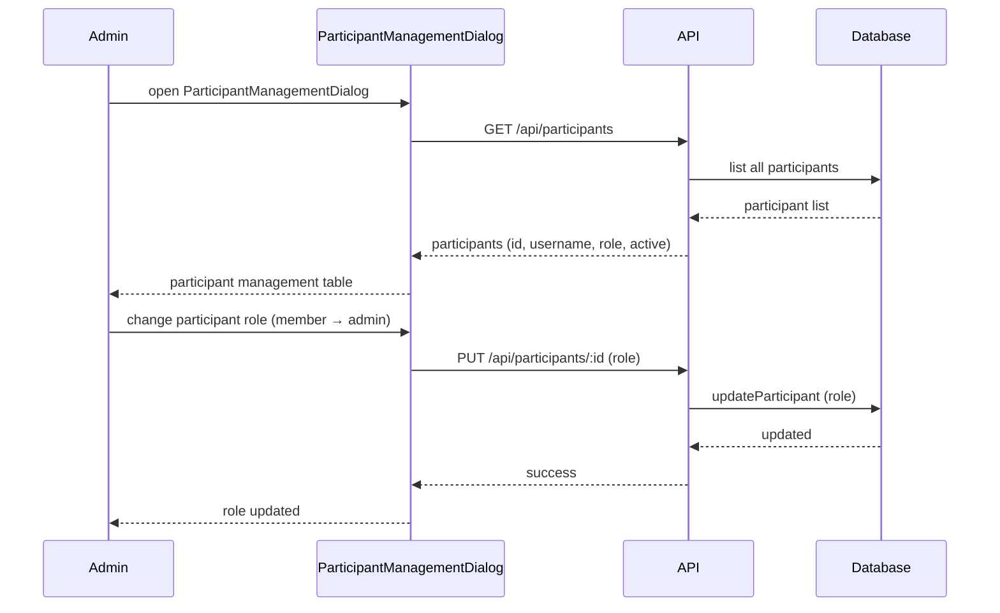

[← UC-auth.registration.sign-up-participant](UC-auth.registration.sign-up-participant.md) · [Back to README](../README.md) · [UC-audit.logging.audit-state-transition →](UC-audit.logging.audit-state-transition.md)

# UC-auth.roles.assign-participant-role: Разграничение ролей и прав участников

**Актор:** Administrator

**Приоритет:** P1

**Ключевая функция:** HF9.2 Разграничение ролей

**Канал:** GUI (ParticipantManagementDialog) / API

**Описание:** Администратор управляет участниками: назначает роли (`admin`/`member`), деактивирует, сбрасывает пароли. Каждый участник имеет ограниченные права: `admin` — полный доступ, `member` — только назначенные задачи. RBAC проверяется в `resolveTaskAction` и `resolveTaskPermissions`.

**Диаграмма последовательности:**

**Основной поток:**

1. Администратор открывает ParticipantManagementDialog (доступен только `admin`).
2. UI показывает список участников с их ролями и статусами.
3. Администратор может:
   - Изменить роль участника (`member` ↔ `admin`).
   - Деактивировать/реактивировать участника.
   - Сбросить пароль участника.
4. Изменения применяются немедленно: middleware проверяет `participant.active` и `role` на каждом запросе.

**Альтернативные потоки:**

- **A1. Self-service password change:** пользователь может изменить свой пароль через Header (onChangePassword).
- **A2. Task isolation:** `BR-constraint.auth.task-isolation` — member может видеть только задачи, на которые назначен.
- **A3. Member без проекта:** member видит только проекты, в которые добавлен.

**Постусловия:** Роль участника изменена. Права доступа обновлены для всех последующих запросов.

**Источник требований:** HF9.2 Разграничение ролей, BR-fact.auth.roles, BR-fact.auth.admin-privileges, BR-constraint.auth.member-scope, BR-constraint.auth.task-isolation
