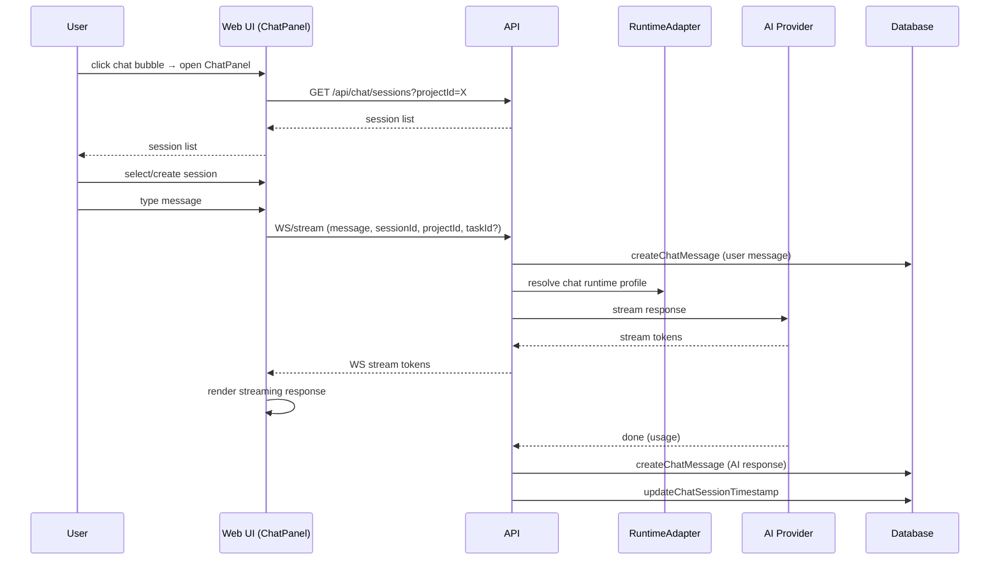

[← UC-handoff.diagnostics.receive-escalation-diagnostics](UC-handoff.diagnostics.receive-escalation-diagnostics.md) · [Back to README](../README.md) · [UC-chat.task-context.discuss-task-with-ai →](UC-chat.task-context.discuss-task-with-ai.md)

# UC-chat.project-context.consult-ai-assistant: Диалог с AI-ассистентом в контексте проекта

**Актор:** User (Developer)

**Приоритет:** P1

**Ключевая функция:** HF8.1 Диалог в контексте проекта

**Канал:** GUI (WebSocket, ChatPanel)

**Описание:** Пользователь открывает чат-панель и общается с AI-ассистентом в контексте проекта. Ассистент имеет доступ к задачам проекта, планам, runtime-профилям, но не может запускать конвейер. Диалог сохраняется в `chatSessions`/`chatMessages`.

**Диаграмма последовательности:**

**Основной поток:**

1. Пользователь нажимает на ChatBubble в углу экрана.
2. ChatPanel открывается с выбором/созданием сессии.
3. Пользователь вводит сообщение — UI отправляет через WebSocket/API.
4. API разрешает chat runtime profile (`defaultChatRuntimeProfileId`).
5. AI-провайдер возвращает потоковый ответ (stream tokens).
6. UI рендерит ответ по мере получения токенов.
7. Сообщения сохраняются в `chatMessages` для истории.
8. Usage (токены, стоимость) учитывается на `chatSessions`.

**Альтернативные потоки:**

- **A1. Создание задачи из чата:** `ChatActionCreateTask` — AI может предложить создать задачу, пользователь подтверждает.
- **A2. Attachments:** пользователь может прикреплять файлы к сообщениям через `ChatMessageAttachment`.
- **A3. Новая сессия:** создаётся с `title` и привязкой к `runtimeProfileId`.

**Постусловия:** Диалог сохранён. Usage учтён.

**Источник требований:** HF8.1 Диалог в контексте проекта
