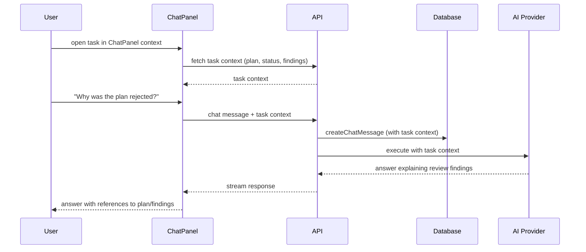

[← UC-chat.project-context.consult-ai-assistant](UC-chat.project-context.consult-ai-assistant.md) · [Back to README](../README.md) · [UC-auth.registration.sign-up-participant →](UC-auth.registration.sign-up-participant.md)

# UC-chat.task-context.discuss-task-with-ai: Диалог с AI в контексте конкретного изменения

**Актор:** User (Developer)

**Приоритет:** P1

**Ключевая функция:** HF8.2 Диалог в контексте изменения

**Канал:** GUI (ChatPanel + TaskDetail)

**Описание:** Пользователь может задать вопрос AI-ассистенту в контексте конкретной задачи: ассистент видит план задачи, текущий статус, результаты проверок, лог выполнения. Диалог привязан к `taskId` и `sessionId`.

**Диаграмма последовательности:**

**Основной поток:**

1. Пользователь открывает ChatPanel с активной задачей.
2. Чат-сессия привязывается к `taskId`.
3. Пользователь задаёт вопрос в контексте задачи (план, ревью, статус).
4. API включает контекст задачи в промпт ассистента.
5. AI-ассистент отвечает, ссылаясь на конкретные артефакты задачи.
6. Ответ сохраняется в `chatMessages` с указанием `sessionId`.

**Постусловия:** Диалог сохранён. Контекст задачи доступен ассистенту.

**Источник требований:** HF8.2 Диалог в контексте изменения
