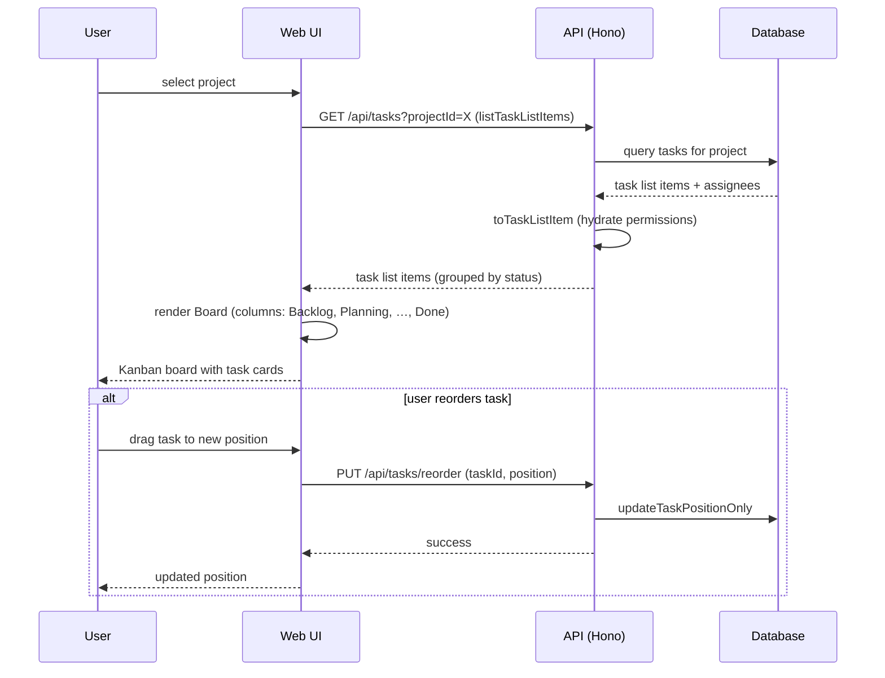

[← UC-pipeline.escalation.escalate-after-exhausted-retries](UC-pipeline.escalation.escalate-after-exhausted-retries.md) · [Back to README](../README.md) · [UC-dashboard.gate-status.view-gate-results →](UC-dashboard.gate-status.view-gate-results.md)

# UC-dashboard.board.view-kanban-columns: Просмотр изменений по стадиям в Kanban-доске

**Актор:** User (Developer, Tech Lead)

**Приоритет:** P0

**Ключевая функция:** HF2.1 Просмотр изменений по стадиям

**Канал:** GUI (React SPA, Vite, TailwindCSS 4)

**Описание:** Пользователь видит все задачи проекта, сгруппированные по стадиям конвейера в Kanban-доске с возможностью drag-and-drop переупорядочивания. Доступны два режима отображения: kanban (колонки) и list (таблица).

**Диаграмма последовательности:**

**Основной поток:**

1. Пользователь выбирает проект в ProjectSelector.
2. UI запрашивает задачи через REST API: `GET /api/tasks?projectId=X`.
3. API возвращает `TaskListItem[]` со статусами, assignees, permissions.
4. UI группирует задачи по статусу и отображает Board с колонками:
   - Backlog / Planning / Improve / Plan Ready / Plan Review / Implementing / Verify / Review / Blocked / Done / Accepted.
5. Пользователь видит для каждой задачи: заголовок, приоритет, assignee, runtime, статус гейтов, время последней активности.
6. Drag-and-drop через `@dnd-kit` изменяет позицию задачи в колонке.
7. Доступны режимы: `comfortable` (с preview) и `compact` (таблица).

**Альтернативные потоки:**

- **A1. List mode:** пользователь переключает `viewMode=list` — задачи отображаются в табличном формате (`TaskListTable`).
- **A2. Фильтрация:** FilterBar позволяет фильтровать по статусу, приоритету, assignee, тегам.
- **A3. Проекты не выбраны:** показывается `ProjectsOverview` — сводка всех проектов с метриками.

**Постусловия:** Пользователь видит актуальное состояние всех задач проекта. WebSocket поддерживает live-обновления.

**Источник требований:** HF2.1 Просмотр изменений по стадиям, BR-audit.observability
