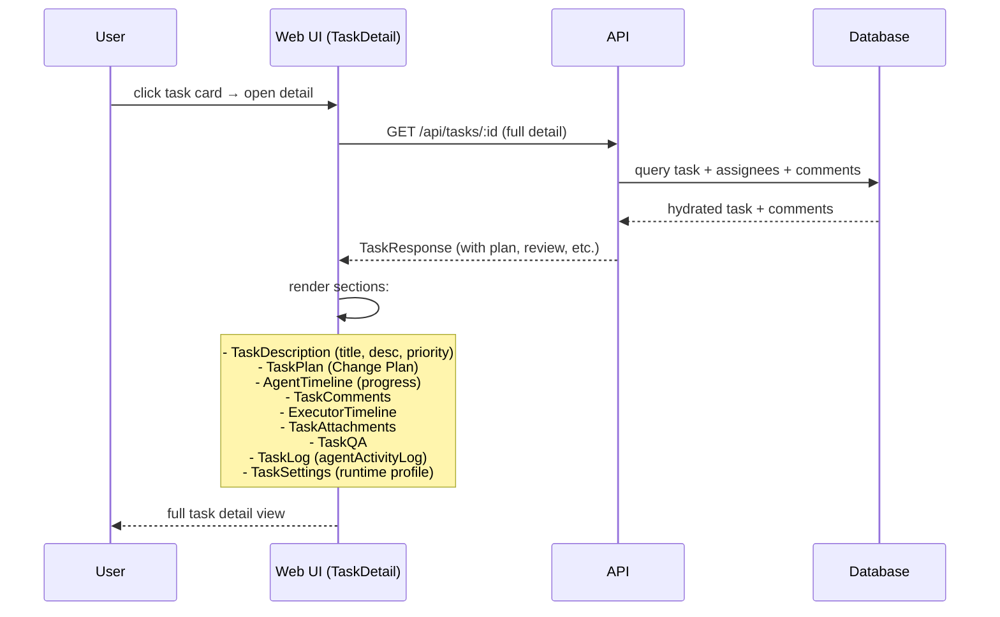

[← UC-dashboard.gate-status.view-gate-results](UC-dashboard.gate-status.view-gate-results.md) · [Back to README](../README.md) · [UC-dashboard.realtime.receive-live-status-updates →](UC-dashboard.realtime.receive-live-status-updates.md)

# UC-dashboard.detail.view-task-details: Детальный просмотр изменения

**Актор:** User (Developer)

**Приоритет:** P0

**Ключевая функция:** HF2.3 Детали изменения

**Канал:** GUI (React SPA)

**Описание:** Пользователь открывает детальный просмотр задачи и видит: план (Change Plan), результаты проверок, комментарии, историю эскалаций, ownership, лог выполнения, runtime usage, прогресс выполнения.

**Диаграмма последовательности:**

**Основной поток:**

1. Пользователь кликает на карточку задачи в Kanban-доске.
2. UI открывает `TaskDetail` (slide-over панель).
3. API возвращает полные данные задачи, включая:
   - План (`planPath`, `planDocs`).
   - Результаты проверок (`autoReviewState`, `reviewComments`).
   - Комментарии с attachments.
   - Ownership (assignees, executor history).
   - Agent activity log и прогресс (currentTool, heartbeat).
   - Runtime usage (tokenInput/Output, costUsd, runtimeLimitSnapshot).
4. UI отображает разделы:
   - **Header:** статус, priority, title, ownership.
   - **Plan:** Change Plan с подсветкой.
   - **Timeline:** AgentTimeline (прогресс выполнения).
   - **Comments:** обсуждения с participant info.
   - **ExecutorTimeline:** история исполнителей.
   - **Settings:** runtime profile, model override.
   - **QA:** статус QA-прогона (если настроен).
   - **Log:** сырой лог выполнения.

**Альтернативные потоки:**

- **A1. План не сгенерирован:** если `planPath=null`, секция плана скрыта.
- **A2. Комментарии:** пользователь может добавлять комментарии (POST /api/tasks/:id/comments).
- **A3. Изменение параметров:** в TaskSettings пользователь может изменить runtime profile, model override.

**Постусловия:** Пользователь получил полную информацию о задаче и может принять решение (эскалировать, утвердить, запросить изменения).

**Источник требований:** HF2.3 Детали изменения
