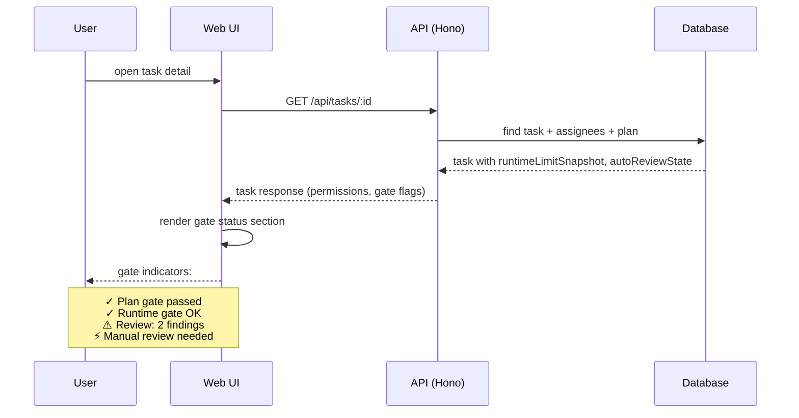

[← UC-dashboard.board.view-kanban-columns](UC-dashboard.board.view-kanban-columns.md) · [Back to README](README.md) · [UC-dashboard.detail.view-task-details →](UC-dashboard.detail.view-task-details.md)

# UC-dashboard.gate-status.view-gate-results: Просмотр статуса формальных гейтов

**Актор:** User (Developer)

**Приоритет:** P1

**Ключевая функция:** HF2.2 Статус формальных гейтов

**Канал:** GUI (React SPA)

**Описание:** Пользователь видит на карточке задачи и в детальном просмотре, какие гейты пройдены и какие блокируют задачу. Статус гейтов включает: runtime-гейт (лимиты), гейт плана, гейт ревью, гейт верификации.

**Диаграмма последовательности:**

**Основной поток:**

1. Пользователь открывает детальный просмотр задачи.
2. API возвращает задачу с метаданными гейтов:
   - `blockedReason` / `blockedFromStatus` — причина блокировки.
   - `runtimeLimitSnapshot` — статус лимитов runtime.
   - `autoReviewState` — состояние авторевью (strategy, iteration, findings).
   - `manualReviewRequired` — флаг эскалации.
   - `retryCount` / `reviewIterationCount` — счётчики попыток.
3. UI отображает статус каждого гейта цветовым индикатором.
4. При блокировке гейта UI показывает причину и рекомендацию.

**Постусловия:** Пользователь информирован о статусе каждого гейта задачи.

**Источник требований:** HF2.2 Статус формальных гейтов, BR-fact.audit.observability
