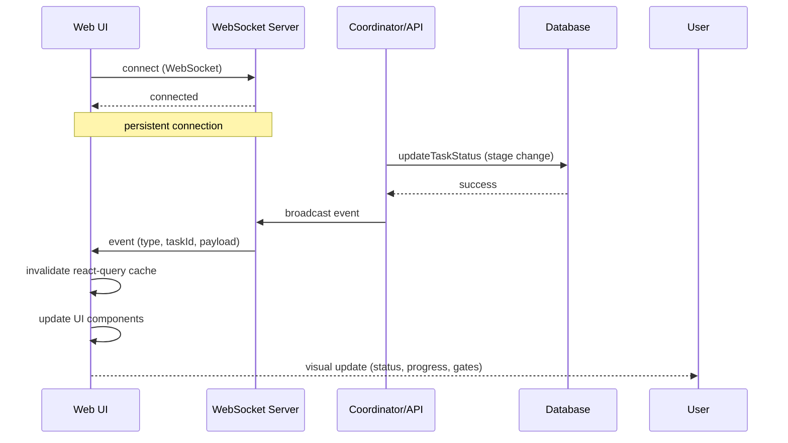

[← UC-dashboard.detail.view-task-details](UC-dashboard.detail.view-task-details.md) · [Back to README](README.md) · [UC-dashboard.search.find-task-by-query →](UC-dashboard.search.find-task-by-query.md)

# UC-dashboard.realtime.receive-live-status-updates: Обновления статуса в реальном времени

**Актор:** User (Developer)

**Приоритет:** P1

**Ключевая функция:** HF2.4 Обновления в реальном времени

**Канал:** GUI (WebSocket)

**Описание:** UI получает WebSocket-события от сервера при каждом изменении статуса задачи, броадкасте прогресса execution, хартбитах и ownership-изменениях. Компоненты автоматически обновляются без полного reload-а страницы.

**Диаграмма последовательности:**

**Основной поток:**

1. При монтировании приложения UI устанавливает WebSocket-соединение (`useWebSocket(true)`).
2. Каждое изменение статуса задачи (API-запросом или Coordinator-ом) триггерит broadcast в WS.
3. WS-событие содержит тип (`task:stageChanged`, `task:heartbeat`, `task:ownershipChanged`, `task:comment`, `task:usage`, `task:limitBroadcast`).
4. UI обрабатывает событие и инвалидирует react-query кэш (`queryClient.invalidateQueries`).
5. UI перерисовывает обновлённые компоненты (Board, TaskDetail, Header metrics).

**Альтернативные потоки:**

- **A1. WS disconnected:** `useWebSocket` автоматически переподключается при разрыве.
- **A2. Навигация:** при смене проекта WS-соединение переустанавливается.
- **A3. Commit-статус:** `task:commitComplete` — уведомление о завершении auto-queue коммита.

**Постусловия:** UI отображает актуальное состояние всех задач без ручного обновления страницы.

**Источник требований:** HF2.4 Обновления в реальном времени
