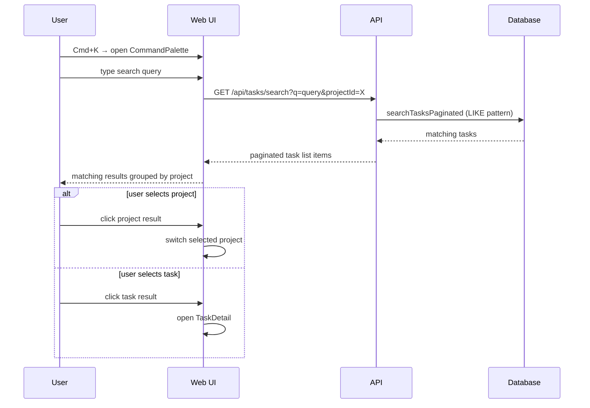

[← UC-dashboard.realtime.receive-live-status-updates](UC-dashboard.realtime.receive-live-status-updates.md) · [Back to README](README.md) · [UC-runtime.profile.configure-project-runtime →](UC-runtime.profile.configure-project-runtime.md)

# UC-dashboard.search.find-task-by-query: Поиск по проектам и изменениям

**Актор:** User (Developer)

**Приоритет:** P2

**Ключевая функция:** HF2.5 Поиск по проектам и изменениям

**Канал:** GUI (Command Palette)

**Описание:** Пользователь открывает Command Palette (Cmd+K), вводит поисковый запрос и получает отфильтрованные результаты по проектам и задачам. Поиск выполняется по `searchTasksPaginated` — полнотекстовый поиск в БД.

**Диаграмма последовательности:**

**Основной поток:**

1. Пользователь открывает Command Palette (Cmd+K или через Header).
2. Вводит поисковый запрос — UI выполняет `GET /api/tasks/search?q=...`.
3. API выполняет `searchTasksPaginated` с LIKE-поиском по `title` и `description`.
4. UI отображает результаты, сгруппированные по проектам.
5. Пользователь выбирает проект (переключение) или задачу (открытие TaskDetail).

**Альтернативные потоки:**

- **A1. Пустой результат:** UI показывает "No matching tasks".
- **A2. Фильтрация через FilterBar:** пользователь может фильтровать задачи по статусу, приоритету, assignee.

**Постусловия:** Пользователь нашёл нужную задачу или проект и перешёл к ней.

**Источник требований:** HF2.5 Поиск по проектам и изменениям
