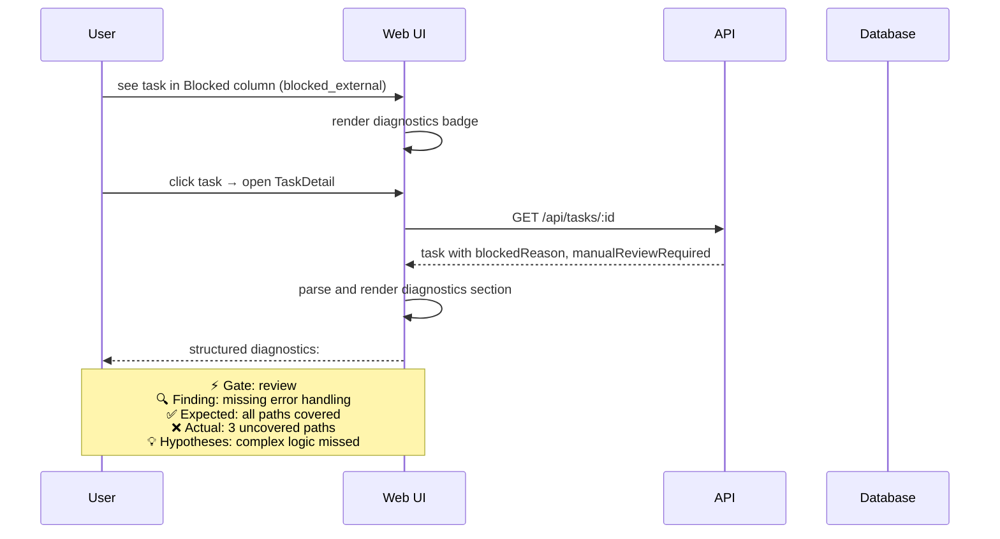

[← UC-handoff.history.view-executor-timeline](UC-handoff.history.view-executor-timeline.md) · [Back to README](../README.md) · [UC-chat.project-context.consult-ai-assistant →](UC-chat.project-context.consult-ai-assistant.md)

# UC-handoff.diagnostics.receive-escalation-diagnostics: Получение диагностики эскалации

**Актор:** User (Developer)

**Приоритет:** P1

**Ключевая функция:** HF7.4 Диагностика эскалации

**Канал:** GUI (TaskDetail)

**Описание:** При эскалации задачи пользователь получает структурированную диагностику: какой гейт упал, что ожидалось, что проверено, какие гипотезы рассматривались. Диагностика отображается в UI как часть blocked-статуса задачи.

**Диаграмма последовательности:**

**Основной поток:**

1. Пользователь видит задачу в колонке Blocked с badge "Manual review required".
2. При открытии TaskDetail диагностика отображается в структурированном виде.
3. Диагностика содержит: gate, finding, expected, actual, hypotheses.
4. Пользователь принимает решение: исправить, отклонить, изменить план, сбросить счётчик.

**Альтернативные потоки:**

- **A1. Нет диагностики:** если `blockedReason` пуст, UI показывает generic "Blocked" сообщение.
- **A2. Исправление:** пользователь может изменить план, скорректировать runtime-профиль и вызвать `retry_from_blocked`.

**Постусловия:** Пользователь получил диагностику и может принять обоснованное решение.

**Источник требований:** HF7.4 Диагностика эскалации, BR-ownership.automation-eligibility
