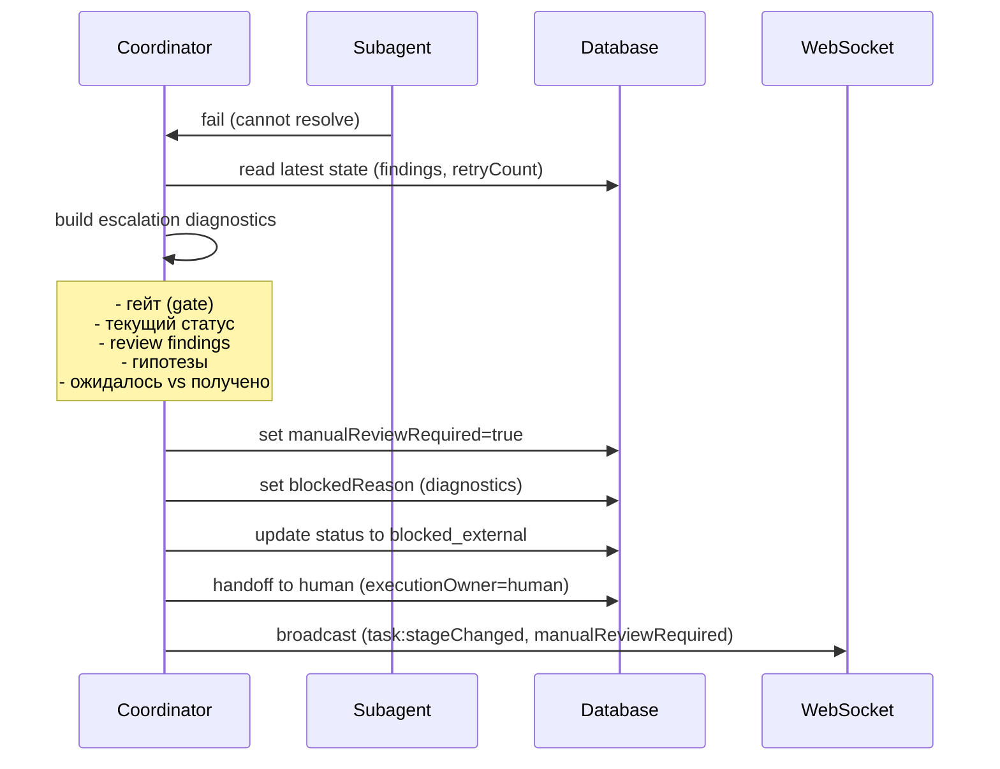

[← UC-handoff.transfer.ownership-to-executor](UC-handoff.transfer.ownership-to-executor.md) · [Back to README](../README.md) · [UC-handoff.history.view-executor-timeline →](UC-handoff.history.view-executor-timeline.md)

# UC-handoff.escalation.escalate-unresolvable-decision: Эскалация решения вне правил

**Актор:** Coordinator (Agent)

**Приоритет:** P1

**Ключевая функция:** HF7.2 Эскалация решений вне правил

**Канал:** Agent

**Описание:** Когда Coordinator или субагент сталкивается с решением, которое не может быть выведено из формальных правил (exhausted retries, неопределённая ситуация), задача эскалируется человеку. Эскалация включает полную диагностику: какой гейт упал, что ожидалось, что проверено, какие гипотезы.

**Диаграмма последовательности:**

**Основной поток:**

1. Coordinator определяет, что ситуация не может быть разрешена автоматически:
   - `reviewIterationCount >= maxReviewIterations`.
   - или runtime-гейт не может быть пройден (лимиты).
   - или субагент вернул non-retriable ошибку.
2. Coordinator собирает полную диагностику:
   - гейт, на котором произошла остановка.
   - последние finding-и (`AutoReviewFinding`).
   - что ожидалось (expected) и что проверено (actual).
   - гипотезы о причине.
3. Coordinator устанавливает `manualReviewRequired=true`, `blocked_external`.
4. Coordinator выполняет handoff → человеку (`executionOwner=human`).
5. WS-уведомление отправляется всем участникам.

**Альтернативные потоки:**

- **A1. Исправление человеком:** пользователь анализирует диагностику, исправляет проблему и вызывает `retry_from_blocked`.
- **A2. Отклонение изменения:** пользователь может закрыть задачу или изменить требования.

**Постусловия:** Задача эскалирована человеку с полной диагностикой. Статус: `blocked_external`, `manualReviewRequired=true`.

**Источник требований:** HF7.2 Эскалация решений вне правил, BR-inference.ownership.automation-eligibility, BR-trigger.task-lifecycle.blocked
