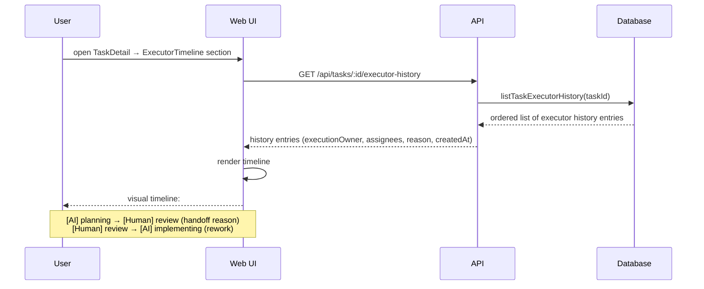

[← UC-handoff.escalation.escalate-unresolvable-decision](UC-handoff.escalation.escalate-unresolvable-decision.md) · [Back to README](../README.md) · [UC-handoff.diagnostics.receive-escalation-diagnostics →](UC-handoff.diagnostics.receive-escalation-diagnostics.md)

# UC-handoff.history.view-executor-timeline: Просмотр истории исполнителей задачи

**Актор:** User (Admin, Developer)

**Приоритет:** P2

**Ключевая функция:** HF7.3 История исполнителей

**Канал:** GUI (ExecutorTimeline) / API

**Описание:** Пользователь видит полную историю смены исполнителей задачи: кто и когда владел задачей, причина handoff, snapshot assignees и статуса на момент передачи. Данные берутся из `taskExecutorHistory`.

**Диаграмма последовательности:**

**Основной поток:**

1. Пользователь открывает детальный просмотр задачи и переходит к секции ExecutorTimeline.
2. API возвращает `listTaskExecutorHistory(taskId)` — все записи по `ownershipRevision`.
3. Каждая запись содержит: `actorKind` (ai/human), `executionOwner`, `assigneesSnapshotJson`, `statusSnapshot`, `reason`.
4. UI отображает timeline с визуальными индикаторами AI ↔ Human.

**Постусловия:** Пользователь видит полную историю смены исполнителей.

**Источник требований:** HF7.3 История исполнителей, BR-ownership.executor-history, BR-automation.plan-review-gate
