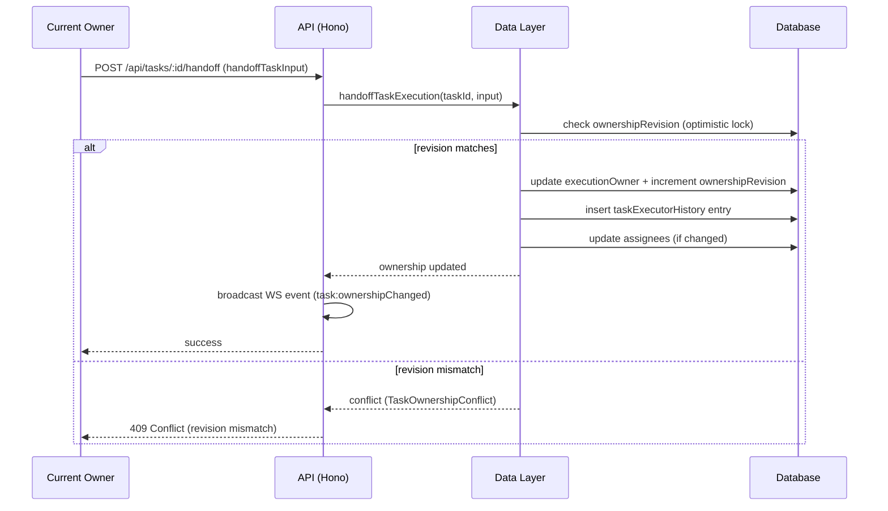

[← UC-accounting.blocking.block-on-limit-exceeded](UC-accounting.blocking.block-on-limit-exceeded.md) · [Back to README](README.md) · [UC-handoff.escalation.escalate-unresolvable-decision →](UC-handoff.escalation.escalate-unresolvable-decision.md)

# UC-handoff.transfer.ownership-to-executor: Передача владения изменением (handoff)

**Актор:** User (Developer) / Coordinator (Agent)

**Приоритет:** P0

**Ключевая функция:** HF7.1 Передача владения изменением

**Канал:** API (REST) / Agent

**Описание:** Владение задачей может быть передано между исполнителями (AI ↔ Human, Human → Human). Каждая передача фиксируется в `taskExecutorHistory` с монотонной `ownershipRevision` для оптимистичной блокировки. Handoff возможен только при совпадении `ownershipRevision`.

**Диаграмма последовательности:**

**Основной поток:**

1. Текущий владелец (человек через UI или Coordinator) инициирует handoff.
2. API вызывает `handoffTaskExecution` с `ownershipRevision`, `executionOwner`, `reason`.
3. Data layer атомарно проверяет совпадение `ownershipRevision` в БД.
4. При совпадении: обновляется `executionOwner`, инкрементируется `ownershipRevision`, создаётся запись в `taskExecutorHistory`.
5. При несовпадении: возвращается `409 Conflict` с `TaskOwnershipConflict`.
6. WS-событие `task:ownershipChanged` уведомляет всех клиентов.

**Альтернативные потоки:**

- **A1. AI → Human handoff:** Coordinator автоматически передаёт задачу человеку при эскалации (exhausted retries). Устанавливает `executionOwner=human`.
- **A2. Human → AI handoff:** пользователь передаёт задачу AI через action `start_ai`. Coordinator устанавливает `executionOwner=ai`.
- **A3. Assignment:** при handoff могут быть обновлены assignees (кто назначен на задачу).
- **A4. Locked task:** `allowLockedBy` — handoff может быть выполнен даже если задача заблокирована Coordinator-ом.

**Постусловия:** Владение задачей передано. `ownershipRevision` инкрементирован. Запись в `taskExecutorHistory` создана. WS-уведомление отправлено.

**Источник требований:** HF7.1 Передача владения изменением, BR-fact.ownership.assignment, BR-constraint.ownership.handoff, BR-constraint.ownership.executor-history
