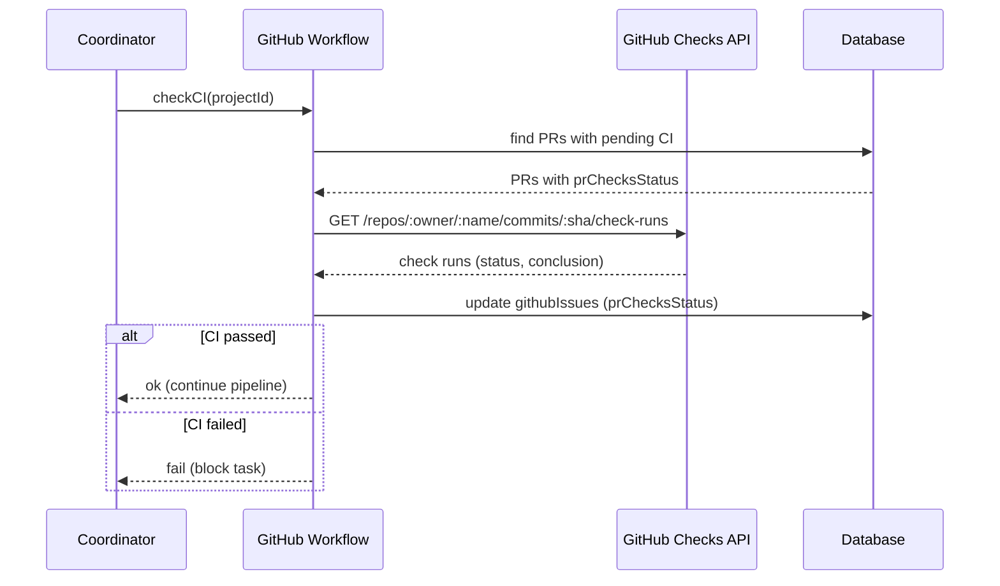

[← UC-integration.pr-mr.publish-github-pr](UC-integration.pr-mr.publish-github-pr.md) · [Back to README](../README.md) · [UC-warmup.preheat.warmup-runtime-session →](UC-warmup.preheat.warmup-runtime-session.md)

# UC-integration.ci-status.check-pipeline-status: Проверка CI-статусов PR/MR

**Актор:** Coordinator (Schedule) → GitHub Workflow

**Приоритет:** P2

**Ключевая функция:** HF11.3 Проверка CI-статусов

**Канал:** Schedule (cron)

**Описание:** Coordinator проверяет статусы CI-проверок для опубликованных PR/MR через GitHub Checks API / GitLab CI API. Статус сохраняется в `githubIssues.prChecksStatus` / `gitlabIssues.mrChecksStatus`. Задача не переходит на следующую стадию, пока CI не пройден.

**Диаграмма последовательности:**

**Основной поток:**

1. Coordinator запускает проверку CI для всех опубликованных PR/MR.
2. GitHubWorkflow запрашивает GitHub Checks API для commit SHA.
3. Статус обновляется в `githubIssues.prChecksStatus` (queued/in_progress/completed, conclusion: success/failure).
4. Если CI не пройден — задача не переходит на следующую стадию.
5. При успешном CI — конвейер продолжается.

**Альтернативные потоки:**

- **A1. GitLab CI:** `gitlabWorkflow.ts` проверяет статусы через `MergeRequests API`.
- **A2. CI не настроен:** `prChecksStatus=null` — проверка пропускается.
- **A3. CI timeout:** если CI висит слишком долго, Coordinator эскалирует задачу.

**Постусловия:** CI-статус обновлён. Задача либо продолжает конвейер, либо блокируется.

**Источник требований:** HF11.3 Проверка CI-статусов, BR-git.vcs-workflow
