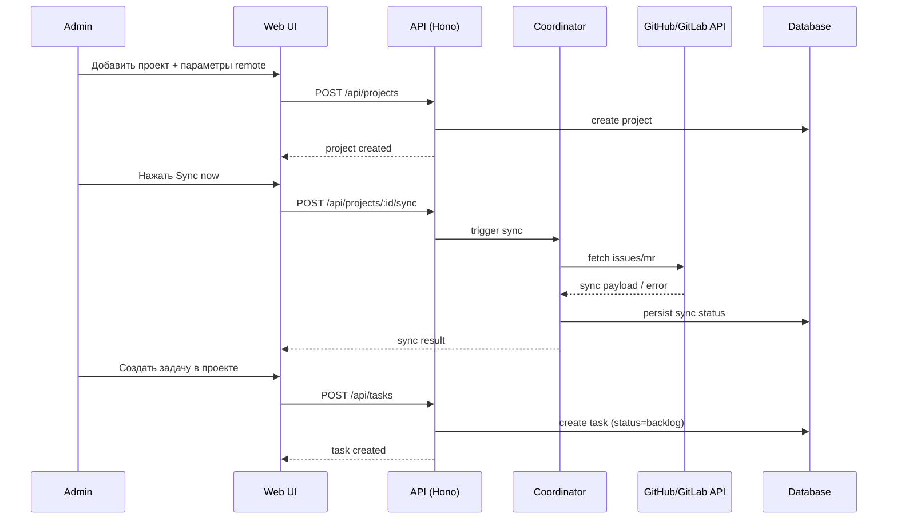

[← UC-integration.issues.sync-github-issue](UC-integration.issues.sync-github-issue.md) · [Back to README](../README.md) · [UC-integration.pr-mr.publish-github-pr →](UC-integration.pr-mr.publish-github-pr.md)

# UC-integration.issues.bootstrap-project-sync-and-create-task: Добавление проекта, синхронизация и постановка задачи

**Актор:** Администратор проекта → Web UI → API → Coordinator

**Приоритет:** P1

**Ключевая функция:** HF11.1 Синхронизация с Issues, HF2.1 Просмотр изменений по стадиям

**Канал:** Mixed (GUI + API + Schedule/Agent)

**Описание:** Администратор добавляет проект с привязкой к удалённому GitHub/GitLab-репозиторию, запускает синхронизацию и после успешного или частично успешного sync может поставить задачу в этом проекте. Система должна не блокировать ручную постановку задач при временных сбоях VCS sync.

**Диаграмма последовательности:**

**Основной поток:**

1. Администратор открывает экран управления проектами.
2. Создаёт проект и указывает параметры подключения к удалённому репозиторию (GitHub/GitLab).
3. Система сохраняет проект и настройки подключения.
4. Администратор запускает `Sync now`.
5. Coordinator инициирует синхронизацию Issues/MR для проекта.
6. Результат синхронизации (успех/ошибка) сохраняется и отображается в интерфейсе.
7. Администратор открывает Kanban-доску проекта.
8. Администратор создаёт задачу через форму добавления задачи.
9. Задача сохраняется в проекте в статусе `backlog` и отображается на доске.

**Альтернативные потоки:**

- **A1. VCS sync временно недоступен:** ошибка синхронизации сохраняется (`syncError`), но ручное создание задачи остаётся доступным.
- **A2. Sync отключён для репозитория:** шаг sync пропускается по флагу конфигурации; создание задач доступно.
- **A3. Недостаточно прав:** не-администратор не может менять параметры проекта/репозитория.

**Постусловия:** Проект создан и доступен в UI; синхронизация удалённого репозитория выполнена (или зафиксирована диагностируемая ошибка); ручная постановка задач в проекте доступна и работоспособна.

**Источник требований:** [US-integration.issues.bootstrap-project-sync-and-create-task](../user-stories/US-integration.issues.bootstrap-project-sync-and-create-task.md), HF11.1, HF2.1, BR-fact.git.vcs-workflow
