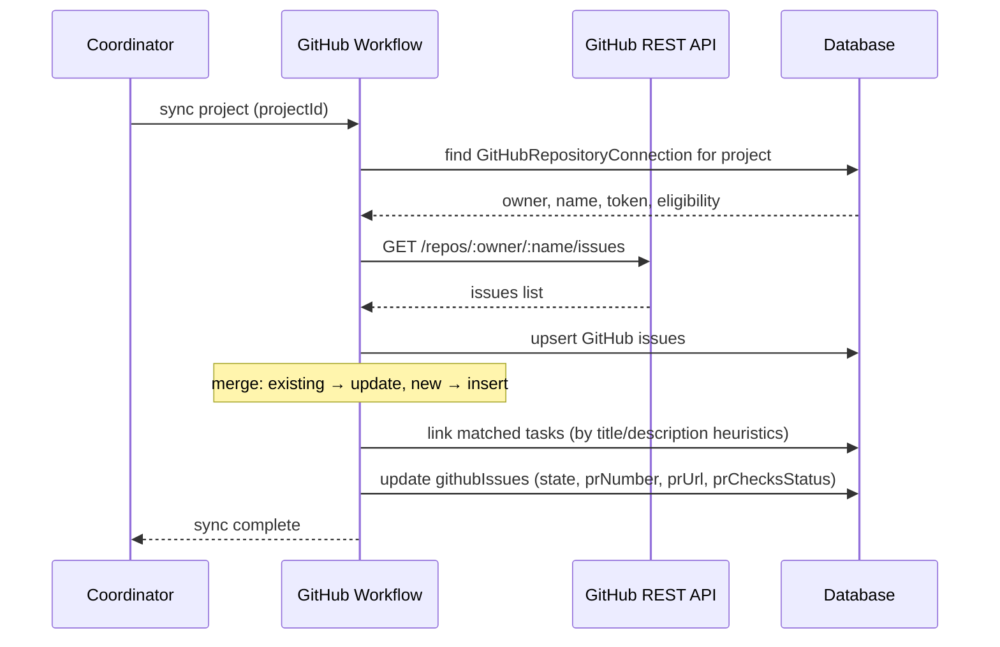

[← UC-audit.errors.classify-runtime-error](UC-audit.errors.classify-runtime-error.md) · [Back to README](../README.md) · [UC-integration.pr-mr.publish-github-pr →](UC-integration.pr-mr.publish-github-pr.md)

# UC-integration.issues.sync-github-issue: Синхронизация задач с GitHub Issues

**Актор:** Coordinator (Schedule) → GitHub Workflow

**Приоритет:** P2

**Ключевая функция:** HF11.1 Синхронизация с Issues

**Канал:** Schedule (cron)

**Описание:** Coordinator синхронизирует задачи AIF Handoff с GitHub Issues: статусы, заголовки, assignees, комментарии. Связь хранится в таблице `githubIssues` с полями issueNumber, taskId, state, prNumber, prState, sourceUpdatedAt.

**Диаграмма последовательности:**

**Основной поток:**

1. Coordinator запускает синхронизацию по расписанию или по запросу.
2. GitHubWorkflow читает конфигурацию репозитория (`githubRepositories`).
3. Запрашивает Issues и MR через GitHub REST API.
4. Обновляет `githubIssues`: создаёт новые записи, обновляет существующие.
5. Пытается связать Issues с задачами AIF Handoff (по title/description/assignee).
6. Обновляет статусы PR: открыт/закрыт/merged, CI-checks.

**Альтернативные потоки:**

- **A1. GitLab:** `gitlabWorkflow.ts` — аналогичная синхронизация с GitLab Issues/MR.
- **A2. Sync disabled:** `githubRepositories.enabled=false` — синхронизация пропускается.
- **A3. Error:** `syncError` сохраняется для диагностики.

**Постусловия:** GitHub Issues синхронизированы с задачами AIF Handoff.

**Источник требований:** HF11.1 Синхронизация с Issues, BR-git.vcs-workflow
