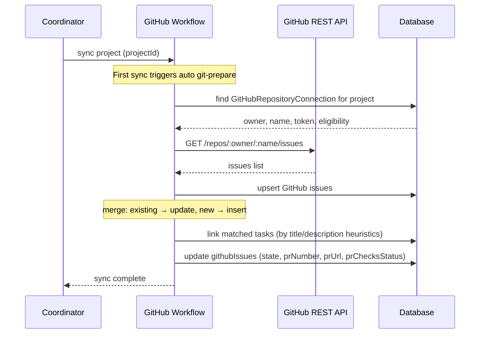

[← UC-audit.errors.classify-runtime-error](UC-audit.errors.classify-runtime-error.md) · [Back to README](README.md) · [UC-integration.issues.bootstrap-project-sync-and-create-task →](UC-integration.issues.bootstrap-project-sync-and-create-task.md)

# UC-integration.issues.sync-github-issue: Синхронизация задач с GitHub Issues

**Актор:** Coordinator (Schedule) → GitHub Workflow

**Приоритет:** P2

**Ключевая функция:** HF11.1 Синхронизация с Issues

**Канал:** Schedule (cron)

**Описание:** Coordinator синхронизирует задачи AIF Handoff с GitHub Issues: статусы, заголовки, assignees, комментарии. Связь хранится в таблице `githubIssues` с полями issueNumber, taskId, state, prNumber, prState, sourceUpdatedAt.

**Диаграмма последовательности:**

**Основной поток:**

1. Coordinator запускает синхронизацию по расписанию или по запросу.
2. Best-effort `git pull --ff-only origin <current-branch>` в локальном репозитории проекта — обновление рабочей копии до состояния remote. Неудача (нет remote, пустой репозиторий, конфликт) не блокирует синхронизацию.
3. При первом Sync now (или при `gitPreparedAt = null`) перед импортом задач агент автоматически инициализирует локальный репозиторий: добавляет `origin`, настраивает credential helper (`x-access-token`), устанавливает `safe.directory`, выполняет fetch и checkout дефолтной ветки, а также инициализирует AI Factory scaffold при его отсутствии. Неудача prepare немедленно возвращает ошибку 502 и блокирует импорт.
4. GitHubWorkflow читает конфигурацию репозитория (`githubRepositories`).
5. Запрашивает Issues и MR через GitHub REST API.
6. Обновляет `githubIssues`: создаёт новые записи, обновляет существующие.
7. Пытается связать Issues с задачами AIF Handoff (по title/description/assignee).
8. Обновляет статусы PR: открыт/закрыт/merged, CI-checks.

**Альтернативные потоки:**

- **A1. GitLab:** `gitlabWorkflow.ts` — аналогичная синхронизация с GitLab Issues/MR.
- **A2. Sync disabled:** `githubRepositories.enabled=false` — синхронизация пропускается.
- **A3. Error:** `syncError` сохраняется для диагностики.
- **A4. Git pull unavailable:** нет remote `origin`, detached HEAD или пустой репозиторий — `pullDefaultBranch` логирует причину на debug-уровне и продолжает синхронизацию без ошибки.

**Постусловия:** GitHub Issues синхронизированы с задачами AIF Handoff.

**Источник требований:** HF11.1 Синхронизация с Issues, BR-fact.git.vcs-workflow
