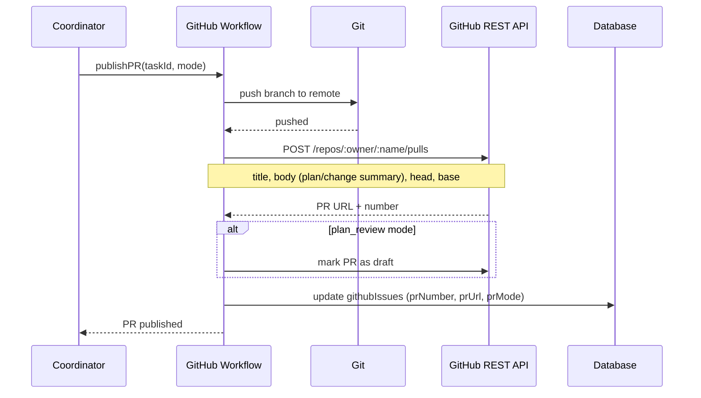

[← UC-integration.issues.bootstrap-project-sync-and-create-task](UC-integration.issues.bootstrap-project-sync-and-create-task.md) · [Back to README](../README.md) · [UC-integration.pr-mr.resolve-review-decision →](UC-integration.pr-mr.resolve-review-decision.md)

# UC-integration.pr-mr.publish-github-pr: Публикация Pull Request на GitHub

**Актор:** Coordinator (Agent) → GitHub Workflow

**Приоритет:** P2

**Ключевая функция:** HF11.2 Публикация PR/MR

**Канал:** Agent (GitHub REST API)

**Описание:** Coordinator публикует Pull Request на GitHub с изменениями задачи: пушит ветку, создаёт PR с описанием (Change Plan summary), привязывает к Issue. PR Mode может быть `plan_review` (план для утверждения) или `completion` (готовое изменение).

**Диаграмма последовательности:**

**Основной поток:**

1. Coordinator запускает публикацию PR для задачи с GitHub-привязкой.
2. GitHubWorkflow пушит ветку задачи в remote.
3. Создаёт PR через REST API.
4. Для `plan_review` mode PR создаётся в Draft-режиме.
5. Описание PR содержит план или сводку изменений.
6. Ссылка сохраняется в `githubIssues.prUrl`.

**Альтернативные потоки:**

- **A1. GitLab MR:** аналогично `gitlabWorkflow.ts` — `POST /projects/:id/merge_requests`.
- **A2. Plan Review:** PR публикуется с планом; при утверждении (`planReviewState=approved`) продолжается реализация.
- **A3. VCS недоступен:** syncError сохраняется; задача не переходит на следующую стадию.

**Постусловия:** PR опубликован. Ссылки сохранены.

**Источник требований:** HF11.2 Публикация PR/MR, BR-fact.git.vcs-workflow
