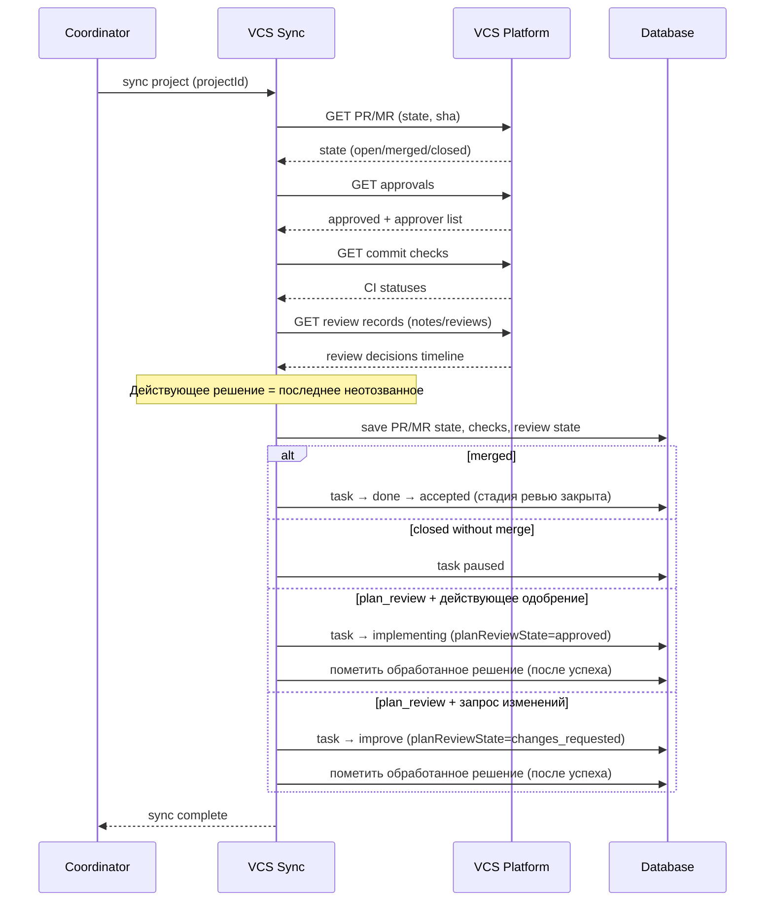

[← UC-integration.pr-mr.publish-github-pr](UC-integration.pr-mr.publish-github-pr.md) · [Back to README](README.md) · [UC-integration.ci-status.check-pipeline-status →](UC-integration.ci-status.check-pipeline-status.md)

# UC-integration.pr-mr.resolve-review-decision: Обработка решения ревью по PR/MR

**Актор:** Coordinator (Agent) → VCS Sync

**Приоритет:** P1

**Ключевая функция:** HF11.1 Синхронизация с Issues, HF11.2 Публикация PR/MR (гейт HF4.4 Plan Review Gate)

**Канал:** Schedule/Agent (VCS REST API)

**Описание:** При сверке связанного PR/MR система считывает состояние MR, состояние одобрений, статусы CI и записи ревью, определяет **действующее** решение ревьюера и применяет его к задаче: одобрение открывает гейт плана, запрос изменений возвращает задачу на доработку, слияние принимает результат. Отозванное одобрение и повторная сверка состояние задачи не меняют.

**Диаграмма последовательности:**

**Основной поток:**

1. Coordinator запускает сверку связанных задач и PR/MR проекта (по расписанию или по запросу).
2. Система считывает состояние PR/MR: открыт, закрыт, слит; и статусы CI.
3. Система считывает состояние одобрений PR/MR: признак одобрения и список одобряющих.
4. Система считывает записи ревью PR/MR (решения ревьюера с их последовательностью).
5. Система сохраняет состояние PR/MR и вычисленный статус ревью; одобренным считается состояние с фактическим одобряющим.
6. Система определяет действующее решение ревьюера — последнее по времени, не отозванное.
7. Задача в стадии плана: действующее одобрение переводит её в реализацию с признаком утверждённого плана.
8. Задача в стадии плана при запросе изменений: задача возвращается к планированию, обратная связь ревьюера сохраняется как вход для доработки плана.
9. Задача в стадии ревью или завершённая: запрос изменений возвращает её в реализацию с пометкой о переработке и сбросом состояния фиксации.
10. Слияние PR/MR принимает результат: если задача ещё не завершила стадию ревью, стадия закрывается решением человека, после чего задача принимается; рабочее дерево задачи освобождается.
11. Отметка об обработанном решении сохраняется только после успешного перехода; повторная сверка не применяет то же решение второй раз.

**Альтернативные потоки:**

- **A1. Отзыв одобрения:** решение ревьюера отозвано явно или автоматически сброшено при обновлении содержимого ветки — одобрение не открывает гейт и не принимает результат.
- **A2. Конкурентное изменение состояния:** переход отвергнут из-за изменившегося состояния задачи — отметка об обработке не сохраняется, решение применяется при следующей сверке, ошибка фиксируется в журнале.
- **A3. Несколько необработанных решений:** применяется последнее по времени; более ранние решения не применяются.
- **A4. PR/MR закрыт без слияния:** задача приостанавливается и не продолжает конвейер.
- **A5. Нет связанного PR/MR:** сверка не меняет состояние задачи.

**Постусловия:** Задача отражает действующее решение ревьюера; обработанное решение помечено, поэтому повторные сверки идемпотентны и не «отбрасывают» задачу назад.

**Источник требований:** HF11.1 Синхронизация с Issues, HF11.2 Публикация PR/MR, HF4.4 Plan Review Gate, BR-inference.git.review-decision-precedence, BR-trigger.automation.plan-review-gate, BR-fact.git.vcs-workflow
