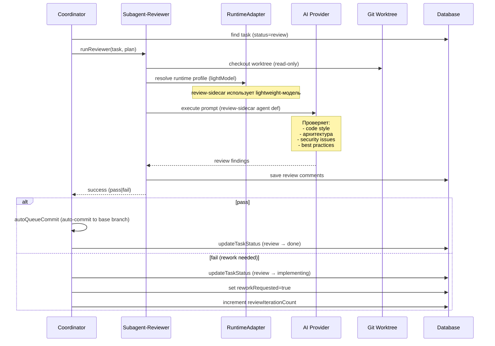

[← UC-pipeline.verification.verify-change-result](UC-pipeline.verification.verify-change-result.md) · [Back to README](../README.md) · [UC-pipeline.manual-override.intervene-task-stage →](UC-pipeline.manual-override.intervene-task-stage.md)

# UC-pipeline.completion.auto-complete-pipeline: Автоматическое завершение конвейера

**Актор:** Coordinator (Agent) → Subagent-Reviewer

**Приоритет:** P0

**Ключевая функция:** HF1.6 Завершение конвейера

**Канал:** Agent (runtime adapter → AI-провайдер)

**Описание:** Coordinator запускает ревьюера (review-sidecar) для задачи в статусе `review`. Ревьюер выполняет код-ревью реализованного изменения, проверяет стиль, архитектуру, безопасность и принимает решение: пропустить в `done` или вернуть на доработку.

**Диаграмма последовательности:**

**Основной поток:**

1. Coordinator выбирает задачу в статусе `review`.
2. Coordinator запускает `runReviewer` — read-only sidecar-агент.
3. Ревьюер использует `lightModel` (легковесную модель для экономии затрат).
4. Загружает agent definition `review-sidecar`.
5. AI-провайдер выполняет код-ревью: анализ изменённых файлов, поиск дефектов, уязвимостей, нарушений стиля.
6. При успехе ревью:
   - Coordinator выполняет `autoQueueCommit` — gate-коммит с приведением к целевой ветке.
   - Задача переводится в `done`.
7. При обнаружении проблем задача возвращается в `implementing` с `reworkRequested=true`.

**Альтернативные потоки:**

- **A1. Skip-review:** если `skipReview=true`, Coordinator пропускает review и переводит задачу из `verify` в `done` (через `autoQueueCommit`).
- **A2. Auto-queue mode:** если проект использует `autoQueueMode`, после `done` задача автоматически переходит в `accepted` через `processAutoQueueAdvance`.
- **A3. Auto-review state:** результаты ревью сохраняются как `AutoReviewState` (findings, strategy, iteration).
- **A4. Коммит-гейт:** `autoQueueCommit.ts` выполняет `git add`, `git commit` и проверяет статус. При ошибке задача блокируется.

**Постусловия:** Изменение закоммичено в целевую ветку. Задача в статусе `done` (или `accepted` при auto-queue). Результаты ревью сохранены.

**Источник требований:** HF1.6 Завершение конвейера, BR-automation.pipeline, BR-automation.completion-commit, BR-automation.auto-review
