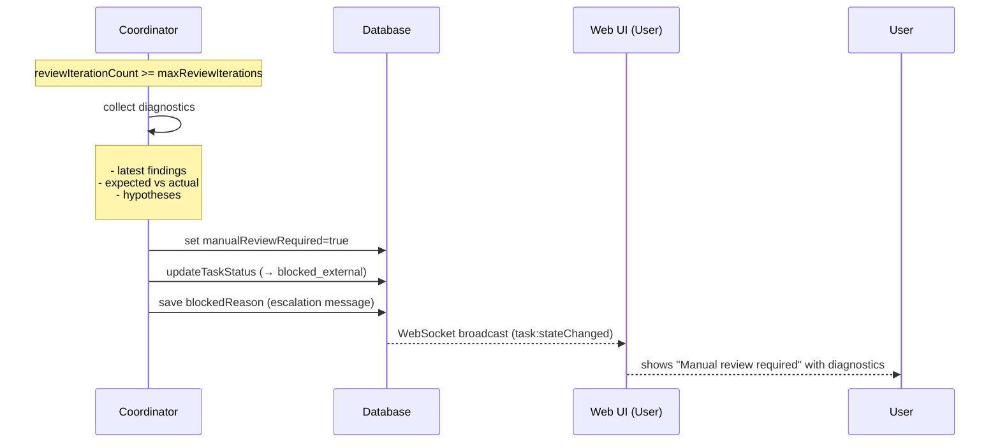

[← UC-pipeline.independent-verification.verify-independently](UC-pipeline.independent-verification.verify-independently.md) · [Back to README](../README.md) · [UC-dashboard.board.view-kanban-columns →](UC-dashboard.board.view-kanban-columns.md)

# UC-pipeline.escalation.escalate-after-exhausted-retries: Эскалация при исчерпании попыток исправления

**Актор:** Coordinator (Agent) → Pipeline Loop

**Приоритет:** P1

**Ключевая функция:** HF5.5 Эскалация при исчерпании попыток

**Канал:** Agent (coordinator)

**Описание:** Если задача не прошла review-цикл после `maxReviewIterations` итераций, Coordinator эскалирует её человеку: устанавливает `manualReviewRequired=true`, `blocked_external` и сохраняет диагностику (крайний finding, что ожидалось, что проверено, какие гипотезы).

**Диаграмма последовательности:**

**Основной поток:**

1. Coordinator обнаруживает, что `reviewIterationCount >= maxReviewIterations`.
2. Coordinator собирает диагностику:
   - Последние finding-и sidecar-агента (`AutoReviewFinding`).
   - Что ожидалось (expected vs actual).
   - Какие гипотезы были проверены.
3. Coordinator устанавливает `manualReviewRequired=true`, `blocked_external` с `blockedReason`, содержащим диагностику.
4. WebSocket-трансляция уведомляет UI.
5. Пользователь видит задачу в статусе `blocked_external` с пометкой "Требуется ручная проверка".

**Альтернативные потоки:**

- **A1. Ручное решение:** пользователь открывает задачу, анализирует диагностику, принимает решение: отклонить изменение, исправить вручную, сбросить счётчик и продолжить цикл.
- **A2. Изменение условий:** пользователь может скорректировать план, изменить runtime-профиль и вызвать `retry_from_blocked`.

**Постусловия:** Задача заблокирована (`blocked_external`) с полной диагностикой. Ожидает ручного вмешательства.

**Источник требований:** HF5.5 Эскалация при исчерпании попыток, BR-trigger.task-lifecycle.blocked, BR-inference.ownership.automation-eligibility
