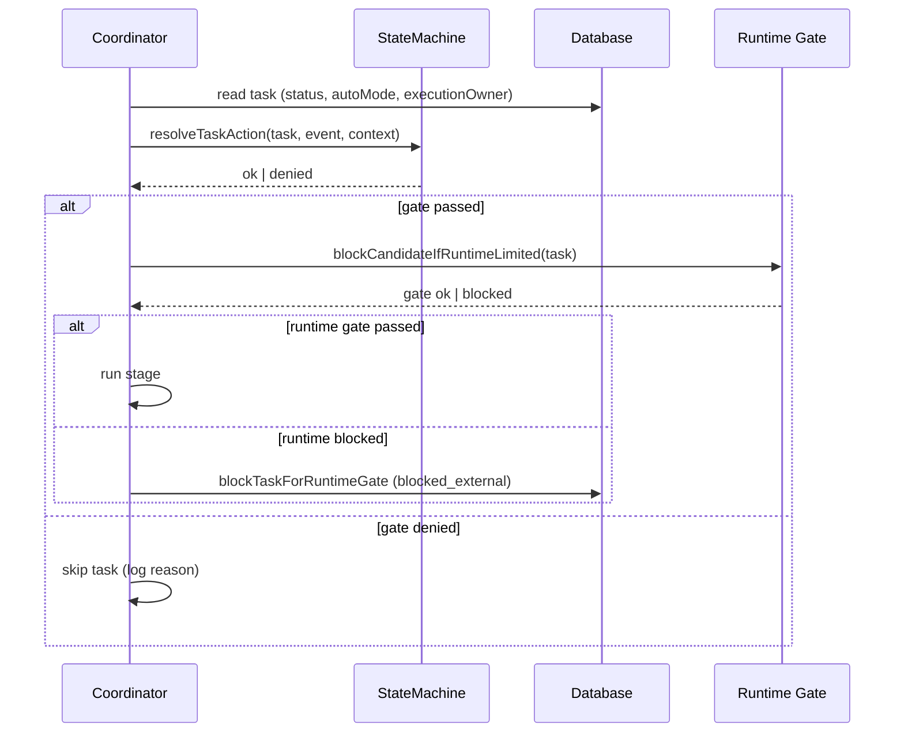

[← UC-pipeline.manual-override.intervene-task-stage](UC-pipeline.manual-override.intervene-task-stage.md) · [Back to README](README.md) · [UC-pipeline.sidecar.review-with-sidecar-agent →](UC-pipeline.sidecar.review-with-sidecar-agent.md)

# UC-pipeline.gate.enforce-stage-transition-gate: Формальные гейты переходов между стадиями

**Актор:** Coordinator (Agent) → State Machine

**Приоритет:** P0

**Ключевая функция:** HF5.1 Формальные гейты переходов

**Канал:** Agent (coordinator + data layer)

**Описание:** Каждый переход задачи между стадиями защищён формальным гейтом, реализованным в `stateMachine.ts`. State machine (`resolveTaskAction`) проверяет, что переход разрешён для текущего статуса, `executionOwner` и контекста актора. Дополнительно Coordinator проверяет runtime-гейт (лимиты) перед запуском субагента.

**Диаграмма последовательности:**

**Основной поток:**

1. Coordinator для каждой задачи-кандидата вызывает `resolveTaskAction` с соответствующим `event` (определяемым стадией).
2. State machine проверяет: статус ∈ `from`, `autoMode`, `executionOwner`, роль актора, назначение.
3. Если переход не разрешён — Coordinator логирует причину и пропускает задачу.
4. Если переход разрешён — Coordinator проверяет runtime-гейт: `blockCandidateIfRuntimeLimited(task)`.
5. Runtime-гейт проверяет `RuntimeLimitSnapshot` проекта — если лимит превышен, задача блокируется.
6. При прохождении обоих гейтов Coordinator запускает stage runner.
7. Stage runner определяет `onSuccess` статус для успешного выполнения.

**Альтернативные потоки:**

- **A1. Denied по статусу:** `action_not_allowed` — событие не применимо к текущему статусу (например, `start_ai` из `implementing`).
- **A2. Denied по owner:** `ai_handoff_required` — действие требует AI-владения, но `executionOwner=human`.
- **A3. Denied по авторизации:** `actor_not_authorized` — участник не активен или роль не позволяет.
- **A4. Runtime-гейт:** `proactivelyBlockTaskForRuntimeGate` — задача блокируется до reset-окна лимита.
- **A5. Plan Review Gate:** дополнительный гейт для задач с `planReviewState=pending` — ожидание утверждения плана человеком.

**Постусловия:** Задача либо прошла гейт и запущена на выполнение, либо заблокирована с указанием причины.

**Источник требований:** HF5.1 Формальные гейты переходов, BR-constraint.task-lifecycle.transitions, BR-trigger.automation.runtime-limit-gate
