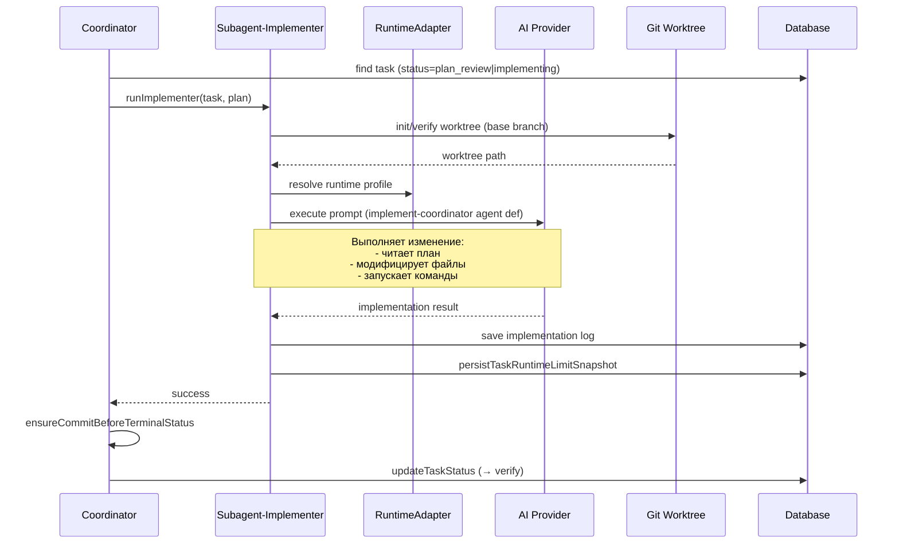

[← UC-pipeline.plan.refine-plan-second-pass](UC-pipeline.plan.refine-plan-second-pass.md) · [Back to README](../README.md) · [UC-pipeline.verification.verify-change-result →](UC-pipeline.verification.verify-change-result.md)

# UC-pipeline.implementation.execute-change-in-isolation: Реализация изменения в изолированном контексте

**Актор:** Coordinator (Agent) → Subagent-Implementer

**Приоритет:** P0

**Ключевая функция:** HF1.4 Реализация изменения AI, HF4.1 Изолированное выполнение

**Канал:** Agent (runtime adapter → AI-провайдер)

**Описание:** Coordinator запускает AI-реализатора (implement-coordinator) для задачи в статусе `plan_review` или `implementing`. Реализатор выполняет код изменения в изолированном Git worktree согласно утверждённому плану и сохраняет результат.

**Диаграмма последовательности:**

**Основной поток:**

1. Coordinator выбирает задачу в статусе `plan_review` или `implementing` (при rework).
2. Coordinator проверяет Git worktree задачи: если отсутствует — создаёт (`git worktree add` с веткой на base branch).
3. Coordinator запускает `runImplementer` — субагент-реализатор.
4. Реализатор читает план задачи, разрешает runtime-профиль.
5. Загружает agent definition `implement-coordinator`.
6. AI-провайдер через runtime-адаптер выполняет реализацию: читает/изменяет файлы, запускает команды в worktree.
7. Реализатор сохраняет лог выполнения и снапшот лимитов.
8. Coordinator выполняет `ensureCommitBeforeTerminalStatus` — gate-коммит всех изменений перед переходом.
9. Coordinator переводит задачу в статус `verify`.
10. Coordinator отправляет WS-событие `task:stageChanged` (→ verifying).

**Альтернативные потоки:**

- **A1. Fast-fix:** задача с `isFix=true`: Coordinator использует ускоренный промпт (fast-fix) без полного plan review.
- **A2. Runtime-гейт заблокировал:** `proactivelyBlockTaskForRuntimeGate` — задача блокируется с `blocked_external`.
- **A3. Rework (review → implementing):** Coordinator устанавливает `reworkRequested=true`, инкрементирует `reviewIterationCount`.
- **A4. Ошибка выполнения:** ErrorClassifier (rate_limit, tool_error, auth); Coordinator инкрементирует `retryCount` и блокирует задачу.
- **A5. Scheduled task:** если `scheduledAt` в будущем, задача ждёт на `implementing` до наступления времени.

**Постусловия:** Код изменения реализован и закоммичен в изолированной ветке. Задача в статусе `verify`. Лог выполнения сохранён.

**Источник требований:** HF1.4 Реализация изменения AI, HF4.1 Изолированное выполнение, BR-constraint.git.worktree-isolation, BR-trigger.automation.completion-commit
