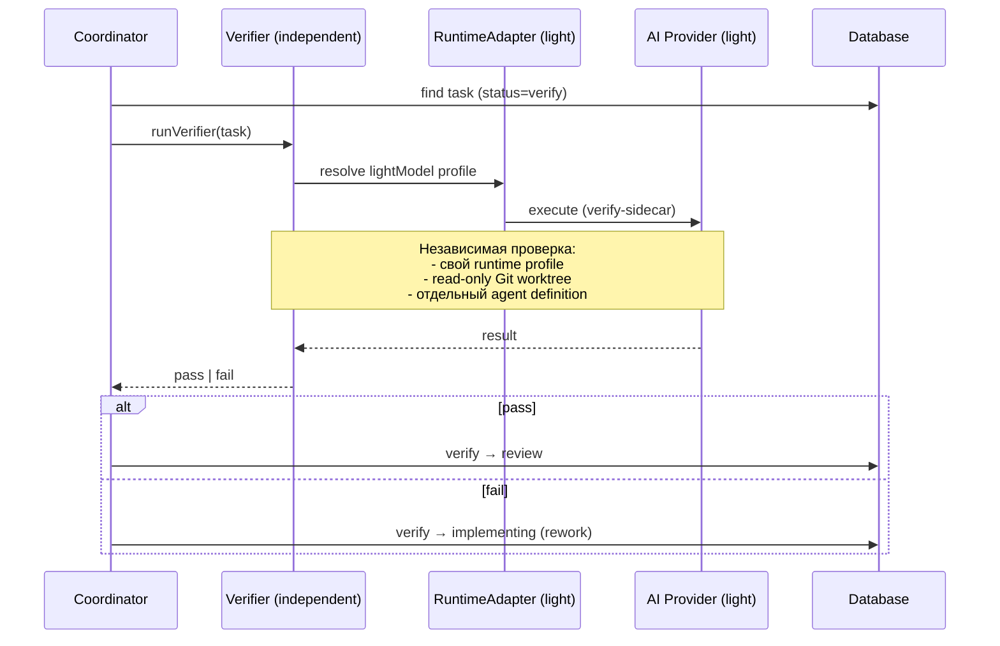

[← UC-pipeline.review-loop.iterate-review-feedback](UC-pipeline.review-loop.iterate-review-feedback.md) · [Back to README](../README.md) · [UC-pipeline.escalation.escalate-after-exhausted-retries →](UC-pipeline.escalation.escalate-after-exhausted-retries.md)

# UC-pipeline.independent-verification.verify-independently: Независимая верификация после гейтов

**Актор:** Coordinator (Agent) → Subagent-Verifier

**Приоритет:** P1

**Ключевая функция:** HF5.4 Независимая верификация

**Канал:** Agent (runtime adapter → AI-провайдер)

**Описание:** После прохождения формального гейта и перед ревью Coordinator запускает независимую верификацию (verify-sidecar). Верификатор действует независимо от реализатора: использует отдельный runtime-профиль (lightweight-модель), read-only доступ и собственный agent definition.

**Диаграмма последовательности:**

**Основной поток:**

1. Coordinator выбирает задачу в статусе `verify`.
2. Запускает `runVerifier` с отдельным runtime-профилем (`reviewRuntimeProfileId`).
3. Верификатор использует lightweight-модель (например, `lightModel` конфигурации).
4. Выполняет read-only проверку изменения.
5. Результат: `pass` → переход в `review`; `fail` → возврат в `implementing`.

**Альтернативные потоки:**

- **A1. verify не настроен:** `runPostVerify=false` — задача переходит из `implementing` в `review` минуя верификацию (для human-owner).
- **A2. Human verify:** для human-owner задачи человек вызывает `pass_verification` или `fail_verification` через UI.

**Постусловия:** Изменение прошло независимую верификацию (review) или возвращено на доработку.

**Источник требований:** HF5.4 Независимая верификация, BR-automation.qa
