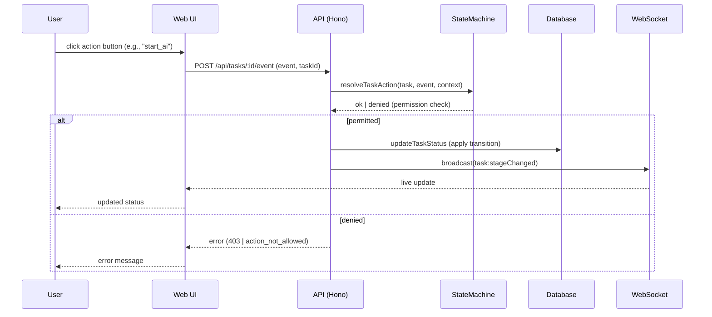

[← UC-pipeline.completion.auto-complete-pipeline](UC-pipeline.completion.auto-complete-pipeline.md) · [Back to README](../README.md) · [UC-pipeline.gate.enforce-stage-transition-gate →](UC-pipeline.gate.enforce-stage-transition-gate.md)

# UC-pipeline.manual-override.intervene-task-stage: Ручное управление движением задачи

**Актор:** User (Developer, Tech Lead)

**Приоритет:** P1

**Ключевая функция:** HF1.7 Ручное управление движением

**Канал:** GUI (REST API)

**Описание:** Пользователь выполняет действие над задачей через UI или API, принудительно переводя её на другую стадию. Доступные действия определяются статусом задачи, `executionOwner` и ролью пользователя.

**Диаграмма последовательности:**

**Основной поток:**

1. Пользователь открывает задачу в UI и нажимает кнопку действия (например, "Start AI", "Replan", "Approve Done").
2. UI отправляет POST-запрос в API: `/api/tasks/:id/event` с `TaskEventInput`.
3. API вызывает `resolveTaskAction(task, event, context)` — state machine проверяет допустимость перехода, роль пользователя, authorship.
4. Если переход разрешён, API вызывает `updateTaskStatus` — атомарный переход статуса.
5. API отправляет WebSocket-событие `task:stageChanged`.
6. UI получает обновление и отображает новый статус.
7. API записывает событие аудита `TaskEvent`.

**Альтернативные потоки:**

- **A1. Действие не разрешено:** state machine возвращает `{ok: false, code, error}` — UI отображает причину отказа.
- **A2. Human-owner задачи:** для `executionOwner=human` доступны actions: `start_human_work`, `mark_plan_review`, `submit_implementation`, `complete_review`, `pass_verification`, `fail_verification`.
- **A3. Admin bypass:** администратор может выполнить action, даже если не назначен исполнителем задачи.
- **A4. Action из blocked_external:** `retry_from_blocked` — восстановление задачи из блокировки (возврат к `blockedFromStatus`).

**Постусловия:** Задача переведена на указанную стадию или пользователь получил мотивированный отказ. Событие аудита записано.

**Источник требований:** HF1.7 Ручное управление движением, BR-auth.roles, BR-auth.member-scope, BR-task-lifecycle.transitions
