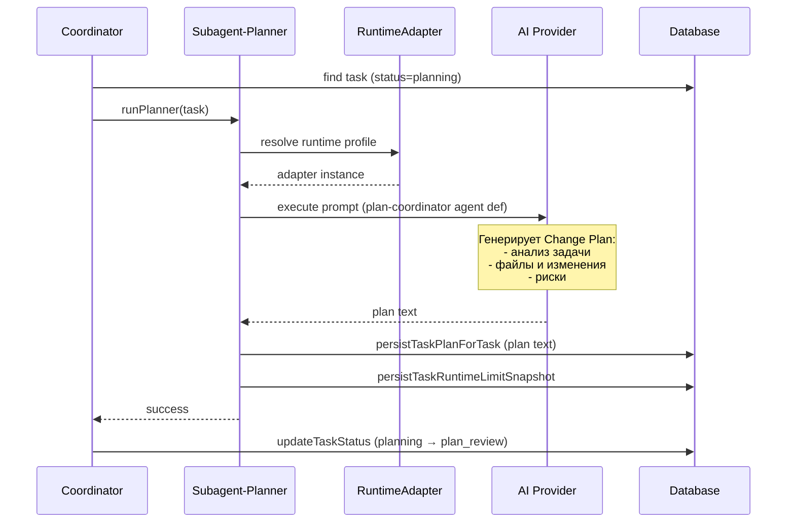

[← UC-pipeline.stage.auto-advance-task](UC-pipeline.stage.auto-advance-task.md) · [Back to README](../README.md) · [UC-pipeline.plan.refine-plan-second-pass →](UC-pipeline.plan.refine-plan-second-pass.md)

# UC-pipeline.plan.generate-change-plan: Генерация плана изменения AI-планировщиком

**Актор:** Coordinator (Agent) → Subagent-Planner

**Приоритет:** P0

**Ключевая функция:** HF1.2 Планирование изменения AI

**Канал:** Agent (runtime adapter → AI-провайдер)

**Описание:** Coordinator запускает AI-планировщика (plan-coordinator) для задачи в статусе `planning`. Планировщик анализирует описание задачи, контекст проекта, генерирует Change Plan и сохраняет его. Задача переходит в `plan_review`.

**Диаграмма последовательности:**

**Основной поток:**

1. Coordinator выбирает задачу в статусе `planning` и захватывает её (`claimTask`).
2. Coordinator инициализирует Git worktree для задачи (изолированная ветка от base branch).
3. Coordinator запускает `runPlanner` — субагент-планировщик.
4. Планировщик разрешает runtime-профиль: для `planning` стадии используется `planRuntimeProfileId` из проекта или системы.
5. Планировщик загружает agent definition `plan-coordinator` (из `.claude/agents/`).
6. AI-провайдер через runtime-адаптер выполняет промпт планировщика, анализируя задачу, код проекта и зависимости.
7. Сгенерированный Change Plan сохраняется в БД (`persistTaskPlanForTask`) и в файл `plan.md` в worktree задачи.
8. Планировщик фиксирует снапшот лимитов runtime (`persistTaskRuntimeLimitSnapshot`).
9. Coordinator переводит задачу в статус `plan_review`.
10. Coordinator освобождает блокировку и отправляет WS-событие.

**Альтернативные потоки:**

- **A1. Ошибка AI-провайдера:** ErrorClassifier определяет категорию (rate_limit, auth, timeout); Coordinator блокирует задачу с указанием причины и `retryAfter`.
- **A2. Fast-fix сценарий:** если задача отмечена `isFix=true`, Coordinator использует упрощённый промпт (fast-fix, без глубокого анализа).

**Постусловия:** Задача в статусе `plan_review` с планом, доступным для просмотра в UI. План сохранён в БД и файловой системе (worktree). Событие `TaskStageChanged` (planning → plan_review) записано в аудит.

**Источник требований:** HF1.2 Планирование изменения AI, BR-trigger.automation.pipeline, BR-constraint.git.worktree-isolation
