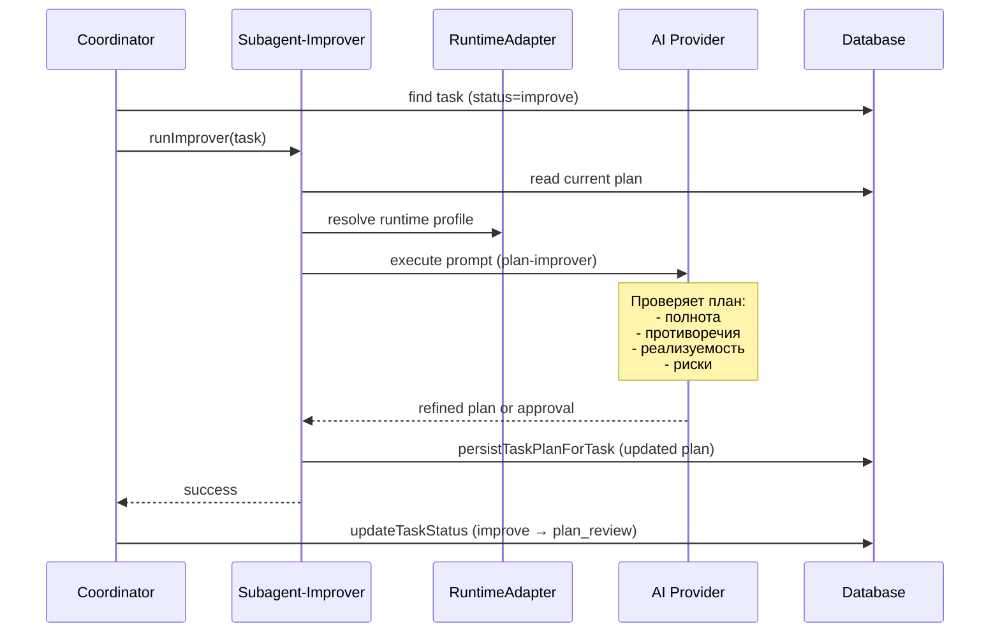

[← UC-pipeline.plan.generate-change-plan](UC-pipeline.plan.generate-change-plan.md) · [Back to README](../README.md) · [UC-pipeline.implementation.execute-change-in-isolation →](UC-pipeline.implementation.execute-change-in-isolation.md)

# UC-pipeline.plan.refine-plan-second-pass: Уточнение плана вторым проходом (Improve)

**Актор:** Coordinator (Agent) → Subagent-Improver

**Приоритет:** P1

**Ключевая функция:** HF1.3 Уточнение плана (Improve)

**Канал:** Agent (runtime adapter → AI-провайдер)

**Описание:** Если задача настроена с `runPlanImprove=true`, после завершения планирования Coordinator запускает второй проход (improver) для проверки плана на полноту, противоречия и реализуемость. По результату план может быть уточнён.

**Диаграмма последовательности:**

**Основной поток:**

1. Coordinator выбирает задачу в статусе `improve`. Переход из `planning` в `improve` происходит если `runPlanImprove=true`.
2. Coordinator запускает `runImprover` — субагент, реализующий второй проход планирования.
3. Improver читает текущий план из БД и контекст задачи (описание, attachments, теги).
4. Improver загружает agent definition `plan-improver` и выполняет промпт проверки плана.
5. AI-провайдер анализирует план на:
   - Полноту покрытия требований задачи.
   - Противоречия между шагами и целевым состоянием.
   - Реализуемость с учётом архитектуры проекта.
6. При находке проблем Improver генерирует уточнённый план и сохраняет его.
7. Coordinator переводит задачу в `plan_review`.

**Альтернативные потоки:**

- **A1. Improve не настроен:** если `runPlanImprove=false` (Skills Mode), задача переходит из `planning` сразу в `plan_review` без запуска improver.
- **A2. План признан корректным:** improver не изменяет план, фиксирует `passed` в результате.
- **A3. Ошибка AI-провайдера:** ErrorClassifier определяет категорию; Coordinator блокирует задачу.

**Постусловия:** План задачи либо уточнён (улучшенная версия), либо подтверждён как корректный. Задача в статусе `plan_review`. Событие аудита записано.

**Источник требований:** HF1.3 Уточнение плана, BR-trigger.automation.pipeline, BR-constraint.task-lifecycle.transitions
